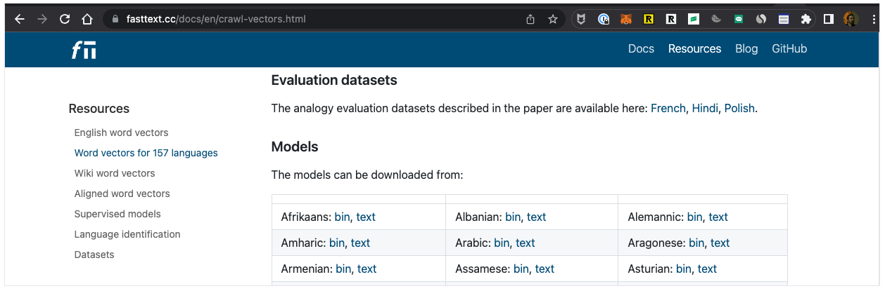
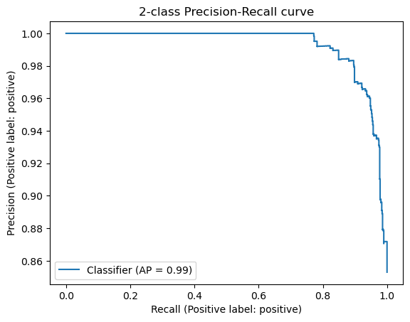
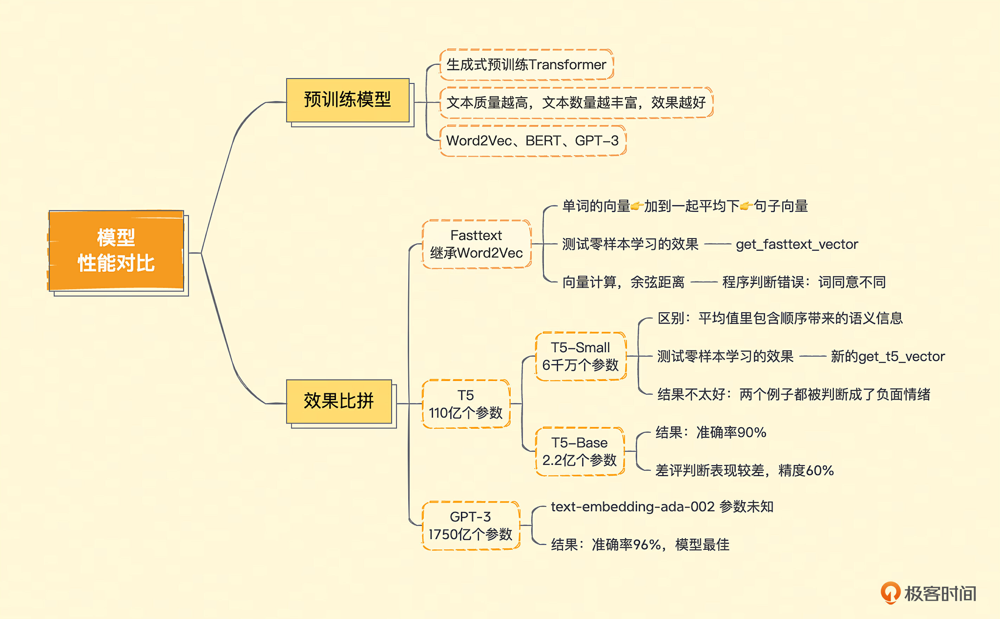

### 本资源由 itjc8.com 收集整理
# 04｜新时代模型性能大比拼，GPT-3到底胜在哪里？
你好，我是徐文浩。

前面两讲，我带你体验了OpenAI通过API提供的GPT-3.5系列模型的两个核心接口。一个是获取一段文本的Embedding向量，另一个则是根据提示语，直接生成一段补全的文本内容。我们用这两种方法，都可以实现零样本（zero-shot）或者少样本下的情感分析任务。不过，你可能会提出这样两个疑问。

1. Embedding不就是把文本变成向量吗？我也学过一些自然语言处理，直接用个开源模型，比如Word2Vec、Bert之类的就好了呀，何必要去调用OpenAI的API呢？
2. 我们在这个情感分析里做了很多投机取巧的工作。一方面，我们把3分这种相对中性的评价分数排除掉了；另一方面，我们把1分2分和4分5分分别合并在了一起，把一个原本需要判断5个分类的问题简化了。那如果我们想要准确地预测多个分类，也会这么简单吗？

那么，这一讲我们就先来回答第一个问题。我们还是拿代码和数据来说话，就拿常见的开源模型来试一试，看看能否通过零样本学习的方式来取得比较好的效果。第二个问题，我们下一讲再来探讨，看看能不能利用Embedding进一步通过一些机器学习的算法，来更好地处理情感分析问题。

## 什么是预训练模型？

给出一段文本，OpenAI就能返回给你一个Embedding向量，这是因为它的背后是GPT-3这个超大规模的预训练模型（Pre-trained Model）。事实上，GPT的英文全称翻译过来就是“生成式预训练Transformer（Generative Pre-trained Transformer）”。

所谓预训练模型，就是虽然我们没有看过你想要解决的问题，比如这里我们在情感分析里看到的用户评论和评分。但是，我可以拿很多我能找到的文本，比如网页文章、维基百科里的文章，各种书籍的电子版等等， **作为理解文本内容的一个学习资料**。

我们不需要对这些数据进行人工标注，只根据这些文本前后的内容，来习得文本之间内在的关联。比如，网上的资料里，会有很多“小猫很可爱”、“小狗很可爱”这样的文本。小猫和小狗后面都会跟着“很可爱”，那么我们就会知道小猫和小狗应该是相似的词，都是宠物。同时，一般我们对于它们的情感也是正面的。这些隐含的内在信息，在我们做情感分析的时候，就带来了少量用户评论和评分数据里缺少的“常识”，这些“常识”也有助于我们更好地预测。

比如，文本里有“白日依山尽”，那么模型就知道后面应该跟“黄河入海流”。文本前面是“今天天气真”，后面跟着的大概率是“不错”，小概率是“糟糕”。这些文本关系，最后以一堆参数的形式体现出来。对于你输入的文本，它可以根据这些参数计算出一个向量，然后根据这个向量，来推算这个文本后面的内容。

可以这样来理解： **用来训练的语料文本越丰富，模型中可以放的参数越多，那模型能够学到的关系也就越多。类似的情况在文本里出现得越多，那么将来模型猜得也就越准。**

预训练模型在自然语言处理领域并不是OpenAI的专利。早在2013年，就有一篇叫做Word2Vec的经典论文谈到过。它能够通过预训练，根据同一个句子里一个单词前后出现的单词，来得到每个单词的向量。而在2018年，Google关于BERT的论文发表之后，整个业界也都会使用BERT这样的预训练模型，把一段文本变成向量用来解决自己的自然语言处理任务。在GPT-3论文发表之前，大家普遍的结论是，BERT作为预训练的模型效果也是优于GPT的。

## Fasttext、T5、GPT-3模型效果大比拼

今天我们就拿两个开源的预训练模型，来看看直接用它们对文本进行向量化，是不是也能取得和OpenAI的API一样好的效果。

第一个是来自Facebook的Fasttext，它继承了Word2Vec的思路，能够把一个个单词表示成向量。第二个是来自Google的T5，T5的全称是Text-to-Text Transfer Trasnformer，是适合做迁移学习的一个模型。所谓迁移学习，也就是它推理出来向量的结果，常常被拿来再进行机器学习，去解决其他自然语言处理问题。通常很多新发表的论文，会把T5作为预训练模型进行微调和训练，或者把它当作Benchmark来对比、评估。

### Fasttext效果测试

我们先来试一下Fasttext，在实际运行代码之前，我们需要先安装Fasttext和Gensim这两个Python包。我在下面列出了通过Conda安装对应Python包的代码，如果你使用的是PIP或者其他的Python包管理工具，你就换成对应的PIP命令就好了。

```bash
conda install gensim
conda install fasttext

```

然后，我们要把Fasttext对应的模型下载到本地。因为这些开源库和对应的论文都是Facebook和Google这样的海外公司发布的，效果自然是在英语上比较好，所以我们就下载对应的英语模型，名字叫做 “cc.en.300.bin”。同样的，对应模型的下载链接，我也放在 [这里](https://dl.fbaipublicfiles.com/fasttext/vectors-crawl/cc.en.300.bin.gz) 了。

下载之后解压，然后把文件放在和Notebook相同的目录下，方便我们接下来运行代码。

这里我们拿来测试效果的数据集还是和 [第 02 讲](https://time.geekbang.org/column/article/642179) 一样，用的是 2.5w 条亚马逊食物评论的数据。



注：各种语言的 [Fasttext模型](https://fasttext.cc/docs/en/crawl-vectors.html)。

代码的逻辑也不复杂，我们先利用Gensim这个库，把Facebook预训练好的模型加载进来。然后，我们定义一个获取文本向量的函数。因为Fasttext学到的是单词的向量，而不是句子的向量。同时，因为我们想要测试一下零样本学习的效果，不能再根据拿到的评论数据进一步训练模型了。所以我们把一句话里每个单词的向量，加在一起平均一下，把得到的向量作为整段评论的向量。这个方法也是当年常用的 **一种将一句话变成向量的办法**。我们把这个操作定义成了 get\_fasttext\_vector 这个函数，供后面的程序使用。

```python
import gensim
import numpy as np
# Load the FastText pre-trained model
model = gensim.models.fasttext.load_facebook_model('cc.en.300.bin')

def get_fasttext_vector(line):
    vec = np.zeros(300) # Initialize an empty 300-dimensional vector
    for word in line.split():
        vec += model.wv[word]
    vec /= len(line.split()) # Take the average over all words in the line
    return vec

```

而对应的零样本学习，我们还是和 [第 02 讲](https://time.geekbang.org/column/article/642179) 一样，将需要进行情感判断的评论分别与 “An Amazon review with a positive sentiment.” 以及 “An Amazon review with a negative sentiment.” 这两句话进行向量计算，算出它们之间的余弦距离。

**离前一个近，我们就认为是正面情感，离后一个近就是负面情感。**

```python
positive_text = """Wanted to save some to bring to my Chicago family but my North Carolina family ate all 4 boxes before I could pack. These are excellent...could serve to anyone"""
negative_text = """First, these should be called Mac - Coconut bars, as Coconut is the #2 ingredient and Mango is #3.  Second, lots of people don't like coconut.  I happen to be allergic to it.  Word to Amazon that if you want happy customers to make things like this more prominent.  Thanks."""

positive_example_in_fasttext = get_fasttext_vector(positive_text)
negative_example_in_fasttext = get_fasttext_vector(negative_text)

positive_review_in_fasttext = get_fasttext_vector("An Amazon review with a positive sentiment.")
negative_review_in_fasttext = get_fasttext_vector('An Amazon review with a negative sentiment.')

from openai.embeddings_utils import cosine_similarity

def get_fasttext_score(sample_embedding):
  return cosine_similarity(sample_embedding, positive_review_in_fasttext) - cosine_similarity(sample_embedding, negative_review_in_fasttext)

positive_score = get_fasttext_score(positive_example_in_fasttext)
negative_score = get_fasttext_score(negative_example_in_fasttext)

print("Fasttext好评例子的评分 : %f" % (positive_score))
print("Fasttext差评例子的评分 : %f" % (negative_score))

```

输出结果：

```python
Fasttext好评例子的评分 : -0.000544
Fasttext差评例子的评分 : 0.000369

```

我们从亚马逊食物评论的数据集里，选取了一个用户打5分的正面例子和一个用户打1分的例子试了一下。结果非常不幸，通过这个零样本学习的方式，这两个例子，程序都判断错了。

不过，仔细想一下，这样的结果也正常。因为这里的整句向量就是把所有单词的向量平均了一下。这意味着， **可能会出现我们之前说过的单词相同顺序不同的问题。**

“not good, really bad” 和 “not bad, really good”，在这个情况下，意思完全不同，但是向量完全相同。更何况，我们拿来做对比的正面情感和负面情感的两句话，只差了positive/negative这样一个单词。不考虑单词的顺序，而只考虑出现了哪些单词，并且不同单词之间还平均一下。这种策略要是真的有很好的效果，你反而要担心是不是哪里有Bug。

### T5效果测试

Fasttext出师不利，毕竟Word2Vec已经是10年前的技术了，可以理解。那么，我们来看看和GPT一样使用了现在最流行的Transformer结构的T5模型效果怎么样。

T5模型的全称是Text-to-Text Transfer Transformer，翻译成中文就是“文本到文本的迁移Transformer”，也就是说，这个模型就是为了方便预训练之后拿去“迁移”到别的任务上而创造出来的。当时发表的时候，它就在各种数据集的评测上高居榜首。

T5最大的模型也有110亿个参数，也是基于Transformer，虽然比起GPT-3的1750亿小了不少，但是对硬件的性能要求也不低。所以，我们先测试一下T5-Small这个小模型看看效果。

同样的，在实际运行代码之前，我们也需要安装对应的Python包。这里我们分别安装了SentencePiece和PyTorch。在安装PyTorch的时候，我一并安装了Torchvision，后面课程会用到。

```python
conda install transformers -c conda-forge
conda install pytorch torchvision -c pytorch
conda install sentencepiece

```

代码也不复杂，我们先加载预训练好的T5模型的分词器（Tokenizer），还有对应的模型。然后，我们定义了一个get\_t5\_vector函数，它会接收一段你的文本输入，然后用分词器来分词把结果变成一个序列，然后让模型的编码器部分对其进行编码。编码后的结果，仍然是分词后的一个词一个向量，我们还是把这些向量平均一下，作为整段文本的向量。

不过要注意，虽然同样是平均，但是和前面Fasttext不一样的是，这里每个词的向量，随着位置以及前后词的不同，编码出来的结果是不一样的。所以 **这个平均值里，仍然包含了顺序带来的语义信息。**

这段代码执行的过程可能会有点慢。因为第一次加载模型的时候，Transformer库会把模型下载到本地并缓存起来，整个下载过程会花一些时间。

```python
from transformers import T5Tokenizer, T5Model
import torch

# load the T5 tokenizer and model
tokenizer = T5Tokenizer.from_pretrained('t5-small', model_max_length=512)
model = T5Model.from_pretrained('t5-small')

# set the model to evaluation mode
model.eval()

# encode the input sentence
def get_t5_vector(line):
    input_ids = tokenizer.encode(line, return_tensors='pt', max_length=512, truncation=True)
    # generate the vector representation
    with torch.no_grad():
        outputs = model.encoder(input_ids=input_ids)
        vector = outputs.last_hidden_state.mean(dim=1)
    return vector[0]

```

有了模型和通过模型获取的向量数据，我们就可以再试一试前面的零样本学习的方式，来看看效果怎么样了。我们简单地把之前获取向量和计算向量的函数调用，都换成新的get\_t5\_vector，运行一下就能看到结果了。

```python
positive_review_in_t5 = get_t5_vector("An Amazon review with a positive sentiment.")
negative_review_in_t5 = get_t5_vector('An Amazon review with a negative sentiment.')

def test_t5():
  positive_example_in_t5 = get_t5_vector(positive_text)
  negative_example_in_t5 = get_t5_vector(negative_text)

  def get_t5_score(sample_embedding):
    return cosine_similarity(sample_embedding, positive_review_in_t5) - cosine_similarity(sample_embedding, negative_review_in_t5)

  positive_score = get_t5_score(positive_example_in_t5)
  negative_score = get_t5_score(negative_example_in_t5)

  print("T5好评例子的评分 : %f" % (positive_score))
  print("T5差评例子的评分 : %f" % (negative_score))

test_t5()

```

输出结果：

```python
T5好评例子的评分 : -0.010294
T5差评例子的评分 : -0.008990

```

不幸的是，结果还是不太好，两个例子都被判断成了负面情绪，而且好评的分数还更低一点。不过别着急，会不会是我们用的模型太小了呢？毕竟T5论文里霸占各个排行榜的是110亿个参数的大模型，我们这里用的是T5-Small这个同样架构下的小模型，参数数量只有6000万个。

110亿个参数要花太多时间了，我们不妨把模型放大一下，试试有2.2亿个参数的 T5-Base这个模型？试用起来也很简单，我们就直接把上面模型的名字从 T5-small 改成 T5-base 就好了，其他代码不需要动，重新运行一遍。

```python
tokenizer = T5Tokenizer.from_pretrained('t5-base', model_max_length=512)
model = T5Model.from_pretrained('t5-base')

# set the model to evaluation mode
model.eval()

# encode the input sentence
def get_t5_vector(line):
    input_ids = tokenizer.encode(line, return_tensors='pt', max_length=512, truncation=True)
    # generate the vector representation
    with torch.no_grad():
        outputs = model.encoder(input_ids=input_ids)
        vector = outputs.last_hidden_state.mean(dim=1)
    return vector[0]

positive_review_in_t5 = get_t5_vector("An Amazon review with a positive sentiment.")
negative_review_in_t5 = get_t5_vector('An Amazon review with a negative sentiment.')

test_t5()

```

输出结果：

```python
T5好评例子的评分 : 0.010347
T5差评例子的评分 : -0.023935

```

这一次，结果似乎是我们想要的了，好评被判定为正面情感，而差评被判定为负面情感。不过，也许我们只是运气好，在这一两个例子上有效果呢？所以，接下来让我们把整个数据集里，1分2分的差评和4分5分的好评都拿出来看一看。在OpenAI的API拿到的Embedding里，它的准确率能够达到95%以上，我们看看用这个有2.2亿个参数的T5-base模型能有什么样的结果。

对应的代码也不复杂，基本上和 [第 02 讲](https://time.geekbang.org/column/article/642179) 里OpenAI给到的Embedding代码是类似的。无非是通过pandas，根据评论的Text字段，全部计算一遍T5下的Embedding，然后存到DataFrame的t5\_embedding 里去。

同样的，我们还是要通过T5的模型，来获得 “An Amazon review with a positive sentiment.” 以及 “An Amazon review with a negative sentiment.” 这两句话的Embedding。然后，我们用刚刚计算的用户评论的Embedding和这两句话计算一下余弦距离，来判断这些评论是正面还是负面的。

最后，通过Scikit-learn的分类报告的类库把评估的报告结果打印出来。

```python
import pandas as pd
from sklearn.metrics import classification_report

datafile_path = "data/fine_food_reviews_with_embeddings_1k.csv"

df = pd.read_csv(datafile_path)

df["t5_embedding"] = df.Text.apply(get_t5_vector)
# convert 5-star rating to binary sentiment
df = df[df.Score != 3]
df["sentiment"] = df.Score.replace({1: "negative", 2: "negative", 4: "positive", 5: "positive"})

from sklearn.metrics import PrecisionRecallDisplay
def evaluate_embeddings_approach():
    def label_score(review_embedding):
        return cosine_similarity(review_embedding, positive_review_in_t5) - cosine_similarity(review_embedding, negative_review_in_t5)

    probas = df["t5_embedding"].apply(lambda x: label_score(x))
    preds = probas.apply(lambda x: 'positive' if x>0 else 'negative')

    report = classification_report(df.sentiment, preds)
    print(report)

    display = PrecisionRecallDisplay.from_predictions(df.sentiment, probas, pos_label='positive')
    _ = display.ax_.set_title("2-class Precision-Recall curve")

evaluate_embeddings_approach()

```

输出结果：

```python
              precision    recall  f1-score   support
    negative       0.60      0.90      0.72       136
    positive       0.98      0.90      0.94       789
    accuracy                           0.90       925
   macro avg       0.79      0.90      0.83       925
weighted avg       0.93      0.90      0.91       925

```



结果显示，使用T5的效果也还可以，考虑所有样本的准确率也能达到90%。但是，在比较困难的差评的判断里，它的表现要比直接用OpenAI给到的Embedding要差很多，整体的精度只有60%。我们去看整体模型的准确率的话，OpenAI的Embedding能够到达96%，还是比这里的90%要好上一些的。

```python
            precision    recall  f1-score   support
    negative       0.98      0.73      0.84       136
    positive       0.96      1.00      0.98       789
    accuracy                           0.96       925
   macro avg       0.97      0.86      0.91       925
weighted avg       0.96      0.96      0.96       925

```

这里我重新贴一下使用OpenAI的Embedding取得的效果，你可以做个对比。

当然，这个分数也还不错，也能作为一个合格的情感分析分类器的基准线了。毕竟，我们这里采用的是零样本分类的方法，没有对需要分类的数据做任何训练，使用的完全是预训练模型给出来的向量，直接根据距离做的判断。所以，看起来大一点的预训练模型的确有用，能够取得更好的效果。而且，当你因为成本或者网络延时的问题，不方便使用OpenAI的API的时候，如果只是要获取文本的Embedding向量，使用T5这样的开源模型其实效果也还不错。

## 小结

最后，我们来复习一下这一讲的内容。



这一讲我们一起使用 Fasttext、T5-small 和 T5-base 这三个预训练模型，做了零样本分类测试。在和之前相同的食物评论的数据集上，使用只学习了单词向量表示的Fasttext，效果很糟糕。当我们换用同样基于Transformer的T5模型的时候，T5-small这个6000万参数的小模型其实效果也不好。但是当我们用上2.2亿参数的T5-base模型的时候，结果还可以。不过，还是远远比不上直接使用OpenAI的API的效果。可见，模型的大小，即使是对情感分析这样简单的问题，也能产生明显的差距。

## 课后练习

1. 我们在尝试使用T5-base这个模型之后，下了个判断认为大一点的模型效果更好。不过，其实我们并没有在整个数据集上使用T5-small这个模型做评测，你能试着修改一下代码，用T5-small测试一下整个数据集吗？测试下来的效果又是怎样的呢？
2. 我们使用Fasttext的时候，把所有的单词向量平均一下，用来做情感分析效果很糟糕。那么什么样的分类问题，可以使用这样的方式呢？给你一个小提示，你觉得什么样的文本分类，只关心出现的单词是什么，而不关心它们的顺序？

期待你的思考，也欢迎你把这节课分享给感兴趣的朋友，我们下一讲再见。