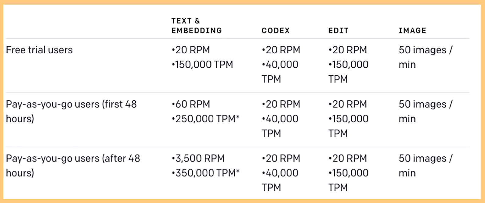
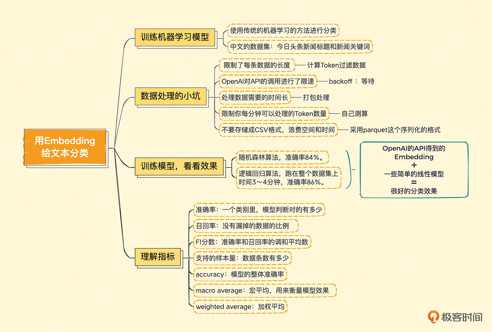

### 本资源由 itjc8.com 收集整理
# 05｜善用Embedding，我们来给文本分分类
你好，我是徐文浩。

上一讲里我们看到大模型的确有效。在进行情感分析的时候，我们通过OpenAI的API拿到的Embedding，比T5-base这样单机可以运行的小模型，效果还是好很多的。

不过，我们之前选用的问题的确有点太简单了。我们把5个不同的分数分成了正面、负面和中性，还去掉了相对难以判断的“中性”评价，这样我们判断的准确率高的确是比较好实现的。但如果我们想要准确地预测出具体的分数呢？

## 利用Embedding，训练机器学习模型

最简单的办法就是利用我们拿到的文本Embedding的向量。这一次，我们不直接用向量之间的距离，而是使用传统的机器学习的方法来进行分类。毕竟，如果只是用向量之间的距离作为衡量标准，就没办法最大化地利用已经标注好的分数信息了。

事实上，OpenAI在自己的官方教程里也直接给出了这样一个例子。我在这里也放上了相应的GitHub的代码 [链接](https://github.com/openai/openai-cookbook/blob/main/examples/Classification_using_embeddings.ipynb)，你可以去看一下。不过，为了避免OpenAI王婆卖瓜自卖自夸，我们也希望能和其他人用传统的机器学习方式得到的结果做个比较。

因此我重新找了一个中文的数据集来试一试。这个数据集是在中文互联网上比较容易找到的一份今日头条的新闻标题和新闻关键词，在GitHub上可以直接找到数据，我把 [链接](https://github.com/aceimnorstuvwxz/toutiao-text-classfication-dataset) 也放在这里。用这个数据集的好处是，有人同步放出了预测的实验效果。我们可以拿自己训练的结果和他做个对比。

## 数据处理，小坑也不少

在训练模型之前，我们要先获取每一个新闻标题的Embedding。我们通过Pandas这个Python数据处理库，把对应的文本加载到内存里。接着去调用之前我们使用过的OpenAI的Embedding接口，然后把返回结果一并存下来就好了。这个听起来非常简单直接，我也把对应的代码先放在下面，不过你先别着急运行。

注：因为后面的代码可能会耗费比较多的Token数量，如果你使用的是免费的5美元额度的话，可以直接去拿我放在Github里的 [数据文件](https://github.com/xuwenhao/geektime-ai-course)，用我已经处理好的数据。

```python
import pandas as pd
import tiktoken
import openai
import os

from openai.embeddings_utils import get_embedding, get_embeddings

openai.api_key = os.environ.get("OPENAI_API_KEY")

# embedding model parameters
embedding_model = "text-embedding-ada-002"
embedding_encoding = "cl100k_base"  # this the encoding for text-embedding-ada-002
max_tokens = 8000  # the maximum for text-embedding-ada-002 is 8191

# import data/toutiao_cat_data.txt as a pandas dataframe
df = pd.read_csv('data/toutiao_cat_data.txt', sep='_!_', names=['id', 'code', 'category', 'title', 'keywords'])
df = df.fillna("")
df["combined"] = (
    "标题: " + df.title.str.strip() + "; 关键字: " + df.keywords.str.strip()
)

print("Lines of text before filtering: ", len(df))

encoding = tiktoken.get_encoding(embedding_encoding)
# omit reviews that are too long to embed
df["n_tokens"] = df.combined.apply(lambda x: len(encoding.encode(x)))
df = df[df.n_tokens <= max_tokens]

print("Lines of text after filtering: ", len(df))

```

注：这个是加载数据并做一些简单预处理的代码，你可以直接运行。

```python
# randomly sample 1k rows
df_1k = df.sample(1000, random_state=42)

df_1k["embedding"] = df_1k.combined.apply(lambda x : get_embedding(x, engine=embedding_model))
df_1k.to_csv("data/toutiao_cat_data_10k_with_embeddings.csv", index=False)

```

注：这个是一条条数据请求OpenAI的API获取Embedding的代码，但是你在运行中会遇到报错。

直接运行这个代码，你多半会遇到一个报错，因为在这个数据处理过程中也是有几个坑的。

第一个坑是 **OpenAI提供的接口限制了每条数据的长度**。我们这里使用的 text-embedding-ada-002 的模型，支持的长度是每条记录8191个Token。所以我们在实际发送请求前，需要计算一下每条记录有多少Token，超过8000个的需要过滤掉。不过，在我们这个数据集里，只有新闻的标题，所以不会超过这个长度。但是你在使用其他数据集的时候，可能就需要过滤下数据，或者采用截断的方法，只用文本最后8000个Token。

我们在这里，调用了Tiktoken这个库，使用了 cl100k\_base 这种编码方式，这种编码方式和 text-embedding-ada-002 模型是一致的。如果选错了编码方式，你计算出来的Token数量可能和OpenAI的不一样。

第二个坑是，如果你直接一条条调用OpenAI的API，很快就会遇到报错。这是因为 **OpenAI对API的调用进行了限速**（Rate Limit）。如果你过于频繁地调用，就会遇到限速的报错。而如果你在报错之后继续持续调用，限速的时间还会被延长。那怎么解决这个问题呢？我习惯选用 backoff 这个Python库，在调用的时候如果遇到报错了，就等待一段时间，如果连续报错，就拉长等待时间。通过backoff改造的代码我放在了下面，不过这还没有彻底解决问题。

```python
conda install backoff

```

你需要先安装一下backoff库，当然，换成PIP安装也是一样的。

```python
import backoff

@backoff.on_exception(backoff.expo, openai.error.RateLimitError)
def get_embedding_with_backoff(**kwargs):
    return get_embedding(**kwargs)

# randomly sample 10k rows
df_10k = df.sample(10000, random_state=42)

df_10k["embedding"] = df_10k.combined.apply(lambda x : get_embedding_with_backoff(text=x, engine=embedding_model))
df_10k.to_csv("data/toutiao_cat_data_10k_with_embeddings.csv", index=False)

```

通过backoff库，我们指定了在遇到RateLimitError的时候，按照指数级别增加等待时间。

如果你直接运行上面那个代码，大约需要2个小时才能处理完1万条数据。我们的数据集里有38万条数据，真要这么干，需要3天3夜才能把训练数据处理完，这样显然不怎么实用。这么慢的原因有两个，一个是限速，backoff只是让我们的调用不会因为失败而终止，但是我还是受到了每分钟API调用次数的限制。第二个是延时，因为我们是按照顺序一个个调用Embedding接口，每一次调用都要等前一次调用结束后才会发起请求，而不是多条数据并行请求，这更进一步 **拖长了处理数据所需要的时间**。



注：你可以点开这个 [链接](https://platform.openai.com/docs/guides/rate-limits/overview)，看看目前OpenAI对不同模型的限速。

要解决这个问题也不困难，OpenAI是支持batch调用接口的，也就是说，你可以在一个请求里一次批量处理很多个请求。我们把1000条记录打包在一起处理，速度就会快很多。我把对应的代码放在下面，你可以试着执行一下，处理这38万多条的数据，也就个把小时。不过，你也不能一次性打包太多条记录，因为OpenAI的限速不仅仅是针对请求数的，也 **限制你每分钟可以处理的 Token 数量**，具体一次打包几条，你可以根据每条数据包含的Token数自己测算一下。

```python
import backoff
from openai.embeddings_utils import get_embeddings

batch_size = 1000

@backoff.on_exception(backoff.expo, openai.error.RateLimitError)
def get_embeddings_with_backoff(prompts, engine):
    embeddings = []
    for i in range(0, len(prompts), batch_size):
        batch = prompts[i:i+batch_size]
        embeddings += get_embeddings(list_of_text=batch, engine=engine)
    return embeddings

# randomly sample 10k rows
df_all = df
# group prompts into batches of 100
prompts = df_all.combined.tolist()
prompt_batches = [prompts[i:i+batch_size] for i in range(0, len(prompts), batch_size)]

embeddings = []
for batch in prompt_batches:
    batch_embeddings = get_embeddings_with_backoff(prompts=batch, engine=embedding_model)
    embeddings += batch_embeddings

df_all["embedding"] = embeddings
df_all.to_parquet("data/toutiao_cat_data_all_with_embeddings.parquet", index=True)

```

最后一个你需要注意的点是，对于这样的大数据集， **不要存储成CSV格式**。特别是我们获取到的Embedding数据，是很多浮点数，存储成CSV格式会把本来只需要4个字节的浮点数，都用字符串的形式存储下来，会浪费好几倍的空间，写入的速度也很慢。我在这里 **采用了parquet这个序列化的格式**，整个存储的过程只需要1分钟。

## 训练模型，看看效果怎么样

数据处理完了，我们就不妨试一试模型训练。如果你担心浪费太多的API调用，我把我处理好的数据集，放在了我的 [GitHub](https://github.com/xuwenhao/geektime-ai-course) 上，我把链接也放在了这里，你可以直接下载、使用这个数据集。

```python
from sklearn.ensemble import RandomForestClassifier
from sklearn.model_selection import train_test_split
from sklearn.metrics import classification_report, accuracy_score

training_data = pd.read_parquet("data/toutiao_cat_data_all_with_embeddings.parquet")
training_data.head()

df =  training_data.sample(50000, random_state=42)

X_train, X_test, y_train, y_test = train_test_split(
    list(df.embedding.values), df.category, test_size=0.2, random_state=42
)

clf = RandomForestClassifier(n_estimators=300)
clf.fit(X_train, y_train)
preds = clf.predict(X_test)
probas = clf.predict_proba(X_test)

report = classification_report(y_test, preds)
print(report)

```

模型训练的代码也非常简单，考虑到运行时间的因素，我这里直接随机选取了里面的5万条数据，4万条作为训练集，1万条作为测试集。然后通过最常用的scikit-learn这个机器学习工具包里面的随机森林（RandomForest）算法，做了一次训练和测试。在我的电脑上，大概10分钟可以跑完，整体的准确率可以达到84%。

```python
                    precision    recall  f1-score   support
  news_agriculture       0.83      0.85      0.84       495
          news_car       0.88      0.94      0.91       895
      news_culture       0.86      0.76      0.81       741
          news_edu       0.86      0.89      0.87       708
news_entertainment       0.71      0.92      0.80      1051
      news_finance       0.81      0.76      0.78       735
         news_game       0.91      0.82      0.86       742
        news_house       0.91      0.86      0.89       450
     news_military       0.89      0.82      0.85       688
       news_sports       0.90      0.92      0.91       968
        news_story       0.95      0.46      0.62       197
         news_tech       0.82      0.86      0.84      1052
       news_travel       0.80      0.77      0.78       599
        news_world       0.83      0.73      0.78       671
             stock       0.00      0.00      0.00         8
          accuracy                           0.84     10000
         macro avg       0.80      0.76      0.77     10000
      weighted avg       0.84      0.84      0.84     10000

```

随机森林这个算法，虽然效果不错，但是跑起来有些慢。我们接下来用个更简单的逻辑回归（LogisticRegression）算法，但我们这次要跑在整个数据集上。一样的，我们拿80%作为训练，20%作为测试。这一次，虽然数据量是刚才4万条数据的好几倍，但是时间上却只要3～4分钟，而最终的准确率也能达到86%。

```python
from sklearn.linear_model import LogisticRegression

df =  training_data

X_train, X_test, y_train, y_test = train_test_split(
    list(df.embedding.values), df.category, test_size=0.2, random_state=42
)

clf = LogisticRegression()
clf.fit(X_train, y_train)
preds = clf.predict(X_test)
probas = clf.predict_proba(X_test)

report = classification_report(y_test, preds)
print(report)

```

输出结果：

```python
                    precision    recall  f1-score   support
  news_agriculture       0.86      0.88      0.87      3908
          news_car       0.92      0.92      0.92      7101
      news_culture       0.83      0.85      0.84      5719
          news_edu       0.89      0.89      0.89      5376
news_entertainment       0.86      0.88      0.87      7908
      news_finance       0.81      0.79      0.80      5409
         news_game       0.91      0.88      0.89      5899
        news_house       0.91      0.91      0.91      3463
     news_military       0.86      0.82      0.84      4976
       news_sports       0.93      0.93      0.93      7611
        news_story       0.83      0.82      0.83      1308
         news_tech       0.84      0.86      0.85      8168
       news_travel       0.80      0.80      0.80      4252
        news_world       0.79      0.81      0.80      5370
             stock       0.00      0.00      0.00        70
          accuracy                           0.86     76538
         macro avg       0.80      0.80      0.80     76538
      weighted avg       0.86      0.86      0.86     76538

```

注：下载的数据集所在的测试结果可以看 [这里](https://github.com/aceimnorstuvwxz/toutiao-text-classfication-dataset)。

这个结果已经比我们下载数据集的GitHub页面里看到的效果好了，那个的准确率只有85%。

可以看到，通过OpenAI的API获取到Embedding，然后通过一些简单的线性模型，我们就能获得很好的分类效果。我们既不需要提前储备很多自然语言处理的知识，对数据进行大量的分析和清理；也不需要搞一块昂贵的显卡，去使用什么深度学习模型。只要1～2个小时，我们就能在一个几十万条文本的数据集上训练出一个非常不错的分类模型。

## 理解指标，学一点机器学习小知识

刚刚我说了，就算你没有机器学习的相关知识，也没有关系，这里我来给你补补课。理解一下上面模型输出的报告是什么意思。报告的每一行都有四个指标，分别是准确率（Precision）、召回率（Recall）、F1分数，以及支持样本量（Support）。我还是用今日头条的新闻标题这个数据集来解释这些概念。

1. **准确率**，代表模型判定属于这个分类的标题里面判断正确的有多少，有多少真的是属于这个分类的。比如，模型判断里面有 100个都是农业新闻，但是这100个里面其实只有83个是农业新闻，那么准确率就是0.83。准确率自然是越高越好，但是并不是准确率达到100%就代表模型全对了。因为模型可能会漏，所以我们还要考虑召回率。
2. **召回率**，代表模型判定属于这个分类的标题占实际这个分类下所有标题的比例，也就是没有漏掉的比例。比如，模型判断100个都是农业新闻，这100个的确都是农业新闻。准确率已经100%了。但是，实际我们一共有200条农业新闻。那么有100条其实被放到别的类目里面去了。那么在农业新闻这个类目，我们的召回率，就只有 100/200 = 50%。
3. 所以模型效果的好坏，既要考虑准确率，又要考虑召回率，综合考虑这两项得出的结果，就是 **F1** **分数**（F1 Score）。F1分数，是准确率和召回率的调和平均数，也就是 F1 Score = 2/ (1/Precision + 1/Recall)。当准确率和召回率都是100%的时候，F1分数也是1。如果准确率是100%，召回率是80%，那么算下来F1分数就是0.88。F1分数也是越高越好。
4. **支持的样本量**，是指数据里面，实际是这个分类的数据条数有多少。一般来说，数据条数越多，这个分类的训练就会越准确。

分类报告里一个类目占一行，每一行都包含对应的这四个指标，而最下面还有三行数据。这三行数据，是整个拿来测试的数据集，所以对应的支持样本量都是1万个。

第一行的accuracy，只有一个指标，虽然它在F1 Score这个列里，但是并不是F1分数的意思。而是说，模型总共判断对的分类/模型测试的样本数，也就是模型的整体准确率。

第二行的macro average，中文名叫做宏平均，宏平均的三个指标，就是把上面每一个分类算出来的指标加在一起平均一下。它主要是在数据分类不太平衡的时候，帮助我们衡量模型效果怎么样。

比如，我们做情感分析，可能90%都是正面情感，10%是负面情感。这个时候，我们预测正面情感效果很好，比如有90%的准确率，但是负面情感预测很差，只有50%的准确率。如果看整体数据，其实准确率还是非常高的，毕竟负面情感的例子很少。

但是我们的目标可能就是找到有负面情绪的客户和他们沟通、赔偿。那么整体准确率对我们就没有什么用了。而宏平均，会把整体的准确率变成 (90%+50%)/2 = 70%。这就不是一个很好的预测结果了，我们需要进一步优化。宏平均对于数据样本不太平衡，有些类目样本特别少，有些特别多的场景特别有用。

第三行的weighted average，就是加权平均，也就是我们把每一个指标，按照分类里面支持的样本量加权，算出来的一个值。无论是 Precision、Recall 还是 F1 Score都要这么按照各个分类加权平均一下。

## 小结



好了，今天的这一讲到这里就结束了，最后我们来回顾一下。这一讲我们学会了两件事情。

第一件，是怎么利用OpenAI的API来获取文本的Embedding。虽然接口不复杂，但是我们也要考虑模型能够接受的最大文本长度，API本身的限速，以及网络延时带来的问题。

我们分别给出了解决方案，使用Tiktoken计算样本的Token数量，并进行过滤；在遇到限速问题时通过backoff进行指数级别的时间等待；通过一次性批量请求一批数据，最大化我们的吞吐量来解决问题；对于返回的结果，我们可以通过parquet这样序列化的方式保存数据，来减少数据尺寸。

第二件，是如何直接利用拿到的Embedding，简单调用一下scikit-learn，通过机器学习的方法，进行更准确的分类。我们最终把Embedding放到一个简单的逻辑回归模型里，就取得了很不错的分类效果。你学会了吗？

## 课后练习

这一讲里我们学会了利用OpenAI来获取文本的Embedding，然后通过传统的机器学习方式来进行训练，并评估训练的结果。

我们之前用过Amazon1000条食物评论的情感分析数据，在那个数据集里，我们其实已经使用过获取到并保存下来的Embedding数据了。那么，你能不能试着在完整的数据集上，训练一个能把从1分到5分的每一个级别都区分出来的机器学习模型，看看效果怎么样？

整个原始数据集的下载链接我放在 [这里](https://www.kaggle.com/snap/amazon-fine-food-reviews) 了，欢迎你把你测试出来的结果分享出来，看看和其他人比起来怎么样。另外如果你觉得有收获的话，也欢迎你把这节课分享出去，让更多的人了解用Embedding给文本分类的方法。