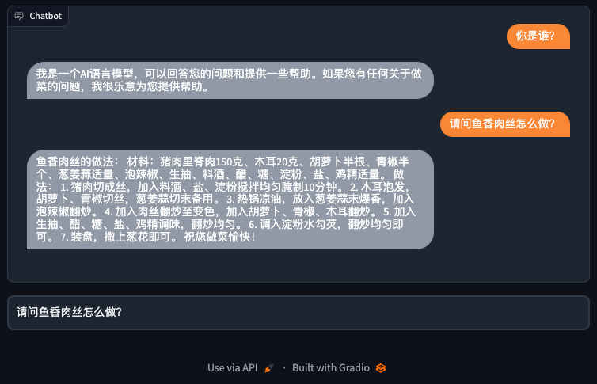
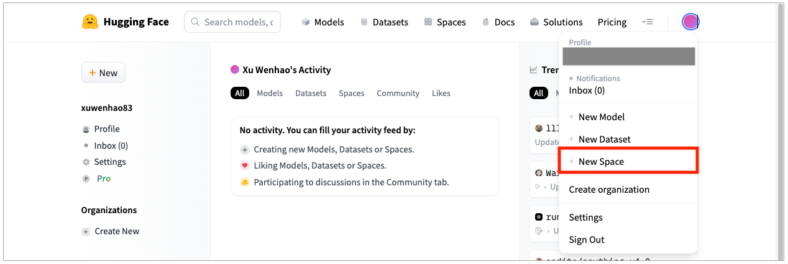
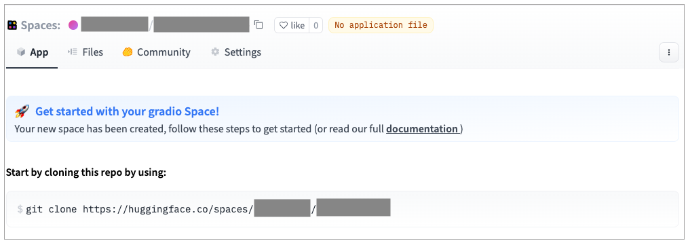
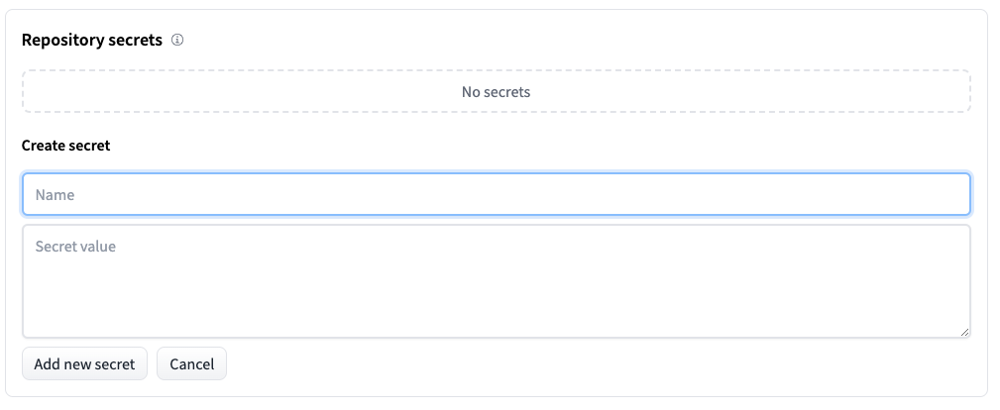
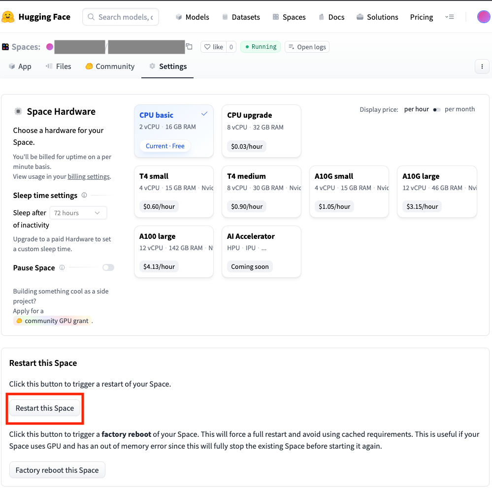
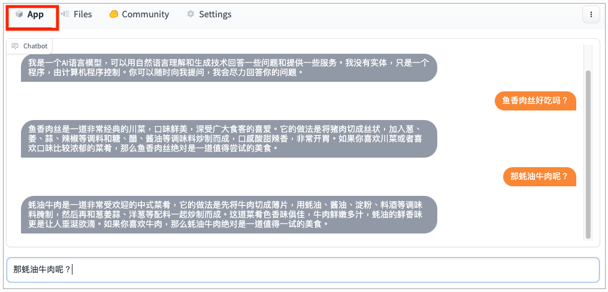

### 本资源由 itjc8.com 收集整理
# 06｜ChatGPT来了，让我们快速做个AI应用
你好，我是徐文浩。

过去的两讲，我带着你通过OpenAI提供的Embedding接口，完成了文本分类的功能。那么，这一讲里，我们重新回到Completion接口。而且这一讲里，我们还会快速搭建出一个有界面的聊天机器人来给你用。在这个过程里，你也会第一次使用 HuggingFace 这个平台。

HuggingFace 是现在最流行的深度模型的社区，你可以在里面下载到最新开源的模型，以及看到别人提供的示例代码。

## ChatGPT来了，更快的速度更低的价格

我在 [第03讲](https://time.geekbang.org/column/article/642197) 里，已经给你看了如何通过Completion的接口，实现一个聊天机器人的功能。在那个时候，我们采用的是自己将整个对话拼接起来，将整个上下文都发送给OpenAI的Completion API的方式。不过，在3月2日，因为ChatGPT的火热，OpenAI放出了一个直接可以进行对话聊天的接口。这个接口叫做 **ChatCompletion**，对应的模型叫做gpt-3.5-turbo，不但用起来更容易了，速度还快，而且价格也是我们之前使用的 text-davinci-003 的十分之一，可谓是物美价廉了。

```python
import openai
openai.ChatCompletion.create(
  model="gpt-3.5-turbo",
  messages=[
        {"role": "system", "content": "You are a helpful assistant."},
        {"role": "user", "content": "Who won the world series in 2020?"},
        {"role": "assistant", "content": "The Los Angeles Dodgers won the World Series in 2020."},
        {"role": "user", "content": "Where was it played?"}
    ]
)

```

注：点击在这个 [链接](https://platform.openai.com/docs/guides/chat) 你可以看到接口调用示例。

在OpenAI的官方文档里，可以看到这个接口也非常简单。你需要传入的参数，从一段Prompt变成了一个数组，数组的每个元素都有role和content两个字段。

1. role这个字段一共有三个角色可以选择，其中 system 代表系统，user代表用户，而assistant则代表AI的回答。
2. 当role是system的时候，content里面的内容代表我们给AI的一个指令，也就是告诉AI应该怎么回答用户的问题。比如我们希望AI都通过中文回答，我们就可以在content里面写“你是一个只会用中文回答问题的助理”，这样即使用户问的问题都是英文的，AI的回复也都会是中文的。
3. 而当role是user或者assistant的时候，content里面的内容就代表用户和AI对话的内容。和我们在 [第03讲](https://time.geekbang.org/column/article/642197) 里做的聊天机器人一样，你需要把历史上的对话一起发送给OpenAI的接口，它才能有理解整个对话的上下文的能力。

有了这个接口，我们就很容易去封装一个聊天机器人了，我把代码放在了下面，我们一起来看一看。

```python
import openai
import os

openai.api_key = os.environ.get("OPENAI_API_KEY")

class Conversation:
    def __init__(self, prompt, num_of_round):
        self.prompt = prompt
        self.num_of_round = num_of_round
        self.messages = []
        self.messages.append({"role": "system", "content": self.prompt})

    def ask(self, question):
        try:
            self.messages.append({"role": "user", "content": question})
            response = openai.ChatCompletion.create(
                model="gpt-3.5-turbo",
                messages=self.messages,
                temperature=0.5,
                max_tokens=2048,
                top_p=1,
            )
        except Exception as e:
            print(e)
            return e

        message = response["choices"][0]["message"]["content"]
        self.messages.append({"role": "assistant", "content": message})

        if len(self.messages) > self.num_of_round*2 + 1:
            del self.messages[1:3] //Remove the first round conversation left.
        return message

```

1. 我们封装了一个Conversation类，它的构造函数 **init** 会接受两个参数，prompt 作为 system的content，代表我们对这个聊天机器人的指令，num\_of\_round 代表每次向ChatGPT发起请求的时候，保留过去几轮会话。
2. Conversation类本身只有一个ask函数，输入是一个string类型的question，返回结果也是string类型的一条message。
3. 每次调用ask函数，都会向ChatGPT发起一个请求。在这个请求里，我们都会把最新的问题拼接到整个对话数组的最后，而在得到ChatGPT的回答之后也会把回答拼接上去。如果回答完之后，发现会话的轮数超过我们设置的num\_of\_round，我们就去掉最前面的一轮会话。

下面，我们就来试一试这个Conversation类好不好使。

```python
prompt = """你是一个中国厨师，用中文回答做菜的问题。你的回答需要满足以下要求:
1. 你的回答必须是中文
2. 回答限制在100个字以内"""
conv1 = Conversation(prompt, 2)
question1 = "你是谁？"
print("User : %s" % question1)
print("Assistant : %s\n" % conv1.ask(question1))

question2 = "请问鱼香肉丝怎么做？"
print("User : %s" % question2)
print("Assistant : %s\n" % conv1.ask(question2))

question3 = "那蚝油牛肉呢？"
print("User : %s" % question3)
print("Assistant : %s\n" % conv1.ask(question3))

```

1. 我们给到了ChatGPT一个指令，告诉它它是一个中国厨子，用中文回答问题，而且回答在100个字以内，并且我们设定了AI只记住过去3轮的对话。
2. 然后，我们按照顺序问了他，“你是谁”，“鱼香肉丝怎么做”以及“那蚝油牛肉呢”这三个问题。
3. 可以看到，在回答里它说自己可以回答做菜的问题，而且回答都在100个字以内。
4. 并且，我们问他“那蚝油牛肉呢”的时候，它也的确记住了上下文，知道我们问的是菜的做法，而不是价格或者其他信息。

```python
User : 你是谁？
Assistant : 我是一个AI语言模型，可以回答你的做菜问题。
User : 请问鱼香肉丝怎么做？
Assistant : 鱼香肉丝的做法：
1. 瘦猪肉切丝，用盐、淀粉、料酒腌制；
2. 香葱、姜、蒜切末备用；
3. 青红椒切丝备用；
4. 热锅凉油，放入肉丝煸炒至变色；
5. 放入葱姜蒜末和青红椒丝煸炒；
6. 加入适量盐、糖、醋、酱油、料酒、水淀粉翻炒均匀；
7. 淋上少许香油即可。
User : 那蚝油牛肉呢？
Assistant : 蚝油牛肉的做法：
1. 牛肉切薄片，加入盐、生抽、淀粉腌制20分钟；
2. 青红椒切丝，姜蒜切末备用；
3. 热锅冷油，下姜蒜末煸炒出香味；
4. 加入牛肉片快速翻炒至变色；
5. 加入青红椒丝翻炒均匀；
6. 倒入蚝油、生抽、糖、水淀粉调味；
7. 翻炒均匀，收汁后淋上香油即可。

```

在问完了3个问题之后，我们又问了它第四个问题，也就是我们问它的第一个问题是什么。这个时候，它因为记录了过去第1-3轮的对话，所以还能正确地回答出来，我们问的是“你是谁”。

```python
question4 = "我问你的第一个问题是什么？"
print("User : %s" % question4)
print("Assistant : %s\n" % conv1.ask(question4))

```

输出结果：

```python
User : 我问你的第一个问题是什么？
Assistant : 你问我：“你是谁？”

```

而这个时候，如果我们重新再问一遍“我问你的第一个问题是什么”，你会发现回答变了。因为啊，上一轮已经是第四轮了，而我们设置记住的num\_of\_round是3。在上一轮的问题回答完了之后，第一轮的关于“你是谁”的问答，被我们从ChatGPT的对话历史里去掉了。所以这个时候，它会告诉我们，第一个问题是“鱼香肉丝怎么做”。

```python
question5 = "我问你的第一个问题是什么？"
print("User : %s" % question5)
print("Assistant : %s\n" % conv1.ask(question5))

```

输出结果：

```python
User : 我问你的第一个问题是什么？
Assistant : 你问我：“请问鱼香肉丝怎么做？”

```

## 计算聊天机器人的成本

无论是在 [第03讲](https://time.geekbang.org/column/article/642197) 里，还是这一讲里，我们每次都要发送一大段之前的聊天记录给到OpenAI。这是由OpenAI的GPT-3系列的大语言模型的原理所决定的。GPT-3系列的模型能够实现的功能非常简单，它就是根据你给他的一大段文字去续写后面的内容。而为了能够方便地为所有人提供服务，OpenAI也没有在服务器端维护整个对话过程自己去拼接，所以就不得不由你来拼接了。

即使ChatGPT的接口是把对话分成了一个数组，但是实际上， **最终发送给模型的还是拼接到一起的字符串**。OpenAI在它的Python库里面提供了一个叫做 [ChatML](https://github.com/openai/openai-python/blob/main/chatml.md) 的格式，其实就是ChatGPT的API的底层实现。OpenAI实际做的，就是根据一个定义好特定分隔符的格式，将你提供的多轮对话的内容拼接在一起，提交给 gpt-3.5-turbo 这个模型。

```python
<|im_start|>system
You are ChatGPT, a large language model trained by OpenAI. Answer as concisely as possible.
Knowledge cutoff: 2021-09-01
Current date: 2023-03-01<|im_end|>
<|im_start|>user
How are you<|im_end|>
<|im_start|>assistant
I am doing well!<|im_end|>
<|im_start|>user
How are you now?<|im_end|>

```

注：chatml的文档里，你可以看到你的对话，就是通过 <\|im\_start\|>system\|user\|assistant、<\|im\_end\|> 这些分隔符分割拼装的字符串。底层仍然是一个内容续写的大语言模型。

ChatGPT的对话模型用起来很方便，但是也有一点需要注意。就是在这个需要传送大量上下文的情况下，这个费用会比你想象的高。OpenAI是通过模型处理的Token数量来收费的，但是要注意，这个收费是“双向收费”。它是按照你发送给它的上下文，加上它返回给你的内容的总Token数来计算花费的Token数量的。

这个从模型的原理上是合理的，因为每一个Token，无论是你发给它的，还是它返回给你的，都需要通过GPU或者CPU运算。所以你发的上下文越长，它消耗的资源也越多。但是在使用中，你可能觉得我来了10轮对话，一共1000个Token，就只会收1000个Token的费用。而实际上，第一轮对话是只消耗了100个Token，但是第二轮因为要把前面的上下文都发送出去，所以需要200个，这样10轮下来，是需要花费5500个Token，比前面说的1000个可多了不少。

所以，如果做了应用要计算花费的成本，你就需要学会计算Token数。下面，我给了你一段示例代码，看看在ChatGPT的对话模型下，怎么计算Token数量。

### 通过API计算Token数量

第一种计算Token数量的方式，是从API返回的结果里面获取。我们修改一下刚才的Conversation类，重新创建一个Conversation2类。和之前只有一个不同，ask函数除了返回回复的消息之外，还会返回这次请求消耗的Token数。

```python
class Conversation2:
    def __init__(self, prompt, num_of_round):
        self.prompt = prompt
        self.num_of_round = num_of_round
        self.messages = []
        self.messages.append({"role": "system", "content": self.prompt})

    def ask(self, question):
        try:
            self.messages.append( {"role": "user", "content": question})
            response = openai.ChatCompletion.create(
                model="gpt-3.5-turbo",
                messages=self.messages,
                temperature=0.5,
                max_tokens=2048,
                top_p=1,
            )
        except Exception as e:
            print(e)
            return e

        message = response["choices"][0]["message"]["content"]
        num_of_tokens = response['usage']['total_tokens']
        self.messages.append({"role": "assistant", "content": message})

        if len(self.messages) > self.num_of_round*2 + 1:
            del self.messages[1:3]
        return message, num_of_tokens

```

然后我们还是问一遍之前的问题，看看每一轮问答消耗的Token数量。

```python
conv2 = Conversation2(prompt, 3)
questions = [question1, question2, question3, question4, question5]
for question in questions:
    answer, num_of_tokens = conv2.ask(question)
    print("询问 {%s} 消耗的token数量是 : %d" % (question, num_of_tokens))输出结果：

```

输出结果：

```python
询问 {你是谁？} 消耗的token数量是 : 108
询问 {请问鱼香肉丝怎么做？} 消耗的token数量是 : 410
询问 {那蚝油牛肉呢？} 消耗的token数量是 : 733
询问 {我问你的第一个问题是什么？} 消耗的token数量是 : 767
询问 {我问你的第一个问题是什么？} 消耗的token数量是 : 774

```

可以看到，前几轮的Token消耗数量在逐渐增多，但是最后3轮是一样的。这是因为我们代码里只使用过去3轮的对话内容向ChatGPT发起请求。

### 通过Tiktoken库计算Token数量

第二种方式，我们在上一讲用过，就是使用Tiktoken这个Python库，将文本分词，然后数一数Token的数量。

需要注意，使用不同的GPT模型，对应着不同的Tiktoken的编码器模型。对应的文档，可以查询这个链接： [https://github.com/openai/openai-cookbook/blob/main/examples/How\_to\_count\_tokens\_with\_tiktoken.ipynb](https://github.com/openai/openai-cookbook/blob/main/examples/How_to_count_tokens_with_tiktoken.ipynb)

我们使用的ChatGPT，采用的是cl100k\_base的编码，我们也可以试着用它计算一下第一轮对话使用的Token数量。

```python
import tiktoken
encoding = tiktoken.get_encoding("cl100k_base")

conv2 = Conversation2(prompt, 3)
question1 = "你是谁？"
answer1, num_of_tokens = conv2.ask(question1)
print("总共消耗的token数量是 : %d" % (num_of_tokens))

prompt_count = len(encoding.encode(prompt))
question1_count = len(encoding.encode(question1))
answer1_count = len(encoding.encode(answer1))
total_count = prompt_count + question1_count + answer1_count
print("Prompt消耗 %d Token, 问题消耗 %d Token，回答消耗 %d Token，总共消耗 %d Token" % (prompt_count, question1_count, answer1_count, total_count))

```

输出结果：

```python
总共消耗的token数量是 : 104
Prompt消耗 65 Token, 问题消耗 5 Token，回答消耗 20 Token，总共消耗 90 Token

```

我们通过API获得了消耗的Token数，然后又通过Tiktoken分别计算了System的指示内容、用户的问题和AI生成的回答，发现了两者还有小小的差异。这个是因为，我们没有计算OpenAI去拼接它们内部需要的格式的Token数量。很多时候，我们都需要通过Tiktoken预先计算一下Token数量，避免提交的内容太多，导致API返回报错。

## Gradio帮你快速搭建一个聊天界面

我们已经有了一个封装好的聊天机器人了。但是，现在这个机器人，我们只能自己在Python Notebook里面玩，每次问点问题还要调用代码。那么，接下来我们就给我们封装好的Convesation接口开发一个界面。

我们直接选用Gradio这个Python库来开发这个聊天机器人的界面，因为它有这样几个好处。

1. 我们现有的代码都是用Python实现的，你不需要再去学习JavaScript、TypeScript以及相关的前端框架了。
2. Gradio渲染出来的界面可以直接在Jupyter Notebook里面显示出来，对于不了解技术的同学，也不再需要解决其他环境搭建的问题。
3. Gradio这个公司，已经被目前最大的开源机器学习模型社区HuggingFace收购了。你可以免费把Gradio的应用部署到HuggingFace上。我等一下就教你怎么部署，你可以把你自己做出来的聊天机器人部署上去给你的朋友们用。
4. 在后面的课程里，有些时候我们也会使用一些开源的模型，这些模型往往也托管在HuggingFace上。所以使用HuggingFace+Gradio的部署方式，特别方便我们演示给其他人看。

注：Gradio官方也有用其他开源预训练模型创建Chatbot的教程 [https://gradio.app/creating-a-chatbot/](https://gradio.app/creating-a-chatbot/)

在实际开发之前，还是按照惯例我们先安装一下Python的Gradio的包。

```python
conda install -c conda-forge gradio

```

Gradio应用的代码我也列在了下面，对应的逻辑也非常简单。

1. 首先，我们定义好了system这个系统角色的提示语，创建了一个Conversation对象。
2. 然后，我们定义了一个answer方法，简单封装了一下Conversation的ask方法。主要是通过history维护了整个会话的历史记录。并且通过responses，将用户和AI的对话分组。然后将它们两个作为函数的返回值。这个函数的签名是为了符合Gradio里Chatbot组件的函数签名的需求。
3. 最后，我们通过一段with代码，创建了对应的聊天界面。Gradio提供了一个现成的Chatbot组件，我们只需要调用它，然后提供一个文本输入框就好了。

```python
import gradio as gr
prompt = """你是一个中国厨师，用中文回答做菜的问题。你的回答需要满足以下要求:
1. 你的回答必须是中文
2. 回答限制在100个字以内"""

conv = Conversation(prompt, 10)

def answer(question, history=[]):
    history.append(question)
    response = conv.ask(question)
    history.append(response)
    responses = [(u,b) for u,b in zip(history[::2], history[1::2])]
    return responses, history

with gr.Blocks(css="#chatbot{height:300px} .overflow-y-auto{height:500px}") as demo:
    chatbot = gr.Chatbot(elem_id="chatbot")
    state = gr.State([])

    with gr.Row():
        txt = gr.Textbox(show_label=False, placeholder="Enter text and press enter").style(container=False)

    txt.submit(answer, [txt, state], [chatbot, state])

demo.launch()

```

你直接在Colab或者你本地的Jupyter Notebook里面，执行一下这一讲到目前的所有代码，就得到了一个可以和ChatGPT聊天的机器人了。



## 把机器人部署到HuggingFace上去

有了一个可以聊天的机器人，相信你已经迫不及待地想让你的朋友也能用上它了。那么我们就把它部署到 [HuggingFace](https://huggingface.co/) 上去。

1. 首先你需要注册一个HuggingFace的账号，点击左上角的头像，然后点击 “+New Space” 创建一个新的项目空间。



1. 在接下来的界面里，给你的Space取一个名字，然后在Select the Space SDK里面，选择第二个Gradio。硬件我们在这里就选择免费的，项目我们在这里选择public，让其他人也能够看到。不过要注意，public的space，是连你后面上传的代码也能够看到的。


1. 创建成功后，会跳转到HuggingFace的App界面。里面给了你如何Clone当前的space，然后提交代码部署App的方式。我们只需要通过Git把当前space下载下来，然后提交两个文件就可以了，分别是：

- app.py 包含了我们的Gradio应用；
- requirements.txt 包含了这个应用依赖的Python包，这里我们只依赖OpenAI这一个包。




代码提交之后，HuggingFace的页面会自动刷新，你可以直接看到对应的日志和Chatbot的应用。不过这个时候，我们还差一步工作。

1. 因为我们的代码里是通过环境变量获取OpenAI的API Key的，所以我们还要在这个HuggingFace的Space里设置一下这个环境变量。

- 你可以点击界面里面的Settings，然后往下找到Repository secret。

  

  

在Name这里输入 OPENAI\_API\_KEY，然后在Secret value里面填入你的OpenAI的密钥。

- 设置完成之后，你还需要点击一下Restart this space确保这个应用重新加载一遍，以获取到新设置的环境变量。



好啦，这个时候，你可以重新点击App这个Tab页面，试试你的聊天机器人是否可以正常工作了。



我把今天给你看到的Chatbot应用放到了HuggingFace上，你可以直接复制下来试一试。

地址： [https://huggingface.co/spaces/xuwenhao83/simple\_chatbot](https://huggingface.co/spaces/xuwenhao83/simple_chatbot)

## 小结

希望通过这一讲，你已经学会了怎么使用ChatGPT的接口来实现一个聊天机器人了。我们分别实现了只保留固定轮数的对话，并且体验了它的效果。我们也明白了为什么我们总是需要把所有的上下文都发送给OpenAI的接口。然后我们通过Gradio这个库开发了一个聊天机器人界面。最后，我们将这个简单的聊天机器人部署到了HuggingFace上，让你可以分享给自己的朋友使用。希望你玩得高兴！

## 课后练习

在这一讲里，我们的Chatbot只能维护过去N轮的对话。这意味着如果对话很长的话，我们一开始对话的信息就被丢掉了。有一种方式是我们不设定轮数，只限制传入的上下文的Token数量。

1. 你能根据这一讲学到的内容，修改一下代码，让这个聊天机器人不限制轮数，只在Token数量要超标的时候再删减最开始的对话么？
2. 除了“忘记”开始的几轮，你还能想到什么办法让AI尽可能多地记住上下文吗？

期待能在评论区看到你的思考，也欢迎你把这节课分享给感兴趣的朋友，我们下一讲再见。