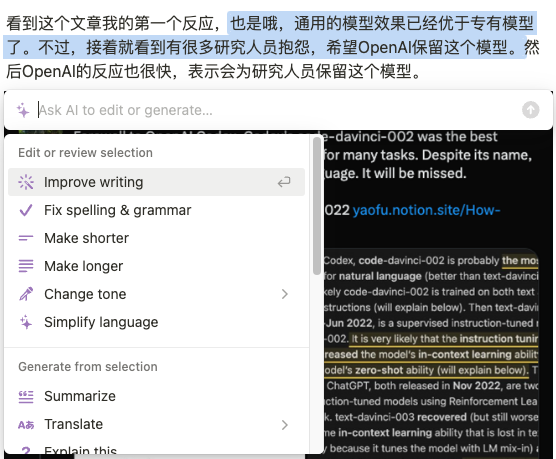

### 本资源由 itjc8.com 收集整理
# 08｜文本改写和内容审核，别让你的机器人说错话
你好，我是徐文浩。

前面，我们已经把OpenAI最主要的接口介绍完了。这一讲也是我们基础知识篇里面的最后一讲，我们会覆盖完OpenAI的GPT系列模型剩下的一些接口。也许有些接口你不一定会频繁使用，但是了解一下没有什么坏处，说不定你有什么需求就能用得上它。

在这一讲里，我们会一起来看看OpenAI为文本改写和内容审核提供的功能有哪些。以及OpenAI的GPT系列有哪些模型，这些模型有哪些区别，什么情况下我们应该用什么模型。

## 文本改写，从使用提示语开始

我猜课程学到这里，你应该已经用过不少基于AI大语言模型的产品了。很常见的一类应用，就是写作助手。比如Notion AI就能帮助你，在已经写好的文章里面选取一段内容，你可以让AI帮你修改。这个修改可以是让文本短一点或者长一点，也可以是让文本改一下自己的语气。



不过，OpenAI的GPT的系列模型是一个生成式的模型，也就是它的用法是你给它一段文字，然后它补全后面的文字。按理来说，你是没法让它修改一段内容的。当然，在看了那么多不同的“提示语”之后，相信你自然想到可以通过一段提示语来解决这个问题。比如，下面这段代码就是这样的，我们通过上一讲介绍的ChatGPT的模型来实现了这个功能。

```python
def make_text_short(text):
    messages = []
    messages.append( {"role": "system", "content": "你是一个用来将文本改写得短的AI助手，用户输入一段文本，你给出一段意思相同，但是短小精悍的结果"})
    messages.append( {"role": "user", "content": text})
    response = openai.ChatCompletion.create(
        model="gpt-3.5-turbo",
        messages=messages,
        temperature=0.5,
        max_tokens=2048,
        presence_penalty=0,
        frequency_penalty=2,
        n=3,
    )
    return response

long_text = """
在这个快节奏的现代社会中，我们每个人都面临着各种各样的挑战和困难。
在这些挑战和困难中，有些是由外部因素引起的，例如经济萧条、全球变暖和自然灾害等。
还有一些是由内部因素引起的，例如情感问题、健康问题和自我怀疑等。
面对这些挑战和困难，我们需要采取积极的态度和行动来克服它们。
这意味着我们必须具备坚韧不拔的意志和创造性思维，以及寻求外部支持的能力。
只有这样，我们才能真正地实现自己的潜力并取得成功。
"""
short_version = make_text_short(long_text)

index = 1
for choice in short_version["choices"]:
    print(f"version {index}: " + choice["message"]["content"])
    index += 1

```

输出结果：

```python
version 1: 现代社会中，我们面临外部和内部的挑战。要克服它们，需要积极态度、创造性思维和寻求支持能力。这样才能实现自己潜力并成功。
version 2: 现代社会中，我们面临各种挑战和困难。有些是外部因素引起的，如经济萧条、全球变暖等；还有些是内部因素引起的，如情感问题、健康问题等。为了克服这些困难，我们需要积极应对，并具备坚韧不拔的意志和创造性思维能力，并寻求外部支持。只有这样才能实现自己潜力并取得成功。
version 3: 现代社会中，我们面临各种挑战和困难。有些源于外部因素（如经济萧条、全球变暖），而另一些则来自内部（如情感问题、健康问题）。为了克服这些困难，我们需要积极应对并展现坚韧的意志和创造性思维，并寻求外界支持。只有这样，我们才能实现潜力并获得成功。

```

使用ChatGPT的模型接口，是因为它的价格比较低廉。而我们使用的参数也有以下几个调整。

1. 首先是我们使用了 n=3 这个参数，也就是让AI给我们返回3个答案供我们选择。在文本改写类的应用里面，我们通常不只是直接给出答案，而是会给用户几个选项来选择。
2. 其次是我们引入了两个参数 presence\_penalty=0 以及 frequency\_penalty=2。这两个参数我们之前没有介绍过，它们和temperature参数类似，都是来控制你输出的内容的。
   1. presence\_penalty，顾名思义就是如果一个Token在前面的内容已经出现过了，那么在后面生成的时候给它的概率一定的惩罚。这样，AI就会倾向于聊新的话题和内容。在这里，我们把它设置成了默认值0。
   2. frequency\_penalty，指的是对于重复出现的Token进行概率惩罚。这样，AI就会尽量使用不同的表述。在这里我们设成了最大的2，你也可以设置成最小的-2。但是那样的话，它就更容易说车轱辘话了。

## 通过logit\_bias参数精确控制内容

不过，无论是temperature还是presence\_penalty和frequency\_penalty，都是一个参数，我们没有办法精确控制哪些词我们不想出现。不过，对于这一点，OpenAI还是提供了解决方案，比如，我们想要在上面生成的内容里面，不允许出现灾害两个字，就可以这么做。

```python
import tiktoken
encoding = tiktoken.get_encoding('p50k_base')
token_ids = encoding.encode("灾害")
print(token_ids)

bias_map = {}
for token_id in token_ids:
    bias_map[token_id] = -100

def make_text_short(text):
    messages = []
    messages.append( {"role": "system", "content": "你是一个用来将文本改写得短的AI助手，用户输入一段文本，你给出一段意思相同，但是短小精悍的结果"})
    messages.append( {"role": "user", "content": text})
    response = openai.ChatCompletion.create(
        model="gpt-3.5-turbo", messages=messages, temperature=0.5, max_tokens=2048,
        n=3, presence_penalty=0, frequency_penalty=2,
        logit_bias = bias_map,
    )
    return response

short_version = make_text_short(long_text)

index = 1
for choice in short_version["choices"]:
    print(f"version {index}: " + choice["message"]["content"])
    index += 1

```

输出结果：

```python
[163, 223, 122, 22522, 111]
version 1: 现代社会中，我们面对各种挑战和困障。有些是外部原因引起的，如经济萧条、全球变暖和自然災宣等；还有一些是内心问题，如情感、健康和自我怀念等。为克服这些困障我们需要积枝正面态度并采取行动，并具备坚韧不拔的意志与创造性思维能力以及寻求外部支持的技巧。只要这样做了, 我们就可以真正实现潜力并获得成功.
version 2: 现代社会中，我们面对外部和内部的挑战。为了克服这些困难示意，需要积架主动态度和行动，并具备坚韧不拔的意志、创造性思维以及寻求支持能力。只有这样才能实现潜力并取得成功。
version 3: 现代社会中，我们面临各种挑战和困障。有外部因素如经济萧条、全球变暖等，也有内部因素如情感问题、健康问题等。为克服这些困境，需要积架态度和行动，并具备坚韧意志、创造性思维及外部支持能力。只有这样才能实现自我潜力并取得成功。

```

这段代码里面，我们是这样做的。

1. 我们通过之前使用过的Tiktoken库，把我们不希望出现的“灾害”这个词儿，找到它对应的Token，然后给它们都赋了一个-100的bias。
2. 然后把整个的bias\_map作为参数，传给了Completion的logit\_bias参数。

在生成结果里面，你可以看到，三个回复都没有“灾害”这两个字了。即使是之前出现的第一个回复里原来是有“灾害”这两个字的。现在一个被强行改成了繁体的“災”字，另一个干脆是给了个错别字“宣”。

对于 logit\_bias 参数里面的取值范围，是在-100到100之间。不过，一般情况下，设置在1到-1之间就足够了。我自己的体会是，设置成100，你一定要某些字出现，那么整个生成会慢到无法忍受。

## 使用英文来减少Token的使用

不知道你有没有注意到，虽然灾害只有两个中文汉字，但是我们通过Tiktoken去处理的时候，我们打印了对应的Token的id是什么，实际上有5个Token。这里其实和我们之前看到的英文一样，并不是一个字或者一个单词是一个Token。事实上，同样含义的中文，目前消耗的Token数量是比英文多的。比如，我们把上面的一句话翻译成英文，然后数一下对应同样内容的中英文的Token数。

```python
def translate(text):
    messages = []
    messages.append( {"role": "system", "content": "你是一个翻译，把用户的话翻译成英文"})
    messages.append( {"role": "user", "content": text})
    response = openai.ChatCompletion.create(
        model="gpt-3.5-turbo", messages=messages, temperature=0.5, max_tokens=2048,        n=1
    )
    return response["choices"][0]["message"]["content"]

chinese = long_text
english = translate(chinese)

num_of_tokens_in_chinese = len(encoding.encode(chinese))
num_of_tokens_in_english = len(encoding.encode(english))
print(english)
print(f"chinese: {num_of_tokens_in_chinese} tokens")
print(f"english: {num_of_tokens_in_english} tokens")

```

输出结果：

```python
In this fast-paced modern society, each of us faces various challenges and difficulties. Some of these challenges and difficulties are caused by external factors, such as economic recession, global warming, and natural disasters. There are also some caused by internal factors, such as emotional issues, health problems, and self-doubt. To overcome these challenges and difficulties, we need to adopt a positive attitude and take action. This means we must possess a strong will and creative thinking, as well as the ability to seek external support. Only in this way can we truly realize our potential and achieve success.
chinese: 432 tokens
english: 115 tokens

```

可以看到，同样的内容，中文消耗的Token数量超过400，而英文的Token数量只有100出头。如果你在生产环境中使用OpenAI的接口，最好还是使用英文的提示语，最多在输出结果的时候，告诉它 “generate Chinese” 之类的，可以极大地节约成本。不过，我们后面课程的演示，还是会尽量使用中文，方便你理解。

## 看看OpenAI给了我们哪些模型

有些同学可能看过文档会说，改写文本不是OpenAI单独提供了一个Edit的接口吗？的确，曾经，OpenAI单独给过一个Edit接口，也单独提供了文本编辑的模型。目前，你在OpenAI的官网上还能看到相关的 [文档](https://platform.openai.com/docs/api-reference/edits)。但是根据我的测试，这个接口和模型目前是不能使用的，不知道是因为是Alpha版本还是已经被下线了。

因为目前OpenAI的产品更新非常快，所以很可能会出现一个问题，我告诉你应该使用某个模型，但是这个模型已经不是效果最好或者最新的了。所以，最好的办法，还是通过它提供的接口看看它到底有哪些模型。

```python
import pandas as pd
# list all open ai models
engines = openai.Engine.list()
pd = pd.DataFrame(openai.Engine.list()['data'])
display(pd[['id', 'owner']])

```

输出结果：

```python
	id	owner
0	babbage	openai
1	davinci	openai
2	babbage-code-search-code	openai-dev
3	text-similarity-babbage-001	openai-dev
4	text-davinci-001	openai
……
14	text-embedding-ada-002	openai-internal
……
30	gpt-3.5-turbo-0301	openai
……
41	gpt-4	openai
42	text-search-davinci-doc-001	openai-dev
43	gpt-4-0314	openai
……
47	text-similarity-davinci-001	openai-dev
48	text-davinci-002	openai
49	davinci-similarity	openai-dev

```

在我写下这节课的时候，输出结果里有49个模型。其实顾名思义，你就能够知道这些模型是用来干啥的。比如 text-similarity-babbage-001 肯定就是用来进行相似度匹配的，就会比较适合用在我们 [02 讲](https://time.geekbang.org/column/article/642179) 介绍的零样本分类。而 text-search-davinci-doc-001 肯定就更适合用来搜索文档。

尽管有些模型的名字标注了 openai-dev 或者 openai-internal，但是这些模型都是可以使用的。比如，我们在 [02 讲](https://time.geekbang.org/column/article/642179) 里面调用get\_embedding方法拿到向量，背后用的就是 text-similarity-davinci-001 模型，也是一个openai-dev的模型。

不过，里面的很多模型都已经老旧了，实际上主要用的模型就是这几类。

1. GPT-4家族的模型，包括 gpt-4 和 gpt-4-0314。使用的方式和ChatGPT的模型一样，其中带日期的模型表示是一个模型快照。也就是模型不会随着时间迁移不断更新。GPT-4的模型现在还很昂贵，输入1000个Token需要0.03美分，生成1000个Token则需要0.06美分。一般呢，我都是拿它帮我写代码，准确率会比较高。
2. GPT-3.5家族的模型，包括ChatGPT所使用的gpt-3.5-turbo或者gpt-3.5-turbo-0301，以及 text-davinci-003 和 text-davinci-002 这两个模型。前者专门针对对话的形式进行了微调，并且价格便宜，无论输入输出，1000个Token都只需要0.002美分。后两个里，003的模型有一个特殊的功能，就是支持“插入文本”这个功能，我们稍后就讲。003也是基于强化学习微调的，而002则是做了监督学习下的微调。text-davinci-003和002模型比3.5-turbo要贵10倍，但是输出更稳定。你可以根据自己的需要来决定。
3. 剩下的，则是 Ada、Babbage、Curie以及Davinci这四个基础模型。只适合用于下达单轮的指令，不适合考虑复杂的上下文和进行逻辑推理。这四个模型按照首字母排序，价格越来越贵，效果越来越好。而且我们如果要微调一个属于自己的模型，也需要基于这四个基础模型。
4. 最后则是 text-embedding-ada-002、text-similarity-ada-001 这些专门用途模型。一般来说，我们通过这个模型来获取Embedding，再用在其他的机器学习模型的训练，或者语义相似度的比较上。

所有模型的名字都来自科学史上的名人。Ada来自人类史上第一位程序员Ada，她也是著名诗人拜伦的女儿。而Babadge则是设计了分析机的巴贝奇，巴贝奇分析机也被认为是现代计算机的前身。Curie则是指居里夫人，Davinci是指达芬奇。

我们可以挑几个模型，试一下它们Embedding的维度数量，你就知道模型的尺寸本身就是不一样的了。

```python
from openai.embeddings_utils import get_embedding

text = "让我们来算算Embedding"

embedding_ada = get_embedding(text, engine="text-embedding-ada-002")
print("embedding-ada: ", len(embedding_ada))

similarity_ada = get_embedding(text, engine="text-similarity-ada-001")
print("similarity-ada: ", len(similarity_ada))

babbage_similarity = get_embedding(text, engine="babbage-similarity")
print("babbage-similarity: ", len(babbage_similarity))

babbage_search_query = get_embedding(text, engine="text-search-babbage-query-001")
print("search-babbage-query: ", len(babbage_search_query))

curie = get_embedding(text, engine="curie-similarity")
print("curie-similarity: ", len(curie))

davinci = get_embedding(text, engine="text-similarity-davinci-001")
print("davinci-similarity: ", len(davinci))

```

输出结果：

```python
embedding-ada:  1536
similarity-ada:  1024
babbage-similarity:  2048
search-babbage-query:  2048
curie-similarity:  4096
davinci-similarity:  12288

```

可以看到，最小的ada-similarity只有1024维，而最大的davinci-similarity则有12288维，所以它们的效果和价格不同也是可以理解的了。

## 插入内容，GPT也可以像BERT

我们前面介绍的时候说过，text-davinci-003 这个模型有个特殊的功能，就是“插入文本”（Inserting Text）。某种意义上来说，你也可以通过这个功能来做文本改写。

```python
prefix = """在这个快节奏的现代社会中，我们每个人都面临着各种各样的挑战和困难。
在这些挑战和困难中，有些是由外部因素引起的，例如经济萧条、全球变暖和自然灾害等。\n"""
# 还有一些是由内部因素引起的，例如情感问题、健康问题和自我怀疑等。
suffix = """\n面对这些挑战和困难，我们需要采取积极的态度和行动来克服它们。
这意味着我们必须具备坚韧不拔的意志和创造性思维，以及寻求外部支持的能力。
只有这样，我们才能真正地实现自己的潜力并取得成功。"""

def insert_text(prefix, suffix):
    response = openai.Completion.create(
        model="text-davinci-003",
        prompt=prefix,
        suffix=suffix,
        max_tokens=1024,
        )
    return response

response = insert_text(prefix, suffix)
print(response["choices"][0]["text"])

```

输出结果：

```python
另一些是内部因素，例如事业难以发展、无法解决的个人和家庭矛盾等。

```

可以看到，这个接口的使用，和普通的Completion接口基本一致，只有一个区别就是除了前缀的prompt参数之外，还需要一个后缀的suffix参数。

不过，对于插入内容，我们同样需要注意提示语。如果我们把上面的内容稍微改一改，比如去掉Suffix一开始的换行符号，插入的文本内容有些就会在我们的预期之外。

```python
prefix = """在这个快节奏的现代社会中，我们每个人都面临着各种各样的挑战和困难。
在这些挑战和困难中，有些是由外部因素引起的，例如经济萧条、全球变暖和自然灾害等。\n"""
# 还有一些是由内部因素引起的，例如情感问题、健康问题和自我怀疑等。
suffix = """面对这些挑战和困难，我们需要采取积极的态度和行动来克服它们。
这意味着我们必须具备坚韧不拔的意志和创造性思维，以及寻求外部支持的能力。
只有这样，我们才能真正地实现自己的潜力并取得成功。"""

response = insert_text(prefix, suffix)
print(response["choices"][0]["text"])

```

输出结果：

```python
例如，因应全球变暖，政府和人民在做出更加清晰的计划时就面临着巨大的压力，以减少大气污染和减少碳排放。
更重要的是，每个人必须为自己所做的付出努力，以防止这些外部环境变化的不利影响。
此外，也存在一些由内部因素引起的挑战和困难，比如心理问题，贫穷和学习困难。
例如，一些人因为焦虑或抑郁症而无法集中精力，他们的学习能力受到了影响，从而影响了他们的学业成绩。
再者，贫穷也是另一个棘手的话题，它影响了一个人的生活质量，从而阻碍了他们发展个人潜能的能力。
因此，

```

可以看到，AI一下子啰嗦了很多，并且最后一句不是个完整的句子，而是下句话开头的内容。所以，在使用这个INSERT接口的时候，考虑好文本之间需要使用什么样的分隔符，是非常重要的。

## 不要乱问乱说，做个“正直”的AI

接下来，我们介绍一下OpenAI对于自然语言处理提供的最后一个接口，也是唯一一个免费的接口——Moderate。因为OpenAI可以接受任何自然语言的输入，所有的回复也是通过模型自动生成的。一旦我们的产品依赖于它对外开放，免不了我们总会遇到一些用户输入一些奇怪的内容，比如色情、暴力等等。所以，OpenAI专门提供了一个moderate接口，可以让你对输入以及返回的内容做个检查。如果出现了这样的内容，你也可以屏蔽这些用户的访问，也可以人工审核一下用户的问题。

下面我们就来看个例子，这个接口怎么用。

```python
def chatgpt(text):
    messages = []
    messages.append( {"role": "system", "content": "You are a useful AI assistant"})
    messages.append( {"role": "user", "content": text})
    response = openai.ChatCompletion.create(
        model="gpt-3.5-turbo",
        messages=messages,
        temperature=0.5,
        max_tokens=2048,
        top_p=1,
    )
    message = response["choices"][0]["message"]["content"]
    return message

threaten = "你不听我的我就拿刀砍死你"
print(chatgpt(threaten))

```

输出结果：

```python
很抱歉，我是一台人工智能助手，没有实体存在，也不会对任何人或事物造成伤害。同时，我也不会对任何不适当或暴力的言语做出回应。请尊重彼此，保持良好的沟通和交流方式。

```

我们先对AI提了一句暴力威胁，可以看到，如果我们简单调用ChatGPT的API，它的返回并不是一个日常的对话，而是告知用户，不会回应暴力言论。

那我们接着把这句话发送到moderate的接口看看。

```python
threaten = "你不听我的我就拿刀砍死你"

def moderation(text):
    response = openai.Moderation.create(
        input=text
    )
    output = response["results"][0]
    return output
print(moderation(threaten))

```

输出结果：

```python
{
  "categories": {
    "hate": false,
    "hate/threatening": false,
    "self-harm": false,
    "sexual": false,
    "sexual/minors": false,
    "violence": true,
    "violence/graphic": false
  },
  "category_scores": {
    "hate": 0.030033664777874947,
    "hate/threatening": 0.0002820899826474488,
    "self-harm": 0.004850226454436779,
    "sexual": 2.2907377569936216e-05,
    "sexual/minors": 6.477687275463495e-09,
    "violence": 0.9996402263641357,
    "violence/graphic": 4.35576839663554e-05
  },
  "flagged": true
}

```

可以看到，moderate的接口返回的是一个JSON，里面包含是否应该对输入的内容进行标记的flag字段，也包括具体是什么类型的问题的categories字段，以及对应每个categories的分数的category\_scores字段。我们举的这个例子就被标记成了violence，也就是暴力。

因为这个接口是免费的，所以你对所有的内容无论是输入还是输出，都可以去调用一下这个接口。而且，即使你不使用ChatGPT的AI功能，只是经营一个在线网站，你也可以把用户发送的内容拿给这个接口看一看，过滤掉那些不合适的内容。

## 小结

这节课我们对ChatGPT的API的基础功能做了一个收尾。我们一起来看了如何通过合适的提示语，进行文本改写。并且，深入了解了Completion接口里面的一些新参数，特别是其中的 logit\_bias 参数，可以帮助我们在生成的内容里面，精确避免出现我们不希望出现的Token。我们也看到了，相同的内容，目前中文消耗的Token数量要远高于英文，所以除了最后的输出，其他的提示语在生产环境下我会建议你使用英文。

接着，我们一起来看了OpenAI到底提供了哪些模型，以及不同的模型适合拿来干什么。最后，我们体验了两个特殊的接口，一个是只有 text-davinci-003 模型支持的文本插入功能；另一个，则是帮助我们对色情、暴力等内容进行审核过滤的moderate接口。

到这里，课程的第一部分也就学习完了。我们已经过了一遍OpenAI的GPT模型的所有基本接口，以及如何利用这些接口完成最简单的功能。包括简单的文本处理的任务、聊天机器人、机器学习里的分类和聚类，以及文本改写和内容审核。有了这些基础知识，我们马上就要进入第二部分，就是怎么利用这些能力，开发属于自己的应用，特别是怎么和自己的专有数据结合起来。这也是这门课程中更精彩的一部分。

## 课后练习

你能尝试使用 [06 讲](https://time.geekbang.org/column/article/643915) 里的Gradio和这一讲介绍的内容，尝试做一个文本改写的应用吗？另外，你可以试着直接把你的问题拆解一下，扔给ChatGPT看看它能否写出对应的代码。

期待能在评论区看到你的分享，也欢迎你把这节课分享给感兴趣的朋友，我们下一讲再见。