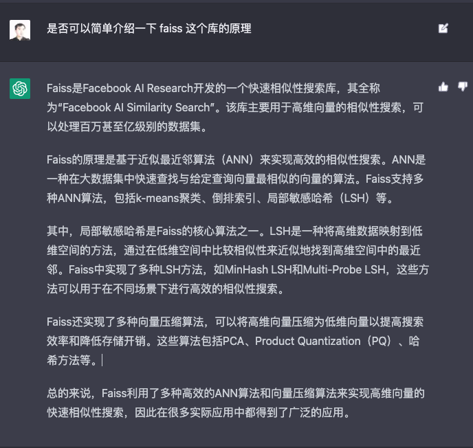

### 本资源由 itjc8.com 收集整理
# 09｜语义检索，利用Embedding优化你的搜索功能
你好，我是徐文浩。

在过去的8讲里面，相信你已经对Embedding和Completion接口非常熟悉了。Embedding向量适合作为一个中间结果，用于传统的机器学习场景，比如分类、聚类。而Completion接口，一方面可以直接拿来作为一个聊天机器人，另一方面，你只要善用提示词，就能完成合理的文案撰写、文本摘要、机器翻译等一系列的工作。

不过，很多同学可能会说，这个和我的日常工作又没有什么关系。的确，日常我们的需求里面，最常使用自然语言处理（NLP）技术的，是搜索、广告、推荐这样的业务。那么，今天我们就来看看，怎么利用OpenAI提供的接口来为这些需求提供些帮助。

## 让AI生成实验数据

在实际演示代码之前，我们需要一些可以拿来实验的数据。之前，我们都是在网上找一些数据集，或者直接使用一些机器学习软件包里面自带的数据集。但是，并不是所有时候我们都能很快找到合适的数据集。这个时候，我们也可以利用AI，我们直接让AI帮我们生成一些数据不就好了吗？

```python
import openai, os

openai.api_key = os.environ.get("OPENAI_API_KEY")
COMPLETION_MODEL = "text-davinci-003"

def generate_data_by_prompt(prompt):
    response = openai.Completion.create(
        engine=COMPLETION_MODEL,
        prompt=prompt,
        temperature=0.5,
        max_tokens=2048,
        top_p=1,
    )
    return response.choices[0].text

prompt = """请你生成50条淘宝网里的商品的标题，每条在30个字左右，品类是3C数码产品，标题里往往也会有一些促销类的信息，每行一条。"""
data = generate_data_by_prompt(prompt)

```

为了让数据和真实情况更加接近一点，我们可以好好设计一下我们的提示语。比如，我这里就指明了是淘宝的商品，品类是3C，并且标题里要包含一些促销信息。

我们把拿到的返回结果，按行分割，加载到一个DataFrame里面，看看结果会是怎么样的。

```python
import pandas as pd

product_names = data.strip().split('\n')
df = pd.DataFrame({'product_name': product_names})
df.head()

```

输出结果：

```python
    product_name
0	1. 【限时特惠】Apple/苹果 iPhone 11 Pro Max 手机
1	2. 【超值折扣】Huawei/华为 P30 Pro 智能手机
2	3. 【热销爆款】OPPO Reno 10X Zoom 全网通手机
3	4. 【限量特价】Xiaomi/小米 9 Pro 5G 手机
4	5. 【限时促销】Apple/苹果 iPad Pro 11寸 平板

```

可以看到，AI为我们生成了50条商品信息，并且每一个都带上了一些促销相关的标签。不过，在返回的结果里面，每一行都带上了一个标号，所以我们需要简单处理一下，去掉这个标号拿到一些干净的数据。

```python
df.product_name = df.product_name.apply(lambda x: x.split('.')[1].strip())
df.head()

```

输出结果：

```python
     product_name
0	【限时特惠】Apple/苹果 iPhone 11 Pro Max 手机
1	【超值折扣】Huawei/华为 P30 Pro 智能手机
2	【热销爆款】OPPO Reno 10X Zoom 全网通手机
3	【限量特价】Xiaomi/小米 9 Pro 5G 手机
4	【限时促销】Apple/苹果 iPad Pro 11寸 平板

```

我们可以如法炮制，再生成一些女装的商品名称，覆盖不同的品类，这样后面我们演示搜索效果的时候就会方便一点。

```python
clothes_prompt = """请你生成50条淘宝网里的商品的标题，每条在30个字左右，品类是女性的服饰箱包等等，标题里往往也会有一些促销类的信息，每行一条。"""
clothes_data = generate_data_by_prompt(clothes_prompt)
clothes_product_names = clothes_data.strip().split('\n')
clothes_df = pd.DataFrame({'product_name': clothes_product_names})
clothes_df.product_name = clothes_df.product_name.apply(lambda x: x.split('.')[1].strip())
clothes_df.head()

```

输出结果：

```python
    product_name
0	【新款】时尚百搭羊绒毛衣，暖洋洋温暖你的冬天
1	【热卖】复古气质翻领毛衣，穿出时尚感
2	【特价】轻薄百搭棉衣，舒适温暖，冬季必备
3	【限时】经典百搭牛仔外套，轻松搭配，时尚范
4	【全新】简约大气羊绒连衣裙，温柔优雅

```

然后我们把这两个DataFrame拼接在一起，就是我们接下来用于做搜索实验的数据。

```python
df = pd.concat([df, clothes_df], axis=0)
df = df.reset_index(drop=True)
display(df)

```

输出结果：

```python
	product_name
0	【新款】Apple/苹果 iPhone 11 Pro Max 智能手机
1	【特惠】华为P30 Pro 8GB+256GB 全网通版
2	【限量】OnePlus 7T Pro 8GB+256GB 全网通
3	【新品】小米CC9 Pro 8GB+256GB 全网通版
4	【热销】三星Galaxy Note10+ 8GB+256GB 全网通
...	...
92	【优惠】气质小清新拼接百搭双肩斜挎包
93	【热卖】活力色彩精致小巧百搭女士单肩斜挎包
94	【特价】简约可爱原宿风时尚双肩斜挎包
95	【折扣】潮流小清新拼接百搭女士单肩斜挎包
96	【特惠】百搭潮流活力色彩拼色双肩斜挎

```

不过如果你多试几次，你会发现AI有时候返回的条数没有50条，不过没有关系，这个基本不影响我们使用这个数据源。你完全可以多运行几次，获得足够你需要的数据。

## 通过Embedding进行语义搜索

那对于搜索问题，我们可以用GPT模型干些什么呢？像百度、阿里这样的巨头公司自然有很多内部复杂的策略和模型，但是对于大部分中小公司，特别是刚开始提供搜索功能的时候，往往是使用Elasticsearch这个开源项目。而Elasticsearch背后的搜索原理，则是先分词，然后再使用倒排索引。

简单来说，就是把上面的“气质小清新拼接百搭双肩斜挎包”这样的商品名称，拆分成“气质”“小清新”“拼接”“百搭”“双肩”“斜挎包”。每个标题都是这样切分。然后，建立一个索引，比如“气质”这个词，出现过的标题的编号，都按编号顺序跟在气质后面。其他的词也类似。

然后，当用户搜索的时候，比如用户搜索“气质背包”，也会拆分成“气质”和“背包”两个词。然后就根据这两个词，找到包含这些词的标题，根据出现的词的数量、权重等等找出一些商品。

但是，这个策略有一个缺点，就是如果我们有同义词，那么这么简单地去搜索是搜不到的。比如，我们如果搜“自然淡雅背包”，虽然语义上很接近，但是因为“自然”“淡雅”“背包”这三个词在这个商品标题里都没有出现，所以就没有办法匹配上了。为了提升搜索效果，你就得做更多的工程研发工作，比如找一个同义词表，把标题里出现的同义词也算上等等。

不过，有了OpenAI的Embedding接口，我们就可以把一段文本的语义表示成一段向量。而向量之间是可以计算距离的，这个我们在之前的情感分析的零样本分类里就演示过了。那如果我们把用户的搜索，也通过Embedding接口变成向量。然后把它和所有的商品的标题计算一下余弦距离，找出离我们搜索词最近的几个向量。那最近的几个向量，其实就是语义和这个商品相似的，而并不一定需要相同的关键词。

那根据这个思路，我们不妨用代码来试一试。

首先，我们还是要把随机生成出来的所有商品标题，都计算出来它们的Embedding，然后存下来。这里的代码，基本和之前通过Embedding进行分类和聚类一致，就不再详细讲解了。我们还是利用backoff和batch处理，让代码能够容错，并且快速处理完这些商品标题。

```python
from openai.embeddings_utils import get_embeddings
import openai, os, backoff

openai.api_key = os.environ.get("OPENAI_API_KEY")
embedding_model = "text-embedding-ada-002"

batch_size = 100

@backoff.on_exception(backoff.expo, openai.error.RateLimitError)
def get_embeddings_with_backoff(prompts, engine):
    embeddings = []
    for i in range(0, len(prompts), batch_size):
        batch = prompts[i:i+batch_size]
        embeddings += get_embeddings(list_of_text=batch, engine=engine)
    return embeddings

prompts = df.product_name.tolist()
prompt_batches = [prompts[i:i+batch_size] for i in range(0, len(prompts), batch_size)]

embeddings = []
for batch in prompt_batches:
    batch_embeddings = get_embeddings_with_backoff(prompts=batch, engine=embedding_model)
    embeddings += batch_embeddings

df["embedding"] = embeddings
df.to_parquet("data/taobao_product_title.parquet", index=False)

```

然后，我们就可以定义一个search\_product的搜索函数，接受三个参数，一个df代表用于搜索的数据源，一个query代表用于搜索的搜索词，然后一个n代表搜索返回多少条记录。而这个函数就干了这样三件事情。

1. 调用OpenAI的API将搜索词也转换成Embedding。
2. 将这个Embedding和DataFrame里的每一个Embedding都计算一下余弦距离。
3. 根据余弦相似度去排序，返回距离最近的n个标题。

```python
from openai.embeddings_utils import get_embedding, cosine_similarity

# search through the reviews for a specific product
def search_product(df, query, n=3, pprint=True):
    product_embedding = get_embedding(
        query,
        engine=embedding_model
    )
    df["similarity"] = df.embedding.apply(lambda x: cosine_similarity(x, product_embedding))

    results = (
        df.sort_values("similarity", ascending=False)
        .head(n)
        .product_name
    )
    if pprint:
        for r in results:
            print(r)
    return results

results = search_product(df, "自然淡雅背包", n=3)

```

我们就拿刚才举的那个例子，使用“自然淡雅背包”作为搜索词，调用这个search\_product函数，然后拿前3个返回结果。可以看到，尽管在关键词上完全不同，但是返回的结果里，的确包含了“小清新百搭拼色女士单肩斜挎包”这个商品。

输出结果：

```python
【新品】潮流简约可爱时尚双肩斜挎包
【优惠】精致小巧可爱双肩斜挎包
【新品】小清新百搭拼色女士单肩斜挎包

```

注意，因为我们的商品标题都是随机生成的，所以你得到的数据集和搜索结果可能都和我不一样，你根据实际情况测试你想要的搜索词即可。

## 利用Embedding信息进行商品推荐的冷启动

Embedding的向量距离，不仅可以用于搜索，也可以用于 **商品推荐里的冷启动**。主流的推荐算法，主要是依托于用户“看了又看”这样的行为信息。也就是如果有很多用户看了OPPO的手机，又去看了vivo的手机，那么在用户看OPPO手机的时候，我们就可以向他推荐vivo手机。但是，往往一个新的商品，或者新的平台，没有那么多相关的行为数据。这个时候，我们同样可以根据商品名称在语义上的相似度，来进行商品推荐。

我们这里的代码实现和上面的搜索例子基本一致，唯一的差别就是商品名称的Embedding是根据输入的商品名称，从DataFrame里找到的，而不是通过调用OpenAI的Embedding API获取。因为这个Embedding我们之前已经计算过一遍了，没有必要浪费成本再请求一次。

```python
def recommend_product(df, product_name, n=3, pprint=True):
    product_embedding = df[df['product_name'] == product_name].iloc[0].embedding
    df["similarity"] = df.embedding.apply(lambda x: cosine_similarity(x, product_embedding))

    results = (
        df.sort_values("similarity", ascending=False)
        .head(n)
        .product_name
    )
    if pprint:
        for r in results:
            print(r)
    return results

results = recommend_product(df, "【限量】OnePlus 7T Pro 8GB+256GB 全网通", n=3)

```

输出结果：

```python
【限量】OnePlus 7T Pro 8GB+256GB 全网通
【新品】OnePlus 7T Pro 8GB+256GB 全网通
【限量】荣耀V30 Pro 8GB+256GB 全网通版

```

## 通过FAISS加速搜索过程

不过，上面的示例代码里面，还有一个问题。那就是每次我们进行搜索或者推荐的时候，我们都要把输入的Embedding和我们要检索的数据的所有Embedding都计算一次余弦相似度。例子里，我们检索的数据只有100条，但是在实际的应用中，即使不是百度、谷歌那样的搜索引擎，搜索对应的内容条数在几百万上千万的情况也不在少数。如果每次搜索都要计算几百万次余弦距离，那速度肯定慢得不行。

这个问题也有解决办法。我们可以利用一些向量数据库，或者能够快速搜索相似性的软件包就好了。比如，我比较推荐你使用Facebook开源的Faiss这个Python包，它的全称就是Facebook AI Similarity Search，也就是快速进行高维向量的相似性搜索。

我们把上面的代码改写一下，先把DataFrame里面计算好的Embedding向量都加载到Faiss的索引里，然后让Faiss帮我们快速找到最相似的向量，来看看效果怎么样。

当然，按照惯例我们还是需要先安装Faiss这个Python库。

```python
conda install -c conda-forge faiss

```

把索引加载到Faiss里面非常容易，我们直接把整个的Embedding变成一个二维矩阵，整个加载到Faiss里面就好了。在加载之前，我们先要定义好Faiss索引的维度数，也就是我们Embedding向量的维度数。

```python
import faiss
import numpy as np

def load_embeddings_to_faiss(df):
    embeddings = np.array(df['embedding'].tolist()).astype('float32')
    index = faiss.IndexFlatL2(embeddings.shape[1])
    index.add(embeddings)
    return index

index = load_embeddings_to_faiss(df)

```

而搜索Faiss也非常容易，我们把查询变成Embedding，然后再把Embedding转换成一个numpy的array向量，然后直接对刚才生成的索引 index 调用 search 方法，并且指定返回的结果数量就可以了。

返回拿到的，只有索引的index，也就是加载在Faiss里面的第几个索引。我们还是要根据这个，在DataFrame里面，反查到对应的是DataFrame里面的第几行，以及这一行商品的标题是什么，就能获得搜索的结果。

```python
def search_index(index, df, query, k=5):
    query_vector = np.array(get_embedding(query, engine=embedding_model)).reshape(1, -1).astype('float32')
    distances, indexes = index.search(query_vector, k)

    results = []
    for i in range(len(indexes)):
        product_names = df.iloc[indexes[i]]['product_name'].values.tolist()
        results.append((distances[i], product_names))
    return results

products = search_index(index, df, "自然淡雅背包", k=3)

for distances, product_names in products:
    for i in range(len(distances)):
        print(product_names[i], distances[i])

```

输出结果：

```python
【新品】潮流简约可爱时尚双肩斜挎包 0.22473168
【优惠】精致小巧可爱双肩斜挎包 0.22881898
【新品】小清新百搭拼色女士单肩斜挎包 0.22901852

```

我们同样用“自然淡雅背包”这个搜索词，可以看到搜索结果和之前我们自己计算余弦距离排序的结果是一样的。

Faiss的原理，是通过ANN这样的近似最近邻的算法，快速实现相似性的搜索。如果你想进一步了解Faiss的原理，你也可以去问问ChatGPT。



Faiss这个库能够加载的数据量，受限于我们的内存大小。如果你的数据量进一步增长，就需要选用一些向量数据库来进行搜索。比如OpenAI就推荐了 [Pinecone](https://www.pinecone.io/) 和 [Weaviate](https://weaviate.io/)，周围也有不少团队使用的是 [Milvus](https://milvus.io/) 这个国人开源的产品。

当然，无论是搜索还是推荐，使用Embedding的相似度都只是一种快速启动的方式。需要真正做到更好的效果，一定也需要投入更复杂的策略。比如根据用户行为的反馈，更好地排序搜索和推荐结果。但是，对于提供一个简单的搜索或者推荐功能来说，通过文本的Embedding的相似度，是一个很好的快速启动的方式。

## 小结

好了，相信经过这一讲，你已经有了快速优化你们现有业务里的推荐和搜索功能的思路了。这一讲里，我主要想教会你三件事情。

第一，是在没有合适的测试数据的时候，我们完全可以让AI给我们生成一些数据。既节约了在网上找数据的时间，也能根据自己的要求生成特定特征的数据。比如，我们就可以要求在商品标题里面有些促销相关的信息。

第二，是如何利用Embedding之间的余弦相似度作为语义上的相似度，优化搜索。通过Embedding的相似度，我们不要求搜索词和查询的内容之间有完全相同的关键字，而只要它们的语义信息接近就好了。

第三，是如何通过Faiss这样的Python库，或者其他的向量数据库来快速进行向量之间的检索。而不是必须每一次搜索都和整个数据库计算一遍余弦相似度。

通过对于我们自己的数据计算Embedding，然后索引起来，我们可以将外部的知识和信息引入到使用GPT模型的应用里来。后面，我们还会进一步学习如何利用这些外部知识，开发更加复杂的AI应用。

## 课后练习

搜索里面经常会遇到这样一个问题，同样的关键词有歧义。比如，我们搜索“小米手机”，返回结果里也许应该有“荣耀V30 Pro”，但是不应该返回“黑龙江优质小米”。你可以试一试用Embedding进行语义搜索，看看还会不会遇上这样的问题？

期待能在评论区看到你的分享，也欢迎你把这节课分享给感兴趣的朋友，我们下一讲再见。