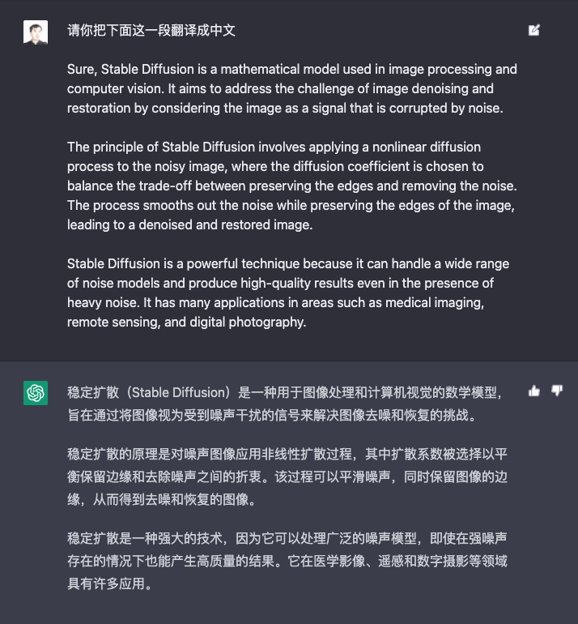
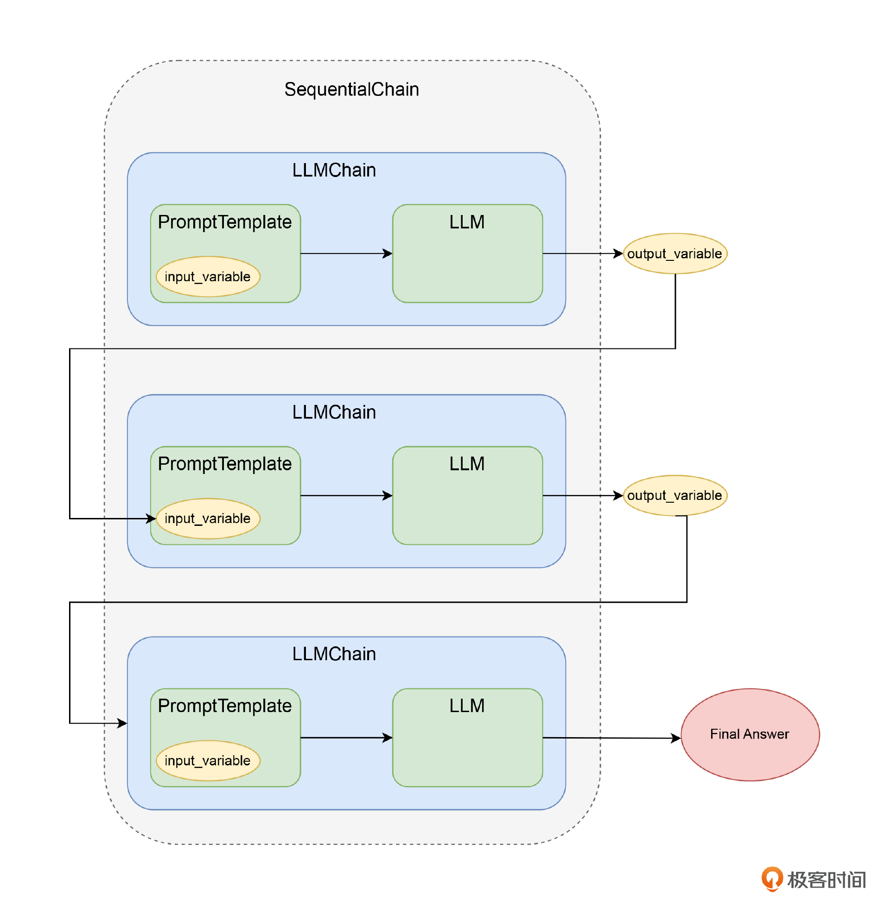

### 本资源由 itjc8.com 收集整理
# 14｜链式调用，用LangChain简化多步提示语
你好，我是徐文浩。

OpenAI的大语言模型，只是提供了简简单单的Completion和Embedding这样两个核心接口。但是你也看到了，在过去的13讲里，通过合理使用这两个接口，我们完成了各种各样复杂的任务。

- 通过提示语（Prompt）里包含历史的聊天记录，我们能够让AI根据上下文正确地回答问题。
- 通过将Embedding提前索引好存起来，我们能够让AI根据外部知识回答问题。
- 而通过多轮对话，将AI返回的答案放在新的问题里，我们能够让AI帮我们给自己的代码撰写单元测试。

这些方法，也是一个实用的自然语言类应用里常见的模式。我之前也都通过代码为你演示过具体的做法。但是，如果我们每次写应用的时候，都需要自己再去OpenAI提供的原始API里做一遍，那就太麻烦了。于是，开源社区就有人将这些常见的需求和模式抽象了出来，开发了一个叫做Langchain的开源库。那么接下来，我们就来看看如何使用LangChain来快速实现之前我们利用大语言模型实现过的功能。以及我们如何进一步地，将Langchain和我们的业务系统整合，完成更复杂、更有实用价值的功能。

## 使用Langchain的链式调用

如果你观察得比较仔细的话，你会发现在 [第 11 讲](https://time.geekbang.org/column/article/646363) 我们使用llama-index的时候，就已经装好LangChain了。llama-index专注于为大语言模型的应用构建索引，虽然Langchain也有类似的功能，但这一点并不是Langchain的主要卖点。Langchain的第一个卖点其实就在它的名字里，也就是 **链式调用**。

我们先来看一个使用ChatGPT的例子，你就能理解为什么会有链式调用的需求了。我们知道，GPT-3的基础模型里面，中文的语料很少。用中文问它问题，很多时候它回答得不好。所以有时候，我会迂回处理一下，先把中文问题给AI，请它翻译成英文，然后再把英文问题贴进去提问，得到一个英文答案。最后，再请AI把英文答案翻译回中文。很多时候，问题的答案会更准确一点。比如，下面的截图里，我就请它简单介绍一下Stable Diffusion的原理是什么。

注：Stable Diffusion是一个热门的开源AI画图工具，后面我们在介绍用AI生成图片的时候会用到。

### 人工链式调用




如果用API来实现这个过程，其实就是一个链式调用的过程。

1. 我们先调用OpenAI，把翻译请求和原始问题组合在一起发送给AI，完成问题的中译英。
2. 然后再把拿到的翻译好的英文问题发送给OpenAI，得到英文答案。
3. 最后再把英文答案，和对应要求AI翻译答案的请求组合在一起，完成答案的英译中。

### 使用LLMChain进行链式调用

如果我们用代码，可以像下面这样，一步步进行。

```python
import openai, os
from langchain.prompts import PromptTemplate
from langchain.llms import OpenAI
from langchain.chains import LLMChain

openai.api_key = os.environ.get("OPENAI_API_KEY")

llm = OpenAI(model_name="text-davinci-003", max_tokens=2048, temperature=0.5)

en_to_zh_prompt = PromptTemplate(
    template="请把下面这句话翻译成英文： \n\n {question}?", input_variables=["question"]
)

question_prompt = PromptTemplate(
    template = "{english_question}", input_variables=["english_question"]
)

zh_to_cn_prompt = PromptTemplate(
    input_variables=["english_answer"],
    template="请把下面这一段翻译成中文： \n\n{english_answer}?",
)

question_translate_chain = LLMChain(llm=llm, prompt=en_to_zh_prompt, output_key="english_question")
english = question_translate_chain.run(question="请你作为一个机器学习的专家，介绍一下CNN的原理。")
print(english)

qa_chain = LLMChain(llm=llm, prompt=question_prompt, output_key="english_answer")
english_answer = qa_chain.run(english_question=english)
print(english_answer)

answer_translate_chain = LLMChain(llm=llm, prompt=zh_to_cn_prompt)
answer = answer_translate_chain.run(english_answer=english_answer)
print(answer)

```

输出结果：

```plain
Please explain the principles of CNN as an expert in Machine Learning.

A Convolutional Neural Network (CNN) is a type of deep learning algorithm that is used to analyze visual imagery. It is modeled after the structure of the human visual cortex and is composed of multiple layers of neurons that process and extract features from an image. The main principle behind a CNN is that it uses convolutional layers to detect patterns in an image. Each convolutional layer is comprised of a set of filters that detect specific features in an image. These filters are then used to extract features from the image and create a feature map. The feature map is then passed through a pooling layer which reduces the size of the feature map and helps to identify the most important features in the image. Finally, the feature map is passed through a fully-connected layer which classifies the image and outputs the result.

卷积神经网络（CNN）是一种深度学习算法，用于分析视觉图像。它模仿人类视觉皮层的结构，由多层神经元组成，可以处理和提取图像中的特征。CNN的主要原理是使用卷积层来检测图像中的模式。每个卷积层由一组滤波器组成，可以检测图像中的特定特征。然后使用这些滤波器从图像中提取特征，并创建特征图。然后，将特征图通过池化层传递，该层可以减小特征图的大小，并有助于识别图像中最重要的特征。最后，将特征图传递给完全连接的层，该层将对图像进行分类，并输出结果。

```

这里的代码，我们使用了Langchain这个库，不过还没有动用它的链式调用过程。我们主要用了Langchain的三个包。

1. LLM，也就是我们使用哪个大语言模型，来回答我们提出的问题。在这里，我们还是使用OpenAIChat，也就是最新放出来的 gpt-3.5-turbo 模型。
2. PromptTemplate，和我们在 [第 11 讲](https://time.geekbang.org/column/article/646363) 里看到的llama-index的PromptTemplate是一个东西。它可以定义一个提示语模版，里面能够定义一些可以动态替换的变量。比如，代码里的question\_prompt这个模版里，我们就定义了一个叫做question的变量，因为我们每次问的问题都会不一样。事实上，llamd-index里面的PromptTemplate就是对Langchain的PromptTemplate做了一层简单的封装。
3. 主角 LLMChain，它的构造函数接收一个LLM和一个PromptTemplate作为参数。构造完成之后，可以直接调用里面的run方法，将PromptTemplate需要的变量，用K=>V对的形式传入进去。返回的结果，就是LLM给我们的答案。

不过如果看上面这段代码，我们似乎只是对OpenAI的API做了一层封装而已。我们构建了3个LLMChain，然后按照顺序调用，每次拿到答案之后，再作为输入，交给下一个LLM调用。感觉好像更麻烦了，没有减少什么工作量呀？

别着急，这是因为我们还没有真正用上LLMChain的“链式调用”功能，而用这个功能，只需要加上一行小小的代码。我们用一个叫做SimpleSequentialChain的LLMChain类，把我们要按照顺序依次调用的三个LLMChain放在一个数组里，传给这个类的构造函数。

然后对于这个对象，我们调用run方法，把我们用中文问的问题交给它。这个时候，这个SimpleSequentialChain，就会按照顺序开始调用chains这个数组参数里面包含的其他LLMChain。并且，每一次调用的结果，会存储在这个Chain构造时定义的output\_key参数里。而下一个调用的LLMChain，里面模版内的变量如果有和之前的output\_key名字相同的，就会用output\_key里存入的内容替换掉模版内变量所在的占位符。

这次，我们只向这个SimpleSequentialChain调用一次run方法，把一开始的问题交给它就好了。后面根据答案去问新的问题，这个LLMChain会自动地链式搞定。我在这里把日志的Verbose模式打开了，你在输出的过程中，可以看到其实这个LLMChain是调用了三次，并且中间两次的返回结果你也可以一并看到。

```python
from langchain.chains import SimpleSequentialChain

chinese_qa_chain = SimpleSequentialChain(
    chains=[question_translate_chain, qa_chain, answer_translate_chain], input_key="question",
    verbose=True)
answer = chinese_qa_chain.run(question="请你作为一个机器学习的专家，介绍一下CNN的原理。")
print(answer)

```

Verbose日志信息：

```plain
> Entering new SimpleSequentialChain chain...

Please introduce the principle of CNN as a machine learning expert.

Convolutional Neural Networks (CNNs) are a type of artificial neural network that are commonly used in image recognition and classification tasks. They are inspired by the structure of the human brain and are composed of multiple layers of neurons connected in a specific pattern. The neurons in the first layer of a CNN are connected to the input image, and the neurons in the last layer are connected to the output. The neurons in between the input and output layers are called feature maps and are responsible for extracting features from the input image. CNNs use convolutional layers to detect patterns in the input image and pooling layers to reduce the size of the feature maps. This allows the CNN to learn the most important features in the image and use them to make predictions.

卷积神经网络（CNN）是一种常用于图像识别和分类任务的人工神经网络。它们受到人脑结构的启发，由多层神经元以特定模式连接而成。CNN的第一层神经元与输入图像连接，最后一层神经元与输出连接。输入和输出层之间的神经元称为特征映射，负责从输入图像中提取特征。CNN使用卷积层检测输入图像中的模式，使用池化层减小特征映射的大小。这使得CNN能够学习图像中最重要的特征，并利用它们进行预测。
> Finished chain.

```

输出结果：

```plain
卷积神经网络（CNN）是一种常用于图像识别和分类任务的人工神经网络。它们受到人脑结构的启发，由多层神经元以特定模式连接而成。CNN的第一层神经元与输入图像连接，最后一层神经元与输出连接。输入和输出层之间的神经元称为特征映射，负责从输入图像中提取特征。CNN使用卷积层检测输入图像中的模式，使用池化层减小特征映射的大小。这使得CNN能够学习图像中最重要的特征，并利用它们进行预测。

```

在使用这样的链式调用的时候，有一点需要注意，就是一个LLMChain里，所使用的PromptTemplate里的输入参数， **之前必须在LLMChain里，通过 output\_key 定义过。** 不然，这个变量没有值，程序就会报错。

### 支持多个变量输入的链式调用

事实上，因为使用变量的输入输出，是用这些参数定义的。所以我们不是只能用前一个LLMChain的输出作为后一个LLMChain的输入。我们完全可以连续问多个问题，然后把这些问题的答案，作为后续问题的输入来继续处理。下面我就给你看一个例子。

```python
from langchain.chains import SequentialChain

q1_prompt = PromptTemplate(
    input_variables=["year1"],
    template="{year1}年的欧冠联赛的冠军是哪支球队，只说球队名称。"
)
q2_prompt = PromptTemplate(
    input_variables=["year2"],
    template="{year2}年的欧冠联赛的冠军是哪支球队，只说球队名称。"
)
q3_prompt = PromptTemplate(
    input_variables=["team1", "team2"],
    template="{team1}和{team2}哪只球队获得欧冠的次数多一些？"
)
chain1 = LLMChain(llm=llm, prompt=q1_prompt, output_key="team1")
chain2 = LLMChain(llm=llm, prompt=q2_prompt, output_key="team2")
chain3 = LLMChain(llm=llm, prompt=q3_prompt)

sequential_chain = SequentialChain(chains=[chain1, chain2, chain3], input_variables=["year1", "year2"], verbose=True)
answer = sequential_chain.run(year1=2000, year2=2010)
print(answer)

```

输出结果：

```plain
> Entering new SequentialChain chain...
> Finished chain.

西班牙皇家马德里队获得欧冠的次数更多，共13次，而拜仁慕尼黑只有5次。

```

在这个例子里，我们定义了两个PromptTemplate和对应的LLMChain，各自接收一个年份作为输入，回答这两个年份的欧冠冠军。然后将两个队名作为输入，放到第三个问题里，让AI告诉我们这两支球队哪一支获得欧冠的次数多一些。只需要在我们的SequentialChain里输入两个年份，就能通过三次回答得到答案。

## 通过Langchain实现自动化撰写单元测试

看到这里，不知道你有没有想起我们上一讲刚刚讲过的通过多步提示语自动给代码写单元测试。没错，Langchain可以顺序地通过多个Prompt调用OpenAI的GPT模型。这个能力拿来实现上一讲的自动化测试的功能是再合适不过的了。下面，我就拿Langchain重新实现了一遍上一讲的这个功能，并且给它补上了AST语法解析失败之后自动重试的能力。

````python
from langchain.chains import SequentialChain

def write_unit_test(function_to_test, unit_test_package = "pytest"):
    # 解释源代码的步骤
    explain_code = """"# How to write great unit tests with {unit_test_package}

    In this advanced tutorial for experts, we'll use Python 3.10 and `{unit_test_package}` to write a suite of unit tests to verify the behavior of the following function.
    ```python
    {function_to_test}
    ```

    Before writing any unit tests, let's review what each element of the function is doing exactly and what the author's intentions may have been.
    - First,"""

    explain_code_template = PromptTemplate(
        input_variables=["unit_test_package", "function_to_test"],
        template=explain_code
    )
    explain_code_llm = OpenAI(model_name="text-davinci-002", temperature=0.4, max_tokens=1000,
            top_p=1, stop=["\n\n", "\n\t\n", "\n    \n"])
    explain_code_step = LLMChain(llm=explain_code_llm, prompt=explain_code_template, output_key="code_explaination")

    # 创建测试计划示例的步骤
    test_plan = """

    A good unit test suite should aim to:
    - Test the function's behavior for a wide range of possible inputs
    - Test edge cases that the author may not have foreseen
    - Take advantage of the features of `{unit_test_package}` to make the tests easy to write and maintain
    - Be easy to read and understand, with clean code and descriptive names
    - Be deterministic, so that the tests always pass or fail in the same way

    `{unit_test_package}` has many convenient features that make it easy to write and maintain unit tests. We'll use them to write unit tests for the function above.

    For this particular function, we'll want our unit tests to handle the following diverse scenarios (and under each scenario, we include a few examples as sub-bullets):
    -"""
    test_plan_template = PromptTemplate(
        input_variables=["unit_test_package", "function_to_test", "code_explaination"],
        template= explain_code + "{code_explaination}" + test_plan
    )
    test_plan_llm = OpenAI(model_name="text-davinci-002", temperature=0.4, max_tokens=1000,
            top_p=1, stop=["\n\n", "\n\t\n", "\n    \n"])
    test_plan_step = LLMChain(llm=test_plan_llm, prompt=test_plan_template, output_key="test_plan")

    # 撰写测试代码的步骤
    starter_comment = "Below, each test case is represented by a tuple passed to the @pytest.mark.parametrize decorator"
    prompt_to_generate_the_unit_test = """

Before going into the individual tests, let's first look at the complete suite of unit tests as a cohesive whole. We've added helpful comments to explain what each line does.
```python
import {unit_test_package}  # used for our unit tests

{function_to_test}

#{starter_comment}"""

    unit_test_template = PromptTemplate(
        input_variables=["unit_test_package", "function_to_test", "code_explaination", "test_plan", "starter_comment"],
        template= explain_code + "{code_explaination}" + test_plan + "{test_plan}" + prompt_to_generate_the_unit_test
    )
    unit_test_llm = OpenAI(model_name="text-davinci-002", temperature=0.4, max_tokens=1000, stop="```")
    unit_test_step = LLMChain(llm=unit_test_llm, prompt=unit_test_template, output_key="unit_test")

    sequential_chain = SequentialChain(chains=[explain_code_step, test_plan_step, unit_test_step],
                                    input_variables=["unit_test_package", "function_to_test", "starter_comment"], verbose=True)
    answer = sequential_chain.run(unit_test_package=unit_test_package, function_to_test=function_to_test, starter_comment=starter_comment)
    return f"""#{starter_comment}""" + answer

code = """
def format_time(seconds):
    minutes, seconds = divmod(seconds, 60)
    hours, minutes = divmod(minutes, 60)
    if hours > 0:
        return f"{hours}h{minutes}min{seconds}s"
    elif minutes > 0:
        return f"{minutes}min{seconds}s"
    else:
        return f"{seconds}s"
"""

import ast

def write_unit_test_automatically(code, retry=3):
    unit_test_code = write_unit_test(code)
    all_code = code + unit_test_code
    tried = 0
    while tried < retry:
        try:
            ast.parse(all_code)
            return all_code
        except SyntaxError as e:
            print(f"Syntax error in generated code: {e}")
            all_code = code + write_unit_test(code)
            tried += 1

print(write_unit_test_automatically(code))

````

输出结果：

```python

def format_time(seconds):
    minutes, seconds = divmod(seconds, 60)
    hours, minutes = divmod(minutes, 60)
    if hours > 0:
        return f"{hours}h{minutes}min{seconds}s"
    elif minutes > 0:
        return f"{minutes}min{seconds}s"
    else:
        return f"{seconds}s"
#Below, each test case is represented by a tuple passed to the @pytest.mark.parametrize decorator.
#The first element of the tuple is the name of the test case, and the second element is a list of tuples,
#where each tuple contains the input values for the format_time() function and the expected output.
@pytest.mark.parametrize("test_case, input_values, expected_output", [
    # Test cases for when the seconds parameter is an integer
    ("seconds is positive", (42,), "42s"),
    ("seconds is negative", (-42,), "-42s"),
    ("seconds is 0", (0,), "0s"),
    # Test cases for when the seconds parameter is not an integer
    ("seconds is a float", (42.0,), "42.0s"),
    ("seconds is a string", ("42",), "42s"),
    ("seconds is None", (None,), "None"),
    # Test cases for when the seconds parameter is an integer, but it is not in the range 0-3600
    ("seconds is too small", (-1,), "-1s"),
    ("seconds is too large", (3601,), "1h0min1s"),
])
def test_format_time(test_case, input_values, expected_output):
    # We use the pytest.raises context manager to assert that the function raises a TypeError
    # if the input is not an integer.
    with pytest.raises(TypeError):
        format_time(input_values)
    # We use the pytest.approx context manager to assert that the output is approximately equal
    # to the expected output, within a certain tolerance.
    assert format_time(input_values) == pytest.approx(expected_output)

```

这个代码的具体功能，其实和上一讲是一模一样的，只是通过Langchain做了封装，使它更加容易维护了。我们把解释代码、生成测试计划，以及最终生成测试代码，变成了三个LLMChain。每一步的输入，都来自上一步的输出。这个输入既包括上一步的Prompt Template和这一步的Prompt Template的组合，也包括过程中的一些变量，这些变量是上一步执行的结果作为输入变量传递进来的。最终，我们可以使用SequentialChain来自动地按照这三个步骤，执行OpenAI的API调用。

这整个过程通过write\_unit\_test这个函数给封装起来了。对于重试，我们则是通过一个while循环来调用 write\_unit\_test。拿到的结果和输入的代码拼装在一起，交给AST库做解析。如果解析通不过，则重试整个单元测试生成的过程，直到达到我们最大的重试次数为止。

LangChain的这个分多个步骤调用OpenAI模型的能力，能够帮助我们通过AI完成复杂的任务，并且将整个任务的完成过程定义成了一个固定的流程模版。在下一讲里，我们还会进一步看到，通过这样一个链式组合多个LLMChain的方法，如何完成更复杂并且更具有现实意义的工作。

## 小结

好了，相信到这里，你脑子里应该有了更多可以利用大语言模型的好点子。这一讲，我带你学会了如何通过Langchain这个开源库，对大语言模型进行链式调用。想要通过大语言模型，完成一个复杂的任务，往往需要我们多次向AI提问，并且前面提问的答案，可能是后面问题输入的一部分。LangChain通过将多个LLMChain组合成一个SequantialChain并顺序执行，大大简化了这类任务的开发工作。



Langchain还有很多更强大的功能，我们不仅能调用语言模型，还能调用外部系统，甚至我们还能直接让AI做决策，决定该让我们的系统做什么。在后面的几讲里，我们会覆盖这些内容，并最终给你一个完整的电商聊天机器人。

## 思考题

最后，给你留一道思考题。你能试着通过Langchain组合多个问题，并且利用前面问题的回答结果，触发新的问题找到你想要的答案吗？欢迎你把你的例子拿出来分享在评论区，也欢迎你把这一讲分享给需要的朋友，我们下一讲再见。

## 推荐阅读

和之前介绍过的llama-index这个项目一样，Langchain这个项目也在快速地发展和迭代过程中。我推荐你去看一看他们的 [官方文档](https://langchain.readthedocs.io/en/latest/)，好知道他们提供的最新功能。此外，这个我们之前提到过的向量数据库公司Pinecone，也制作了一份 [Langchain AI Handbook](https://www.pinecone.io/learn/langchain/)，你也可以去看一看。