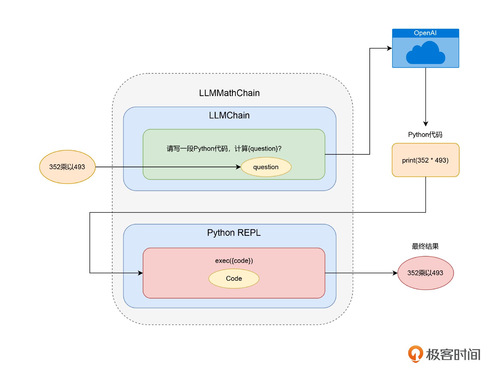
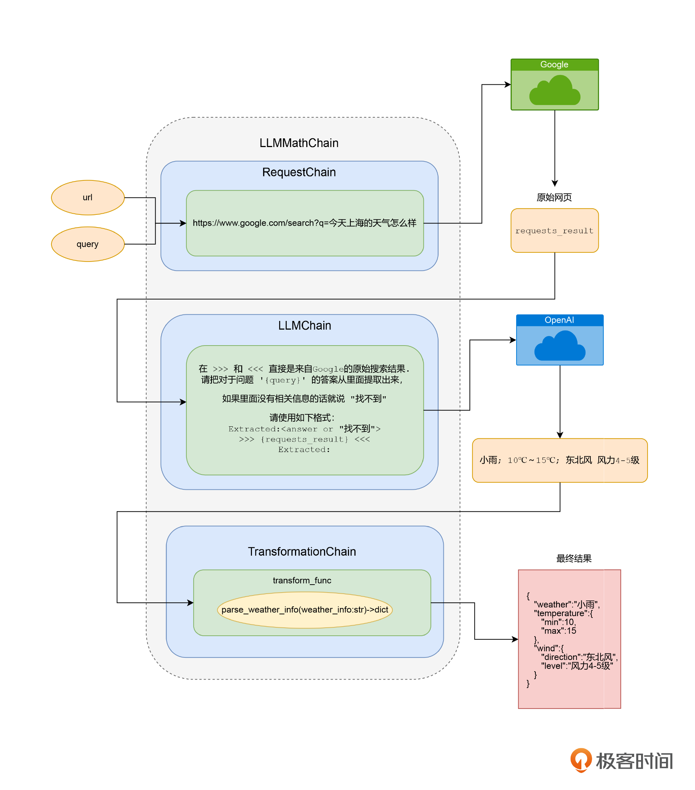

### 本资源由 itjc8.com 收集整理
# 15｜深入使用LLMChain，给AI连上Google和计算器
你好，我是徐文浩。

上一讲里，我们一起学习了怎么通过LangChain这个Python包，链式地调用OpenAI的API。通过链式调用的方式，我们可以把一个需要询问AI多轮才能解决的问题封装起来，把一个通过自然语言多轮调用才能解决的问题，变成了一个函数调用。

不过，LangChain能够帮到我们的远不止这一点。前一阵，ChatGPT发布了 [Plugins](https://openai.com/blog/chatgpt-plugins) 这个插件机制。通过Plugins，ChatGPT可以浏览整个互联网，还可以接上Wolfram这样的科学计算工具，能够实现很多原先光靠大语言模型解决不好的问题。不过，这个功能目前还是处于wait list的状态，我也还没有拿到权限。

不过没有关系，我们通过LangChain也能实现这些类似的功能。今天这一讲，我们就继续深入挖掘一下Langchain，看看它怎么解决这些问题。

## 解决AI数理能力的难题

很多人发现，虽然ChatGPT回答各种问题的时候都像模像样的，但是一到计算三位数乘法的时候就露馅儿了。感觉它只是快速估计了一个数字，而不是真的准确计算了。我们来看下面这段代码，我们让OpenAI帮我们计算一下 352 x 493 等于多少，你会发现，它算得大差不差，但还是算错了。这就很尴尬，如果我们真的想要让它来担任一个小学数学的助教，总是给出错误的答案也不是个事儿。

```python
import openai, os

openai.api_key = os.environ.get("OPENAI_API_KEY")

from langchain.prompts import PromptTemplate
from langchain.llms import OpenAI
from langchain.chains import LLMChain

llm = OpenAI(model_name="text-davinci-003", max_tokens=2048, temperature=0.5)
multiply_prompt = PromptTemplate(template="请计算一下{question}是多少?", input_variables=["question"])
math_chain = LLMChain(llm=llm, prompt=multiply_prompt, output_key="answer")
answer = math_chain.run({"question": "352乘以493"})
print("OpenAI API 说答案是:", answer)

python_answer = 352 * 493
print("Python 说答案是:", python_answer)

```

输出结果：

```plain
OpenAI API 说答案是:
352 x 493 = 174,336
Python 说答案是: 173536

```

注：可以看到，OpenAI给出的结果，答案是错误的。

不过，有人很聪明，说虽然ChatGPT直接算这些数学题不行，但是它不是会写代码吗？我们直接让它帮我们写一段利用Python计算这个数学式子的代码不就好了吗？的确，如果你让它写一段Python代码，给出的代码是没有问题的。

```python
multiply_by_python_prompt = PromptTemplate(template="请写一段Python代码，计算{question}?", input_variables=["question"])
math_chain = LLMChain(llm=llm, prompt=multiply_by_python_prompt, output_key="answer")
answer = math_chain.run({"question": "352乘以493"})
print(answer)

```

输出结果：

```python
print(352 * 493)

```

不过，我们不想再把这段代码，复制粘贴到Python的解释器或者Notebook里面，再去手工执行一遍。所以，我们可以在后面再调用一个Python解释器，让整个过程自动完成，对应的代码我也放在了下面。

```python
multiply_by_python_prompt = PromptTemplate(template="请写一段Python代码，计算{question}?", input_variables=["question"])
math_chain = LLMChain(llm=llm, prompt=multiply_by_python_prompt, output_key="answer")
answer_code = math_chain.run({"question": "352乘以493"})

from langchain.utilities import PythonREPL
python_repl = PythonREPL()
result = python_repl.run(answer_code)
print(result)

```

输出结果：

```python
173536

```

注：生成的Python脚本是正确的，再通过调用Python解释器就能得到正确的计算结果。

可以看到，LangChain里面内置了一个utilities的包，里面包含了PythonREPL这个类，可以实现对Python解释器的调用。如果你去翻看一下对应代码的源码的话，它其实就是简单地调用了一下系统自带的exec方法，来执行Python代码。utilities里面还有很多其他的类，能够实现很多功能，比如可以直接运行Bash脚本，调用Google Search的API等等。你可以去LangChain的 [文档](https://python.langchain.com/en/latest/modules/agents/tools.html)，看看它内置的这些工具类有哪些。

如果你仔细想一下，你会发现这其实也是一种链式调用。只不过，调用链里面的第二步，不是去访问OpenAI的API而已。所以，对于这些工具能力，LangChain也把它们封装成了LLMChain的形式。比如刚才的数学计算问题，是一个先生成Python脚本，再调用Python解释器的过程，LangChain就把这个过程封装成了一个叫做 LLMMathChain的LLMChain。不需要自己去生成代码，再调用PythonREPL，只要直接调用LLMMathChain，它就会在背后把这一切都给做好，对应的代码我也放在下面。

```python
from langchain import LLMMathChain

llm_math = LLMMathChain(llm=llm, verbose=True)
result = llm_math.run("请计算一下352乘以493是多少?")
print(result)

```

输出结果：

```python
> Entering new LLMMathChain chain...
请计算一下352乘以493是多少?

print(352 * 493)

Answer: 173536
> Finished chain.
Answer: 173536

```

LangChain也把前面讲过的utilities包里面的很多功能，都封装成了Utility Chains。比如，SQLDatabaseChain可以直接根据你的数据库生成SQL，然后获取数据，LLMRequestsChain可以通过API调用外部系统，获得想要的答案。你可以直接在LangChain关于Utility Chains的 [文档](https://python.langchain.com/en/latest/modules/agents/tools.html) 里面，找到有哪些工具可以用。



## 通过RequestsChain获取实时外部信息

这里我们来重点讲一讲如何通过API来调用外部系统，获得想要的答案。之前在介绍llama-index的时候，我们已经介绍过一种为AI引入外部知识的方法了，那就是计算这些外部知识的Embedding，然后作为索引先保存下来。但是，这只适用于处理那些预先准备好会被问到的知识，比如一本书、一篇论文。这些东西，内容多但是固定，也不存在时效性问题，我们可以提前索引好，而且用户问的问题往往也有很强的相似性。

但是，对于时效性强的问题，这个方法不太适用，因为我们可能没有必要不停地更新索引。比如，你想要知道实时的天气情况，我们不太可能把全球所有城市最新的天气信息每隔几分钟都索引一遍。

这个时候，我们可以使用LLMRequestsChain，通过一个HTTP请求来得到问题的答案。最简单粗暴的一个办法，就是直接通过一个HTTP请求来问一下Google。

```python
from langchain.chains import LLMRequestsChain

template = """在 >>> 和 <<< 直接是来自Google的原始搜索结果.
请把对于问题 '{query}' 的答案从里面提取出来，如果里面没有相关信息的话就说 "找不到"
请使用如下格式：
Extracted:<answer or "找不到">
>>> {requests_result} <<<
Extracted:"""

PROMPT = PromptTemplate(
    input_variables=["query", "requests_result"],
    template=template,
)
requests_chain = LLMRequestsChain(llm_chain = LLMChain(llm=OpenAI(temperature=0), prompt=PROMPT))
question = "今天上海的天气怎么样？"
inputs = {
    "query": question,
    "url": "https://www.google.com/search?q=" + question.replace(" ", "+")
}
result=requests_chain(inputs)
print(result)
print(result['output'])

```

输出结果：

```plain
{'query': '今天上海的天气怎么样？', 'url': 'https://www.google.com/search?q=今天上海的天气怎么样？', 'output': '小雨; 10℃～15℃; 东北风 风力4-5级'}
小雨; 10℃～15℃; 东北风 风力4-5级

```

我们来看看这段代码，基于LLMRequestsChain，我们用到了之前使用过的好几个技巧。

1. 首先，因为我们是简单粗暴地搜索Google。但是我们想要的是一个有价值的天气信息，而不是整个网页。所以，我们还需要通过ChatGPT把网页搜索结果里面的答案给找出来。所以我们定义了一个PromptTemplate，通过一段提示语，让OpenAI为我们在搜索结果里面，找出问题的答案，而不是去拿原始的HTML页面。
2. 然后，我们使用了LLMRequestsChain，并且把刚才PromptTemplate构造的一个普通的LLMChain，作为构造函数的一个参数，传给LLMRequestsChain，帮助我们在搜索之后处理搜索结果。
3. 对应的搜索词，通过query这个参数传入，对应的原始搜索结果，则会默认放到requests\_results里。而通过我们自己定义的PromptTemplate抽取出来的最终答案，则会放到output这个输出参数里面。

我们运行一下，就可以看到我们通过简单搜索Google加上通过OpenAI提取搜索结果里面的答案，就得到了最新的天气信息。

## 通过TransformationChain转换数据格式

有了实时的外部数据，我们就又有很多做应用的创意了。比如说，我们可以根据气温来推荐大家穿什么衣服。我们可以要求如果最低温度低于0度，就要推荐用户去穿羽绒服。或者，根据是否下雨来决定要不要提醒用户出门带伞。

不过，在现在的返回结果里，天气信息（天气、温度、风力）只是一段文本，而不是可以直接获取的JSON格式。当然，我们可以在LLMChain里面再链式地调用一次OpenAI的接口，把这段文本转换成JSON格式。但是，这样做的话，一来还要消耗更多的Token、花更多的钱，二来这也会进一步增加程序需要运行的时间，毕竟一次往返的网络请求也是很慢的。这里的文本格式其实很简单，我们完全可以通过简单的字符串处理完成解析。

```python
import re
def parse_weather_info(weather_info: str) -> dict:
    # 将天气信息拆分成不同部分
    parts = weather_info.split('; ')

    # 解析天气
    weather = parts[0].strip()

    # 解析温度范围，并提取最小和最大温度
    temperature_range = parts[1].strip().replace('℃', '').split('～')
    temperature_min = int(temperature_range[0])
    temperature_max = int(temperature_range[1])

    # 解析风向和风力
    wind_parts = parts[2].split(' ')
    wind_direction = wind_parts[0].strip()
    wind_force = wind_parts[1].strip()

    # 返回解析后的天气信息字典
    weather_dict = {
        'weather': weather,
        'temperature_min': temperature_min,
        'temperature_max': temperature_max,
        'wind_direction': wind_direction,
        'wind_force': wind_force
    }

    return weather_dict

# 示例
weather_info = "小雨; 10℃～15℃; 东北风 风力4-5级"
weather_dict = parse_weather_info(weather_info)
print(weather_dict)

```

输出结果：

```python
{'weather': '小雨', 'temperature': {'min': 10, 'max': 15}, 'wind': {'direction': '东北风', 'level': '风力4-5级'}}

```

注：上面这段代码，其实是我让GPT-4写的。

我们在这里实现了一个 **parse\_weather\_info** 函数，可以把前面LLMRequestsChain的输出结果，解析成一个dict。不过，我们能不能更进一步，把这个解析的逻辑，也传到LLMChain的链式调用的最后呢？答案当然是可以的。对于这样的要求，Langchain里面也有一个专门的解决方案，叫做TransformChain，也就是做格式转换。

```python
from langchain.chains import TransformChain, SequentialChain

def transform_func(inputs: dict) -> dict:
    text = inputs["output"]
    return {"weather_info" : parse_weather_info(text)}

transformation_chain = TransformChain(input_variables=["output"],
                                      output_variables=["weather_info"], transform=transform_func)

final_chain = SequentialChain(chains=[requests_chain, transformation_chain],
                              input_variables=["query", "url"], output_variables=["weather_info"])
final_result = final_chain.run(inputs)
print(final_result)

```

输出结果：

```python
{'weather': '小雨', 'temperature': {'min': 10, 'max': 15}, 'wind': {'direction': '东北风', 'level': '风力4-5级'}}

```

注：在requests\_chain后面跟上一个transformation\_chain，我们就能把结果解析成dict，供后面其他业务使用结构化的数据。

1. 我们在这里，先定义了一个transform\_func，对前面的parse\_weather\_info函数做了一下简单的封装。它的输入，是整个LLMChain里，执行到TransformChain之前的整个输出结果的dict。我们前面看到整个LLMRequestsChain里面的天气信息的文本内容，是通过output这个key拿到的，所以这里我们也是先通过它来拿到天气信息的文本内容，再调用 parse\_weather\_info 解析，并且把结果输出到 weather\_info 这个字段里。
2. 然后，我们就定义了一个TransformChain，里面的输入参数就是 output，输出参数就是 weather\_info。
3. 最后，我们通过上一讲用过的 SequentialChain，将前面的LLMRequestsChain和这里的TransformChain串联到一起，变成一个新的叫做 final\_chain 的LLMChain。

在这三步完成之后，未来我们想要获得天气信息，并且拿到一个dict形式的输出，只要调用 final\_chain的run方法，输入我们关于天气的搜索文本就好了。



最后，我们来梳理一下final\_chain都做了哪些事。

1. 通过一个HTTP请求，根据搜索词拿到Google的搜索结果页。
2. 把我们定义的Prompt提交给OpenAI，然后把我们搜索的问题和结果页都发给了OpenAI，让它从里面提取出搜索结果页里面的天气信息。
3. 最后我们通过 transform\_func 解析拿到的天气信息的文本，被转换成一个dict。这样，后面的程序就好处理了。

## 通过VectorDBQA来实现先搜索再回复的能力

此外，还有一个常用的LLMChain，就是我们之前介绍的llama-index的使用场景，也就是针对自己的资料库进行问答。我们预先把资料库索引好，然后每次用户来问问题的时候，都是先到这个资料库里搜索，再把问题和答案一并交给AI，让它去组织语言回答。

```plain
from langchain.embeddings.openai import OpenAIEmbeddings
from langchain.vectorstores import FAISS
from langchain.text_splitter import SpacyTextSplitter
from langchain import OpenAI, VectorDBQA
from langchain.document_loaders import TextLoader

llm = OpenAI(temperature=0)
loader = TextLoader('./data/ecommerce_faq.txt')
documents = loader.load()
text_splitter = SpacyTextSplitter(chunk_size=256, pipeline="zh_core_web_sm")
texts = text_splitter.split_documents(documents)

embeddings = OpenAIEmbeddings()
docsearch = FAISS.from_documents(texts, embeddings)

faq_chain = VectorDBQA.from_chain_type(llm=llm, vectorstore=docsearch, verbose=True)

```

注：上面的代码创建了一个基于 FAISS 进行向量存储的 docsearch的索引，以及基于这个索引的VectorDBQA这个LLMChain。

先来看第一段代码，我们通过一个TextLoader把文件加载进来，还通过SpacyTextSplitter给文本分段，确保每个分出来的Document都是一个完整的句子。因为我们这里的文档是电商FAQ的内容，都比较短小精悍，所以我们设置的chunk\_size只有256。然后，我们定义了使用OpenAIEmbeddings来给文档创建Embedding，通过FAISS把它存储成一个VectorStore。最后，我们通过VectorDBQA的from\_chain\_type 定义了一个LLM。对应的FAQ内容，我是请ChatGPT为我编造之后放在了ecommerce\_faq.txt这个文件里。

问题：

```plain
question = "请问你们的货，能送到三亚吗？大概需要几天？"
result = faq_chain.run(question)
print(result)

```

输出结果：

```plain
> Entering new VectorDBQA chain...
> Finished chain.
 我们支持全国大部分省份的配送，包括三亚。一般情况下，大部分城市的订单在2-3个工作日内送达，偏远地区可能需要5-7个工作日。具体送货时间可能因订单商品、配送地址和物流公司而异。

```

问题：

```plain
question = "请问你们的退货政策是怎么样的？"
result = faq_chain.run(question)
print(result)

```

输出结果：

```plain
> Entering new VectorDBQA chain...
> Finished chain.
自收到商品之日起7天内，如产品未使用、包装完好，您可以申请退货。某些特殊商品可能不支持退货，请在购买前查看商品详情页面的退货政策。

```

我向它提了两个不同类型的问题，faq\_chain都能够正确地回答出来。你可以去看看data目录下面的ecommerce\_faq.txt文件，看看它的回答是不是和文档写的内容一致。在VectorDBQA这个LLMChain背后，其实也是通过一系列的链式调用，来完成搜索VectorStore，再向AI发起Completion请求这样两个步骤的。

可以看到LLMChain是一个很强大的武器，它可以把解决一个问题需要的多个步骤串联到一起。这个步骤可以是调用我们的语言模型，也可以是调用一个外部API，或者在内部我们定义一个Python函数。这大大增强了我们利用大语言模型的能力，特别是能够弥补它的很多不足之处，比如缺少有时效的信息，通过HTTP调用比较慢等等。

## 小结

好了，这一讲到这里也就结束了。

我们可以看到，Langchain的链式调用并不局限于使用大语言模型的接口。这一讲里，我们就看到四种常见的将大语言模型的接口和其他能力结合在一起的链式调用。

1. LLMMathChain能够通过Python解释器变成一个计算器，让AI能够准确地进行数学运算。
2. 通过RequestsChain，我们可以直接调用外部API，然后再让AI从返回的结果里提取我们关心的内容。
3. TransformChain能够让我们根据自己的要求对数据进行处理和转化，我们可以把AI返回的自然语言的结果进一步转换成结构化的数据，方便其他程序去处理。
4. VectorDBQA能够完成和llama-index相似的事情，只要预先做好内部数据资料的Embedding和索引，通过对LLMChain进行一次调用，我们就可以直接获取回答的结果。

这些能力大大增强了AI的实用性，解决了几个之前大语言模型处理得不好的问题，包括数学计算能力、实时数据能力、和现有程序结合的能力，以及搜索属于自己的资料库的能力。你完全可以定义自己需要的LLMChain，通过程序来完成各种任务，然后合理地组合不同类型的LLMChain对象，来实现连ChatGPT都做不到的事情。而ChatGPT Plugins的实现机制，其实也是类似的。

## 思考题

最后，我给你留一道思考题。我们前面说过，Langchain里有SQLDatabaseChain可以直接让我们写需求访问数据库。在官方文档里也给出了对应的 [例子](https://langchain.readthedocs.io/en/latest/modules/chains/examples/sqlite.html)，你可以去试一试体验一下，想一想它是通过什么样的提示语信息，来让AI写出可以直接执行的SQL的？

欢迎你把你体验之后的感受以及思考后的结果分享在评论区，也欢迎你把这一讲分享给感兴趣的朋友，我们下一讲再见！

## 推荐试用

我们目前对于Langchain的讲解，都是通过Python编程的方式来实现真实业务场景的需求的。有人直接为Langchain做了一个可以拖拽的图形界面叫做 [LangFlow](https://github.com/logspace-ai/langflow)。你可以试着下载体验一下，看看图形界面是不是可以进一步提升你的效率。