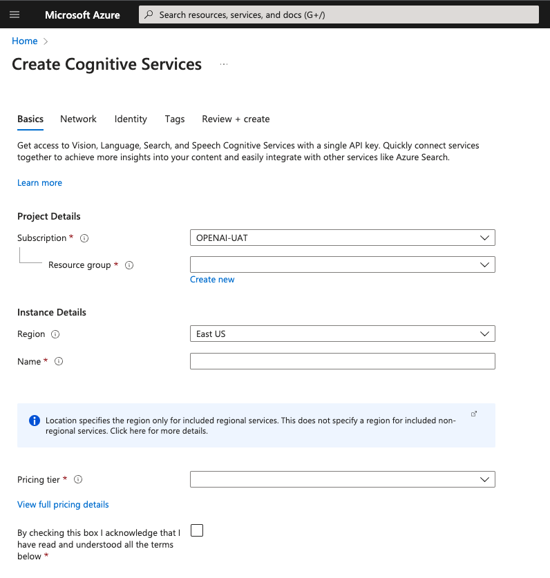
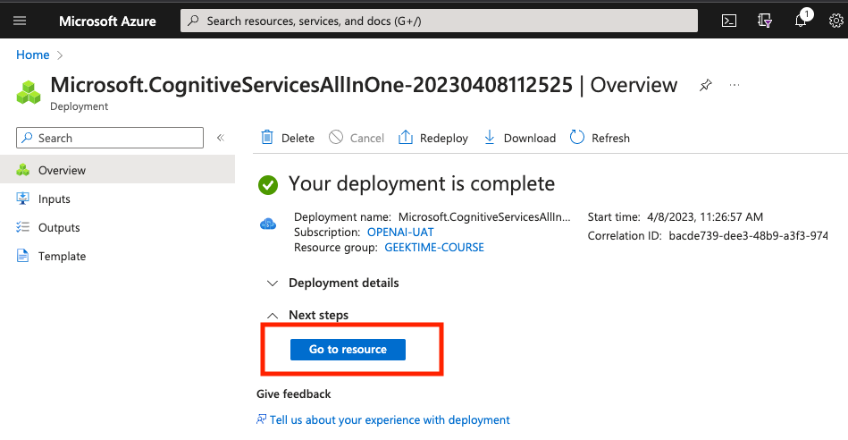
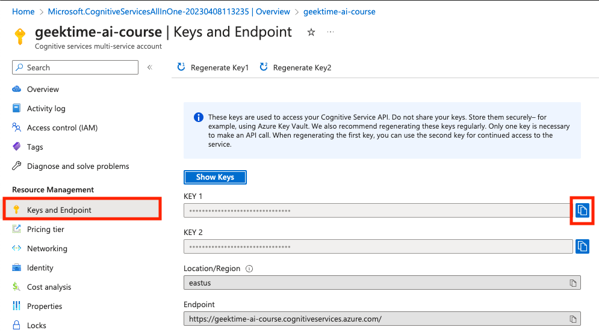

### 本资源由 itjc8.com 收集整理
# 20｜TTS与语音合成：让你的机器人拥有声音
你好，我是徐文浩。

上一讲里，我们通过Whisper模型，让AI“听懂”了我们在说什么。我们可以利用这个能力，让AI替我们听播客、做小结。不过，这只是我们和AI的单向沟通。那我们能不能更进一步，让AI不仅能“听懂”我们说的话，通过ChatGPT去回答我们问的问题，最后还能让AI把这些内容合成为语音，“说”给我们听呢？

当然可以，这也是我们这一讲的主题，我会带你一起来让AI说话。和上一讲一样，我不仅会教你如何使用云端API来做语音合成（Text-To-Speech），也会教你使用开源模型，给你一个用本地CPU就能实现的解决方案。这样，你也就不用担心数据安全的问题了。

## 使用Azure云进行语音合成

语音合成其实已经是一个非常成熟的技术了，现在在很多短视频平台里，你听到的很多配音其实都是通过语音合成技术完成的。国内外的各大公司都有类似的云服务，比如 [科大讯飞](https://www.xfyun.cn/services/online_tts)、 [阿里云](https://ai.aliyun.com/nls/tts)、 [百度](https://ai.baidu.com/tech/speech/tts)、 [AWS Polly](https://aws.amazon.com/cn/polly/)、 [Google Cloud](https://cloud.google.com/text-to-speech) 等等。不过，今天我们先来体验一下微软Azure云的语音合成API。选用Azure，主要有两个原因。

1. 因为微软和OpenAI有合作，Azure还提供了OpenAI相关模型的托管。这样，我们在实际的生产环境使用的时候，只需要和一个云打交道就好了。
2. 价格比较便宜，并且提供了免费的额度。如果你每个月的用量在50万个字符以内，那么就不用花钱。

在运行代码之前，你需要先去注册一个Azure云的账号，并且开通 [微软认知服务](https://azure.microsoft.com/zh-cn/products/cognitive-services/#overview)，然后开启对应的认知服务资源，获得自己的API Key。我在这里放了对应文档的 [链接](https://learn.microsoft.com/en-us/azure/cognitive-services/cognitive-services-apis-create-account?tabs=multiservice%2Canomaly-detector%2Clanguage-service%2Ccomputer-vision%2Cmacos#get-the-keys-for-your-resource)，你照着文档一步步操作，就能完成。我在下面也放上了关键步骤的截图，具体注册过程，我就不一一介绍了。



注：我选择了 East US 区域，因为这个区域也可以部署OpenAI的ChatGPT服务。





在拿到API Key之后，我还是建议你把API Key设置到环境变量里面。避免你使用Notebook或者撰写代码的时候，不小心把自己的Key暴露出去，被别人免费使用。同样的，我们也在环境变量里设置一下我们使用的Azure服务的区域eastus。

```python
export AZURE_SPEECH_KEY=YOUR_API_KEY
export AZURE_SPEECH_REGION=eastus

```

当然，也不要忘了安装对应的Python包。

```python
pip install azure-cognitiveservices-speech

```

### 基本的语音合成

账号和环境都设置好了之后，我们就可以动手来试试Azure语音合成的效果了。

```python
import os
import azure.cognitiveservices.speech as speechsdk

# This example requires environment variables named "SPEECH_KEY" and "SPEECH_REGION"
speech_config = speechsdk.SpeechConfig(subscription=os.environ.get('AZURE_SPEECH_KEY'), region=os.environ.get('AZURE_SPEECH_REGION'))
audio_config = speechsdk.audio.AudioOutputConfig(use_default_speaker=True)

# The language of the voice that speaks.
speech_config.speech_synthesis_voice_name='zh-CN-XiaohanNeural'

speech_synthesizer = speechsdk.SpeechSynthesizer(speech_config=speech_config, audio_config=audio_config)

text = "今天天气真不错，ChatGPT真好用。"

speech_synthesizer.speak_text_async(text)

```

运行上面这个代码，你就会听到一个女声说：“今天天气真不错，ChatGPT真好用。”

这几行代码非常简单。

- 我们先通过配置读取了API Key和Region。
- 然后通过 speech\_synthesis\_voice\_name这个配置参数指定了我们合成语音所使用的声音。
- 通过 speak\_text\_async 这个函数，就能异步调用API服务，直接把合成的声音播放出来了。

通过speech\_synthesis\_voice\_name这个参数，我们还可以选用很多别的声音，包括不同语言和不同的人。对应的列表可以在Azure的 [Language and voice support](https://learn.microsoft.com/en-us/azure/cognitive-services/speech-service/language-support?tabs=tts#prebuilt-neural-voices) 文档里面找到。我们换一个其他的voice\_name，就可以把对应的语音换成男声。

```python
speech_config.speech_synthesis_voice_name='zh-CN-YunfengNeural'
speech_synthesizer = speechsdk.SpeechSynthesizer(speech_config=speech_config, audio_config=audio_config)
speech_synthesizer.speak_text_async(text)

```

### 指定语音的风格与角色

如果你仔细看了 [Language and voice support](https://learn.microsoft.com/en-us/azure/cognitive-services/speech-service/language-support?tabs=tts#prebuilt-neural-voices) 的文档，你会发现它有很多很多voice\_name。而且很多voice\_name里，我们还有额外的两个参数可以选择，那就是Styles和Roles，它们分别代表了合成语音的语气和对应的角色。通过这两个参数，我们可以让AI把很多场景“演出来”。比如，下面的示例代码就演绎了一段母子之间关于买玩具的一段对话，你可以运行一下看看效果。

```python
ssml = """<speak version="1.0" xmlns="http://www.w3.org/2001/10/synthesis"
       xmlns:mstts="https://www.w3.org/2001/mstts" xml:lang="zh-CN">
    <voice name="zh-CN-YunyeNeural">
        儿子看见母亲走了过来，说到：
        <mstts:express-as role="Boy" style="cheerful">
            “妈妈，我想要买个新玩具”
        </mstts:express-as>
    </voice>
    <voice name="zh-CN-XiaomoNeural">
        母亲放下包，说：
        <mstts:express-as role="SeniorFemale" style="angry">
            “我看你长得像个玩具。”
        </mstts:express-as>
    </voice>
</speak>"""

speech_synthesis_result = speech_synthesizer.speak_ssml_async(ssml).get()

```

Azure并不是通过让你在API里面配置一些参数来指定一段文本的角色和语气，而是通过一个叫做SSML格式的XML文件做到这一点的。这个SSML是Speech Synthesis Markup Language的首字母缩写，翻译过来就是 **语音合成标记语言**。它不是一个Azure云专属的格式，而是一个W3C的标准，所以同样的XML不仅可以用在Azure云里，也一样可以用在Google Cloud里。

通过SSML里面元素的属性配置，我们可以指定不同文本段的voice\_name、role和style。比如，在上面的这个例子里面，我们就用两个voice元素，表示了两个不同的人的声音。voice 元素里面的name属性，指定了这段声音的voice\_name。而在voice元素内部，你还可以内嵌mstss:express-as元素，在这个元素里我们可以指定role和style。这样一来，我们就可以让一个voice\_name在不同的场景片段下，用不同的语气和角色来说话。

```python
ssml = """<speak version="1.0" xmlns="http://www.w3.org/2001/10/synthesis"
       xmlns:mstts="https://www.w3.org/2001/mstts" xml:lang="en-US">
    <voice name="en-US-JennyNeural">
        <mstts:express-as style="excited">
            That'd be just amazing!
        </mstts:express-as>
        <mstts:express-as style="friendly">
            What's next?
        </mstts:express-as>
    </voice>
</speak>"""

speech_synthesis_result = speech_synthesizer.speak_ssml_async(ssml).get()

```

在我自己实际使用的体验里面，中文的语气和角色效果不算明显。但是英文的效果还是很明显的，你可以根据文档用不同的参数尝试一下。

SSML这个格式，不只支持style和role，还有更多丰富的参数可以配置，你可以去看看Azure [文档的协议标准](https://www.w3.org/TR/speech-synthesis/)。

### 指定语音的输出方式

到目前为止，我们都是使用异步调用的方式，直接把语音播放出来了。但很多时候，我们可能需要把对应的语音存储下来。那下面的代码就可以做到这一点。

```python
speech_config.speech_synthesis_language='zh-CN'
speech_config.speech_synthesis_voice_name='zh-CN-XiaohanNeural'

audio_config = speechsdk.audio.AudioOutputConfig(filename="./data/tts.wav")

speech_synthesizer = speechsdk.SpeechSynthesizer(speech_config=speech_config, audio_config=audio_config)

text = "今天天气真不错，ChatGPT真好用"
speech_synthesizer.speak_text_async(text)

```

我们只需要把原先设置成 use\_default\_speaker=True的AudioOutputConfig，改为设置成一个 .wav的输出文件就好了。我们之后调用 speak\_text\_async 的函数，就会把语音输出到相应的.wav文件里。

```python
audio_config = speechsdk.audio.AudioOutputConfig(use_default_speaker=True)

```

当然，你可以把对应的语音，暂时放在内存里面，而不是存储到文件系统中，也可以把输出的内容通过我们习惯的MP3格式存储下来。

```python
speech_config.set_speech_synthesis_output_format(speechsdk.SpeechSynthesisOutputFormat.Audio48Khz192KBitRateMonoMp3)

speech_synthesizer = speechsdk.SpeechSynthesizer(speech_config=speech_config, audio_config=None)
result = speech_synthesizer.speak_text_async(text).get()
stream =speechsdk.AudioDataStream(result)

stream.save_to_wav_file("./data/tts.mp3")

```

我们只需要给speech\_config这个参数设定一个 synthesis\_output\_format 就好了。我们上面就是把输出格式设置成了一个48kHz采样、192K码率的MP3格式。然后，这一次我们把AudioConfig设置成了None。在speak\_text\_async函数被调用之后，我们又调用了一下get函数，拿到对应的SpeechSynthesisResult对象。然后把这个对象放到AudioDataStream里，之后我们就可以把这个AudioDataStream按照我们的需要进行处理了。这里，我们是直接把它存储成了一个MP3文件。

## 使用开源模型进行语音合成

虽然通过Azure云的API，我们可以很容易地进行语音合成，速度也很快。但很多时候因为数据安全的问题，我们还是希望能够直接在我们自己的服务器上进行语音合成。当然，这也是能够办到的，有很多开源项目都支持语音合成。

我们在这里，就不妨试一下百度开源的PaddleSpeech的语音合成功能，看看效果怎么样。

我们还是要先安装PaddleSpeech相关的Python包。

```python
%pip install paddlepaddle
%pip install paddlespeech

```

然后通过PaddleSpeech自带的TTSExecutor，可以将对应的文本内容转换成WAV文件。需要注意，这个过程中，PaddleSpeech 需要下载对应的模型，所以第一次运行的时候也要花费一定的时间。

```python
from paddlespeech.cli.tts.infer import TTSExecutor

tts_executor = TTSExecutor()

text = "今天天气十分不错，百度也能做语音合成。"
output_file = "./data/paddlespeech.wav"
tts_executor(text=text, output=output_file)

```

PaddleSpeech的TTSExecutor，只是把你的文本输入转化成了一个WAV文件。要在Python里面播放对应的声音，我们还要借助于PyAudio这个包。对应的，我们要先安装PyAudio依赖的portaudio库，然后再安装PyAudio包。

Mac下可以通过homebrew来安装portaudio。

```python
 brew install portaudio

```

如果在Unbuntu或者Debian下，你就可以通过apt-get来安装portaudio。

```python
sudo apt-get install portaudio19-dev

```

只有在portaudio安装成功之后，我们才能安装PyAudio包，不然会报缺少依赖的错误。

```python
pip install pyaudio

```

通过PyAudio，我们可以直接播放WAV文件的内容了。对应的代码我放在下面了，其实我不太熟悉PyAudio库，但是这样简单的代码直接让ChatGPT帮我写，一次就能运行成功。如果你仔细读一下这段代码，也不难理解它的含义。实际就是打开了一个PyAudio的Stream，然后不断从我们的WAV文件里面读入数据，然后写入这个Stream，写入之后声音就播放出来了。如果你把 stream.write(data) 那一行去掉，那么你就会发现整个程序运行的过程里，是没有声音的。

```python
import wave
import pyaudio

def play_wav_audio(wav_file):
    # open the wave file
    wf = wave.open(wav_file, 'rb')

    # instantiate PyAudio
    p = pyaudio.PyAudio()

    # open a stream
    stream = p.open(format=p.get_format_from_width(wf.getsampwidth()),
                    channels=wf.getnchannels(),
                    rate=wf.getframerate(),
                    output=True)

    # read data from the wave file and play it
    data = wf.readframes(1024)
    while data:
        stream.write(data)
        data = wf.readframes(1024)

    # close the stream and terminate PyAudio
    stream.stop_stream()
    stream.close()
    p.terminate()

play_wav_audio(output_file)

```

不过，我们调用的PaddleSpeech代码里的默认参数有一个小问题，就是它只支持中文的语音合成。如果你的文本带上英文运行一下，你会发现合成的语音里面只有中文，没有英文。

```python
tts_executor = TTSExecutor()

text = "今天天气十分不错，Paddle Speech也能做语音合成。"
output_file = "./data/paddlespeech_missing.wav"
tts_executor(text=text, output=output_file)

play_wav_audio(output_file)

```

运行上面的代码，你会发现，PaddleSpeech在合成的语音里面丢失了。

这是因为，PaddleSpeech默认情况下使用的是一个只支持中文的模型。我们可以通过一些参数来指定使用的模型，一样能够做中英文混合的语音合成。

对应的代码：

```python
tts_executor = TTSExecutor()

text = "早上好, how are you? 百度Paddle Speech一样能做中英文混合的语音合成。"
output_file = "./data/paddlespeech_mix.wav"
tts_executor(text=text, output=output_file,
             am="fastspeech2_mix", voc="hifigan_csmsc",
             lang="mix", spk_id=174)

play_wav_audio(output_file)

```

可以看到，和上面的代码相比，我们增加了4个参数。

- am，是acoustic model的缩写，也就是我们使用的声学模型。我们这里选用的是fastspeech2\_mix。fastspeech2也是一个基于Transformer的语音合成模型，速度快、质量高。这里带了一个mix，代表这个模型是支持中英文混合生成的。
- voc，是vocoder的缩写，叫做音码器。声学模型只是把我们的文本变成了一个声音波形的信号。我们还需要通过音码器，把声学模型给出的波形变成可以播放的音频。我们这里选择的HiFiGAN\_csMSC，是一个高保真（HiFi）、基于对抗生成网络（GAN）技术的模型，它的训练数据用到了HiFiSinger和csMSC，而模型的名字就来自这些关键词的组合。
- lang，代表我们模型支持的语言，这里我们自然应该选mix。
- spk\_id，类似于我们之前在Azure里看到的voice\_name，不同的spk\_id 听起来就是不同的人说的话。

运行这个代码，一样能够正常地生成中英文混合的语音内容。如果你想要了解PaddleSpeech的语音合成功能，还有它所支持的各种模型和各种应用场景，可以参看GitHub上的 [Demo 文档](https://github.com/PaddlePaddle/PaddleSpeech/blob/develop/demos/text_to_speech/README_cn.md)。

## 小结

好了，这一讲到这里也就结束了。

这一讲我们学会了两种语音合成的方式。一种是使用Azure云提供的API，另一种则是使用百度开源的PaddleSpeech。Azure云的语音合成，不仅仅是能简单地把文本变成人声，还能通过SSML这个W3C标准下的XML标记语言，指定不同的人声（voice\_name）、语气（style）还有角色（role）。这些功能都是非常有实用价值的，能够帮助我们处理各种场景下的语音合成需求。

而PaddleSpeech则带给了我们一个开源方案，并且它也支持中英文混合在一起的语音生成。它背后可供选择的模型里，我们使用的也是基于Transformer的fastspeech2模型。可以看到，目前Transformer类型的模型在各个领域都已经占据了主流。

学到这里，我们的AI就拥有了声音。而在下一讲里，我会拿我们已经学到的知识，搭建一个可以通过语音和你聊天的机器人。并且更进一步地，我们还会为它配上你的虚拟形象，希望你和我一样对下一讲充满期待！

## 思考题

最后，给你留一道思考题。PaddleSpeech不仅能拿来做语音合成，也能用来做语音识别。你能试试看用它做语音识别的效果吗？和OpenAI Whisper比起来，你觉得它们两个哪个效果更好？欢迎你把你体验之后的感受分享出来，也欢迎你把这一讲分享给需要的朋友，我们下一讲再见！

## 推荐阅读

PaddleSpeech的 [中文文档](https://github.com/PaddlePaddle/PaddleSpeech/blob/develop/README_cn.md) 里面，包含了大量使用PaddleSpeech这个开源库的场景和方法，你有兴趣可以去看一看。百度的PaddlePaddle的社区里面，也有专门的 [语音相关的课程](https://aistudio.baidu.com/aistudio/education/group/info/25130)，如果你想深入了解的话，也可以去看一看。