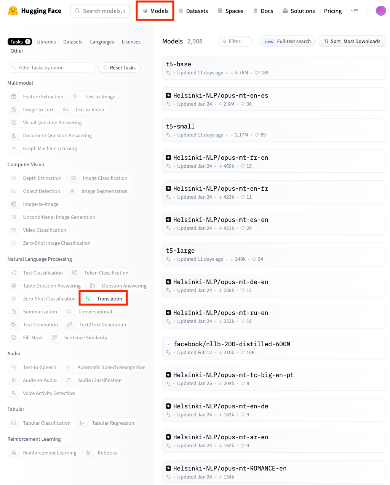
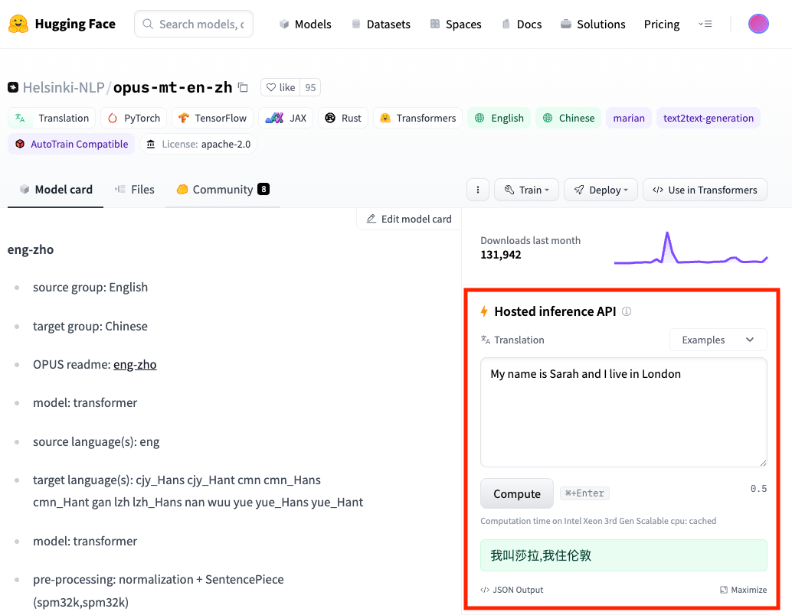
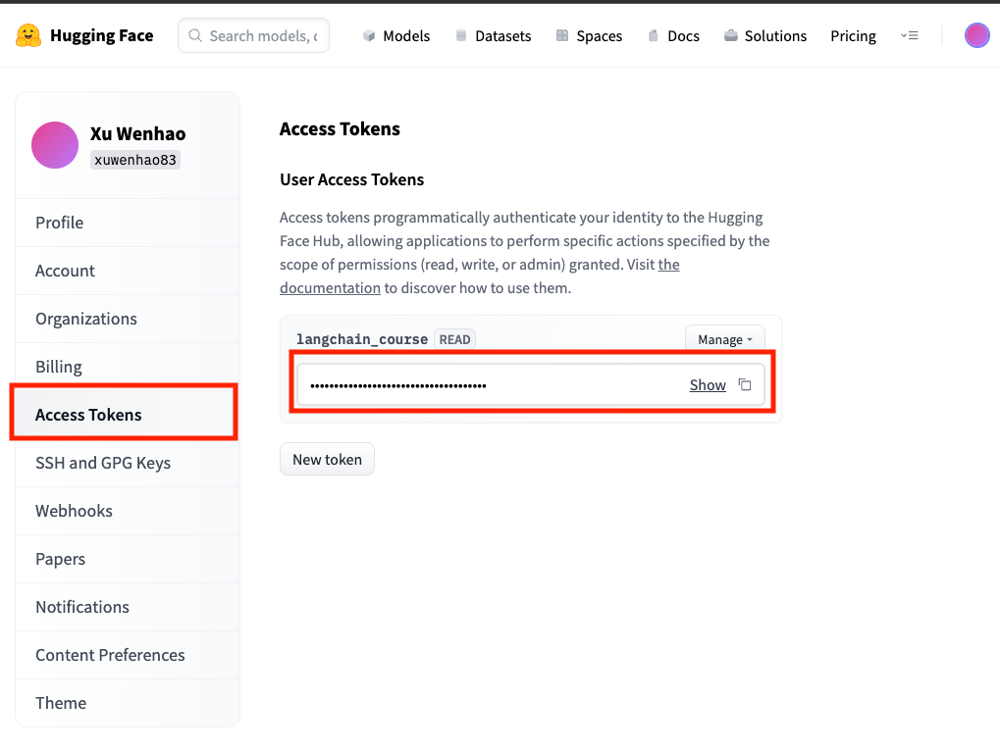
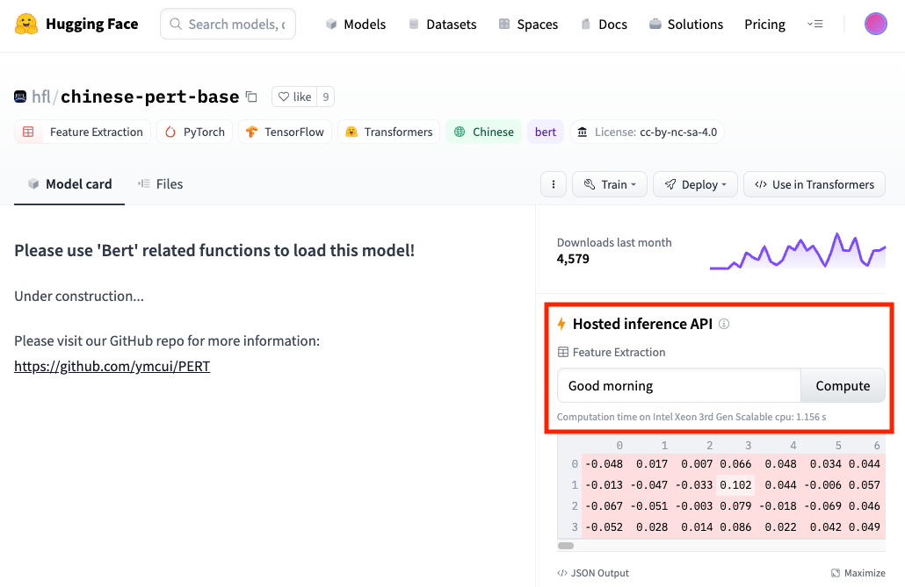
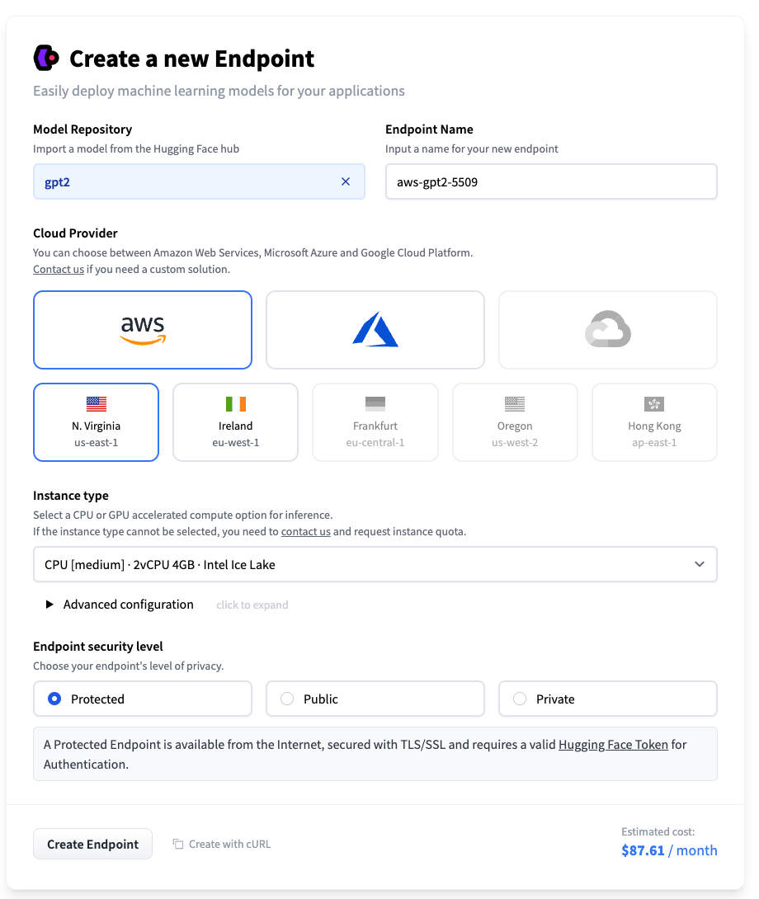
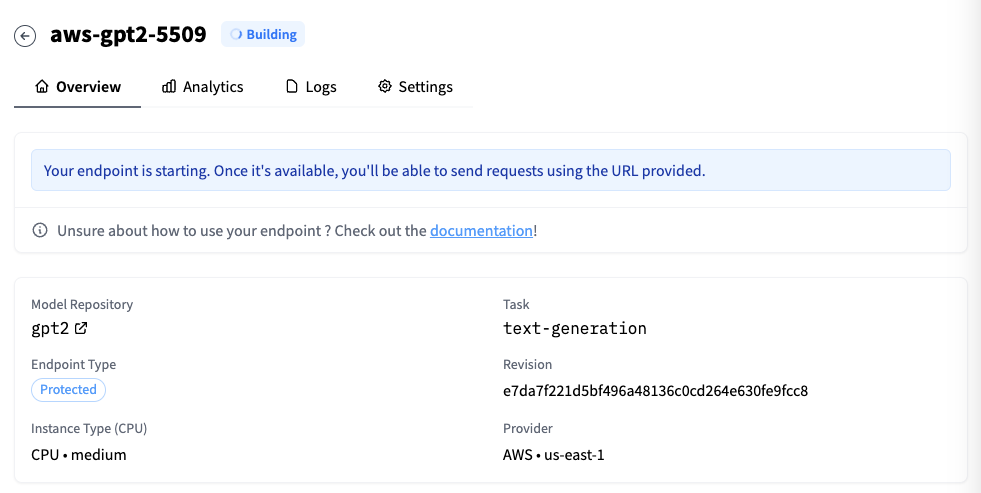
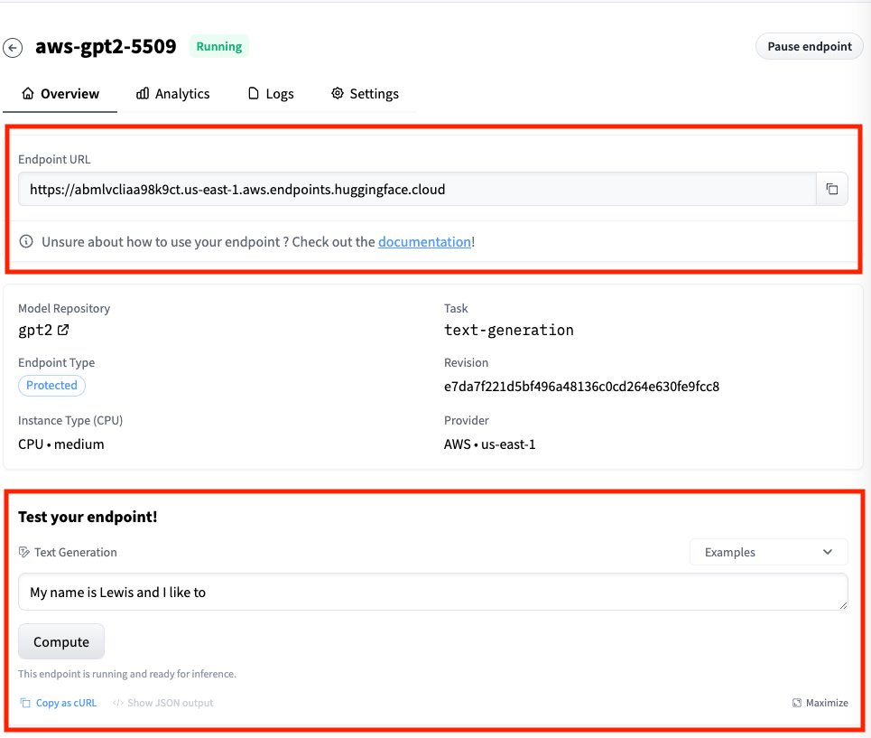
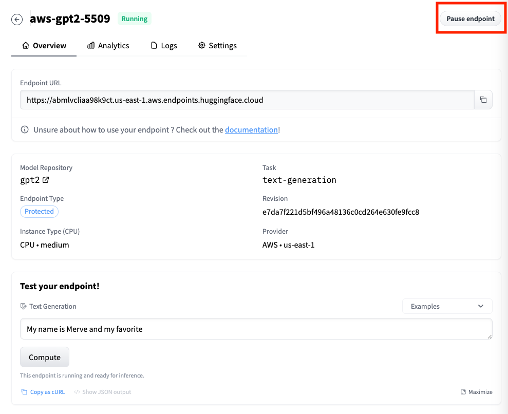
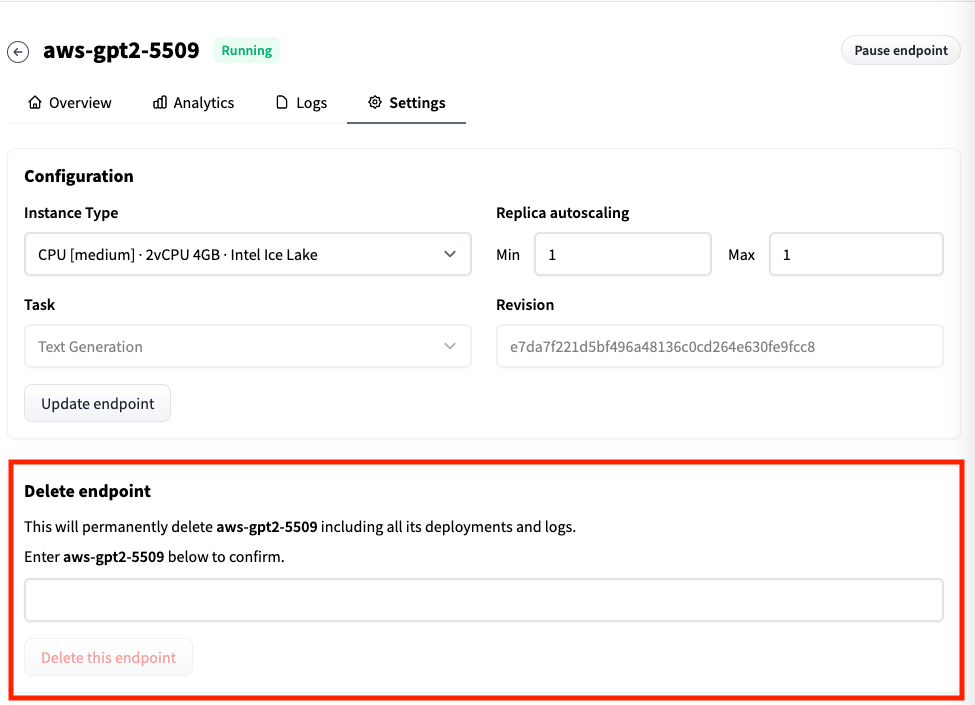

### 本资源由 itjc8.com 收集整理
# 22｜再探HuggingFace：一键部署自己的大模型
你好，我是徐文浩。

过去几讲里，我们一起为AI加上了语音能力。而且相对于大语言模型，语音识别和语音合成都有完全可以用于商业应用的开源模型。事实上，Huggingface的火爆离不开他们开源的这个Transformers库。这个开源库里有数万个我们可以直接调用的模型。很多场景下，这个开源模型已经足够我们使用了。

不过，在使用这些开源模型的过程中，你会发现大部分模型都需要一块不错的显卡。而如果回到我们更早使用过的开源大语言模型，就更是这样了。

在课程里面，我们是通过用Colab免费的GPU资源来搞定的。但是如果我们想要投入生产环境使用，免费的Colab就远远不够用了。而且，Colab的GPU资源对于大语言模型来说还是太小了。我们在前面不得不使用小尺寸的T5-base和裁剪过的ChatGLM-6B-INT4，而不是FLAN-UL2或者ChatGLM-130B这样真正的大模型。

那么，这一讲我们就来看看，Transformers可以给我们提供哪些模型，以及如何在云端使用真正的大模型。而想要解决这两个问题啊，都少不了要使用HuggingFace这个目前最大的开源模型社区。

## Transformers Pipeline

### Pipeline的基本功能

我们先来看看，Transformers这个开源库到底能干些什么。下面的代码都是直接使用开源模型，需要利用GPU的算力，所以你最好还是在Colab里运行，注意不要忘记把Runtime的类型修改为GPU。

```python
from transformers import pipeline

classifier = pipeline(task="sentiment-analysis", device=0)
preds = classifier("I am really happy today!")
print(preds)

```

输出结果：

```plain
No model was supplied, defaulted to distilbert-base-uncased-finetuned-sst-2-english and revision af0f99b (https://huggingface.co/distilbert-base-uncased-finetuned-sst-2-english).
Using a pipeline without specifying a model name and revision in production is not recommended.
[{'label': 'POSITIVE', 'score': 0.9998762607574463}]

```

这个代码非常简单，第一行代码，我们定义了一个task是sentimental-analysis的Pipeline，也就是一个情感分析的分类器。里面device=0的意思是我们指定让Transformer使用GPU资源。如果你想要让它使用CPU，你可以设置device=-1。然后，调用这个分类器对一段文本进行情感分析。从输出结果看，它给出了正确的Positive预测，也给出了具体的预测分数。因为我们在这里没有指定任何模型，所以Transformers自动选择了默认的模型，也就是日志里看到的 distilbert-base-uncased-finetuned-sst-2-english 这个模型。

看名字我们可以知道，这个模型是一个针对英语的模型。如果想要支持中文，我们也可以换一个模型来试试。

```python
classifier = pipeline(model="uer/roberta-base-finetuned-jd-binary-chinese", task="sentiment-analysis", device=0)
preds = classifier("这个餐馆太难吃了。")
print(preds)

```

输出结果：

```python
[{'label': 'negative (stars 1, 2 and 3)', 'score': 0.934112012386322}]

```

这里，我们指定模型的名称，就能换用另一个模型来进行情感分析了。这次我们选用的是roberta-base-finetuned-jd-binary-chinese 这个模型。RoBERTa这个模型是基于BERT做了一些设计上的修改而得来的。而后面的finetuned-jd-binary-chinese 是基于京东的数据进行微调过的一个模型。

Pipeline是Transformers库里面的一个核心功能，它封装了所有托管在HuggingFace上的模型推理预测的入口。你不需要关心具体每个模型的架构、输入数据格式是什么样子的。我们只要通过model参数指定使用的模型，通过task参数来指定任务类型，运行一下就能直接获得结果。

比如，我们现在不想做情感分析了，而是想要做英译中，我们只需要把task换成translation\_en\_to\_zh，然后选用一个合适的模型就好了。

```python
translation = pipeline(task="translation_en_to_zh", model="Helsinki-NLP/opus-mt-en-zh", device=0)

text = "I like to learn data science and AI."
translated_text = translation(text)
print(translated_text)

```

输出结果：

```python
[{'translation_text': '我喜欢学习数据科学和人工智能'}]

```

在这里，我们选用了赫尔辛基大学的opus-mt-en-zh这个模型来做英译中，运行一下就可以看到，我们输入的英文被翻译成了中文。不过，我们怎么知道应该选用哪个模型呢？这个如魔法一般的Helsinki-NLP/opus-mt-en-zh模型名字从哪里可以找到呢？

### 如何寻找自己需要的模型？

这个时候，我们就需要去HuggingFace的网站里找一找了。你点击网站的 [Models 板块](https://huggingface.co/models)，就可以看到一个界面，左侧是一系列的筛选器，而右侧则是筛选出来的模型。比如刚才的英译中的模型，我们就是先在左侧的筛选器里，选中Task下的Translation这种任务类型。然后再在Languages里面选择Chinese，就能找到所有能够翻译中文的模型。默认的模型排序是按照用户下载数量从高到低排序的。一般来说，下载的数量越多，往往也意味着大家觉得这个模型可能更加靠谱。




我们点击Helsinki-NLP/opus-mt-en-zh进入这个模型的卡片页，就能看到更详细的介绍。并且很多模型，都在右侧提供了对应的示例。不使用代码，你也可以直接体验一下模型的能力和效果。



### Pipeline支持的自然语言处理任务

Transformers的Pipeline模块，支持的task是非常丰富的。可以说大部分常见的自然语言处理任务都被囊括在内了，经常会用到的有这么几个。

- feature-extraction，其实它和OpenAI的Embedding差不多，也就是把文本变成一段向量。
- fill-mask，也就是完形填空。你可以把一句话中的一部分遮盖掉，然后让模型预测遮盖掉的地方的词是什么。
- ner，命名实体识别。我们常常用它来提取文本里面的时间、地点、人名、邮箱、电话号码、地址等信息，然后进一步用这些信息来处理其他任务。
- question-answering和table-question-answering，专门针对问题进行自动问答，在客服的FAQ领域常常会用到这类任务。
- sentiment-analysis和text-classification，也就是我们之前见过的情感分析，以及类目更自由的文本分类问题。
- text-generation 和 text2text-generation，文本生成类型的任务。我们之前让AI写代码或者写故事，其实都是这一类的任务。

剩下的还有 summarization文本摘要、translation机器翻译，以及zero-shot-classification，也就是我们课程一开始介绍的零样本分类。

看到这里，你有没有发现ChatGPT的强大之处？上面这些自然语言处理任务，常常需要切换使用不同的专有模型。但是 **在ChatGPT里，我们只需要一个通用的模型，就能直接解决所有的问题**。这也是很多人惊呼“通用人工智能”来了的原因。

### 通过Pipeline进行语音识别

Pipeline不仅支持自然语言处理相关的任务，它还支持语音和视觉类的任务。比如，我们同样可以通过Pipeline使用OpenAI的Whisper模型来做语音识别。

```python
from transformers import pipeline

transcriber = pipeline(model="openai/whisper-medium", device=0)
result = transcriber("./data/podcast_clip.mp3")
print(result)

```

输出结果：

```python
{'text': " Welcome to OnBoard, a real first-line experience, a new investment thinking. I'm Monica. I'm Gao Ning. Let's talk about how software changes the world."}

```

不过，这里你会发现一个小小的问题。我们原本中文的内容，在通过Pipeline调用Whisper模型之后，输出就变成了英文。这个是因为Pipeline对整个数据处理进行了封装。在实际调用Whisper模型的时候，它会在最终生成文本的过程里面，加入一个<\|en\|>，导致文本生成的时候强行被指定成了英文。我们可以修改一下这个decoder生成文本时的设置，让输出的内容变成中文。

```python
from transformers import pipeline
from transformers import WhisperProcessor, WhisperForConditionalGeneration
processor = WhisperProcessor.from_pretrained("openai/whisper-medium")
forced_decoder_ids = processor.get_decoder_prompt_ids(language="zh", task="transcribe")

transcriber = pipeline(model="openai/whisper-medium", device=0,
                       generate_kwargs={"forced_decoder_ids": forced_decoder_ids})
result = transcriber("./data/podcast_clip.mp3")
print(result)

```

输出结果：

```python
{'text': '欢迎来到Onboard真实的一线经验走新的投资思考我是Monica我是高宁我们一起聊聊软件如何改变世界'}

```

不过，即使转录成了中文，也会有一些小小的问题。你会看到转录后的内容没有标点符号。目前，Transformers库的Pipeline还没有比较简单的方法给转录的内容加上Prompt。这也是Pipeline的抽象封装带来的一个缺点。如果你有兴趣，也可以看看是否可以为Transformers库贡献代码，让它能够为Whisper模型支持Prompt的功能。

除了语音之外，Transformers也支持图像类问题的处理。不过我们还没有讲到那一块，今天就先不介绍了。在课程后面的图像部分，我们再详细介绍。

## 如何使用Inference API？

如果你实际运行了上面我们使用的Pipeline代码，你就会发现其实大量的时间，都被浪费在下载模型的过程里了。而且，因为Colab的内存和显存大小的限制，我们还没办法运行尺寸太大的模型。比如，flan-t5-xxl这样大尺寸的模型有110亿参数，Colab和一般的游戏显卡根本放不下。

但是这些模型的效果往往又比单机能够加载的小模型要好很多。那么这个时候，如果你想测试体验一下效果，就可以试试Inference API。它是HuggingFace免费提供的，让你可以通过API调用的方式先试用这些模型。

### 尝试Inference API

首先，和其他的API Key一样，我们还是通过环境变量来设置一下Huggingface的Access Token。你可以在Huggingface的 [个人设置](https://huggingface.co/settings/tokens) 里面拿到这个Key，然后通过export设置到环境变量里就好了。



设置环境变量：

```python
export HUGGINGFACE_API_KEY=YOUR_HUGGINGFACE_ACCESS_TOKEN

```

然后，我们就可以通过简单的HTTP请求，调用托管在Huggingace里的模型了。比如，我们可以通过下面的代码，直接用flan-t5-xxl这个模型来进行问答。

```python
import os, requests, json

API_TOKEN = os.environ.get("HUGGINGFACE_API_KEY")

model = "google/flan-t5-xxl"
API_URL = f"https://api-inference.huggingface.co/models/{model}"
headers = {"Authorization": f"Bearer {API_TOKEN}", "Content-Type": "application/json"}

def query(payload, api_url=API_URL, headers=headers):
    data = json.dumps(payload)
    response = requests.request("POST", api_url, headers=headers, data=data)
    return json.loads(response.content.decode("utf-8"))

question = "Please answer the following question. What is the capital of France?"
data = query({"inputs" : question})

print(data)

```

输出结果：

```python
[{'generated_text': 'paris'}]

```

上面的演示代码也很简单，需要做到三点。

1. 我们向HuggingFace的api-inference这个域名发起一个请求，在对应的路径里跟上模型的名字。
2. 在请求头里，带上我们拿到的ACCESS TOKEN，来通过权限的校验。
3. 通过一个以inputs为key的JSON，作为请求体发送过去就好了。

运行这个例子你就可以看到，flan-t5-xxl这样的模型也有一定的知识和问答能力。在这个例子里，它就准确地回答出了法国的首都是巴黎。

### 等待模型加载完毕

同样的，Inference API也支持各种各样的任务。我们在模型页的卡片里，如果能够看到一个带着闪电标记⚡️的Hosted Inference API字样，就代表着这个模型可以通过Inference API调用。并且下面可以让你测试的示例，就是这个Inference API支持的任务。



比如上面截图里的 hfl/chinese-pert-base 模型支持的就是 feature-extraction 的任务，它能够让你把自己的文本变成向量。我们不妨来试一试。

```python
model = "hfl/chinese-pert-base"
API_URL = f"https://api-inference.huggingface.co/models/{model}"

question = "今天天气真不错！"
data = query({"inputs" : question}, api_url=API_URL)

print(data)

```

输出结果：

```python
{'error': 'Model hfl/chinese-pert-base is currently loading', 'estimated_time': 20.0}

```

第一次尝试去调用这个Inference API，我们得到了一个报错信息。这个消息说的是，模型还在加载，并且预计还需要20秒才会加载完。因为Inference API是Huggingface免费提供给大家的，它也没有足够的GPU资源把所有模型（约几万个）都随时加载到线上。所以实际上，很多模型在没有人调用的时候，就会把GPU资源释放出来。只有当我们调用的时候，它才会加载模型，运行对应的推理逻辑。

我们有两个选择，一个是等待一会儿，等模型加载完了再调用。或者，我们可以在调用的时候就直接加上一个参数 **wait\_for\_model=True**。这个参数，会让服务端等待模型加载完成之后，再把结果返回给我们，而不是立刻返回一个模型正在加载的报错信息。

```python
data = query({"inputs" : question, "wait_for_model" : True}, api_url=API_URL)

print(data)

```

输出结果：

```python
[[[-0.05410267040133476, -0.0140887051820755, 0.017411280423402786, 0.10337194055318832……

```

我们在Pipeline里介绍的任务，基本都可以通过Inference API的方式来调用。如果你想深入了解每一个任务的API的参数，可以去看一下HuggingFace的 [官方文档](https://huggingface.co/docs/api-inference/detailed_parameters)。

## 如何部署自己的大模型?

不过，Inference API只能给你提供试用各个模型的接口。因为是免费的资源，自然不能无限使用，所以HuggingFace为它设置了限额（Rate Limit）。如果你觉得大模型真的好用，那么最好的办法，就是在云平台上找一些有GPU的机器，把自己需要的模型部署起来。

HuggingFace自己就提供了一个非常简便的部署开源模型的产品，叫做Inference Endpoint。你不需要自己去云平台申请服务器，搭建各种环境。只需要选择想要部署的模型、使用的服务器资源，一键就能把自己需要的模型部署到云平台上。

### 把模型部署到Endpoint上

其实GPT2的论文里，已经体现了大语言模型不少潜力了。那么，下面我们就试着来部署一下GPT2这个模型。

1. 首先，进入 [创建 Endpoint 的界面](https://ui.endpoints.huggingface.co/new)，你可以选择自己想要部署的模型，我们这里选择了GPT2这个模型。
2. Endpoint Name，你可以自己设置一个，也可以直接使用系统自动生成的。
3. 系统默认会为你选择云服务商、对应的区域，以及需要的硬件资源。如果你选择的硬件资源不足以部署这个模型，页面上也会有对应的提示告诉你。GPT2的模型连GPU也不需要，有CPU就能运行起来。
4. 最后你需要选择一下这个Endpoint的安全等级，一共有三种，分别是 Protected、Public和Private。

- Public是指这个模型部署好之后，互联网上的任何人都能调用，不需要做任何权限验证。一般情况下，你不太会选择这一个安全等级。
- Protected，需要HuggingFace的Access Token的验证。我们在这里就选用这个方式，这也是测试使用最常用的方式。
- Private，不仅需要权限验证，还需要通过一个AWS或者Azure云里面的私有网络才能访问。如果你实际部署一个应用在线上，对应API访问都是通过自己在云上的服务器进行的，那么选择这个方式是最合理的。



设置好了之后，你再点击最下面的 **Create Endpoint**，HuggingFace就会开始帮你创建机器资源，部署对应的模型了。



我们只要等待几分钟，模型就能部署起来。当然，这是因为GPT2的模型比较小。如果你尝试部署一些大尺寸的模型，可能需要1-2个小时才能完成。因为HuggingFace要完成模型下载、Docker镜像打包等一系列的工作，单个模型又很大，所以需要更长时间。

### 测试体验一下大模型

部署完成之后，我们会自动进入对应的Endpoint详情页里。上面的Endpoint URL就表示你可以像调用Inference API一样调用模型的API\_URL。而下面，也给出了一个测试输入框，这个测试输入框我们在HuggingFace模型卡片页面里也能够看到。



我们可以用这样一段简单的代码来测试一下GPT2模型对应的效果。

```python
API_URL = "https://abmlvcliaa98k9ct.us-east-1.aws.endpoints.huggingface.cloud"

text = "My name is Lewis and I like to"
data = query({"inputs" : text}, api_url=API_URL)

print(data)

```

输出结果：

```python
[{'generated_text': 'My name is Lewis and I like to think I\'m a dog. It would mean my soul to you." The boy quickly gave up and returned to his studies, then began taking classes on the basics and the basics of English, then he\'d write'}]

```

有了这样一个部署在线上的模型，你就可以完全根据自己的需求随时调用API来完成自己的任务了，唯一的限制就是你使用的硬件资源有多少。

### 暂停、恢复以及删除Endpoint

部署在Endpoint上的模型是按照在线的时长收费的。如果你暂时不用这个模型，可以选择 **暂停**（Pause）这个Endpoint。等到想使用的时候，再重新 **恢复**（Resume）这个Endpoint就好了。暂停期间的模型不会计费，这个功能的选项就在模型Overview标签页的右上角。



如果你彻底不需要使用这个模型了，你可以把对应的Endpoint删掉，你只需要在对应Endpoint的Setting页面里输入Endpoint的名称，然后选择删除就好了。



HuggingFace将部署一个开源模型到线上的成本基本降低到了0。不过，目前它只支持海外的AWS、Azure以及Google Cloud，并不支持阿里云或者腾讯云，对国内的用户算是一个小小的遗憾。

## 小结

好了，这一讲到这里也就结束了。

今天，我带着你了解了如何利用HuggingFace以及开源模型，来实现各类大模型应用的推理任务。最简单的方式，是使用Transformers这个Python开源库里面的Pipeline模块，只需要指定Pipeline里的model和task，然后直接调用它们来处理我们给到的数据，就能拿到结果。我们不需要关心模型背后的结构、分词器，以及数据的处理方式，也能快速上手使用这些开源模型。Pipeline的任务，涵盖了常见的自然语言处理任务，同时也包括了音频和图像的功能。

而如果模型比较大，单个的GPU不足以加载这个模型，你可以尝试通过HuggingFace免费提供的Inference API来试用模型。只需要一个简单的HTTP请求，你就可以直接测试像 flan-t5-xxl 这样110亿参数的大模型。而如果你想要把这样的大模型应用到你的生产环境里，你就可以通过Inference Endpoint这个功能来把大模型部署到云端。当然，这需要花不少钱。

在了解了Pipeline、Inference API以及Inference Endpoint之后，相信你已经充分掌握利用Huggingface来完成各种常见的文本、音频任务的方法了。后面需要的就是多多实践。

## 思考题

最后，我给你留一道思考题。

你能试着使用一些HuggingFace的feature-extraction任务，通过开源大模型来做一下情感分析吗？你可以拿一些数据，看看 flan-t5-xxl 这样的模型的效果怎么样。

欢迎你把你实践后的结果分享出来，我们一起学习，共同进步，你也可以把这一讲分享给你身边感兴趣的朋友，邀他一起学习。我们下一讲再见！

## 推荐阅读

HuggingFace的 [官方文档](https://huggingface.co/docs/transformers/main_classes/pipelines) 里，给出了通过Pipeline完成各种任务的详细示例。你可以对照着自己的需求看一下这个文档，相信能解决你90%以上的问题。