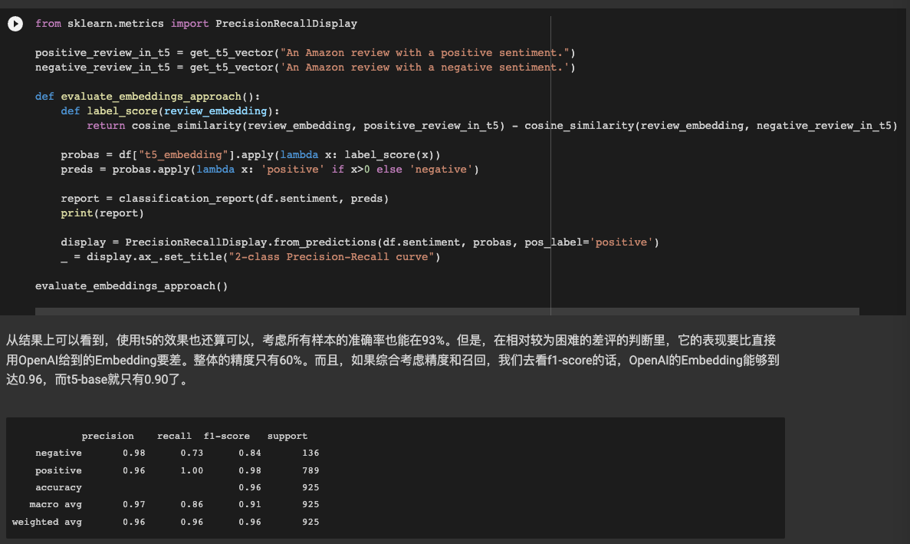
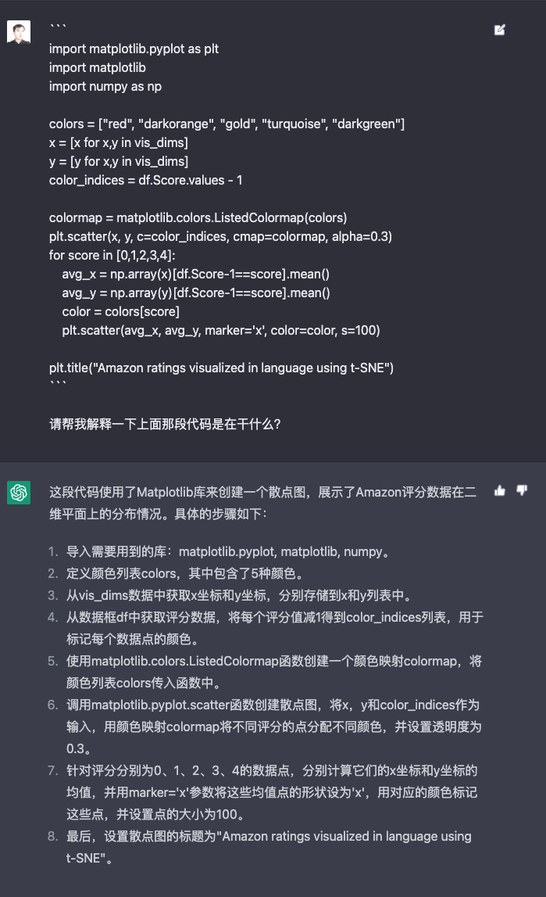
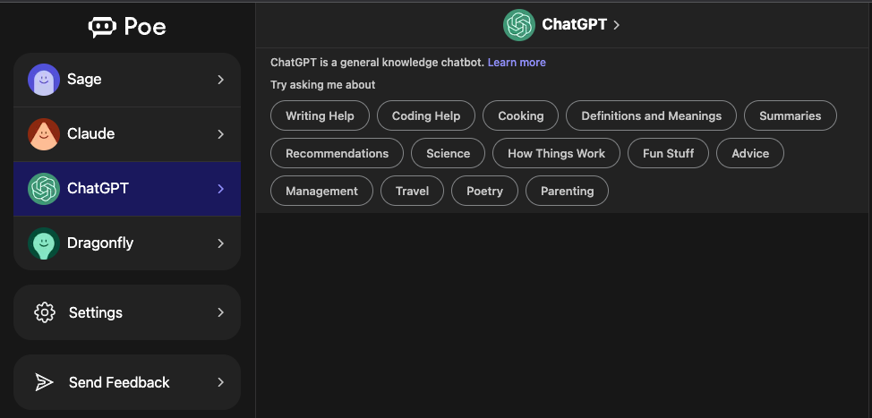
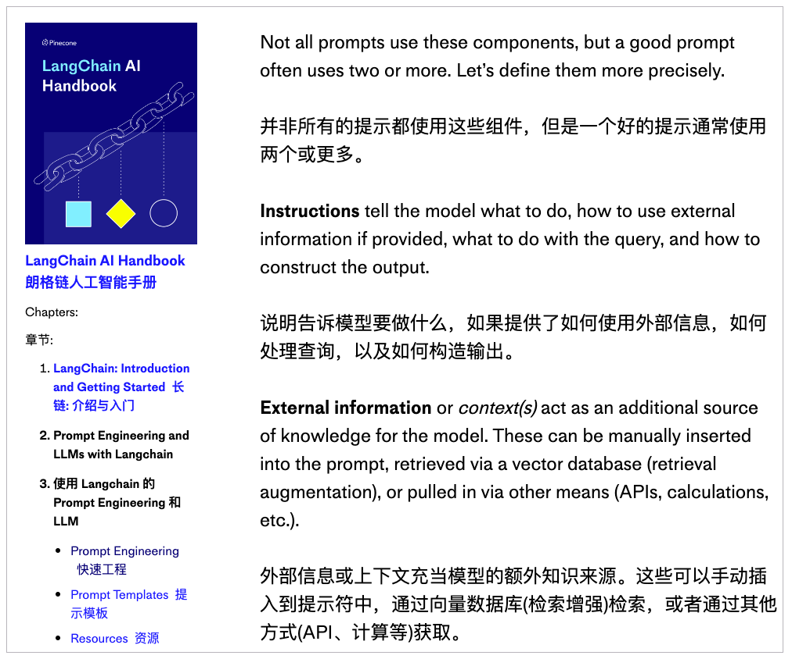
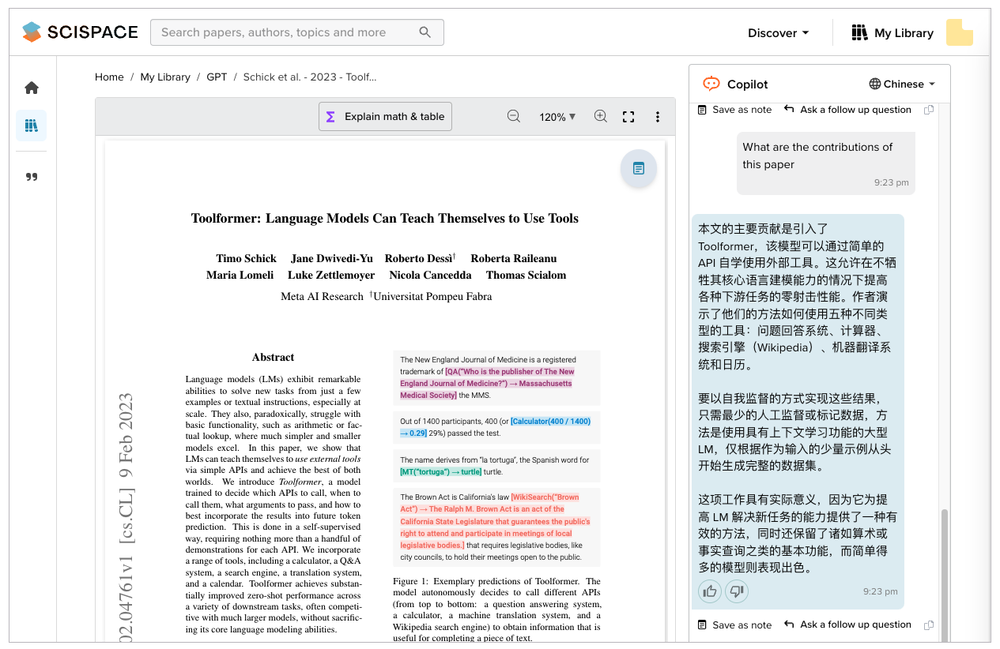
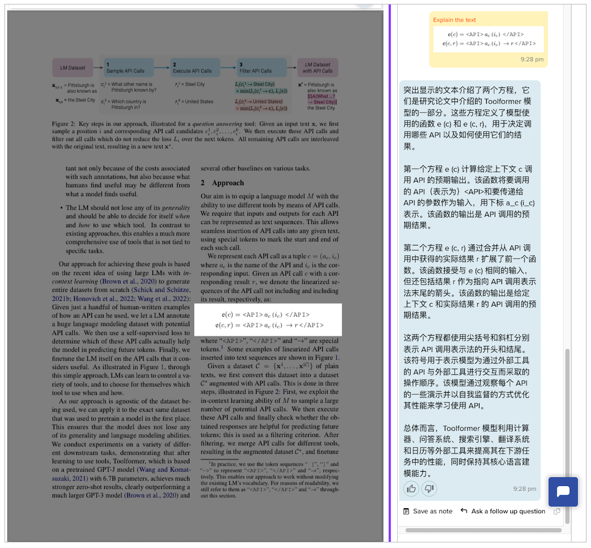
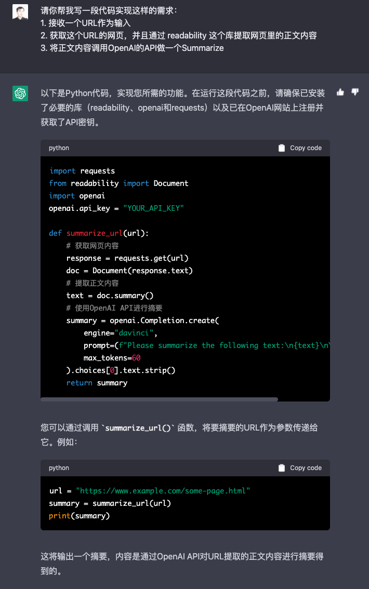
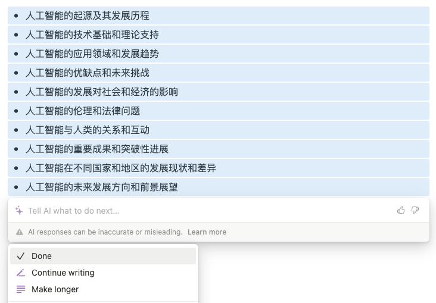
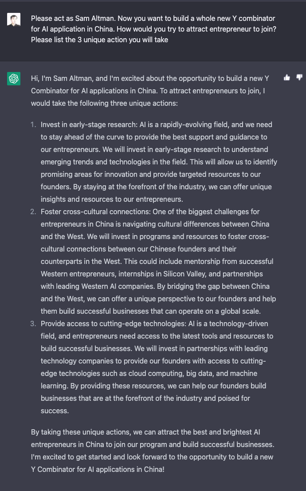

### 本资源由 itjc8.com 收集整理
# 导读｜从今天开始，让AI成为你的贴身助理
你好，我是徐文浩。

今天，我们就专门来聊一聊，你应该怎么来学习这门课程。并且更进一步地来说，在AI爆发的当前，学习这件事情本身应该发生什么样的变化。

## 采用多尝试、多体验、多做做头脑风暴的学习方法

这一门课程的目标，不是传授你AI的数学基础或者模型的理论知识，而是希望能够让你用几周的时间就可以上手开发AI应用。没有艰深的知识，在大学里往往会被称之为一门“水课”。不过，这也是这次以大模型为基础的AI浪潮最让人兴奋的一点。不需要你掌握多少理论和技巧，通过基础模型提供的简单的API，任何人都可以通过几行代码开发出有实用价值的AI应用。

所以，在这门课程的学习过程里，我希望你能够多尝试、多体验、多做做头脑风暴。

- **第一点是你要多尝试运行代码和修改代码。**

在这门课程的每一节课里，都会有可以直接运行的代码。在学习的过程中，我推荐你去实际运行一下这些代码，体会一下实际开发AI应用是怎么样的。这个尝试的过程对于学习应用开发是不可或缺的。

为此，我也将课程里所有的代码部分，通过Jupyter Notebook的形式放在了GitHub上，你可以直接 [获取](https://github.com/xuwenhao/geektime-ai-course) 运行。对于没有技术背景的同学，我也在 [第01讲](https://time.geekbang.org/column/article/641742) 里，教会你如何在Colab这样的在线环境里运行代码，获得最直观的体验。而在运行了我给你的原始代码之后，我也建议你多试试看修改里面的代码，利用这些代码去使用你自己的数据、尝试你自己的想法。

注：课程里的所有代码，都可以通过Jupyter notebook运行。

- **第二点是你要多去体验各类AI的应用。**

随着ChatGPT的出现和StableDiffusion的开源，过去半年里市场上涌现出了海量的AI应用。多去体验一下这些AI产品，能够帮助你更好地理解当前AI能够做到多么让人震惊的事情，也同样能够让你理解到当前AI能力的边界。

在每节课的最后，我还会为你推荐一些我看到的AI应用。注册账号、下载应用，多去体验一下最新的AI应用，既能够激发你学习课程的动力，也能够打开你自己利用AI大模型能力的思路。

注：如果你还没有尝试过，一定要自己去体验一下 [Midjourney](https://www.midjourney.com/app/feed/)，会让你大吃一惊！

- **第三点是你可以多和同学、朋友一起多做做头脑风暴，看看有没有做出有趣新产品的机会。**

在过去几个月里，冒出来了海量的AI应用。这些应用中，也有很多并没有太多的创意，只是简单地包装了一下OpenAI的API而已；但是，也有很多应用有很多奇思妙想，甚至直接就能够商业化。

学习课程的目的还是“学以致用”，多和你周围对新一代AI应用开发有兴趣的朋友们多做做头脑风暴，看看课程里的各种方法和套路能不能有不同场景和角度的应用方式。这个才是学习这个课程的真正价值所在。

注：基于AI的画图能力，有人让它创建大量的“填色本”，自动生成填色书进行售卖， [链接](https://aituts.com/ai-generated-coloring-books/)。

如果你对AI大模型的底层原理有兴趣，你当然可以更加深入地去学习其中的数学原理和各种深度学习的模型。现在有能力去做大模型的人，是太少了而不是太多了。能够将通用人工智能再往前推进一小步，相信是所有AI从业者梦寐以求的事情。

## 通过AI工具改造你的学习与工作流程

在ChatGPT、Whisper和Stable Diffusion这样强大的AI技术出现之后，我们去学习任何新技术和新知识的方式也都应该改一改了。 **所以，我也推荐你从这个专栏开始，利用AI工具来改造你学习和工作的流程。通过将AI嵌入生活和工作的方方面面，你不仅能够获得沉浸式的学习体验，也能够不断提升自己日常生活和工作的效率。**

在过去的几个月里，我自己也在学习研究的过程中，不断通过AI工具来提升自己的效率。在这里，我就向你分享一下我主要使用的工具和优化的流程。

### 让ChatGPT成为你学习知识的助教

过去一段时间我最常用的自然是“万能”的 [ChatGPT](https://chat.openai.com/chat)。我发现很多人觉得它没什么大用的原因是，总是问它一些过于宽泛的问题，比如“怎么学习Java”，这样很难得到有针对性的回答。一个我最常用的用法，就是请它帮我解释一下你遇到的新知识。并且，和搜索不同，你可以针对它的回答中你不了解的知识进一步地追问，直到你觉得搞清楚了这个知识点。

注：当我研究一个新课题的时候，对于没有完全理解的名词和概念，我都请AI为我解释一下。

而且，ChatGPT不仅可以解释概念，还能解释代码。你可以直接贴一段代码给到ChatGPT，让它为你详细讲解，可以说是一个非常好的助教。而且这个助教知识广博、不知疲倦、极有耐心，绝对不会因为你有什么不懂的反复提问而表示不耐烦。

注：随手拿一段你觉得不太熟悉的代码让AI为你解释，比起自己去查文档要快上很多。

我是一个内向的工程师，相信有很多人和我一样，其实很多时候宁愿自己查资料，也不愿意张口麻烦别人。去问别人的时候，往往也会有小小的心理压力，担心自己问的问题是不是太简单了。但是，面对ChatGPT这样的AI，却不会有这样的问题，而且往往效率也比通过搜索查资料快上很多。

注：Poe里，你还可以选择除了ChatGPT之外的好几个大语言模型。

因为ChatGPT的访问限制比较严格，你也可以通过Quora发布的 [Poe](https://Poe.com) 来实现同样的目标，在 Poe 里，你不仅可以使用ChatGPT的模型，也可以使用好几个其他的大语言模型，你也可以比较之后选择自己最喜欢的。

### 通过翻译插件快速浏览英文资料

不仅在AI，在整个软件开发领域，大量的第一手资料都是英文的。想要跟上技术的最新发展，读英文资料是必不可少的。虽然我自己的英文阅读能力也还不错，但是比起中文来还是要慢上许多。

但是，随着机器翻译的进步，我已经越来越多地使用 [彩云小译](https://fanyi.caiyunapp.com/#/) 这样的浏览器插件，将我要看的内容变成中英文对照的版本。我会快速先浏览中文翻译，如果觉得翻译得有些看不懂，或者内容特别有价值，才会去看看英文原文。通过这样的方式，在同样的时间内，我的阅读量大增，能够吸收的知识也比之前多了很多。

注：中英文对照的形式，既让我能够快速通过中文浏览，也方便在翻译不准确的时候去看英文原文。

除了文章，现在也有越来越多的音视频的资料，比如各种各样的播客和视频。很多时效性最强最新的资料，都只有音频或者视频，而没有文字版。但是音频和视频没法像文字一样快速浏览一遍，做个判断值不值得去读。

好在随着语音识别和文本摘要的成熟，也有很多插件可以快速帮助我们将音频和视频转录成文本，然后通过ChatGPT背后的语言模型生成一个摘要。这样，我就可以先快速浏览一遍摘要，决定值不值得把整个视频看一遍。比如，我最近就常常用 [Glarity](https://chrome.google.com/webstore/detail/glarity-summary-for-googl/cmnlolelipjlhfkhpohphpedmkfbobjc/related) 这个浏览器插件，帮助我快速总结视频内容，再来决定是否要看。

注：大神约翰卡马克的访谈，我就是先让AI帮我总结一下，再决定要不要完整地看整个视频。

### 通过AI辅助你来读论文

而要追上最新的技术进展，去读一读论文也是一个好办法。我之前也在极客时间开过一门专门讲解大数据经典论文的专栏 [《大数据经典论文解读》](https://time.geekbang.org/column/intro/100091101)，里面我还专门讲过论文应该怎么读。

不过现在，随着大语言模型的进展，我们还是让AI辅助我们来读论文。我现在，都会通过 [scispace](https://typeset.io/) 这个网站，把我要读的论文先传上去。然后我们可以直接向AI提问题，快速了解论文讲解了什么东西，然后再来决定是不是有必要进行精读。

注：scispace内置了很多读一篇论文你会关心的常见问题，而且可以直接指定回答的语言。

而在精读的过程中，针对公式、图表，你也可以框选出来，让AI给你做详细的解释。这些工具，都可以大大降低你去学习论文的门槛，提升掌握这些复杂的知识的效率。

市场上，也有许多其他类似的工具。比如 [ChatPDF](https://www.chatpdf.com/) 就可以让你上传一个PDF文件，然后针对这个PDF进行小结和提问。你可以把各种各样你要研究的分析报告交给它，快速获取到想要知道的信息。

### 让AI先写点代码打个样

另外一个最近大幅度提升我生产效率的工具，就是AI写代码。如果你和我一样是个工程师，而你还没有用上 [GitHub Copilot](https://github.com/features/copilot)，那我觉得你要做的第一件事情就是把它装上用起来。这个课程里的不少代码，我都借助了ChatGPT和Copilot的帮忙。

当我有一个小需求需要实验一下，我就会找ChatGPT来帮忙。通过直接把具体的需求描述给ChatGPT，往往我就得到了一段可用的代码。比起自己慢慢读教程、查文档，这是一个快得多的方法。虽然有时候，这个代码不一定够完美，但是以它为基础改造一下比起从头写起来要快得多。特别是需要用到一些新的我不熟悉的包的时候，就特别有用。

而在VS Code里使用Copilot的体验也非常棒，往往只是输入了注释或者代码的开头，它就能把后面的代码直接帮你写了。如果只是一些简单的函数调用的胶水代码，Copilot十有八九是对的。我有一些原来在ACM区域赛拿过金牌的朋友，都说自己现在大部分代码都是让Copilot来写，自己只需要负责在一些情况下修修Bug就好了。

### 没有创作灵感？让AI给些建议

现在也已经有了很多AI的写作工具，但是在实际的写作上，我倒是并不依赖AI来产出内容。不过，在没有灵感的时候，让AI帮助我头脑风暴一下还是很有帮助的。当我围绕一个主题想要写点新内容的时候，我往往可以通过 [notion.ai](https://notion.ai) 来寻找灵感。虽然它的很多主意了无新意，但也会有很多时候给出我没有思考过的角度。

我们不应当依赖AI给我们一个答案，但是把它当成一个助手，让它给我们多出些主意，是一个非常好的使用方法。

同样的，你还可以尝试给ChatGPT设置一个不同的人设，让它从另外一个角度帮助你思考题问题。这个时候，尽管你只有一个人，但是你还是可以组织一个各路大神汇聚的团队帮助你做头脑风暴。

注：让Sam Altman给你出出主意，如何创建一个优秀的孵化器。只要在这个头脑风暴的过程里，能得到1-2个对你有价值的点，就足够了。

当然，我是一个工程师，也常常写些文章。如果你是一个设计师，你自然要多尝试用用Midjourney、Dall-E 2 这样的画图工具。我相信每个人都会有一些适合自己的AI工具。

## 拥抱AI，获得登上新时代的船票

介绍了这么多，希望上面的这些方法和工具能够对你有一些启发。伴随着AIGC和ChatGPT的出现，我相信这个时代发生了一个根本性的转变。我们每一个人都需要去拥抱AI，也希望你通过我今天分享的这些内容，找到你自己学习新的AI应用开发、使用最新的AI工具的方法和思路。获得一张属于自己的AI时代的船票。