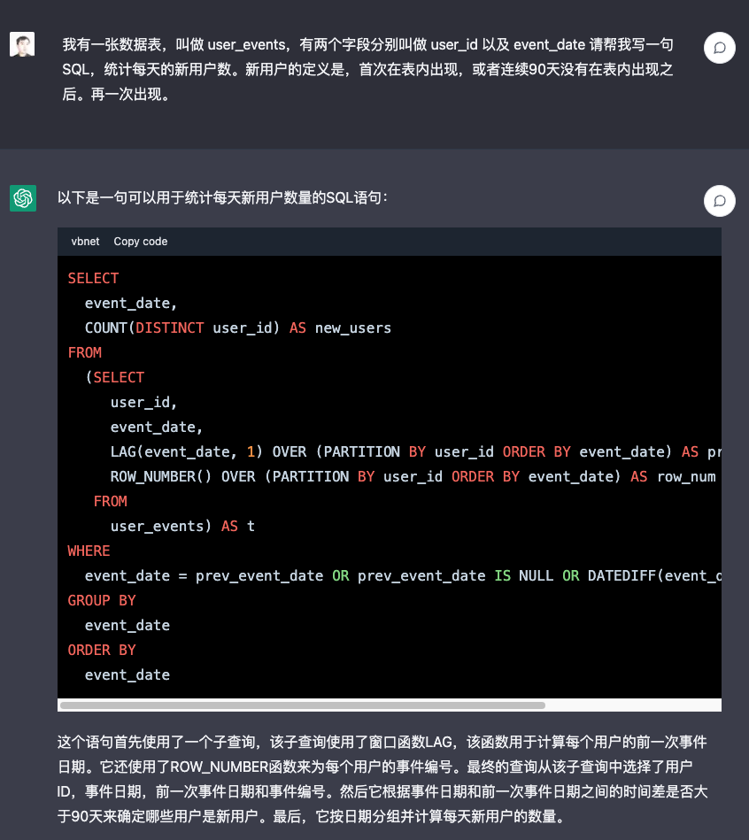
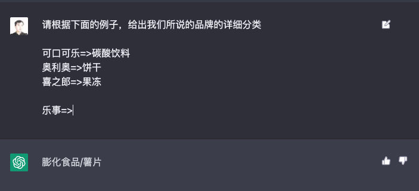
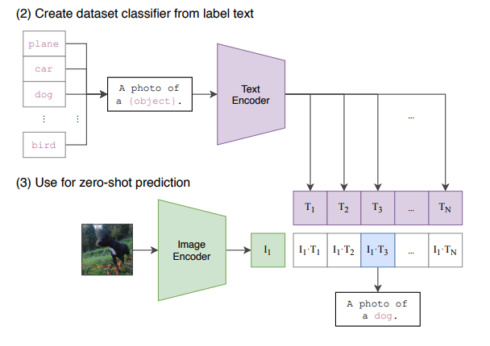
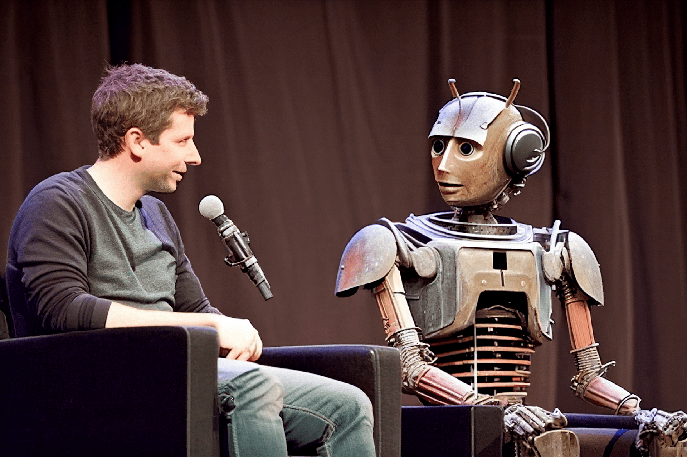

### 本资源由 itjc8.com 收集整理
# 开篇词｜GPT来了，跑步迎接AI爆发的时代
你好，我是徐文浩，一个创办过一家AI聊天机器人公司的工程师。

有人说，编译原理、操作系统和图形学是程序员的三大浪漫。不过在整个计算机科学领域，还有一个超越这三者之外的存在，那就是人工智能。人工智能的诞生其实非常早，公认的起源是1956年的达特茅斯会议。从那个时候开始， **“机器可以思维吗？”** 就是人工智能研究者想要回答的一个永恒的主题。

在2016年，我离开了飞速发展的拼多多，在年底创办了一家人工智能聊天机器人的公司BotHub。那个时候，Transformer这个当前最重要的基础模型还没有被提出来。在之后的研发过程里面，我们尝试过各种机器学习模型、开源的软件包以及各种云平台提供的解决方案，也通过数据标注、模型的训练，为不少中国出海的企业提供了面向普通消费者的智能聊天机器人。

但是，在这个过程中，我们始终没有摆脱 **“有多少人工就有多少智能”** 这样一个诅咒。所有的“智能”都来自于大量的人工数据标注，甚至很多硬编码的业务规则。而即便这样，在很多特殊情况下，“人工智能”还是表现得像一个“人工智障”。也因为如此，整个智能聊天机器人的服务也显得很不经济。所以在2019年，我们也断了继续研发人工智能的念想，之后的几年里转而专注于面向海外电商领域的产品研发。

去年12月初，在ChatGPT刚刚发布没几天，出于职业习惯的好奇心，我第一时间就去尝试体验了一下。说实话，刚开始我并没有对这个新的AI聊天机器人抱有太高的期待。毕竟，在过去十多年，我的经验告诉我，“有多少人工就有多少智能”。即使是Google、Facebook之前推出的聊天机器人，用不了多久也会被大家玩儿坏，体现出自己“人工智障”的本质。

然而，在简单和ChatGPT聊了几句车轱辘话之后，我尝试让它给我写一些简单的Bash脚本和SQL代码，而这一次，我被彻底震住了。它不仅准确地理解了我用自然语言描述的需求，还完全正确地写出了一个需要复杂窗口函数的SQL代码。



注：对于复杂的需要窗口函数的SQL，ChatGPT写得比我快多了。这个例子我分享在了sharegpt上，链接在 [这里](https://sharegpt.com/c/UubOGhm)。

在这之后的几周里，我沉迷于使用ChatGPT完成各种各样的任务，并且开始尝试用OpenAI提供的各种API。同时，我也回头开始研读了过去几年AI大模型的论文和进展。事实上，2023年的整个春节里，我都没有停下来休息过，而是一直对着OpenAI发布的Cookbook做各种各样的尝试。

在这个过程中，我有一个强烈的感觉，那就是 **“强人工智能”已经来了**。这一次人工智能领域的进展，完全不同于80年代的学习理论，也远远超越了2012年的深度神经网络的意义，它会变成一场席卷全世界的风暴。AI应用不仅仅是算法工程师和机器学习研究人员的专利了，而是变成了每个工程师都可以快速学习并参与开发的领域。

于是，在23年的元旦之前，我主动找到了极客时间，提出了要写这样一门课程。希望能够把新一代的AI应用开发的方法和机会介绍给你。在那个时候，我还没有想象到仅仅在一个多月之后，ChatGPT和OpenAI就迅速席卷了国内整个科技行业。我自己对整个领域的爆发，还是估计得太保守了。

不过，这个快速的爆发让我进一步相信，这门课程对所有软件开发行业的从业者都是很有价值的。无论是产品经理还是工程师，乃至于行业之外的业务人员，都值得去学一学看一看。了解新一代AI应用的能力是怎样的，怎么通过几行简单的代码就能把它运用在我们日常工作和生活中。我认为，人人都应该拥抱新的AI浪潮，学习开发新一代的AI应用。

## 为什么人人都应该学习如何开发新一代AI应用？

AI算法工程师原先是一个专门的工作。原来我们的技术团队里，都会分工成产品经理、UI/UE设计师、前端开发、后端开发、大数据团队和AI算法这样一系列的工种。大部分人对于AI也只是有个概念性的了解，其实相对缺乏深入的认识。我为什么说，人人都应该拥抱新的AI浪潮，要去了解怎么开发新的AI应用呢？主要有3个原因。

**第一个原因，是这一轮的AI浪潮里，开发新的AI应用的门槛大大降低了。** 过去，AI应用开发是一个门槛比较高的领域。你需要有不错的数学基础，熟悉微积分、线性代数和概率论；然后掌握大量的机器学习和深度学习的知识，了解各种基础模型，比如逻辑回归、SVM、CNN、LSTM等等的原理和实现；接着，你还要学会使用各种机器学习的编程框架，比如TensorFlow或者PyTorch，买上一块价格不菲的GPU尝试训练模型；最后，你还需要理解在实际应用里锤炼机器学习的各种实战技巧和模型，比如各种各样的特征工程方式、Dropout等正则化方法、超参数调优等等。对于没有相关经验的人来说，不花上个一两年时间，你可能很难说得上能用AI算法做出一些有价值的产品出来。

但是这一轮的AI浪潮完全不用。伴随着GPT-3、Stable Diffusion这样预训练好的大型基础模型的出现，以及这些模型的能力通过开放API的形式提供出来，即使没有任何机器学习的理论知识，你只需要一两天时间，就能做出一个能解决实际问题的AI应用。

比如，最近你在GitHub上就能看到很多工程师，花上1-2天时间就做出来的图书翻译、人工智能语音对话的应用。 **任何一个稍有开发经验的工程师，都能够在几周甚至几天之内，学会使用这些基础模型以及相应的开放API开发出有使用价值的应用。**

```python
from langchain.llms import OpenAIChat
from langchain.text_splitter import SpacyTextSplitter
from llama_index import GPTListIndex, LLMPredictor, SimpleDirectoryReader

documents = SimpleDirectoryReader('./data/mr_fujino').load_data()
llm_predictor = LLMPredictor(llm=OpenAIChat(temperature=0, model_name="gpt-3.5-turbo", max_tokens=1024))
list_index = GPTListIndex(documents, llm_predictor=llm_predictor,
                          text_splitter=SpacyTextSplitter(pipeline="zh_core_web_sm", chunk_size = 2048))
response = list_index.query("下面鲁迅先生以第一人称‘我’写的内容，请你用中文总结一下:", response_mode="tree_summarize")
print(response)

```

注：在第11讲里，我会教你如何通过简单的10行代码，完成对任意文本的小结。

**第二个原因，是这一轮的AI浪潮里，对应技术能够应用的范围非常广泛，可以说是包罗万象。** AI本身是计算机刚刚发明出来就有的学科，在历史的进程中也有过很多次大的进步和发展。比如80年代学习理论（Learning Theory）的发展，就使得SVM在实践中被大量应用。2000年之后随着互联网广告的高速发展，海量参数的分布式机器学习就被广泛运用在搜索、推荐和广告的业务中。2012年随着AlexNet的发布，深度学习和卷积神经网络（CNN）就带来了计算机视觉的爆发。但是，这些历史的发展，往往只是某一个细分领域上的进步。而且这个过程里，对于每一个具体问题我们都要单独收集数据、训练单独的机器学习模型来解决里面某一个小问题。

从2020年的GPT-3开始，拥有海量参数的大模型登上了历史舞台，直接使用GPT-3这样的预训练好的大语言模型，无需任何微调，就能解决情感分析、命名实体识别、机器翻译等一系列的自然语言处理问题。而对于很多AI没见过的问题，也只要通过自然语言给到AI几个例子，通过“小样本学习”（Few-Shot Learning），AI就能给出正确的回答。



注：零样本以及小样本学习的能力，使得一个大模型可以一次性解决不同类型的很多问题。

在计算机视觉上，像2021年OpenAI发表的CLIP这样的模型也有类似的效果。我们对于图片的分类不再局限于预先的人工数据标注的类别，而是可以扩展到任何类别上去。在自然语言、语音、视觉，乃至这些领域相互融合的多模态领域里，AI同时在加速发展、在进步。



注：通过4亿个（图片,文本）对的训练，对于图片的分类可以任意扩展，而不需要预先标注。

这一轮的AI浪潮开始让我们看见了“通用人工智能”（AGI）的雏形，AI应用的覆盖领域被大大扩展了，几乎任何一个问题都有机会通过AI来解决优化。今天你所在的行业和领域，都有机会通过简单的AI应用开发，提升效率和产出。

**第三个原因，是这个浪潮带来的变化会对我们每一个人的工作带来巨大的冲击。** 在过去短短的两三个月里，在个人生活里，我已经习惯于让AI帮我写代码，翻译英文资料，修改我写过的文章，为文章配图。在工作上，也已经让AI来优化商品文案、优化商品搜索，并且进一步开始尝试让AI承接更多原本需要由人来进行的工作。

我不知道AI会不会让你失业，但是善用AI的团队和公司接下来一定会有更高的效率和产出。无论你是产品经理还是工程师，是产品运营还是美术设计，在这一轮AI浪潮下，你的工作性质都会产生根本性的改变。AI会像一个助手一样随时陪伴在我们身边，随时帮我们解决简单的知识性工作，甚至在很多时候给我们创意性的启发。



注：这是我让Midjourney画的Sam Altman和机器人开一个座谈会的图片，除了那个在空中漂浮的话筒，其余的一切都好像真的一样。

英伟达的创始人黄仁勋先生说，ChatGPT的发布堪称是人工智能产业发展的 “iPhone 时刻”。而要我说，整个AI基于基础大模型发展出来的能力，堪比一次工业革命。 **固然，这个改变对很多人的职业生涯来说，也是一场危机。但是就像丘吉尔所说的，“不要浪费一场危机”，尽早去拥抱这个变化，你就有机会像在2008年App Store发布的时候去学习移动App开发一样，把握住未来的机会。**

## 通过实践学习新一代AI应用开发

那么，这门课程将如何帮助你学习新一代的AI应用开发呢？

**首先，这门课程不是一个理论课程，而是一个实践课程。** 每一节课，我们都会提出一个需要解决的实际问题。比如，用户对于商家评论的情感分析，能够记住上下文的聊天机器人，如何通过用户输入的关键词搜索图片等等。而伴随着这个问题的，则是通过几行或者几十行代码解决问题的整个过程。

所有的这些代码，基本都可以通过在线的Notebook的方式运行，不需要你在自己的电脑上搭建开发环境。即使你是一个产品经理或者业务方，你也可以自己动手体验到新一代的AI应用，开发起来是多么的简单便利。

**其次，这门课程不只是对OpenAI的API的讲解，我们既会去尝试一些开源模型，也会去覆盖语音、视觉的应用场景。** 我不只会给你一个打字聊天的机器人，也会带你体验语音识别、语音合成、AI作画等一系列应用开发的过程。我们不仅会使用OpenAI的API这样便捷的方式，也在特定场景下会选用本地部署的开源模型，甚至是基于你拥有的数据去微调这些模型。

**第三，我不仅会告诉你现在AI有什么能力，还会教你实际使用AI的套路。** 比如分类、搜索、推荐、问答这些问题，应该如何用现有模型的能力来解决，有什么固定的模式可以解决这些问题。你可以立刻把这些方法和套路放到你现有的业务系统里，立刻通过AI给你的应用提升体验与效率。

**最后，随着课程的推进，你会看到组合多个API、开源模型和开源库去解决复杂的真实问题的场景。** 如果你想实现一个电商客服，你不仅需要检索知识库和问答的能力，同样需要去连接你现有的订单和物流信息的能力。如何在AI应用的开发过程中，将复杂的业务流程串起来，不是简单地调用一下API就能做到的。但是在学习完这个课程之后，相信这些对你都不再是难事儿了。

那针对这四个目标，我把课程分成了3个模块。

- 第一个模块，是 **基础知识篇**。这里，我会带你探究大型语言模型的基本能力。通过提示语（Prompt）和嵌入式表示（Embedding）这两个核心功能，看看大模型能帮我们解决哪些常见的任务。通过这一部分，你会熟悉OpenAI的API，以及常见的分类、聚类、文本摘要、聊天机器人等功能，能够怎么实现。
- 第二个模块，是 **实战提高篇**。我们会开始进入真实的应用场景。要让AI有用，不是它能简单和我们闲聊几句就可以的。我们希望能够把自己系统里面的信息，和AI系统结合到一起去，以解决和优化实际的业务问题。比如优化传统的搜索、推荐；或者进一步让AI辅助我们读书读文章；乃至于让AI自动根据我们的代码撰写单元测试；最后，我们还能够让AI去决策应用调用什么样的外部系统，来帮助客户解决问题。
- 第三个模块，我们来重点关注 **语音与视觉**。光有文本对话的能力是不够的，我会进一步让你体验语音识别、语音合成，以及唇形能够配合语音内容的数字人。我还会教会你如何利用现在最流行的Stable Diffusion这样的开源模型，去生成你所需要的图片。并在最后，把聊天和画图结合到一起去，为你提供一个“美工助理”。

希望这个课程，能够教会你高效利用新一代AI强大的能力，去解决真实场景下的问题。如果你是一个工程师，你可以立刻把学到的代码、方法和模型用到你的工作里去。如果你是一个产品经理或者业务人员，相信你也能从这个课程里，了解到AI能够做的事情，以及现在做起来能有多简单。

## 立刻动手，拥抱新时代的“通用人工智能”

OpenAI的创始人Sam Altman说，他觉得“通用人工智能”（AGI）已经离我们不远了。在投入了大量的时间去体验、应用和学习AI最新的进展之后，我也已经信服了这个观点。

人工智能是在计算机的发明之后没多久就出现的一个领域。说实话，作为一个早早就接触和进入到这两个领域的幸运儿，之前我从来没有想过在有生之年会看到“通用人工智能”有实现的可能性。

而当“通用人工智能”真的有可能出现在我们面前的时候，我是异常兴奋的，曾经被浇灭过的热情重新燃烧了起来。过去的几个月，可能是我最近几年以来，写代码、读论文、看视频最多的一段时间。我也希望能把这些让我时时刻刻都充满热情和浪漫想象的科学技术分享给你，和你一起去拥抱一个属于AI的新时代。

希望这门课，不仅仅是让你了解到AI领域应用开发的知识和方法，更能激起你们的创意和热情，去开发你们用得上的AI产品，对你们生活的每一天都做出改变！最后欢迎你的加入！