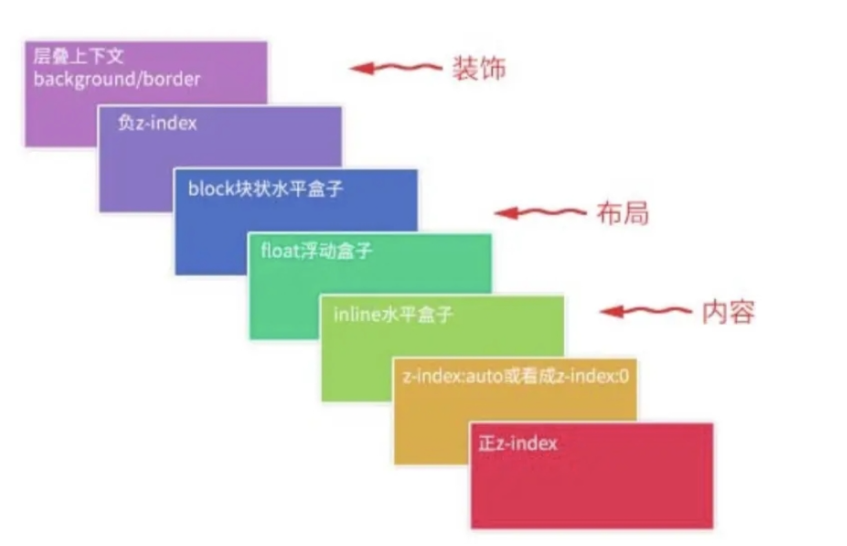
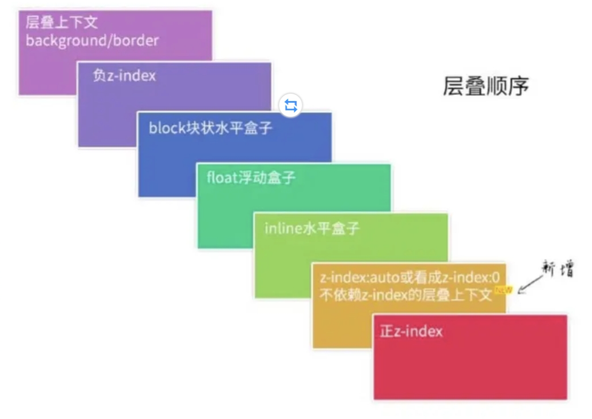

#### z-index的细节

##### 使用条件

* z-index和属性position绑定，只有position为非 `static`才会生效

## 层叠上下文

层叠上下文，英文称作 stacking context，是 HTML 中的一个三维的概念。如果一个元素含有层叠上下文，我们可以理解为这个元素在 z 轴上就“高人一等”。我们可以把层叠上下文理解为一种“层叠结界”，自成一个小世界。在这个层叠结界中，所有的层叠元素都不会溢出这个结界，并在其内部满足一定的层叠规则：

background/border 为装饰属性，浮动和块状元素一般用作布局，而内联元素都是内容。这里需要注意的是，负 z-index 的元素在层叠顺序上是高于 background 的，即使将一个元素的 z-index 设置为-99999，它仍然会出现在所处的层叠上下文的背景之上。

## 层叠上下文的特性

* 层叠上下文的层叠水平要比普通元素高
* 层叠上下文可以阻断元素的混合模式
* 层叠上下文可以嵌套，内部层叠上下文及其所有子元素均受制于外部的“层叠上下文”。
* 每个层叠上下文和兄弟元素独立，也就是说，当进行层叠变化或渲染的时候，只需要考虑后代元素。
* 每个层叠上下文是自成体系的，当元素发生层叠的时候，整个元素被认为是在父层叠上下文的层叠顺序中。

### CSS3 属性创建的层叠上下文

1. 元素为 flex 布局元素(父元素 display:flex|inline-flex)，同时 z-index 值不是 auto。
2. 元素的 opacity 值不是 1。
3. 元素的 transform 值不是 none。
4. 元素 mix-blend-mode 值不是 normal。
5. 元素的 filter 值不是 none。
6. 元素的 isolation 值是 isolate。
7. 元素的 will-change 属性值为上面 2~6 的任意一个(如 will-change:opacity、will-chang:transform 等)。
8. 元素的-webkit-overflow-scrolling 设为 touch。

