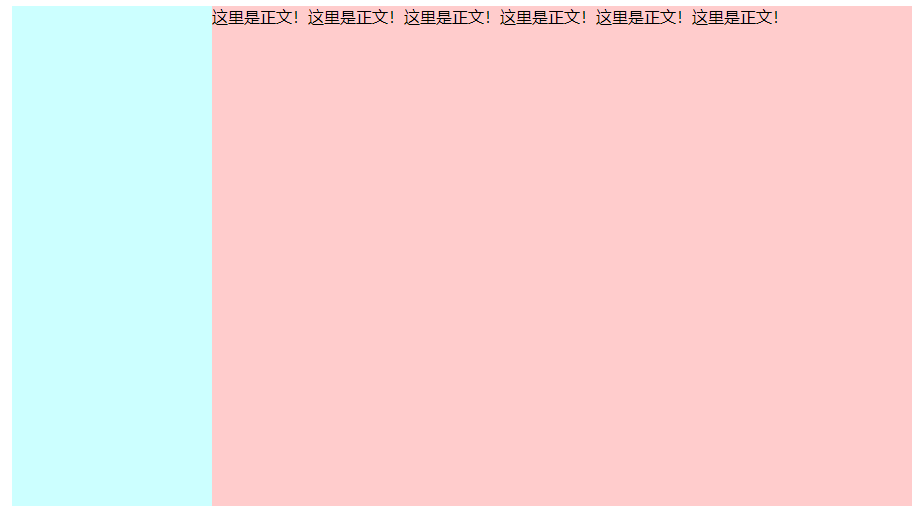

## 两栏布局实现的几种方式:

### 效果



### 方式1：

侧边栏左浮动+正文部分`overflow:hidden`，可以阻止元素被覆盖，详见BFC。

```html
<head>
    <meta charset="UTF-8">
    <meta name="viewport" content="width=device-width, initial-scale=1.0">
    <title>Document</title>
    <style>
        .wrap{
            width:900px;
            margin:0 auto;
        }
        .left{
            width: 200px;
            height: 500px;
            background: #ccffff;
            float: left;
        }
        .right{
            height: 500px;
            overflow: auto;/*可以阻止元素被覆盖，详见BFC*/
            background: #ffcccc;
        }
    </style>
</head>
<body>
    <div class="wrap">
        <aside class="left"></aside>
        <div class="right">
            这里是正文！这里是正文！这里是正文！这里是正文！这里是正文！这里是正文！
        </div>
    </div>
</body>
</html>
```

### 方式二：

定位实现两栏布局

```html
<!DOCTYPE html>
<html lang="en">
<head>
    <meta charset="UTF-8">
    <meta name="viewport" content="width=device-width, initial-scale=1.0">
    <title>Document</title>
    <style>
        .wrap{
            width:900px;
            margin:0 auto;
            position: relative;
        }
        .left{
            width:200px;
            height:500px;
            background: #ccffff;
            position: absolute;
            top:0;
            left:0;
        }
        .right{
            width:700px;
            height:500px;
            background: #ffcccc;
            position: absolute;
            top:0;
            right:0;
        }
    </style>
</head>
<body>
    <div class="wrap">
        <aside class="left"></aside>
        <div class="right">
            这里是正文！这里是正文！这里是正文！这里是正文！这里是正文！这里是正文！
        </div>
    </div>
</body>
</html>
```

方式三：

纯浮动形式:都向左边浮动

```html
<!DOCTYPE html>
<html lang="en">
<head>
    <meta charset="UTF-8">
    <meta name="viewport" content="width=device-width, initial-scale=1.0">
    <title>Document</title>
    <style>
        .wrap{
            width:900px;
            margin:0 auto;
            overflow: hidden;
        }
        .left{
            width:200px;
            height:500px;
            background: #ccffff;
            float: left;
        }
        .right{
            width:700px;
            height:500px;
            background: #ffcccc;
            float: left;
        }
    </style>
</head>
<body>
    <div class="wrap">
        <aside class="left"></aside>
        <div class="right">
            这里是正文！这里是正文！这里是正文！这里是正文！这里是正文！这里是正文！
        </div>
    </div>
</body>
</html>
```

方式四：

浮动+margin-left

```html
<!DOCTYPE html>
<html lang="en">
<head>
    <meta charset="UTF-8">
    <meta http-equiv="X-UA-Compatible" content="IE=edge">
    <meta name="viewport" content="width=device-width, initial-scale=1.0">
    <title>Document</title>
    <style>
        .wrap{
            margin:0 auto;
            width: 900px;
        }
        .left{
            width:200px;
            height:500px;
            background: #ccffff;
            float: left;
        }
        .right{
            height: 500px;
            background: #ffcccc;
            margin-left:200px;
        }
    </style>
</head>
<body>
    <div class="wrap">
        <aside class="left"></aside>
        <div class="right">
            这里是正文！这里是正文！这里是正文！这里是正文！这里是正文！这里是正文！
        </div>
    </div>
</body>
</html>
```

