### 本资源由 itjc8.com 收集整理
# 13 真实案例说明类型编程的意义
我们学了类型编程的各种套路，写了很多高级类型，也学了 TypeScript 内置的高级类型，对类型编程这一块算是有一定程度的掌握了。

那么类型编程在实际开发中会用到么？它的意义是什么呢？这节我们就通过一些案例来说明类型编程有什么用。

## 类型编程的意义
ts 基础是学习怎么给 js 代码声明各种类型，比如索引类型、函数类型、数组类型等，但是如果需要动态生成一些类型，或者对类型做一些变化呢？

这就是类型编程做的事情了，**类型编程可以动态生成类型，对已有类型做修改。**

类型编程是对类型参数做一系列运算之后产生新的类型。需要动态生成类型的场景必然会用到类型编程，比如返回值的类型和参数的类型有一定的关系，需要经过计算才能得到。

有的情况下不用类型编程也行，比如返回值可以是一个字符串类型 string，但用了类型编程的话，可能能更精确的提示出是什么 string，也就是具体的字符串字面量类型，那类型提示的精准度自然就提高了一个级别，体验也会更好。

这就是类型编程的意义：**需要动态生成类型的场景，必然要用类型编程做一些运算。有的场景下可以不用类型编程，但是用了能够有更精准的类型提示和检查。**

我们还是通过例子来说明：

## ParseQueryString
前面我们实现了一个复杂的高级类型 ParseQueryString，用到了提取、构造、递归的套路。

这么复杂的高级类型能用在哪里呢？有什么意义呢？想必很多同学都有疑问，那么我们就先聊一下这个高级类型的应用场景。

首先，我们写一个 JS 函数，实现对 query string 的 parse，如果有同名的参数就合并，大概实现是这样的：

```Plain Text
function parseQueryString(queryStr) {
    if (!queryStr || !queryStr.length) {
        return {};
    }
    const queryObj = {};
    const items = queryStr.split('&');
    items.forEach(item => {
        const [key, value] = item.split('=');
        if (queryObj[key]) {
            if(Array.isArray(queryObj[key])) {
                queryObj[key].push(value);
            } else {
                queryObj[key] = [queryObj[key], value]
            }
        } else {
            queryObj[key] = value;
        }
    });
    return queryObj;
}

```
这种逻辑大家写的很多，就不过多解释了：

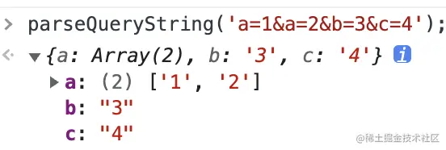

如果要给这个函数加上类型，大家会怎么加呢？

大部分人会这么加：

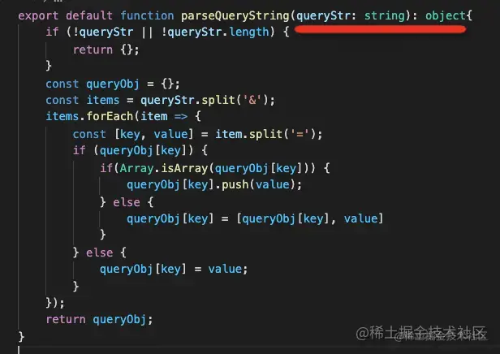

参数是 string 类型，返回值是 parse 之后的对象类型 object。

这样是可以的，而且 object 还可以写成 Record<string, any>，因为对象是索引类型（索引类型就是聚合多个元素的类型，比如对象、class、数组都是）。

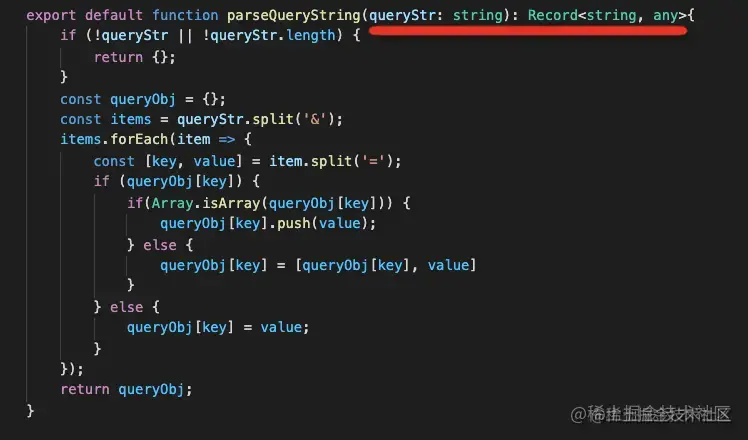

Record 前面介绍过，是 TS 内置的一个高级类型，会通过映射类型的语法来生成索引类型：

```Plain Text
type Record<K extends string | number | symbol, T> = { 
    [P in K]: T;
}

```
比如传入 'a' | 'b' 作为 key，1 作为 value，就可以生成这样索引类型：

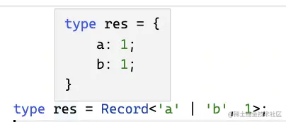

所以这里的 Record<string, any> 也就是 key 为 string 类型，value 为任意类型的索引类型，可以代替 object 来用，更加语义化一点：

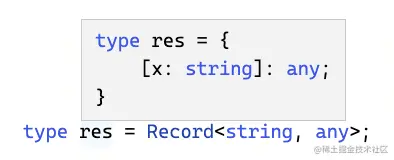

但是不管是返回值类型为 object 还是 Record<string, any> 都存在一个问题：返回的对象不能提示出有哪些属性：


对于习惯了 ts 的提示的同学来说，没有提示太不爽了。怎么能让这个函数的返回的类型有提示呢？

这就要用到类型编程了。

我们把函数的类型定义改成这样：

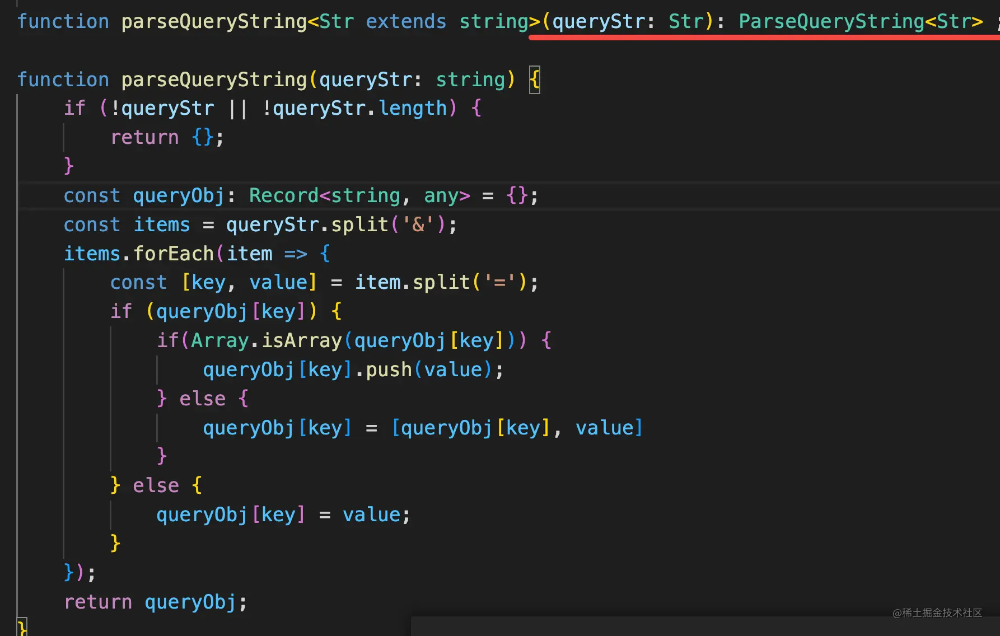

声明一个类型参数 Str，约束为 string 类型，函数参数的类型指定是这个 Str，返回值的类型通过对 Str 做类型运算得到，也就是 ParseQueryString。

这个 ParseQueryString 的类型做的事情就是把传入的 Str 通过各种类型运算产生对应的索引类型。

这样返回的类型就有提示了：

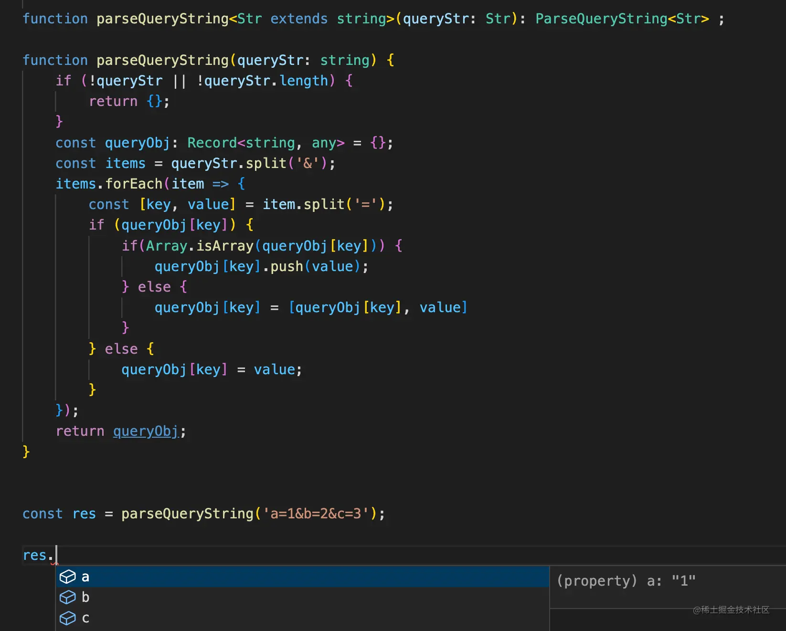

这里最好通过函数重载的方式来声明类型，不然返回值可能和 ParseQueryString 的返回值类型匹配不上，需要 as any 才行，那样比较麻烦。

这里的 ParseQueryString 就是前面实现的那个高级类型，在这里可以用来实现更精准的类型提示，这就是类型体操的意义。

这个类型的实现思路可以看顺口溜那节，就不赘述了：

```Plain Text
type ParseParam<Param extends string> = 
    Param extends `${infer Key}=${infer Value}`
        ? {
            [K in Key]: Value 
        } : Record<string, any>;

type MergeValues<One, Other> = 
    One extends Other 
        ? One
        : Other extends unknown[]
            ? [One, ...Other]
            : [One, Other];

type MergeParams<
    OneParam extends Record<string, any>,
    OtherParam extends Record<string, any>
> = {
  readonly [Key in keyof OneParam | keyof OtherParam]: 
    Key extends keyof OneParam
        ? Key extends keyof OtherParam
            ? MergeValues<OneParam[Key], OtherParam[Key]>
            : OneParam[Key]
        : Key extends keyof OtherParam 
            ? OtherParam[Key] 
            : never
}

type ParseQueryString<Str extends string> = 
    Str extends `${infer Param}&${infer Rest}`
        ? MergeParams<ParseParam<Param>, ParseQueryString<Rest>>
        : ParseParam<Str>;

function parseQueryString<Str extends string>(queryStr: Str): ParseQueryString<Str> ;
function parseQueryString(queryStr: string) {
    if (!queryStr || !queryStr.length) {
        return {};
    }
    const queryObj:Record<string, any> = {};
    const items = queryStr.split('&');
    items.forEach(item => {
        const [key, value] = item.split('=');
        if (queryObj[key]) {
            if(Array.isArray(queryObj[key])) {
                queryObj[key].push(value);
            } else {
                queryObj[key] = [queryObj[key], value]
            }
        } else {
            queryObj[key] = value;
        }
    });
    return queryObj;
}


const res = parseQueryString('a=1&b=2&c=3');

```
这里的实现和之前那个还是有一些区别的，主要是这里：


当提取 a=1 中的 key 和 value，构造成索引类型的时候，如果提取不出来，之前返回的是空对象，现在改成了 Record<string, any>。

因为 ParseQueryString 是针对字符串字面量类型做运算的，如果传入的不是字面量类型，而是 string，那就会走到这里，如果返回空对象，那取它的任何属性都会报错。

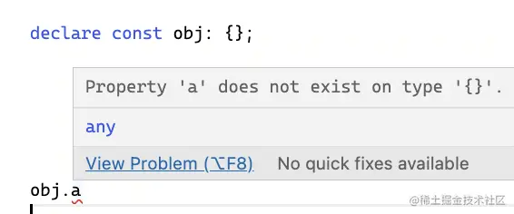

所以要把不满足条件时返回的类型改为 Record<string, any>：


[试一下](https://link.juejin.cn/?target=https%3A%2F%2Fwww.typescriptlang.org%2Fplay%3Fts%3D4.5.0-beta%23code%2FC4TwDgpgBACghgJwM4XguBbAPGzUIAewEAdgCZJRLAICWJA5gHxQC8UAUFN7InocXKUABgBIA3vQBmEBFADSEEAF9WE6bKgA1OABsArhGXCuPMwH4o402dtQA2vKj0FSgLoAubXsOc73ZSgvACUIAGMAewQyLGo6RgAaKDgSECYAbg4OUEgoAFlZBggdAwgkLAB5EggkiuAAC1kWdhsoKugBUgo2hs1Wizbq-p4vOsa5TqEofRIAaxIIgHcSezdhu0t7dqSAOj2x2TX-Wy8t6trehDdM7PBoAoQi3Axy1vbn-CIuylDI6NiaPQGEkUmkEm9Lh9Jt1flEYnEgSDUkwOM0rKYEBA4GQIiRdCAHIoCS5ZkoIlJBqg%2BBgoAAfKCkkDknrjZ6ePw8ImfQTdRnM97U9ZQSxc6GUPkUg4IZ5CgYPIolQzlAXoDCOdwXVnU9UgNwo45mUbVZ46o7%2BLyir5TCUs2QfWU8SxSk1Etwcg1BKDVABusg4yiyOWgaBQAEVDAgQABlQGMLAxiZW7oIxho1oJ7nfKBiSQkGRyZ7KABk6jzmlC1GMQss8qpqvKIbrmBw1KYSUb4dk0djDCwFeATH15t4yCb2ATGSyUhmYWAtFxUDAiDDEe78V7GbFVB7TAAFABHVcJrwJgCUXg7R578ZoLEy05Is-nJEXy4gncjCaBB6vCC8KYYU90TMWgKV3ABCQ8uwzWl6Ug38dl0UgGAaIDrGOTFgH0BAX3EZRMjMAMzEiEhqCgKDIwqAAjAArDxYX%2BACkTSNgrHw1oSLI2hiBeViKLXHYkDAXRuN3AByIsxNPAieG4iAXh2KQogAUTgMJ6l3OSaVYFh0P8TjgAcRkkm9HwIDddgtME4TRLE1gpJkuxQKgH8u2omj7EZNw0IdbhQN3ABBBB0BAHZaCQIKQtcyjaM89xTx8j07H49y4t1HYwH0JANNM0ppN8qBAggXQUGApKzBS2KvNY%2BxKo8ryTLMs0PSI-wipK6A9I9Oq0osqBcsMRzbFagJ8rMTDsJfOrMgDLIDKgTFKHYJdRw-NdvzEuBWAARiLKjWAAJiLMJWAAZgcjggA "https://www.typescriptlang.org/play?ts=4.5.0-beta#code/C4TwDgpgBACghgJwM4XguBbAPGzUIAewEAdgCZJRLAICWJA5gHxQC8UAUFN7InocXKUABgBIA3vQBmEBFADSEEAF9WE6bKgA1OABsArhGXCuPMwH4o402dtQA2vKj0FSgLoAubXsOc73ZSgvACUIAGMAewQyLGo6RgAaKDgSECYAbg4OUEgoAFlZBggdAwgkLAB5EggkiuAAC1kWdhsoKugBUgo2hs1Wizbq-p4vOsa5TqEofRIAaxIIgHcSezdhu0t7dqSAOj2x2TX-Wy8t6trehDdM7PBoAoQi3Axy1vbn-CIuylDI6NiaPQGEkUmkEm9Lh9Jt1flEYnEgSDUkwOM0rKYEBA4GQIiRdCAHIoCS5ZkoIlJBqg+BgoAAfKCkkDknrjZ6ePw8ImfQTdRnM97U9ZQSxc6GUPkUg4IZ5CgYPIolQzlAXoDCOdwXVnU9UgNwo45mUbVZ46o7+Lyir5TCUs2QfWU8SxSk1Etwcg1BKDVABusg4yiyOWgaBQAEVDAgQABlQGMLAxiZW7oIxho1oJ7nfKBiSQkGRyZ7KABk6jzmlC1GMQss8qpqvKIbrmBw1KYSUb4dk0djDCwFeATH15t4yCb2ATGSyUhmYWAtFxUDAiDDEe78V7GbFVB7TAAFABHVcJrwJgCUXg7R578ZoLEy05Is-nJEXy4gncjCaBB6vCC8KYYU90TMWgKV3ABCQ8uwzWl6Ug38dl0UgGAaIDrGOTFgH0BAX3EZRMjMAMzEiEhqCgKDIwqAAjAArDxYX+ACkTSNgrHw1oSLI2hiBeViKLXHYkDAXRuN3AByIsxNPAieG4iAXh2KQogAUTgMJ6l3OSaVYFh0P8TjgAcRkkm9HwIDddgtME4TRLE1gpJkuxQKgH8u2omj7EZNw0IdbhQN3ABBBB0BAHZaCQIKQtcyjaM89xTx8j07H49y4t1HYwH0JANNM0ppN8qBAggXQUGApKzBS2KvNY+xKo8ryTLMs0PSI-wipK6A9I9Oq0osqBcsMRzbFagJ8rMTDsJfOrMgDLIDKgTFKHYJdRw-NdvzEuBWAARiLKjWAAJiLMJWAAZgcjggA")

对比下用类型编程和不用类型编程的体验：

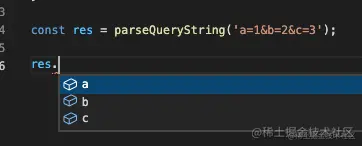

vs


这就是类型体操的意义之一：实现更精准的类型提示和检查。

## Promise.all
前面提到过，需要动态生成类型的场景，必然会用到类型编程，我们来看个例子。

Promise 的 all 和 race 方法的类型声明是这样的：

```Plain Text
interface PromiseConstructor {
    all<T extends readonly unknown[] | []>
        (values: T): Promise<{
            -readonly [P in keyof T]: Awaited<T[P]>
        }>;

    race<T extends readonly unknown[] | []>
        (values: T): Promise<Awaited<T[number]>>;
}

```
因为 Promise.all 是等所有 promise 执行完一起返回，Promise.race 是有一个执行完就返回。返回的类型都需要用到参数 Promise 的 value 类型：


所以自然要用类型编程来提取出 Promise 的 value 的类型，构造成新的 Promise 类型。

具体来看下这两个类型定义：

```Plain Text
interface PromiseConstructor {
    all<T extends readonly unknown[] | []>
        (values: T): Promise<{
            -readonly [P in keyof T]: Awaited<T[P]>
        }>;
}

```
类型参数 T 是待处理的 Promise 数组，约束为 unknown\[\] 或者空数组 \[\]。

这个类型参数 T 就是传入的函数参数的类型。

返回一个新的数组类型，也可以用映射类型的语法构造个新的索引类型（class、对象、数组等聚合多个元素的类型都是索引类型）。

新的索引类型的索引来自之前的数组 T，也就是 P in keyof T，值的类型是之前的值的类型，但要做下 Promise 的 value 类型提取，用内置的高级类型 Awaited，也就是 Awaited<T\[P\]>。

同时要把 readonly 的修饰去掉，也就是 -readonly。

这就是 Promise.all 的类型定义。因为返回值的类型和参数的类型是有关联的，所以必然会用到类型编程。

Promise.race 的类型定义也是这样：

```Plain Text
interface PromiseConstructor {
    race<T extends readonly unknown[] | []>
        (values: T): Promise<Awaited<T[number]>>;
}

```
类型参数 T 是待处理的参数的类型，约束为 unknown\[\] 或者空数组 \[\]。

返回值的类型可能是传入的任何一个 Promise 的 value 类型，那就先取出所有的 Promise 的 value 类型，也就是 T\[number\]。

因为数组类型也是索引类型，所以可以用索引类型的各种语法。


用 Awaited 取出这个联合类型中的每一个类型的 value 类型，也就是 Awaited<T\[number\]>，这就是 race 方法的返回值的类型。

同样，因为返回值的类型是由参数的类型做一些类型运算得到的，也离不开类型编程。

[试一下](https://link.juejin.cn/?target=https%3A%2F%2Fwww.typescriptlang.org%2Fplay%3Fts%3D4.5.0-beta%23code%2FJYOwLgpgTgZghgYwgAgApQPYFtgGcIDCGIuYUArgmBlMgN4BQyzycANmwDwAqyEAHpBAATXMigQ4w4mwCeyciADWIDAHcQAbQC6yAD7IdAPiYszACgBu7chFwAuZNwCUj9NjwROjM75YBaCSkZeU1UZFBkJQhZDBgnbUcAQTU4YEhhHjDtEz9mAF8jAG4GU2YoRC9eASFRcUlpEDkFZVUNHX1DHLLfKxs7Rxc3TBx8ThS0jKyQciwAI2gc4oZ80uEIBDY4CWQEYlJkAAcRz2GPfCISMkpqKBKGPavWDgAlO2QAXiOT-AA6djY5jCPwgvwkuAwbEsEHMAEZnAAaNAgsF2SHQ8wAJkRyPOoPB6JhAGZnNpnPdHgcKkg3mIvsc8WDKkD3KN8WioTD4UjWZ5URDOVicby-gTBSSyfcwLJDihwZ9DCKvLCjAilZxMar1USjNpNDN5osSkA "https://www.typescriptlang.org/play?ts=4.5.0-beta#code/JYOwLgpgTgZghgYwgAgApQPYFtgGcIDCGIuYUArgmBlMgN4BQyzycANmwDwAqyEAHpBAATXMigQ4w4mwCeyciADWIDAHcQAbQC6yAD7IdAPiYszACgBu7chFwAuZNwCUj9NjwROjM75YBaCSkZeU1UZFBkJQhZDBgnbUcAQTU4YEhhHjDtEz9mAF8jAG4GU2YoRC9eASFRcUlpEDkFZVUNHX1DHLLfKxs7Rxc3TBx8ThS0jKyQciwAI2gc4oZ80uEIBDY4CWQEYlJkAAcRz2GPfCISMkpqKBKGPavWDgAlO2QAXiOT-AA6djY5jCPwgvwkuAwbEsEHMAEZnAAaNAgsF2SHQ8wAJkRyPOoPB6JhAGZnNpnPdHgcKkg3mIvsc8WDKkD3KN8WioTD4UjWZ5URDOVicby-gTBSSyfcwLJDihwZ9DCKvLCjAilZxMar1USjNpNDN5osSkA")

这里 T 的类型约束为什么是 unknown\[\] | \[\] 也要专门讲一下：

ts 里有个 as const 的语法，加上之后，ts 就会推导出常量字面量类型，否则推导出对应的基础类型：

没有 as const 时：

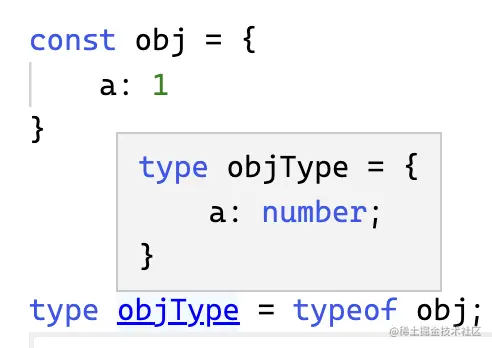

加上 as const 后：

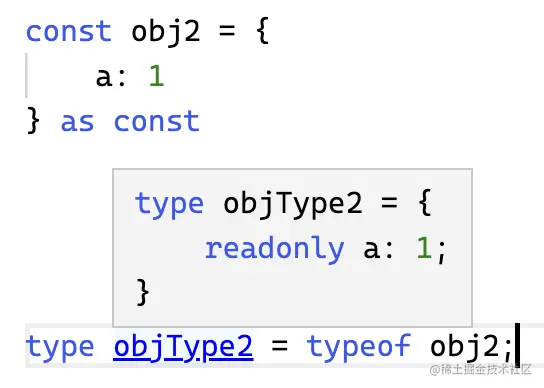

没有 as const 时：

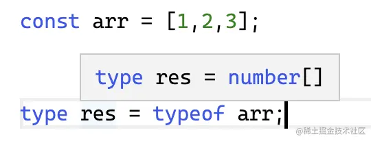

加上 as const 后：


这里类型参数 T 是通过 js 函数的参数传入的，然后取 typeof，也会遇到 as const 的这个问题，约束为 unknown\[\] | \[\] 就是 as const 的意思。


这个地方确实比较特殊，要记一下。

[试一下](https://link.juejin.cn/?target=https%3A%2F%2Fwww.typescriptlang.org%2Fplay%3Fts%3D4.5.0-beta%23code%2FCYUwxgNghgTiAEAzArgOzAFwJYHtXw0IB4AVeEADwxFWAGd44pg8IBPeNAa1RwHdUAbQC6APgAUANygRkIOgC54JAJRKSAbgBQWsHjoZG8%2BAF4ChcYICMAGngAmOwGZhK7TtCRYCFOmx5zDHtScioaeiNmVg5uXgEReAAfeBEJaVl5dTVldz1UAyM6e1NA%2B0tbB2dXXP1DHAAjACsSgG8teA74KCUrLQBfHQw2AAcEBsaSEYQzIdGcRHhxmvy6puKzNs6unv6uhjyDd1mxpsnR9YIp%2BcW15YLYGBLrG0cXQamumBgz6cu5hYed0MDwuz1ewj28AOGCOHwePwux2uII0QA "https://www.typescriptlang.org/play?ts=4.5.0-beta#code/CYUwxgNghgTiAEAzArgOzAFwJYHtXw0IB4AVeEADwxFWAGd44pg8IBPeNAa1RwHdUAbQC6APgAUANygRkIOgC54JAJRKSAbgBQWsHjoZG8+AF4ChcYICMAGngAmOwGZhK7TtCRYCFOmx5zDHtScioaeiNmVg5uXgEReAAfeBEJaVl5dTVldz1UAyM6e1NA+0tbB2dXXP1DHAAjACsSgG8teA74KCUrLQBfHQw2AAcEBsaSEYQzIdGcRHhxmvy6puKzNs6unv6uhjyDd1mxpsnR9YIp+cW15YLYGBLrG0cXQamumBgz6cu5hYed0MDwuz1ewj28AOGCOHwePwux2uII0QA")

## currying
做了一个参数类型和返回值类型有关系的案例，再来看一个更复杂点的：

有这样一个 curring 函数，接受一个函数，返回柯里化后的函数。

也就是当传入的函数为：

```Plain Text
const func = (a: string, b: number, c: boolean) => {};

```
返回的函数应该为：

```Plain Text
(a: string) => (b: number) => (c: boolean) => void

```
JS 怎么实现不用关注，我们只关注这个 curring 函数的类型怎么定义：

```Plain Text
declare function currying(fn: xxx): xxx;

```
明显，这里返回值类型和参数类型是有关系的，所以要用类型编程。

传入的是函数类型，可以用模式匹配提取参数和返回值的类型来，构造成新的函数类型返回。

每有一个参数就返回一层函数，具体层数是不确定的，所以要用递归。

那么，这个类型的定义就是这样的：

```Plain Text
type CurriedFunc<Params, Return> = 
    Params extends [infer Arg, ...infer Rest]
        ? (arg: Arg) => CurriedFunc<Rest, Return>
        : never;

declare function currying<Func>(fn: Func): 
    Func extends (...args: infer Params) => infer Result ? CurriedFunc<Params, Result> : never;

```
curring 函数有一个类型参数 Func，由函数参数的类型指定。

返回值的类型要对 Func 做一些类型运算，通过模式匹配提取参数和返回值的类型，传入 CurriedFunc 来构造新的函数类型。

构造的函数的层数不确定，所以要用递归，每次提取一个参数到 infer 声明的局部变量 Arg，其余参数到 infer 声明的局部变量 Rest。

用 Arg 作为构造的新的函数函数的参数，返回值的类型继续递归构造。

这样就递归提取出了 Params 中的所有的元素，递归构造出了柯里化后的函数类型。


[试一下](https://link.juejin.cn/?target=https%3A%2F%2Fwww.typescriptlang.org%2Fplay%3Fts%3D4.5.0-beta%23code%2FC4TwDgpgBAwgrgJwQSwgEwGJwHYGMA8ACgIYLEC2AzgDRQBKEwi2AfFALxQBQUvUJZKlAgAPYBGxpKUANrJsAMwgIoAQQQBzWgDpd8pSoaVgAXR58LAfigAKUhoBcazQEoObeElSYcBI8FoGJgRWcwteJ2wIADdlAG4uLjQIXAAbUmgFX2BkAHtsKFxEBBB5DXwsPBYbBWwnStwXJzCoBuExCSlbXW17Sid9ZX5SCko3djZBwwhKOFTgKGtPFHQGohGqQJm54DZImPjE3HzjKCy8DltiJ2MUbC0oACNIuHJH5VpcJ0fc3NSIYjYcZsADeAF8ElxjthTkUvKtfJc4SUyjVfC44kA "https://www.typescriptlang.org/play?ts=4.5.0-beta#code/C4TwDgpgBAwgrgJwQSwgEwGJwHYGMA8ACgIYLEC2AzgDRQBKEwi2AfFALxQBQUvUJZKlAgAPYBGxpKUANrJsAMwgIoAQQQBzWgDpd8pSoaVgAXR58LAfigAKUhoBcazQEoObeElSYcBI8FoGJgRWcwteJ2wIADdlAG4uLjQIXAAbUmgFX2BkAHtsKFxEBBB5DXwsPBYbBWwnStwXJzCoBuExCSlbXW17Sid9ZX5SCko3djZBwwhKOFTgKGtPFHQGohGqQJm54DZImPjE3HzjKCy8DltiJ2MUbC0oACNIuHJH5VpcJ0fc3NSIYjYcZsADeAF8ElxjthTkUvKtfJc4SUyjVfC44kA")

这个柯里化的函数类型定义，因为返回值的类型和参数的类型是有关系的，所以离不开类型编程。

## 总结
类型编程是对类型参数做一系列类型运算，产生新的类型。**需要对已有类型做修改，需要动态生成类型的场景，必然会用到类型编程**，比如 Promise.all、Promise.race、柯里化等场景。

有的时候不用类型编程也行，但用了类型编程**能够实现更精准的类型提示和检查**，比如 parseQueryString 这个函数的返回值。

这就是类型编程或者说类型体操的意义。

[本文的案例合并](https://link.juejin.cn/?target=https%3A%2F%2Fwww.typescriptlang.org%2Fplay%3Fts%3D4.5.0-beta%23code%2FPTAEAUEMCcGcFMCKBXe0CeBlALtAlgHYDmAUCdugA7wQwJTSQC2APA86PAB7bwEAmsULFyEiAPlABeUCVDzajJpx59BoAAYASAN6EAZmlABpeOgC%2BU3QaMA1SABtU5jXIXuA-KB1v3f0ADaxqCEJmYAugBcoPZONL5%2B5qDRAErwAMYA9tD8LCL4xAA0oJAE6OIA3GQU1KAAsmhE8LGosCwA8gTwxe3YABZokjIJnTTcvAJCvQPQsv7yXqMJ7tHTRuNqQsgEANYEmQDuBAHhy-NeAaPFAHS3a9Cn837Rl109-WjhVeRUNA3QTXYTDaIy6QJUE3UaSyOTyoiKJTK4kKIw%2B0HBG0moGh2Vy%2BTExVK5RIQ28bmg8Eg-EyBAc6ECpnpoR2Zky%2BlAo3BAB9QCz0GyOWigVE5gpGRDNrzWezOTBmGcFmF6Zj1HyBfcgQq-F5-k0WvA2rKlEEIu8ZkCTehwuItSsOWC5UxLY95tFxSqhGqZULHaKnoqNY7nX7-dEugA3NAkczVX6KBAoNBYeFEFg4WYe4Qp0kJdMSrHaPQEQyzIHmABk1mLRjSIhcWp1jXgQLaDHojrYjuR8aQqAw6bELFr2HENqe0TbzY76cqZH023S2DwNNAlDovaTA%2BIadw%2BfU%2BOI4gAFABHPvJ6DRdMASgn68T-ZTO%2Bgkiq84Ii%2BXBFX9-PW6Ip5-rg0QHkQ15ku4eDskeACEZ6bruXI8nBQHQNcDh8EQ-TgT4TwUtgyDQN%2BOjmFU7gxu4WQECIoDwRg7QAEYAFaRDisKgYSSLSN4pEJFRNF4LwwLcXRF7XLAlAOIJR4AOTljJ15kQognwMC1z6NkACikDpH0R4qcoUiSLh8z8dggR8sU4aOKg4TcQZ4mSdJMlSApSn%2BFBoCAUmjFMQEfLhDhtrKfoR4AILQIw6DXHgsARVF3n0cx-kRNeQX%2BvMom%2BSlVrXJQyCwHp1lxIpwXyEk8AOAgEEZX4WXJQF3EBPVfkBVZNnwC6GUUfMFVVTQJkZS1OV2TIxWoO5iQJOYpXuPhhHfi1VQxmQZmgLwIgAEzcWucAbo%2BBQATJkBSAAjOWDFSJt5bpFIADMblkE9IAQNAmRMLF8AAMI0vkyCLtkZCELw0D6DpNDgG9H0ID91G4P92DZDV8iOA4LAACp7kIFJUjSdKgNseyHMcdk8icY7zEe40GtE6O3q972fSwg3%2BgAtDj1K0vSATgCE35eqA6MimFByQCpuTozz1pauYs4JIw6TwBjWOgBzeP0oT%2BxHCcoBk9LTxUx1sC0-TkOMwgLAi2LvASwEBDIEwDGfKOy1kPwGQODANBrZQUOfROfsw798MA9A3xrajtY7YH8DXKjR48zH1wUrAmQOJGR6ndexRm9Dscp2nGebdnDN58nBqF-AR53degXh8Hqvg1HMi%2B%2Bb%2BfgwnuefeXqfp1XWc50nBd90exeD23PeV9XtelT8tQbeZMiJ23LCnciXcW5t68xywd3iOEdsO07DzfCQ7vpJ7FKgO%2Bn4rtg9-K5matcwTuxayTx7U8bgv0%2Bj9dw6rA03F77YATqdYom1ih3Trm7D2Xtr4LiXHfe%2Bm1H6qCxM-fGmtiY6z1p-I2Jtab-xoinbaMgQGbTARAqBMCSBrUyMxbiLNIDRFOtGWMtQGFMXRnGchvwBRcOIeZLhZDkYlFYdGEoQgzJPRqDQLhPDqCiLkQI5im0hElEik1cBkDoEcJoDAaAiiaB8OoAKQxGjDGiICDowo0CpGgDMt8ORmijG-GUfw9kVjvgvS%2BoRDAYh9GgD8ZFPA8B%2BAADEFydiULAYoaQCJERzO4FsKsAg2FmBFIgNxbgZOxAabAXVtReRgEQaIWTwJGWCf4sJkTonDnifARJBAKb%2BDDPASMYdYEX3gTfJB350j%2BPQIOKJH5jz6AINEUZ6R6YJGmSrI8tw44Am-nklslTJB5NrMgBw5kvAhPwOE6ZMTmBxPybAHZI5kigAjGgDRN9uJHhYVmQ6xQGJhiPmgYo6RogMUyGnSkBANk8Q0YM0JRyFzcTBQE4gR4b6KSAA "https://www.typescriptlang.org/play?ts=4.5.0-beta#code/PTAEAUEMCcGcFMCKBXe0CeBlALtAlgHYDmAUCdugA7wQwJTSQC2APA86PAB7bwEAmsULFyEiAPlABeUCVDzajJpx59BoAAYASAN6EAZmlABpeOgC+U3QaMA1SABtU5jXIXuA-KB1v3f0ADaxqCEJmYAugBcoPZONL5+5qDRAErwAMYA9tD8LCL4xAA0oJAE6OIA3GQU1KAAsmhE8LGosCwA8gTwxe3YABZokjIJnTTcvAJCvQPQsv7yXqMJ7tHTRuNqQsgEANYEmQDuBAHhy-NeAaPFAHS3a9Cn837Rl109-WjhVeRUNA3QTXYTDaIy6QJUE3UaSyOTyoiKJTK4kKIw+0HBG0moGh2Vy+TExVK5RIQ28bmg8Eg-EyBAc6ECpnpoR2Zky+lAo3BAB9QCz0GyOWigVE5gpGRDNrzWezOTBmGcFmF6Zj1HyBfcgQq-F5-k0WvA2rKlEEIu8ZkCTehwuItSsOWC5UxLY95tFxSqhGqZULHaKnoqNY7nX7-dEugA3NAkczVX6KBAoNBYeFEFg4WYe4Qp0kJdMSrHaPQEQyzIHmABk1mLRjSIhcWp1jXgQLaDHojrYjuR8aQqAw6bELFr2HENqe0TbzY76cqZH023S2DwNNAlDovaTA+Iadw+fU+OI4gAFABHPvJ6DRdMASgn68T-ZTO+gkiq84Ii+XBFX9-PW6Ip5-rg0QHkQ15ku4eDskeACEZ6bruXI8nBQHQNcDh8EQ-TgT4TwUtgyDQN+OjmFU7gxu4WQECIoDwRg7QAEYAFaRDisKgYSSLSN4pEJFRNF4LwwLcXRF7XLAlAOIJR4AOTljJ15kQognwMC1z6NkACikDpH0R4qcoUiSLh8z8dggR8sU4aOKg4TcQZ4mSdJMlSApSn+FBoCAUmjFMQEfLhDhtrKfoR4AILQIw6DXHgsARVF3n0cx-kRNeQX+vMom+SlVrXJQyCwHp1lxIpwXyEk8AOAgEEZX4WXJQF3EBPVfkBVZNnwC6GUUfMFVVTQJkZS1OV2TIxWoO5iQJOYpXuPhhHfi1VQxmQZmgLwIgAEzcWucAbo+BQATJkBSAAjOWDFSJt5bpFIADMblkE9IAQNAmRMLF8AAMI0vkyCLtkZCELw0D6DpNDgG9H0ID91G4P92DZDV8iOA4LAACp7kIFJUjSdKgNseyHMcdk8icY7zEe40GtE6O3q972fSwg3+gAtDj1K0vSATgCE35eqA6MimFByQCpuTozz1pauYs4JIw6TwBjWOgBzeP0oT+xHCcoBk9LTxUx1sC0-TkOMwgLAi2LvASwEBDIEwDGfKOy1kPwGQODANBrZQUOfROfsw798MA9A3xrajtY7YH8DXKjR48zH1wUrAmQOJGR6ndexRm9Dscp2nGebdnDN58nBqF-AR53degXh8Hqvg1HMi++b+fgwnuefeXqfp1XWc50nBd90exeD23PeV9XtelT8tQbeZMiJ23LCnciXcW5t68xywd3iOEdsO07DzfCQ7vpJ7FKgO+n4rtg9-K5matcwTuxayTx7U8bgv0+j9dw6rA03F77YATqdYom1ih3Trm7D2Xtr4LiXHfe+m1H6qCxM-fGmtiY6z1p-I2Jtab-xoinbaMgQGbTARAqBMCSBrUyMxbiLNIDRFOtGWMtQGFMXRnGchvwBRcOIeZLhZDkYlFYdGEoQgzJPRqDQLhPDqCiLkQI5im0hElEik1cBkDoEcJoDAaAiiaB8OoAKQxGjDGiICDowo0CpGgDMt8ORmijG-GUfw9kVjvgvS+oRDAYh9GgD8ZFPA8B+AADEFydiULAYoaQCJERzO4FsKsAg2FmBFIgNxbgZOxAabAXVtReRgEQaIWTwJGWCf4sJkTonDnifARJBAKb+DDPASMYdYEX3gTfJB350j+PQIOKJH5jz6AINEUZ6R6YJGmSrI8tw44Am-nklslTJB5NrMgBw5kvAhPwOE6ZMTmBxPybAHZI5kigAjGgDRN9uJHhYVmQ6xQGJhiPmgYo6RogMUyGnSkBANk8Q0YM0JRyFzcTBQE4gR4b6KSAA")