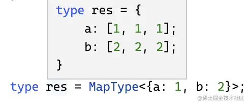
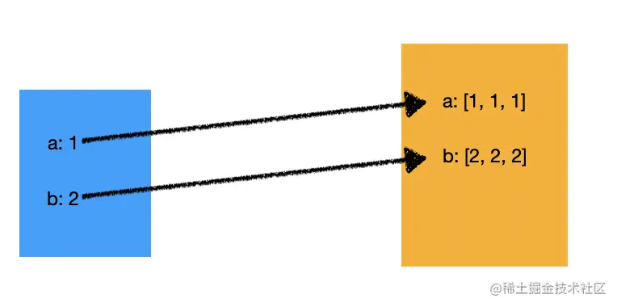
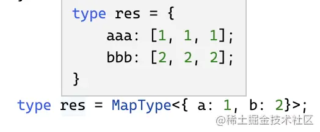
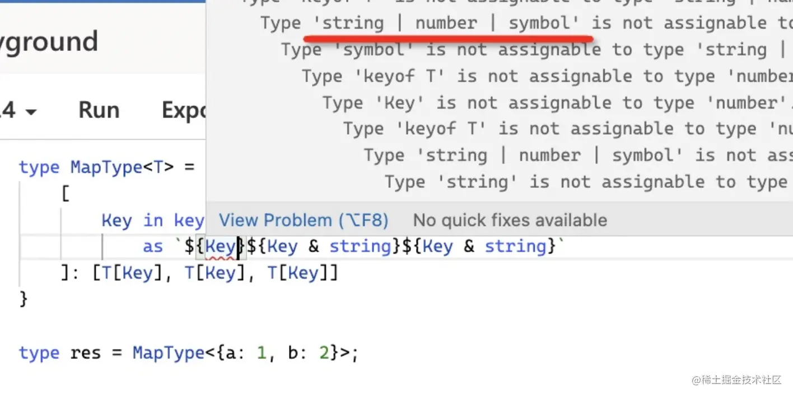

### 本资源由 itjc8.com 收集整理
# 4 TypeScript 类型系统支持哪些类型和类型运算？
学完前几节我们知道 TypeScript 给 JavaScript 加了一套静态类型系统，还支持了泛型和各种类型运算逻辑。

那么这个类型系统里都有哪些类型？支持哪些类型运算逻辑？

## TypeScript 类型系统中的类型
静态类型系统的目的是把类型检查从运行时提前到编译时，那 TS 类型系统中肯定要把 JS 的运行时类型拿过来，也就是 number、boolean、string、object、bigint、symbol、undefined、null 这些类型，还有就是它们的包装类型 Number、Boolean、String、Object、Symbol。

这些很容易理解，给 JS 添加静态类型，总没有必要重新造一套基础类型吧，直接复用 JS 的基础类型就行。

复合类型方面，JS 有 class、Array，这些 TypeScript 类型系统也都支持，但是又多加了三种类型：元组（Tuple）、接口（Interface）、枚举（Enum）。

### 元组
`元组（Tuple）`就是元素个数和类型固定的数组类型：

```Plain Text
type Tuple = [number, string];

```
### 接口
`接口（Interface）`可以描述函数、对象、构造器的结构：

对象：

```Plain Text
interface IPerson {
    name: string;
    age: number;
}

class Person implements IPerson {
    name: string;
    age: number;
}

const obj: IPerson = {
    name: 'guang',
    age: 18
}

```
函数：

```Plain Text
interface SayHello {
    (name: string): string;
}

const func: SayHello = (name: string) => {
    return 'hello,' + name
}

```
构造器：

```Plain Text
interface PersonConstructor {
    new (name: string, age: number): IPerson;
}

function createPerson(ctor: PersonConstructor):IPerson {
    return new ctor('guang', 18);
}

```
对象类型、class 类型在 TypeScript 里也叫做索引类型，也就是索引了多个元素的类型的意思。对象可以动态添加属性，如果不知道会有什么属性，可以用可索引签名：

```Plain Text
interface IPerson {
    [prop: string]: string | number;
}
const obj:IPerson = {};
obj.name = 'guang';
obj.age = 18;

```
总之，**接口可以用来描述函数、构造器、索引类型（对象、class、数组）等复合类型**。

### 枚举
`枚举（Enum）`是一系列值的复合：

```Plain Text
enum Transpiler {
    Babel = 'babel',
    Postcss = 'postcss',
    Terser = 'terser',
    Prettier = 'prettier',
    TypeScriptCompiler = 'tsc'
}

const transpiler = Transpiler.TypeScriptCompiler;

```
此外，TypeScript 还支持`字面量类型`，也就是类似 1111、'aaaa'、{ a: 1} 这种值也可以做为类型。

其中，字符串的字面量类型有两种，一种是普通的字符串字面量，比如 'aaa'，另一种是模版字面量，比如 `aaa${string}`，它的意思是以 aaa 开头，后面是任意 string 的字符串字面量类型。

所以想要约束以某个字符串开头的字符串字面量类型时可以这样写：


还有四种特殊的类型：void、never、any、unknown：

* **never** 代表不可达，比如函数抛异常的时候，返回值就是 never。
* **void** 代表空，可以是 undefined 或 never。
* **any** 是任意类型，任何类型都可以赋值给它，它也可以赋值给任何类型（除了 never）。
* **unknown** 是未知类型，任何类型都可以赋值给它，但是它不可以赋值给别的类型。

这些就是 TypeScript 类型系统中的全部类型了，大部分是从 JS 中迁移过来的，比如基础类型、Array、class 等，也添加了一些类型，比如 枚举（enum）、接口（interface）、元组等，还支持了字面量类型和 void、never、any、unknown 的特殊类型。

### 类型的装饰
除了描述类型的结构外，TypeScript 的类型系统还支持描述类型的属性，比如是否可选，是否只读等：

```Plain Text
interface IPerson {
    readonly name: string;
    age?: number;
}

type tuple = [string, number?];

```
## TypeScript 类型系统中的类型运算
我们知道了 TypeScript 类型系统里有哪些类型，那么可以对这些类型做什么类型运算呢？

### 条件：extends ? :
TypeScript 里的条件判断是 `extends ? :`，叫做条件类型（Conditional Type）比如：

```Plain Text
type res = 1 extends 2 ? true : false;

```


这就是 TypeScript 类型系统里的 if else。

但是，上面这样的逻辑没啥意义，静态的值自己就能算出结果来，为什么要用代码去判断呢？

所以，类型运算逻辑都是用来做一些动态的类型的运算的，也就是对类型参数的运算。

```Plain Text
type isTwo<T> = T extends 2 ? true: false;

type res = isTwo<1>;
type res2 = isTwo<2>;

```


这种类型也叫做`高级类型`。

**高级类型的特点是传入类型参数，经过一系列类型运算逻辑后，返回新的类型。**

### 推导：infer
如何提取类型的一部分呢？答案是 infer。

比如提取元组类型的第一个元素：

```Plain Text
type First<Tuple extends unknown[]> = Tuple extends [infer T,...infer R] ? T : never;

type res = First<[1,2,3]>;

```


注意，第一个 extends 不是条件，条件类型是 `extends ? :`，这里的 extends 是约束的意思，也就是约束类型参数只能是数组类型。

因为不知道数组元素的具体类型，所以用 unknown。

infer 在后面的章节会大量用到，这里先简单了解即可。

### 联合：｜
联合类型（Union）类似 js 里的或运算符 |，但是作用于类型，代表类型可以是几个类型之一。

```Plain Text
type Union = 1 | 2 | 3;

```
### 交叉：&
交叉类型（Intersection）类似 js 中的与运算符 &，但是作用于类型，代表对类型做合并。

```Plain Text
type ObjType = {a: number } & {c: boolean};

```


注意，同一类型可以合并，不同的类型没法合并，会被舍弃：


### 映射类型
对象、class 在 TypeScript 对应的类型是索引类型（Index Type），那么如何对索引类型作修改呢？

答案是`映射类型`。

```Plain Text
type MapType<T> = {
  [Key in keyof T]?: T[Key]
}

```
keyof T 是查询索引类型中所有的索引，叫做`索引查询`。

T\[Key\] 是取索引类型某个索引的值，叫做`索引访问`。

in 是用于遍历联合类型的运算符。

比如我们把一个索引类型的值变成 3 个元素的数组：

```Plain Text
type MapType<T> = {
    [Key in keyof T]: [T[Key], T[Key], T[Key]]
}

type res = MapType<{a: 1, b: 2}>;

```


[试一下](https://link.juejin.cn/?target=https%3A%2F%2Fwww.typescriptlang.org%2Fplay%3F%23code%2FC4TwDgpgBAsghmAKuCAeRA%2BKBeKBvAKCmKgG0BpCEKASwDsoBrKgewDMpEBdALjMQpUuAGk6CQIsZQlcCAXwIFQkKACcIAZxywEySKjxw%2BARlEAjPgCY5GANxA "https://www.typescriptlang.org/play?#code/C4TwDgpgBAsghmAKuCAeRA+KBeKBvAKCmKgG0BpCEKASwDsoBrKgewDMpEBdALjMQpUuAGk6CQIsZQlcCAXwIFQkKACcIAZxywEySKjxw+ARlEAjPgCY5GANxA")

**映射类型就相当于把一个集合映射到另一个集合，这是它名字的由来**。



除了值可以变化，索引也可以做变化，用 as 运算符，叫做`重映射`。

```Plain Text
type MapType<T> = {
    [
        Key in keyof T 
            as `${Key & string}${Key & string}${Key & string}`
    ]: [T[Key], T[Key], T[Key]]
}

```
我们用 as 把索引也做了修改，改成了 3 个 key 重复：



[试一下](https://link.juejin.cn/?target=https%3A%2F%2Fwww.typescriptlang.org%2Fplay%3F%23code%2FC4TwDgpgBAsghmAKuCAeRA%2BKBeKBvAKCmKgG0iTKBpCEKASwDsoBrWgewDMpEoLKBUOAGcoAAwAkeGnQBkUYcABOTAOYBfKTKjzFKxhq20dC5WvVj%2BUALoAuMolIzrAGh5Par98%2BsF1BAlBIKCUIUVx4JBRUPDh7AEY3ACN7ACZ1DABuIA "https://www.typescriptlang.org/play?#code/C4TwDgpgBAsghmAKuCAeRA+KBeKBvAKCmKgG0iTKBpCEKASwDsoBrWgewDMpEoLKBUOAGcoAAwAkeGnQBkUYcABOTAOYBfKTKjzFKxhq20dC5WvVj+UALoAuMolIzrAGh5Par98+sF1BAlBIKCUIUVx4JBRUPDh7AEY3ACN7ACZ1DABuIA")

这里的 & string 可能大家会迷惑，解释一下：

因为索引类型（对象、class 等）可以用 string、number 和 symbol 作为 key，这里 keyof T 取出的索引就是 string | number | symbol 的联合类型，和 string 取交叉部分就只剩下 string 了。就像前面所说，交叉类型会把同一类型做合并，不同类型舍弃。



因为 js 处理对象比较多，所以索引类型的映射比较重要。

## 总结
给 JavaScript 添加静态类型系统，那肯定是能复用的就复用，所以在 TypeScript 里，基础类型和 class、Array 等复合类型都是和 JavaScript 一样的，只是又额外加了接口（interface）、枚举（enum）、元组这三种复合类型（对象类型、class 类型在 TypeScript 里叫做索引类型），还有 void、never、any、unkown 四种特殊类型，以及支持字面量做为类型。此外，TypeScript 类型系统也支持通过 readonly、？等修饰符对属性的特性做进一步的描述。

此外，TypeScript 支持对类型做运算，这是它的类型系统的强大之处，也是复杂之处。

TypeScript 支持条件、推导、联合、交叉等运算逻辑，还有对联合类型做映射。

这些逻辑是针对类型参数，也就是泛型（类型参数）来说的，**传入类型参数，经过一系列类型运算逻辑后，返回新的类型的类型就叫做高级类型**，如果是静态的值，直接算出结果即可，没必要写类型逻辑。

这些语法看起来没有多复杂，但是他们却可以实现很多复杂逻辑，就像 JS 的语法也不复杂，却可以实现很多复杂逻辑一样。

后面我们会大量用到这些类型编程语法来实现各种复杂的类型逻辑。