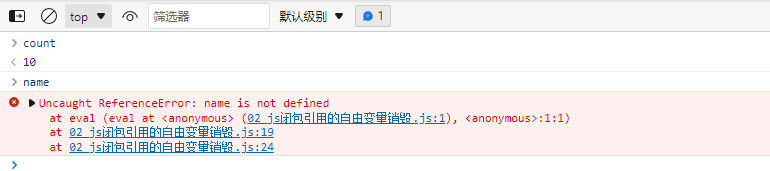

#### 内存管理的生命周期：

内存的管理都会有如下的生命周期： 

-  分配申请你需要的内存(申请)
-  使用分配的内存(存放一些东西，比如对象等)
-  不需要使用时，对其进行释放

通常情况下JavaScript是不需要手动管理的。

#### JS的内存管理

JS在定义变量时为我们分配内存。

- 对于基本数据类型内存的分配会在执行时，直接在栈空间进行分配
- 对于复杂数据类型内存的分配会在堆内存中开辟一块空间，并且将这块空间的指针返回值变量引用

#### JS的垃圾回收

对于那些不在使用的对象，都称为垃圾，需要回收，以释放更多的空间，垃圾回收器简称为GC

###### 常见的的GC算法-引用计数

当一个对象有一个引用指向它时，那么这个对象的引用就+1，当一个对象的引用为0时，这个对象就可以被销 毁掉 

缺点：容易产生循环引用

```js
var obj1 = {friend: obj2}
var obj2 = {friend: obj1}
```

###### 常见的的GC算法-标记清除

 这个算法是设置一个根对象（root object），垃圾回收器会定期从这个根开始，找所有从根开始有引用到的对象，对 于哪些没有引用到的对象，就认为是不可用的对象。

 这个算法可以很好的解决循环引用的问题 

 JS引擎比较广泛的采用的就是标记清除算法 

#### 作用域链

上一节有说过函数上下文包括三个部分

-  在解析函数成为AST树结构时，会创建一个Activation Object（AO）： AO中包含形参、arguments、函数定义和指向函数对象、定义的变量 
-  作用域链：由VO（在函数中就是AO对象）和父级VO组成，查找时会一层层查找 
-  this绑定的值 

#### 闭包

MDN对于闭包的解释

```
 一个函数和对其周围状态（lexical environment，词法环境）的引用捆绑在一起（或者说函数被引用包围），这样的组合就是闭包（closure）； 也就是说，闭包让你可以在一个内层函数中访问到其外层函数的作用域。在 JavaScript 中，每当创建一个函数，闭包就会在函数创建的同时被创建出来。
```

可以简单理解为：

 一个普通的函数function，如果它可以访问外层作用于的自由变量，那么这个函数就是一个闭包.

对于AO不使用的属性

当AO对象不被销毁时，并非里面的对象都不会被释放，如果在闭包中不访问的父级的变量则该变量会被销毁。

```js
function makeAdder(count) {
  let name = 'test'
  return function (num) {
    debugger
    return count + num
  }
}
const add10 = makeAdder(10)
console.log(add10(5))
console.log(add10(8))
```

上面代码在执行到断点中，打印count与name：



  ```
var bar = function () {
    myName ="time.geekbang.com",
    printName=function () {
        console.log(myName)
    }    
}
function foo() {
    let myName = "极客时间"
    return bar.printName
}
let myName = "极客邦"
let _printName = foo()
_printName()
bar.printName()
  ```

