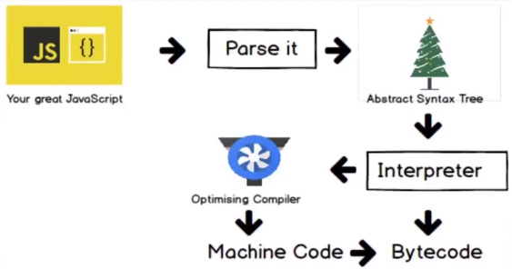

JS的开销和缩短解析时间

加载

- 压缩
- Code splitting 代码拆分，按需加载
- Tree shaking 代码减重

解析&编译

- 减少主线程工作量
  - 避免长任务
  - 避免超过1kb的行间脚本:合理规划首屏资源
  - 使用 `rAF`和 `rIC`进行时间调度


执行

V8编译原理：



V8优化机制：

- 脚本流
  - 正常的脚本是下载、解析编译的，如果下载的脚本超多30kb时，会新开一个线程对该脚本进行解析。
- 字节码缓存
  - 对于使用频率较高的代码会使用缓存
- 懒解析
  - 对于函数而言，只有真正用到函数时才会进行解析，之前只会懒解析（不需要创建语法树，不用在堆里面创建空间)

函数的解析方式：

- lazy parsing懒解析 vs eager parsing 饥饿解析

  - ```js
    export default () => {
        const add = (a, b) => a*b; // lazy parsing
        // const add = ((a, b) => a*b); // eager parsing
        const num1 = 1;
        const num2 = 2;
        add(num1, num2);
    }
    ```
- 加括号使用饥饿解析时在压缩代码(uglify,新版本已经解决)时括号可能会去掉，可以用Optimize.js
- 利用Optimize.js优化初次加载时间

对象优化：

- 以相同顺序初始化对象成员，避免隐藏类的调整

  - ```js
    class RectArea { // HC0 
        constructor(l, w) {
            this.l = l; // HC1
            this.w = w; // HC2
        }
    }

    const rect1 = new RectArea(3,4); // 创建了隐藏类HC0, HC1, HC2
    const rect2 = new RectArea(5,6); // 相同的对象结构，可复用之前的所有隐藏类


    const car1 = {color: 'red'}; // HC0
    car1.seats = 4; // HC1

    const car2 = {seats: 2}; // 没有可复用的隐藏类，创建HC2
    car2.color = 'blue'; // 没有可复用的隐藏类，创建HC3
    ```
- 实例化后避免添加新属性

  - ```js
    const car1 = {color: 'red'}; // In-object 属性
    car1.seats = 4; // Normal/Fast 属性，存储在property store里，需要通过描述数组间接查找 
    ```
- 尽量使用Array代替array-like对象

  - ```js
    Array.prototype.forEach.call(arrObj, (value, index) => { // 不如在真实数组上效率高
      console.log(`${ index }: ${ value }`);
    });

    const arr = Array.prototype.slice.call(arrObj, 0); // 转换的代价比影响优化小
    arr.forEach((value, index) => {
      console.log(`${ index }: ${ value }`);
    });
    ```
- 避免数组越界

  - ```js
    function foo(array) {
      for (let i = 0; i <= array.length; i++) { // 越界比较
        if(array[i] > 1000) { // 1.沿原型链的查找 2.造成undefined与数进行比较
            console.log(array[i]); // 业务上无效、出错
        }  
      }
    }

    ```
- 避免元素类型的转换

  - ```js
    const array = [3, 2, 1]; // PACKED_SMI_ELEMENTS

    array.push(4.4); // PACKED_DOUBLE_ELEMENTS
    ```

HTML优化：

- 减少 `iframes`使用,或延迟加载
- 压缩空白符
- 避免节点深层级嵌套
- 避免table布局
- 删除注释
- CSS&JavaScript尽量外链
- 删除元素默认属性

CSS的优化

- 降低CSS对渲染的阻塞
- **利用GPU进行完成动画**
- 使用contain实现： 允许开发者声明当前元素和它的内容尽可能的*独立*于 DOM 树的其他部分。这使得浏览器在重新计算布局、样式、绘图、大小或这四项的组合时，只影响到有限的 DOM 区域，而不是整个页面，可以有效改善性能。
- 使用font-display属性

JS操作DOM的优化

* 缓存dom查询结果
  ```js
  // 不缓存 DOM 查询结果
  for (let = 0; i < document.getElementsByTagName('p').length; i++) {
      // 每次循环，都会计算 length ，频繁进行 DOM 查询
  }

  // 缓存 DOM 查询结果
  const pList = document.getElementsByTagName('p')
  const length = pList.length
  for (let i = 0; i < length; i++) {
      // 缓存 length ，只进行一次 DOM 查询
  }
  ```
* 使用Fragment
  ```js
  const listNode = document.getElementById('list')

  // 创建一个文档片段，此时还没有插入到 DOM 树中
  const frag = document.createDocumentFragment()

  // 执行插入
  for(let x = 0; x < 10; x++) {
      const li = document.createElement("li")
      li.innerHTML = "List item " + x
      frag.appendChild(li)
  }

  // 都完成之后，再插入到 DOM 树中
  listNode.appendChild(frag)
  ```
