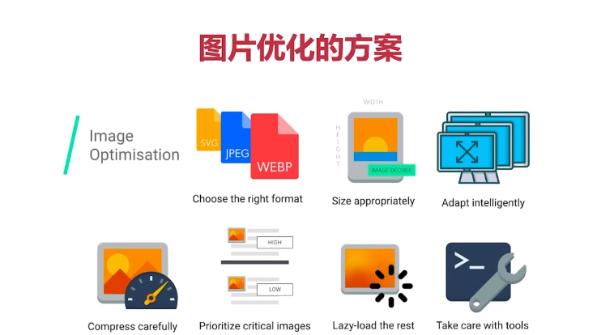
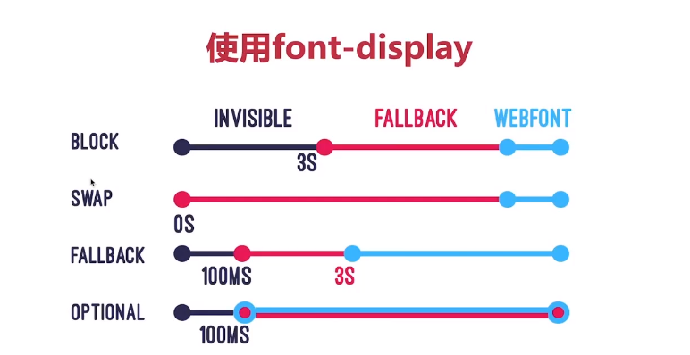

为什么要压缩&合并

- 减少http数量
- 减少请求资源的大小

HTML压缩：

- 使用在线工具进行压缩
- 使用html-minifier等npm工具

CSS压缩：

- 使用在线工具压缩
- 使用clean-css等npm工具(html-minifier有集成)

JS压缩与混淆：

- 使用在线工具进行压缩
- 使用Webpack对JS在构建时压缩

CSS JS文件合并：

 更主流的是分文件；

图片优化-图片格式优化

图片压缩网站：[imagemin](https://github.com/imagemin/imagemin)

图片加载优化

图片懒加载：

浏览器原生加载：在img标签加上loading="lazy"即可

使用插件：[react-lazy-load-image-component](https://github.com/Aljullu/react-lazy-load-image-component)

使用渐进时加载图片：

从低像素到高像素

使用响应式图片：

- Srcset属性的使用：若干图片，根据不同屏幕尺寸选择合适图片，配sizes属性使用
- 新元素picture的使用

字体优化

FOIT:文字从看不到到看到闪烁的变化

FOUT：为经样式修改的字体的闪烁

使用font-display：

 使用AJAX+Base64

缺点：缓存问题
