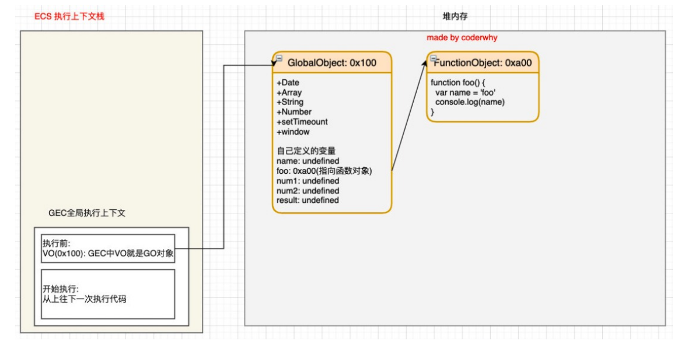
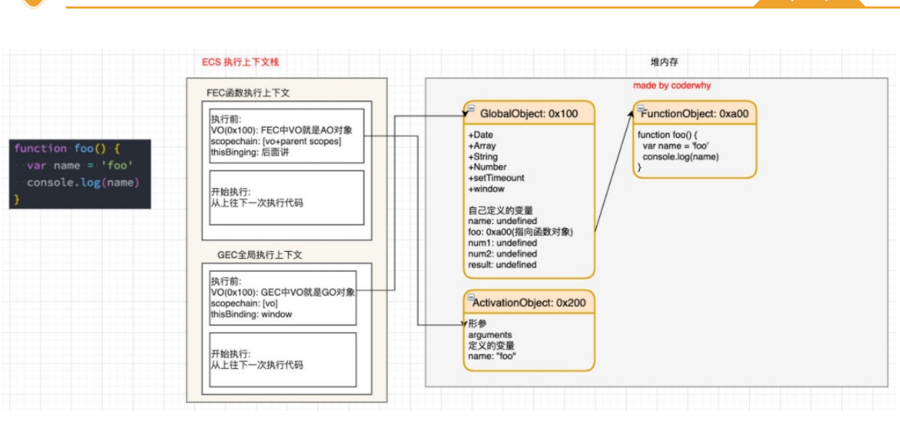

#### 浏览器内核和JS引擎的关系

以`webkit`为例子，`webkit`事实上有两部分组成：

- `WebCore`:负责HTML解析、布局、渲染等等相关工作
- `JavaSCriptCore`:解析、执行JavaScript代码（v8就是一个强大的`JS`引擎)

v8引擎的工作原理：


#### v8对于`js`的解析流程

[Parse模块](https://v8.dev/blog/scanner)（解析器）:  模块会将JavaScript代码转换成AST（抽象语法树），这是因为解释器并不直接认识JavaScript代码； 

[Ignition](https://v8.dev/blog/ignition-interpreter)(解释器), 会将AST转换成ByteCode（字节码）, 同时会收集TurboFan优化所需要的信息（比如函数参数的类型信息，有了类型才能进行真实的运算) 同时会收集TurboFan优化所需要的信息（比如函数参数的类型信息，有了类型才能进行真实的运算)

[TurboFan](https://v8.dev/blog/turbofan-jit)是一个编译器，可以将字节码编译为CPU可以直接执行的机器码 

**如果一个函数被多次调用，那么就会被标记为热点函数，那么就会经过`TurboFan`转换成优化的机器码，提高代码的执行性能;**

所以以下代码会造成性能问题：

```js
function sum(num1, num2) {
    return num1+num2
}
for(let i = 1; i < 100; i++) {
    sum(1,2)
}
sum('a', 'c')// 造成优化失效
```

机器码实际上也会被还原为`ByteCode`，这是因为如果后续执行函数的过程中，类型发生了变化（比如sum函数原来执行的是 number类型，后来执行变成了string类型 。所以使用`ts`对于项目也起到了一定的优化

#### V8的执行细节

parse过程：

- Blink将源码交给V8引擎，Stream获取到源码并且进行编码转换；
- Scanner会进行词法分析，词法分析会将代码转化成tokens
- 接下来token会被转化成AST树，经过`Parser`和`PreParser`：
  - Parser就是直接将token转成AST树结构
  -  PreParser称之为预解析 , V8引擎就实现了Lazy Parsing（延迟解析）的方案，它的作用是将不必要的函数进行预解析，也就是只解析暂 时需要的内容，而对函数的全量解析是在函数被调用时才会进行.
  -  比如我们在一个函数outer内部定义了另外一个函数inner，那么inner函数就会进行预解析 

代码的执行过程：

```js
// 示例代码
var name = 'why'
function foo() {
	var name = 'foo'
    console.log(name)
}
var num1 = 20
var num2 = 30
var result = num1 + num2
console.log(result)
foo()
```

` js`引擎会在执行代码之前，会在堆内存中创建一个全局对象：Global Object（GO )

-  该对象 所有的作用域（scope）都可以访问 
-  里面会包含Date、Array、String、Number、setTimeout、setInterval等等 
-  其中还有一个window属性指向自己； 

```js
Global Object {
    Date,
    Array,
    String,
    Number,
    window: Global Object 
}
```

##### 执行上下文（调用栈）

` js`引擎内部有一个执行上下文栈（Execution Context Stack，简称ECS），它是用于执行代码的调用栈 

在执行全局代码块时会构建一个Global Execution Context(GEC)，GEC会被放到ECS中执行

GEC被放入到ECS中里面包含两部分内容 

第一部分：在代码执行前，在parser转成AST的过程中，会将全局定义的变量、函数等加入到GlobalObject中， 但是并不会赋值

第二部分：在代码执行中，对变量赋值，或者执行其他的函数



遇到函数时执行： 在执行的过程中执行到一个函数时，就会根据函数体创建一个函数执行上下文（Functional Execution Context， 简称FEC），并且压入到EC Stack中 。

 FEC中包含三部分内容 ：

-  在解析函数成为AST树结构时，会创建一个Activation Object（AO）： AO中包含形参、arguments、函数定义和指向函数对象、定义的变量 
-  作用域链：由VO（在函数中就是AO对象）和父级VO组成，查找时会一层层查找 
-  this绑定的值 



##### 作用于提升面试题：

```js
var n = 100
function foo() {
  n = 200
}
foo()
console.log(n)// 200
```

```js
function foo() {
  console.log(n)// undefined
  var n = 200
  console.log(n) // 200
}

var n = 100
foo()
```

```js
var a = 100

function foo() {
  console.log(a) // undefined
  return
  var a = 200
}

foo()
```

```js
function foo() {
  var a = b = 10
  // => 转成下面的两行代码
  // var a = 10
  // b = 10
}

foo()

console.log(a)// ReferenceError
console.log(b)// 10
```

