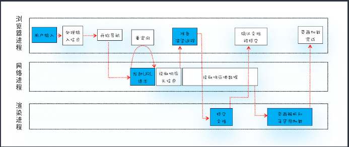
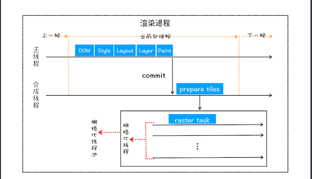
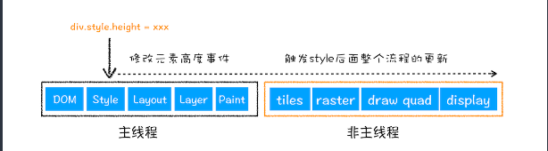

## 渲染流程

#### 从输入url到页面加载

这里主要从提交文档说起：

所谓提交文档，就是指浏览器进程将网络进程接收到的HTML数据提交给渲染进程

#### 渲染阶段：

* 构建DOM树：将HTML转换为DOM树
* 样式计算
  * css ----> stylesheet
  * 标准化 ---->e.g.: rem to px
  * 计算DOM树每个节点的样式
* 布局阶段（layout）
  * 创建布局树
  * 布局计算（计算坐标)
* 分层： 渲染引擎还需要为特定的节点生成专用的图层，并生成一棵对应的图层树
  * 第一点，拥有层叠上下文属性的元素会被提升为单独的一层。（position：fixed, z-index,filter: blue(5px),opacity:0.5)等，可以[参考这篇文章](https://developer.mozilla.org/zh-CN/docs/Web/Guide/CSS/Understanding_z_index/The_stacking_context)。
  * 第二点，需要剪裁（clip）的地方也会被创建为图层。（比如文字溢出）
* 图层绘制：将上面的图层绘制拆分成绘制指令
* 栅格化操作：实际的绘制有渲染引擎的合成线程来完成的，合成线程会按照视口附近的图块来优先生成位图，实际生成位图的操作是由栅格化来执行的。所谓栅格化，是指将图块转换为位图

通常，栅格化过程都会使用GPU来加速生成，使用GPU生成位图的过程叫快速栅格化，或者GPU栅格化，生成的位图被保存在GPU内存中。

* 合成与显示一旦所有图块都被光栅化，合成线程就会生成一个绘制图块的命令——“DrawQuad”，然后将该命令提交给浏览器进程。

重排与重绘与合成

重排：

重绘：

合成

在上图中，我们使用了CSS的transform来实现动画效果，这可以避开重排和重绘阶段，直接在非主线程上执行合成动画操作。这样的效率是最高的，因为是在非主线程上合成，并没有占用主线程的资源，另外也避开了布局和绘制两个子阶段，所以**相对于重绘和重排，合成能大大提升绘制效率**。
