### 信息系统基础

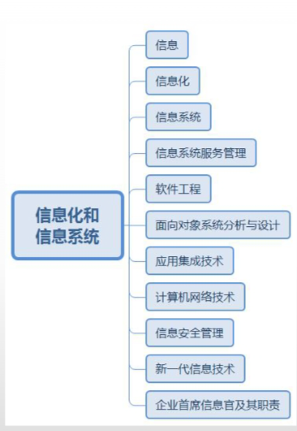

### 信息

信息的概念存在两个基本的层次，即**本体论层次**和**认识论层**次。前者是纯客观的层次，只与客体本身的因素有关，与主体的因素无关。后者是从主体立场来考察的信息层次，既与客体因素有关，又与主体因素有关。

##### 定量描述：

* 香农公式： 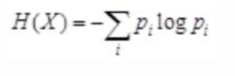
* 该公式的解释：H(X)表示X的信息熵，pi是事件出现第i种状态的概率，在
  二进制的情况下，对数的底是2，这是信息熵可以作为信息的度量，称为信息量，
  单位是比特（bit）。

##### 信息的质量属性

**精完可及经验安**

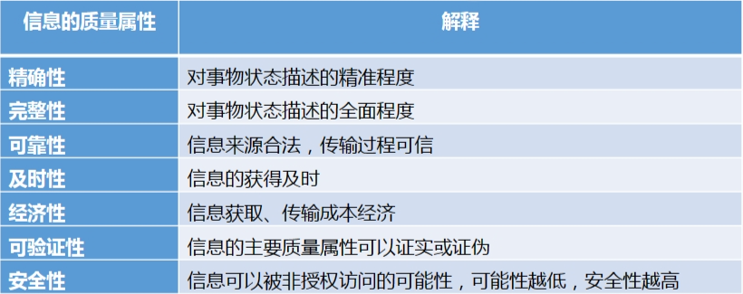

### 信息化

##### 信息化的含义：

**产企业国社**

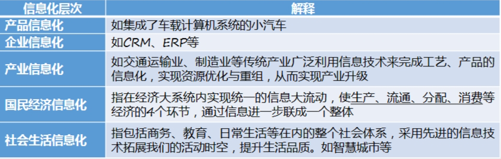

##### 信息化六要素

信息资源是核心、信息技术应用是龙头、信息网络是基础、信息技术和产业是国家信息化建设基础、信息化人才是关键、信息化政策法规和标准规范是保障，

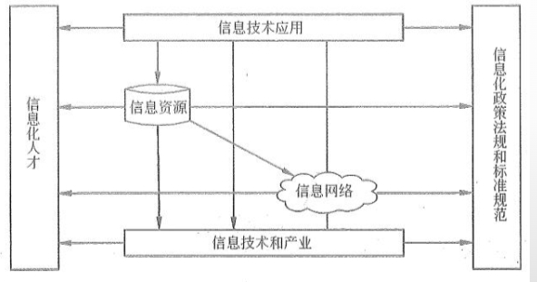

##### 国家信息化发展战略纲要

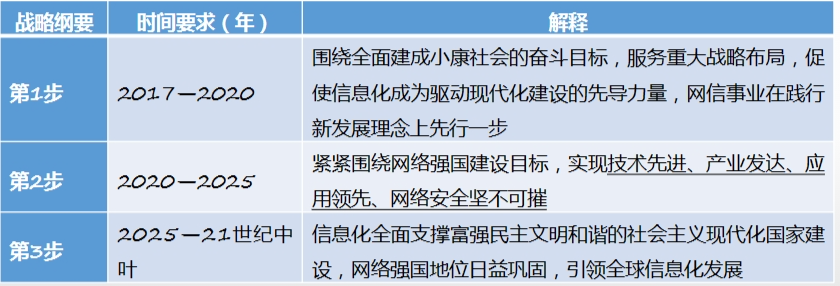

##### 两化融合的含义

* 信息化与工业化的融合
* 信息资源与材料、能源等工业资源的融合
* 是指虚拟经济与工业实体经济融合
* 是指信息技术与工业技术、IT设备与工业装备的融合

##### 电子政务

包括：G2G、G2B、G2C、G2E

##### 电子商务

* 凡使用了诸如电报、电话、广播、电视、传真以及计算机、计算机网络等手段、工具和技术进行商务活动，都可以称之为电子商务。
* EDI（电子数据交换）是连接原始电子商务和现代电子商务的手段

###### 电子商务类型

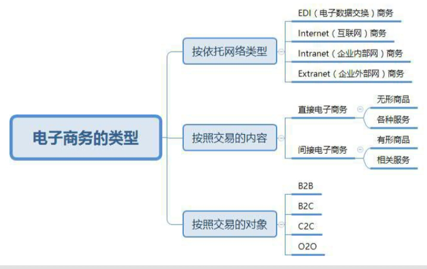

B2B是指企业和企业之间通过互联网进行产品、服务和信息的交换，它的发展经过了电子数据交换（EDI）、基本的电子商务、电子交易集市和协同商务4个
阶段，如阿里巴巴。
B2C是企业与消费者个人之间的电子商务，如京东、当当等。
C2C是指消费者与消费者之间通过电子商务交易平台进行交易的一种商务模式，如淘宝、易趣等。
O2O是指线上购买线下的的商品和服务，实体店提货或享受服务，特别适合餐饮、院线、会所等服务连锁企业。

##### 企业信息化

### 信息系统

是一种以处理信息为目的的专门的系统

##### 信息系统开发方法：

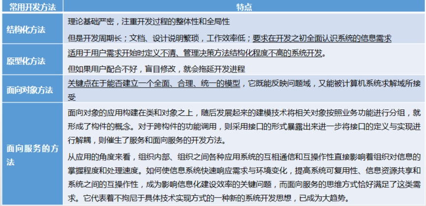

### 软件工程

##### 软件需求分析与定义

* 需求必须可以被验证
* 需求分析的目标：检测和解决需求之间的冲突、发现系统的边界、详细描述出系统需求。

##### 软件设计、测试与维护

* 软件设计：根据软件需求，产生一个软件内部结构的描述，并将其作为软件构造的基础。通过软件设计，描述出软件架构及相关组件之间的接口；然后，
  进一步详细地描述组件，以便能构成这些组件。
* 软件测试：为了评价和改进软件质量、识别产品的缺陷和问题而进行的活动。

##### 软件维护

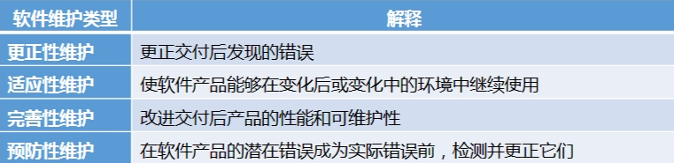

##### 软件质量保证及质量评价

* 软件质量包括内部质量、外部质量和使用质量三部分。
* 验证过程试图确保活动的输出产品构造正确，即活动的输出产品满足活动的规范说明。确认过程则试图确保构造了正确的产品，即产品满足其特定的目
  的。

##### 软件配置管理

* 软件配置管理活动包括：软件配置管理计划、软件配置标识、软件配置控制、软件配置状态记录、软件配置审计、软件发布管理与交付等活动。
* 配置库的权限设置。

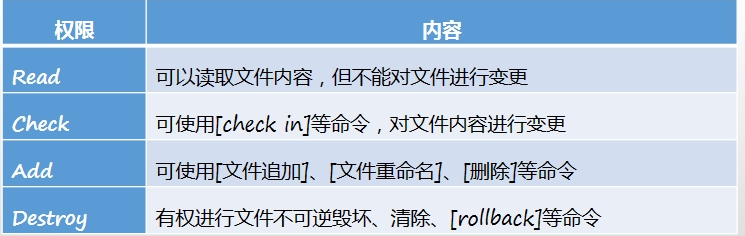

### 面向对象系统分析与设计

三要素：对象标识、对象状态、对象行为

对象是类的实例，类是对象的模板。如果将对象比作房子，类就是房子的设计图纸。

##### 统一建模语言与可视化建模

UML的5种视图：

* 用例视图：例试图定义系统的外部行为，定义了系统的需求，是描述系统设计和构建的其他视图的基础，即用例驱动。又叫用户模型视图
* 逻辑视图：逻辑视图描述逻辑结构，该逻辑结构支持用例视图描述的功能，它描述了问题空间中的概念以及实现系统功能的机制，如类、包、子系统等。又叫结构模型视
  图或静态视图。
* 实现视图：实现描述用于组建系统的物理组件，如可执行文件、代码库和数据库等系统程序员所看到的软件产物，是和配置管理以及系统集成相关的信息。也
  叫组件视图。
* 过程视图：过程视图描述将系统分解为过程和任务，以及这些并发元素之间的通信与同步。也叫并发视图、动态视图或者协作视图等
* 部署视图：述系统的物理网络布局，是系统工程师和网络工程师所感兴趣的。又叫物理视图。

##### UML

静态图：用例图、类图、对象图、组件图、配置图。
动态图：序列图、状态图、协作图、活动图

* 用例图，Use case diagram：描述系统的功能，由系统、用例和角色三种元素组成
* 类图：用来表示系统中的类以及类与类之间的关系，描述系统的静态结构，用于逻辑视图中。
* 对象图：对象图是类图的示例，表示在某一时刻这些类的具体实例以及这些实例之间的具体连接关系，可以帮助人们理解比较复杂的类图。
* 状态图： 主要用来描述对象、子系统、系统的生命周期。通过状态图可以了解一个对象可能具有的所有状态、导致对象状态改变的事件，以及状态转移引发的动作。
  状态图是对类描述的事物的补充说明，用在逻辑视图中描述类的行为。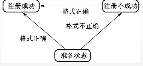
* 序列图：面向对象系统中对象之间的交互表现为消息的发送和接收。序列图反映若干个对象之间的动态协作关系，即随着时间的流逝，消息是如何在对象之间发送和
  接收的。序列图中重点反映对象之间发送消息的先后次序，常用在逻辑视图中。

    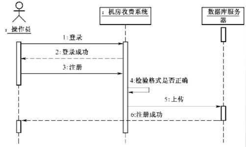	

* 协作图：主要描述协作对象之间的交互和连接。协作图和序列图同样反映对象间的动态协作，也可以表达消息序列，但重点描述交换消息的对象之间的关系，强调的
  是空间关系而非时间顺序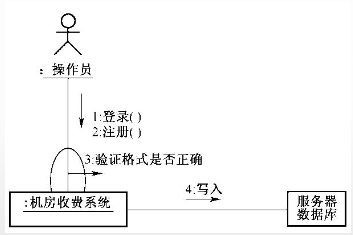
* 活动图：显示动作及其结果，着重描述操作实现中所完成的工作以及用例实例或对象中的活动。活动图中反映了一个连续的活动流，常用于描述一个操作执行过程中
  所完成的工作。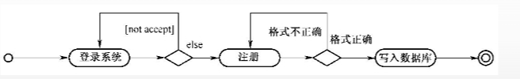
* 组件图： 来反映代码的物理结构，组件可以是源代码、二进制文件或可执行文件，包含逻辑类的实现信息。实现视图由组件图构成。
* 配置图： 配置图用来显示系统中软件和硬件的物理架构。图中通常显示实际的计算机和设备及其之间的关系。配置图用来构成配置视图，描述系统的实际物理结构。

### 应用集成技术

数据库与数据仓库技术

* 数据仓库是一个面向主题的、集成的、相对稳定的、反映历史变化的数据集合，用于支持管理决策

##### Web Service技术

用于传递信息的简单对象访问协议SOAP（Simple Object Access Protocol），用于描述服务的Web服务描述语言WSDL（Web Services Description Language），用于Web服务注册的统一描述、发现及集成规范UDDI（Universal Description, Discovery and Integration），用于数据交换的XML。

##### 软件中间件

* 中间件解决了分布系统的异构问题，具有标准的程序接口和协议
* 通常将中间件分为：
  * 数据库访问中间件，典型技术Windows平台的ODBC和Java平台的JDBC。
  * 远程过程调用中间件（RPC），从效果上来看和执行本地调用相同。
  * 面向消息中间件（MOM），进行平台无关的数据传递，典型如IBM的MQSeries
  * 分布式对象中间件，典型OMG的CORBA、Java的RMI/EJB、Microsoft的DCOM等。
  * 事务中间件，完成事务管理与协调、负载平衡、失效恢复等任务，典型IBM/BEA的Tuxedo、支持EJB的JavaEE应用服务器等。

##### 计算机网络

OSI七层协议：

* 应用层
* 表示层
* 会话层
* 传输层
* 网络层
* 数据链路层
* 物理层

### 信息安全管理

关键词：对称加密技术、非对称加密、Hash函数（对报文进行hash运算，得到hash码，即报文摘要，鉴别报文是否被篡改）、数据签名（发送方A用自己的私钥进行数字签名，接收方B用发送方A的公钥进行验证。这是因为A的私钥只有A才会拥有，发送者无法抵赖自己的签名。）

### 新一代信息技术

大数据特点：Volume（大量）、Velocity（高速）、Variety（多样）、Value（价值）、Veracity（真实性）

物联网

### 企业首席信息官及其职责

CFO：首席财务官	CTO：首席技术官
COO：首席运营官	CIO：首席信息官

练习题：

练习题
1、信息化的奠基者（）认为：信息是能够用来消除不确定性的东西。
A 香农										B 维纳
C 图灵										D冯•诺依曼

解析：香农是信息化的奠基者，维纳是控制论的创始人，图灵是计算机科学之
父、人工智能之父，冯•诺依曼是计算机之父。
答案：A

2、香农用概率来定量描述信息的公式如下，
其中，H（X）表示的意思是（ ）。
A信息熵		B概率	C比特	D字节

解析：公式的解释：H（X）表示X的信息熵，pi是事件出现第i种状态的概率，
在2进制的情况下，对数的底是2,此是信息熵可以作为信息的度量，称为信息量，
单位是比特（bit）。答案：A

3、信息的质量属性有7个，其中（ ）不是信息的质量属性。
A 精确性		B 及时性		C 安全性			D 鲁棒性

解析：信息的质量属性有7个，分别是：精确性、完整性、可靠性、及时性、经
济性、可验证性、安全性。
答案：D

4、信息化的层次从小到大有五层，其中产品信息化最小，它的下一层是（ ）。
A 国民经济信息化			B 产业信息化
C 企业信息化				D 社会生活信息化

解析：信息化的层次从小到大有五层，分别是：产品信息化、企业信息化、产
业信息化、国民经济信息化、社会生活信息化。
答案：C

5、关于两化融合，以下说法错误的是（ ）。
A 是指信息化与制造业发展战略的融合。
B 是指信息资源与材料、能源等工业资源的融合。
C 是指虚拟经济与工业实体经济融合。
D 是指信息技术与工业技术、IT设备与工业装备的融合。

解析：两化融合的含义有如下4条：
（1）是指信息化与工业化发展战略的融合。
（2）是指信息资源与材料、能源等工业资源的融合。
（3）是指虚拟经济与工业实体经济融合。
（4）是指信息技术与工业技术、IT设备与工业装备的融合。
答案：A

6、以下（ ）不是电子商务的类型。
A B2B		B G2C
C C2C		D O2O

解析：电子政务主要包括4个方面：G2G、G2B、G2C、G2E；电子商务的类型
主要包括：B2B、B2C、C2C、O2O。
答案：B

7、目前企业竞争中的“大”吃“小”，正在转向为（ ）。
A“快”吃“慢”		B “强”吃“弱”
C “紧”吃“松”		D “灵”吃“笨”

解析：目前企业竞争中的“大”吃“小”，正在转向为“快”吃“慢”。
答案：A

8、以下（ ）是常用的信息系统开发方法。
①结构化方法②原型法③面向对象方法④面向服务的方法
⑤瀑布模型
A ①②③④⑤			B ①②③④
C ①②③				D ①②

解析：常用的开发方法包括：结构化方法、原型法、面向对象方法、面向服务
的方法。
答案：B

9、企业信息化过程中有3个重要影响因素，分别为（ ）、业务流程与组织、信
息架构。
A 经营战略			B IT战略
C 信息技术行动计划		D 投资分析

解析：企业信息化过程中有3个重要影响因素：经营战略、业务流程与组织、信
息架构。
答案：A

10、某异地开发的信息系统集成项目以程序流程图、数据流程图等为主要分析
设计工具。由于用户身处异地，现场参与系统开发成本较高，因此项目组采用
了先开发一个简化系统，待用户认可后再开发最终系统的策略。该信息系统集
成项目的开发方法属于 （ ） 。
A 结构化方法与原型法的组合应用
B 结构化方法与面向对象方法的组合应用
C 原型法与面向对象方法的组合应用
D 原型法与形式化方法的组合应用

解析：结构化方法使用的主要分析设计工具是“程序流程图、数据流程图等”，
“先开发一个简化系统，待用户认可后再开发最终系统”是原型法的特点。所
以，该信息系统集成项目的开发方法属于“A 结构化方法与原型法的组合应
用”。
答案：A

11、随着互联网的普及，电子商务已经进入到人们日常生活，下列 （ ） 业务
全部属于电子商务的范畴。
①网上客服 ②电视购物 ③网上营销 ④电话交易 ⑤商场广播 ⑥网上调查
A ①②③④⑤⑥	B ①②③④⑤
C ①②③④⑥		D ①③④⑤⑥

解析： 全部都属于电子商务类型。
答案：A

12、2002年，《国家信息化领导小组关于我国电子政务建设指导意见》（中办
发〔2002〕17号）提出我国电子政务建设的12项重点业务系统，后来被称为
“十二金工程”。以下（ ）不属于“十二金工程”的范畴。
A 金关、金税		B 金宏、金财
C 金水、金土		D 金审、金农

解析：“为了提高决策、监管和服务水平，逐步规范政务业务流程，维护社会
稳定，要加快12个重要业务系统建设；继续完善已取得初步成效的办公业务资
源系统、金关、金税和金融监管（含金卡）4个工程，促进业务协同、资源整合；
启动加快建设宏观经济管理、金财、金盾、金审、社会保障、金农、金质和金
水8个业务系统工程建设。”
金土工程不属于“十二金工程”的范畴，因此应选C。
答案：C

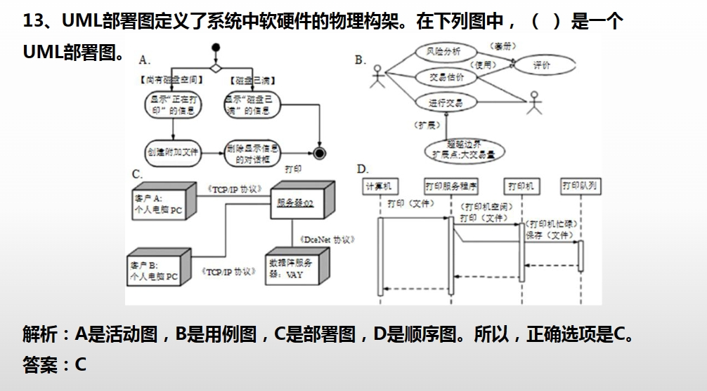

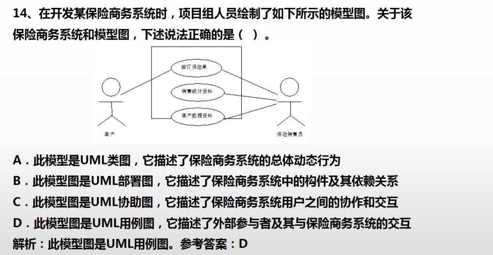

15、关于数据访问中间件的作用，下列说法错误的是 （ ） 。
A．为了建立数据应用资源互操作的模式，对异构环境下的数据库和文件系统实
现联接
B．用来屏蔽掉各种平台及协议之间的差异，进行相互通信，实现应用程序之间
的协同
C．在分布、异构的网络计算环境中，可以将各种分布对象有机地结合在一起，
完成系统的快速集成，实现对象重用
D．使调用远端的过程像调用本地过程一样

解析：A、B、C均为数据访问中间件的作用，D是远程过程调用中间件。
答案：D

16、有关NET框架的描述， （ ） 是错误的。
A．Visual Studio.NET是NET平台的开发工具
B．NET是ASP.NET的一个应用实例，是ASP.NET的一部分
C．NET框架兼容了COM/DCOM基础结构
D．通过Web Service技术可以实现NET与J2EE的互操作

解析：ASP.NET是. NET的一个应用实例，是.NET的一部分。
答案：B

17、UDDI、SOAP、WSDL、XML等是构成Web Service的重要技术，在
CORBA体系中与SOAP对应的是 （ ）。
A．ORPCB．IIOP
C．SOAD．EJB

解析：互联网内部对象请求代理协议IIOP是一个实现互操作性的协议，它使得
由不同语言编写的分布式程序在因特网中可以实现彼此的交流沟通。它是行业
战略性标准，也是公用对象请求代理程序结构中至关重要的一个部分。
参考答案：B
