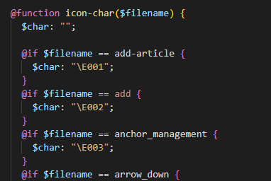

### 需求描述：

原本项目使用iconfont来管理字体图标库，但是由于iconfont经常上传文件失败，并且每次在更新icon的时候还需要重新再下载字体文件并且拷贝到项目当中，比较麻烦。能不能直接通过脚本去直接转化生成需要的字体图标，并且还能生成一个文档查看当前所有的图标。

### 第一步：将svg转化为字体图标

这一步可以用 `gulp-iconfont`来实现，[gulp-iconfont - npm (npmjs.com)](https://www.npmjs.com/package/gulp-iconfont?activeTab=readme)

注意这里用官网的DEMO会报错

```bash
[20:40:04] Task never defined: default
[20:40:04] To list available tasks, try running: gulp --tasks
 ELIFECYCLE  Command failed with exit code 1.
```

我的写法如下：

```js
const iconfont = require('gulp-iconfont');
const iconfontCss = require('gulp-iconfont-css')
const gulp = require('gulp')
const generatorIconHtml = require('./assets/templates/generate-icon-html')

function build(cb) {
  return gulp.src(['assets/icons/*.svg'])
    .pipe(iconfont({
      fontName: 'nimo-icon', // required
      prependUnicode: true, // recommended option
      formats: ['ttf', 'eot', 'woff', 'svg', 'woff2'], // default, 'woff2' and 'svg' are available
    }))
    .pipe(gulp.dest('src/assets/fonts/'));
}
exports.default = build;
```

这样，我们就得到了字体图标文件。

但是我们还需要一层映射：



此时我们可以使用 `gulp-iconfont-css` [gulp-iconfont-css - npm (npmjs.com)](https://www.npmjs.com/package/gulp-iconfont-css)

```js
const iconfont = require('gulp-iconfont');
const iconfontCss = require('gulp-iconfont-css')
const gulp = require('gulp')

function build(cb) {
  return gulp.src(['assets/icons/*.svg'])
    .pipe(iconfontCss({
      fontName: 'nimo-icon',
      path: 'assets/templates/icons.scss',
      // 输出的scss文件
      targetPath: './icons.scss',
    }))
    .pipe(iconfont({
      fontName: 'nimo-icon', // required
      prependUnicode: true, // recommended option
      formats: ['ttf', 'eot', 'woff', 'svg', 'woff2'], // default, 'woff2' and 'svg' are available
    }))
    .pipe(gulp.dest('src/assets/fonts/'));
}
exports.default = build;
```

css template文件，注意这个scss文件可能会报错，不用理会，因为后面是用 `consolidate`来进行渲染的。

```scss
@font-face {
	font-family: "nimoicon";
	src: url('#{$icon-url}.eot');
	/* IE9*/
  src :/* chrome、firefox */
  url('#{$icon-url}.woff') format('woff'),
  /* chrome、firefox、opera、Safari, Android, iOS 4.2+*/
  url('#{$icon-url}.ttf') format('truetype'),
  /* iOS 4.1- */
  url('#{$icon-url}.svg#nimo-icon') format('svg');
  font-display: swap;
}
%iconfont {
  display: inline-block;
  font-style: normal;
  vertical-align: baseline;
  text-align: center;
  text-transform: none;
  // line-height: 1;  // 打开会导致不能和文字对齐
  text-rendering: optimizeLegibility;
  -webkit-font-smoothing: antialiased;
  -moz-osx-font-smoothing: grayscale;
  &:before {
    display: block;
    font-family: 'nimoicon' !important;
  }
}
.#{$iconfont-prefix-cls} {
  @extend %iconfont;
}


@function <%= cssClass%>-char($filename) {
	$char: "";
<% _.each(glyphs, function(glyph) { %>
	@if $filename == <%= glyph.fileName %> {
		$char: "\<%= glyph.codePoint %>";
	}<% }); %>

	@return $char;
}

@mixin <%= cssClass%>($filename, $insert: before, $extend: true) {
	&:#{$insert} {
		content: <%= cssClass%>-char($filename);
	}
}

<% _.each(glyphs, function(glyph) { %>.#{$iconfont-prefix-cls}-<%= glyph.fileName %> {
	@include <%= cssClass%>(<%= glyph.originalFileName ? glyph.originalFileName : glyph.fileName %>);
}
<% }); %>
```

到这里第一步就完成了。

接下来进行第二步

### 第二步：写个插件生成HTML文件：

```js
/**
 * 生成目前已经有的Icon页面
 */
const Stream = require('stream')
const path = require('path')
const ejs = require('ejs')
const fs = require('fs')
const open = require('open')
function generatorIconfont(config) {
  const glyphMap = []
  let stream
  // Happy streaming
  stream = Stream.PassThrough({
    objectMode: true
  });
  // 收集svg
  stream._transform = function (file, unused, cb) {
    if (path.basename(file.path).endsWith('svg')) {
      const fileName = path.basename(file.path, '.svg').replace(/uE\w*-/, '');
      glyphMap.push(fileName);
    }
    cb();
  }
  stream._flush = function(cb) {
    ejs.renderFile('./assets/templates/index.html', {
      glyphMap
    }, (e, data) => {
      fs.writeFile('assets/icons/index.html', data, e => {
        open('assets/icons/index.html')
      })
    })
    cb()
  }
  return stream
}
module.exports = generatorIconfont;

```

再在gulp里面调用即可

```js
const iconfont = require('gulp-iconfont');
const iconfontCss = require('gulp-iconfont-css')
const gulp = require('gulp')
const generatorIconHtml = require('./assets/templates/generate-icon-html')

function build(cb) {
  return gulp.src(['assets/icons/*.svg'])
    .pipe(iconfontCss({
      fontName: 'nimo-icon',
      path: 'assets/templates/icons.scss',
      // 输出的scss文件
      targetPath: './icons.scss',
    }))
    .pipe(generatorIconHtml())
    .pipe(iconfont({
      fontName: 'nimo-icon', // required
      prependUnicode: true, // recommended option
      formats: ['ttf', 'eot', 'woff', 'svg', 'woff2'], // default, 'woff2' and 'svg' are available
    }))
    .pipe(gulp.dest('src/assets/fonts/'));
}
exports.default = build;
```

至此，大功告成！！！！
