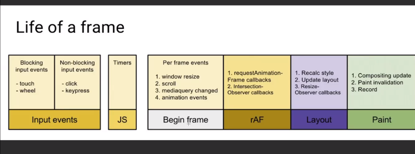
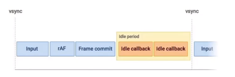
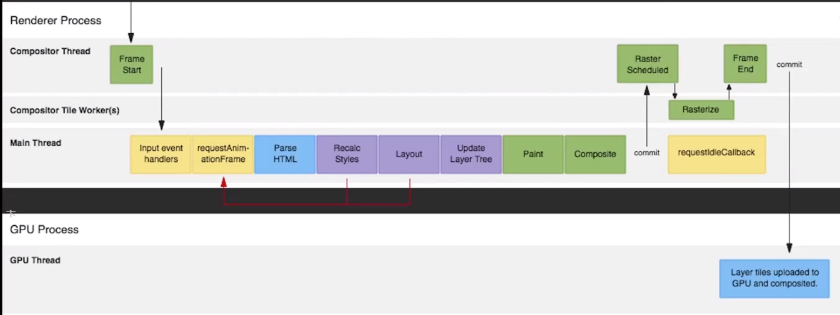

浏览器网页渲染原理——关键渲染路径

 JavaScript(触发视觉变化)--->style--->Layout--->Paint--->Composite

- 构建DOM树
- 构建CSSDOM树
- 根据DOM树与CSSDOM树合并为Render Tree（真正需要显示的东西留下）

布局(layout)与绘制(paint)：开销最高

- 渲染树只包含网页需要的节点
- 布局计算每个节点精确的位置和大小-''盒模型"
- 绘制是像素化每个节点的过程

布局关心的是位置和大小。绘制就是把节点挂到屏幕上。

修改背景颜色和阴影大小是不触发布局的，只会触发绘制。

常见影响回流(重排)的操作：

- 添加/删除元素
- 操作styles
- display：none
- offsetLeft，scrollTop，clientWidth
- 移动元素位置
- 修改浏览器大小，字体大小

避免布局抖动：

bad Example：

```js
// 获取页面的卡片元素
let cards = document.getElementsByClassName('card')
// 浏览器为了提高布局性能，会把修改布局属性的操作推迟，但是获取offsetTop属性时是无法推迟的，立即最新计算。
const update = (timestamp) => {
    for(let i = 0; i < cards.length; i++) {
        // 通过offsetTop计算修改width。连续的读写会导致连续的回流，就是布局抖动
        cards[i].style.width = ((math.sin(cards[i].offsetTop + timestamp/1000) + 1)*500)+'px'
    }
    window.requestAmimationFrams(update);
}
```

- 避免回流

  - 使用transform避免重绘重排

- 读写分离

  - 虚拟`dom`,
  - 批量处理([fastdom](https://github.com/wilsonpage/fastdom)),
    - fastdom.measuer:读操作
    - fastdom.mutate:写操作

  修改(批量修改) ：

  ```js
  // 获取页面的卡片元素
  let cards = document.getElementsByClassName('card')
  // 浏览器为了提高布局性能，会把修改布局属性的操作推迟，但是获取offsetTop属性时是无法推迟的，立即最新计算。
  const update = (timestamp) => {
      for(let i = 0; i < cards.length; i++) {
          // 读
          fastdom.measure(() => {
              let top = cards[i].offsetTop
              // 写
              fastdom.mutate(() => {
                   cards[i].style.width = ((math.sin(top + timestamp/1000) + 1)*500)+'px'
              })
          })
      }
      window.requestAmimationFrams(update);
  }
  ```

复合线程(compositor thread)与图层(layers)

复合做了什么：

- 将页面拆分图层进行绘制再进行复合
- 利用DevTools了解网页的图层拆分情况
- 哪些样式仅影响复合
  - position: `transform:translate(npx, npx);`
  - scale: `transform: scale(n)`
  - rotation: `transform: rotate(ndeg)`
  - Opacity: `opacity: 0...1`

使用：`willchange: transform`创建新图层

高频事假处理函数防抖



利用raf把一些操作做完再进行布局和绘制， 尽量达到60fps

再结合debounce

### React时间调度实现：

基本原理：

- `requestIdleCallback的问题`:兼容问题
- `通过rAF模拟rIC`



raf是在layout与paint之前触发的

ric是在layout与paint之后触发的(给主线程留下更多的时间)



