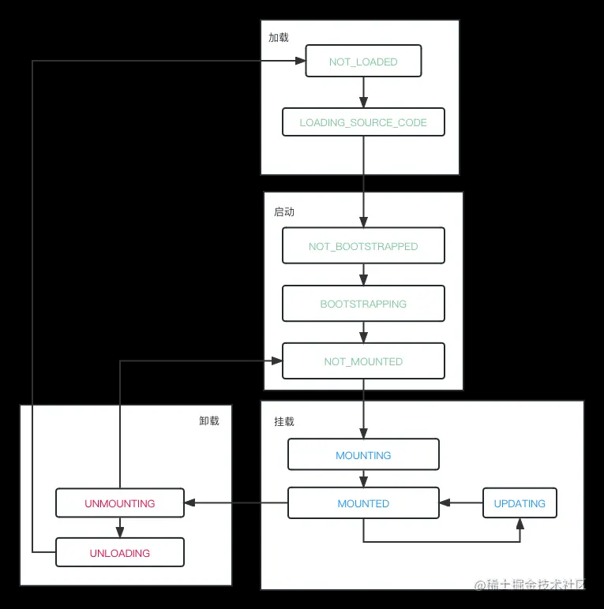

源码的解读思路以 `single-spa`导出的两个函数 `registerApplication`和 `start`为入口逐层分析的，我们先看看 `registerApplication`函数

### registerApplication

`registerApplication`这个函数的作用是注册子应用.

```js
export function registerApplication(
	appNameOrConfig,
	appOrLoadApp,
	activeWhen,
	customProps
) {
	// 格式化用户传递的参数，最终都是转换成一个config对象
	const registration = sanitizeArguments(
		appNameOrConfig,
		appOrLoadApp,
		activeWhen,
		customProps
	);

	// 判断应用是否已经注册过，非重点，不做分析
	if (getAppNames().indexOf(registration.name) !== -1)
		throw Error(
			formatErrorMessage(
				21,
				__DEV__ &&
				`There is already an app registered with name ${registration.name}`,
				registration.name
			)
		);

	// 将每个应用都存储到apps数组中
	apps.push(
		// 给每个应用添加一些默认的属性
		assign(
			{
				loadErrorTime: null,
				status: NOT_LOADED, // 应用的状态， 所有应用的状态都是从NOT_LOADED开始
				parcels: {},
				devtools: {
					overlays: {
						options: {},
						selectors: [],
					},
				},
			},
			registration
		)
	);

	// 判断浏览器环境
	if (isInBrowser) {
		// 判断是否需要加载jquery
		// ensureJQuerySupport(); 非重点，忽略分析
	
		reroute();
	}
}

```


`registerApplication`做了三件重要的事情：

1. 格式化用户传递的参数，最终都是转换成一个标准的config对象，类似的处理方式在很多库中都有，比如 `axios`，`vue-router`,`vue`等等
2. 给每个应用都添加一些默认的属性，比如 `status`等等，并添加到apps数组中存储起来
3. 判断浏览器环境，如果是浏览器环境，然后调用 `reroute`函数


#### sanitizeArguments准入函数

`sanitizeArguments`函数的作用是格式化用户传递的参数，最终都是转换成一个标准的config对象，这个函数的源码如下：

```js
function sanitizeArguments(
  appNameOrConfig,
  appOrLoadApp,
  activeWhen,
  customProps
) {
	// 判断传入的参数是对象还是参数列表
  const usingObjectAPI = typeof appNameOrConfig === "object";

  const registration = {
    name: null,
    loadApp: null,
    activeWhen: null,
    customProps: null,
  };

  if (usingObjectAPI) {
		// 校验参数对象
    validateRegisterWithConfig(appNameOrConfig);
    registration.name = appNameOrConfig.name;
    registration.loadApp = appNameOrConfig.app;
    registration.activeWhen = appNameOrConfig.activeWhen;
    registration.customProps = appNameOrConfig.customProps;
  } else {
		// 校验参数列表
    validateRegisterWithArguments(
      appNameOrConfig,
      appOrLoadApp,
      activeWhen,
      customProps
    );
    registration.name = appNameOrConfig;
    registration.loadApp = appOrLoadApp;
    registration.activeWhen = activeWhen;
    registration.customProps = customProps;
  }

	// 如果传入的loadApp不是一个函数，则返回一个函数，该函数返回一个Promise对象，该Promise对象的值为loadApp
  registration.loadApp = sanitizeLoadApp(registration.loadApp);
	// 如果没有传入customProps，则返回一个空对象
  registration.customProps = sanitizeCustomProps(registration.customProps);
	// 如果传入的activeWhen不是一个函数，则返回一个函数，该函数返回一个布尔值，该布尔值为activeWhen(location)的值
  registration.activeWhen = sanitizeActiveWhen(registration.activeWhen);

  return registration;
}

```


`sanitizeArguments`都是处理一些参数的格式化，比如 `loadApp`，`customProps`，`activeWhen`等等，最终实现我们的子应用的配置对象的准入，这个对象的结构大致如下：

```js
{
    name: 'singleChildVue1',
    loadApp: loadApp('http://localhost:4001', 'singleChildVue1'),
    activeWhen: location => location.pathname.startsWith('/child-vue1'),
    customProps: {
        data: {
            msg: 'hello single-spa1'
        }
    }
}

```


#### 给每个应用都添加默认的属性

在 `registerApplication`中，我们给每个应用添加了一些默认属性，这里我们只关注 `status`属性，这个属性是用来标识应用的状态的，默认值是 `NOT_LOADED`，表示应用是未加载状态，这个常量的定义如下：

```js
export const NOT_LOADED = "NOT_LOADED"; //初始状态 微应用的资源未加载
export const LOADING_SOURCE_CODE = "LOADING_SOURCE_CODE"; // 资源加载中
export const NOT_BOOTSTRAPPED = "NOT_BOOTSTRAPPED"; // 微应用未启动
export const BOOTSTRAPPING = "BOOTSTRAPPING"; // 微应用启动中
export const NOT_MOUNTED = "NOT_MOUNTED"; // 微应用未挂载
export const MOUNTING = "MOUNTING"; // 微应用挂载中
export const MOUNTED = "MOUNTED"; // 微应用已挂载
export const UPDATING = "UPDATING"; // 微应用更新中
export const UNMOUNTING = "UNMOUNTING"; // 微应用卸载中
export const UNLOADING = "UNLOADING"; // 微应用卸载资源中
export const LOAD_ERROR = "LOAD_ERROR"; // 微应用加载出错
export const SKIP_BECAUSE_BROKEN = "SKIP_BECAUSE_BROKEN"; // 微应用因为某些原因被跳过

```

抛开异常状态，我们的子应用状态有10个之多，可以分为四类：加载、启动、挂载、卸载，这四类状态的变化如下图所示




#### reroute函数

`reroute` 是 `single-spa` 中的核心方法。它的作用是根据当前的路由状态来确定哪些应用需要被加载、启动、挂载、卸载。`reroute` 函数的源码如下：

```js
export function reroute(pendingPromises = [], eventArguments) {
// 其他代码

	const {
		appsToUnload,
		appsToUnmount,
		appsToLoad,
		appsToMount,
	} = getAppChanges();
	let appsThatChanged,
		navigationIsCanceled = false,
		oldUrl = currentUrl,
		newUrl = (currentUrl = window.location.href);

	// 是否已经执行start方法
	if (isStarted()) {
      // appsThatChanged 是状态发生变化的 app
		appsThatChanged = appsToUnload.concat(
			appsToLoad,
			appsToUnmount,
			appsToMount
		);
		// 变动的app执行performAppChanges方法
		return performAppChanges();
	} else {
		appsThatChanged = appsToLoad;
		return loadApps();
	}
}

```

##### getAppChanges

`getAppChanges`函数的作用是根据当前的url找出状态需要改变的应用，这个函数的源码如下：

```js
export function getAppChanges() {
	// 需要被移除的应用
	const appsToUnload = [],
		// 需要被卸载的应用
		appsToUnmount = [],
		// 需要被加载的应用
		appsToLoad = [],
		// 需要被挂载的应用
		appsToMount = [];

	// We re-attempt to download applications in LOAD_ERROR after a timeout of 200 milliseconds
	const currentTime = new Date().getTime();

	apps.forEach((app) => {
		// 判断当前应用是否处于被激活状态
		const appShouldBeActive =
			app.status !== SKIP_BECAUSE_BROKEN && shouldBeActive(app);

		switch (app.status) {
			case LOAD_ERROR:
				if (appShouldBeActive && currentTime - app.loadErrorTime >= 200) {
					appsToLoad.push(app);
				}
				break;
			case NOT_LOADED:
			case LOADING_SOURCE_CODE:
				if (appShouldBeActive) {
					appsToLoad.push(app);
				}
				break;
			case NOT_BOOTSTRAPPED:
			case NOT_MOUNTED:
				if (!appShouldBeActive && getAppUnloadInfo(toName(app))) {
					// 需要被移除的应用
					appsToUnload.push(app);
				} else if (appShouldBeActive) {
					// 需要被挂载的应用
					appsToMount.push(app);
				}
				break;
			// 需要被卸载的应用，已经处于挂载状态，但现在路由已经变了的应用需要被卸载
			case MOUNTED:
				if (!appShouldBeActive) {
					appsToUnmount.push(app);
				}
				break;
			// all other statuses are ignored
		}
	});

	return { appsToUnload, appsToUnmount, appsToLoad, appsToMount };
}


```


应用分为四类：

* appsToLoad：需要被加载的应用，NOT_LOADED和LOADING_SOURCE_CODE状态下的应用，且当前应用应当被激活，会被push到该数组中
* appsToMount：需要被挂载的应用，NOT_MOUNTED和NOT_BOOTSTRAPPED状态下的应用，且当前应用应当被激活，会被push到该数组中
* appsToUnmount：需要被卸载的应用，MOUNTED状态下的应用，且当前应用未被激活，会被push到该数组中
* appsToUnload：需要被移除的应用，NOT_MOUNTED和NOT_BOOTSTRAPPED状态下的应用，如果应用未被激活，且应用应当被卸载，会被push到该数组中

应用是否被激活，是通过 `shouldBeActive`函数来判断的，这个函数的源码如下：

```js
// 当前应用是否是被激活状态
export function shouldBeActive(app) {
	try {
		return app.activeWhen(window.location);
	} catch (err) {
		handleAppError(err, app, SKIP_BECAUSE_BROKEN);
		return false;
	}
}

```


##### loadApps

`loadApps`函数的作用是加载应用，当我们注册函数的时候，`isStart()`为 `false`，当我们在 `main.js`中调用 `start`后，`isStart()`为 `true`,所以当我们打开 `localhost:8080`时，调用
注册应用函数时，会进入到 `loadApps`这个函数的逻辑，源码如下：

```js
  function loadApps() {
    return Promise.resolve().then(() => {
      const loadPromises = appsToLoad.map(toLoadPromise);

      return (
        Promise.all(loadPromises)
          .then(callAllEventListeners)
          // there are no mounted apps, before start() is called, so we always return []
          .then(() => [])
          .catch((err) => {
            callAllEventListeners();
            throw err;
          })
      );
    });
  }

```


其实，当前场景下，应为我们访问的是根路径，所以 `appsToLoad`未空数组，函数内部的逻辑，我们也不用关系，但是有个情况例外，当我们访问的是 `localhost:8080/child-vue1`时，`appsToLoad`就不是空数组了，而是我们的子应用 `child-vue1`，这个时候，我们就需要关心 `loadApps`函数的逻辑了，以及 `toLoadPromise`，这里我们不过多赘述，稍后在讲 `performAppChanges`函数的时候，会详细讲解 `toLoadPromise`函数的逻辑

**那么到目前为止，我们的注册函数 `registerApplication`的分析就告一段落了**

### start

接下来我们继续分析 `start`函数，`start`函数的源码如下：

```js
let started = false;

export function start(opts) {
	started = true;
	if (opts && opts.urlRerouteOnly) {
		setUrlRerouteOnly(opts.urlRerouteOnly);
	}
	if (isInBrowser) {
		reroute();
	}
}
export function isStarted() {
  return started;
}

```


`start`函数的作用是启动 `single-spa`，当我们调用 `start`函数时，会将 `started`设置为 `true`，并且会调用 `reroute`函数，`reroute`函数的作用是根据当前的url，来判断是否需要改变应用的状态，`reroute`的源码我们上面已经已经摘出来了，这里我们重点看下其中的以个判断逻辑如下：

```js
// 是否已经执行start方法
	if (isStarted()) {
      // appsThatChanged 是状态发生变化的 app
		appsThatChanged = appsToUnload.concat(
			appsToLoad,
			appsToUnmount,
			appsToMount
		);
		// 变动的app执行performAppChanges方法
		return performAppChanges();
	} else {
		appsThatChanged = appsToLoad;
		return loadApps();
	}

```


在 `reroute`函数中我们会判断 `isStarted()`是否为 `true`，如果为 `true`，则会执行 `performAppChanges`函数，如果为 `false`，则会执行 `loadApps`函数，因为 `started`已经修改为true,所以这里会进入 `performAppChanges`的逻辑，`performAppChanges`函数的源码：

```js
  function performAppChanges() {
	return Promise.resolve().then(() => {
	//...触发了一些事件

      // 将要被移除的应用
		const unloadPromises = appsToUnload.map(toUnloadPromise);

        // 将要被卸载的应用, 先卸载，再移除
		const unmountUnloadPromises = appsToUnmount
			.map(toUnmountPromise)
			.map((unmountPromise) => unmountPromise.then(toUnloadPromise));

		const allUnmountPromises = unmountUnloadPromises.concat(unloadPromises);

		// 所有应当被移除的应用
		const unmountAllPromise = Promise.all(allUnmountPromises);

		// 触发了一些事件

		/* We load and bootstrap apps while other apps are unmounting, but we
         * wait to mount the app until all apps are finishing unmounting
         */
        // 在其他应用被卸载的时，加载和启动应用，但是会等到所有的应用被卸载后，再去挂载应用
		const loadThenMountPromises = appsToLoad.map((app) => {
			return toLoadPromise(app).then((app) =>
				tryToBootstrapAndMount(app, unmountAllPromise)
			);
		});

		/* These are the apps that are already bootstrapped and just need
         * to be mounted. They each wait for all unmounting apps to finish up
         * before they mount.
         */
      // 有些应用已经被启动，只需要被挂载，他们会等待所有的应用被移除后，再去挂载
		const mountPromises = appsToMount
			.filter((appToMount) => appsToLoad.indexOf(appToMount) < 0)
			.map((appToMount) => {
				return tryToBootstrapAndMount(appToMount, unmountAllPromise);
			});
		return unmountAllPromise
			.catch((err) => {
				callAllEventListeners();
				throw err;
			})
			.then(() => {
				// 触发了一些事件

				return Promise.all(loadThenMountPromises.concat(mountPromises))
					.catch((err) => {
						pendingPromises.forEach((promise) => promise.reject(err));
						throw err;
					})
					.then(finishUpAndReturn);
			});
	});
}

```


`performAppChanges`的职责很明确，五个字概括就是：先卸货后装货那么我们先看下卸货的过程


#### 卸货

卸货我们看两个函数就可以，`toUnmountPromise`和 `toUnloadPromise`，源码如下：

```js
export function toUnmountPromise(appOrParcel, hardFail) {
	return Promise.resolve().then(() => {
		if (appOrParcel.status !== MOUNTED) {
			return appOrParcel;
		}
		// 修改状态，表示正在卸载
		appOrParcel.status = UNMOUNTING;

		// 不重要 忽略分析
		const unmountChildrenParcels = Object.keys(
			appOrParcel.parcels
		).map((parcelId) => appOrParcel.parcels[parcelId].unmountThisParcel());

		let parcelError;

		return Promise.all(unmountChildrenParcels)
			.then(unmountAppOrParcel, (parcelError) => {
				// There is a parcel unmount error 
              // 报错时的钩子函数
			})

		function unmountAppOrParcel() {
			// We always try to unmount the appOrParcel, even if the children parcels failed to unmount.
			return reasonableTime(appOrParcel, "unmount")
				.then(() => {
					if (!parcelError) {
						// 修改状态，表示已经卸载
						appOrParcel.status = NOT_MOUNTED;
					}
				})
		}
	});
}


```


`toUnmountPromise`函数的作用是将应用从 `MOUNTED`状态变为 `UNMOUNTING`状态，然后调用应用的 `unmount`钩子函数，最后将应用的状态修改为 `NOT_MOUNTED`

我们再看下 `toUnloadPromise`的源码，如下：

```js
export function toUnloadPromise(app) {
	return Promise.resolve().then(() => {
		const unloadInfo = appsToUnload[toName(app)];

		// 一些判断，忽略分析

        // 不重要 忽略分析
		const unloadPromise =
			app.status === LOAD_ERROR
				? Promise.resolve()
				: reasonableTime(app, "unload");

		// 修改状态，表示正在移除
		app.status = UNLOADING;

		return unloadPromise
			.then(() => {
				// 完成移除函数
				finishUnloadingApp(app, unloadInfo);
				return app;
			})
			.catch((err) => {
				errorUnloadingApp(app, unloadInfo, err);
				return app;
			});
	});
}
function finishUnloadingApp(app, unloadInfo) {
	delete appsToUnload[toName(app)];

	// Unloaded apps don't have lifecycles
	delete app.bootstrap;
	delete app.mount;
	delete app.unmount;
	delete app.unload;

	app.status = NOT_LOADED;

	/* resolve the promise of whoever called unloadApplication.
     * This should be done after all other cleanup/bookkeeping
     */
	unloadInfo.resolve();
}

```


该函数的作用是将应用从 `NOT_MOUNTED`状态变为 `NOT_LOADED`状态，我们回过头在看下卸货的流程，如下:

**MOUNTED -> UNMOUNTING -> NOT_MOUNTED -> UNLOADING -> NOT_LOADED**


#### 装货

我们再回顾下装货的核心代码：

```js
const loadThenMountPromises = appsToLoad.map((app) => {
			return toLoadPromise(app).then((app) =>
				tryToBootstrapAndMount(app, unmountAllPromise)
			);
		});

```

这里我们重点看下 `toLoadPromise`和 `tryToBootstrapAndMount`函数，源码如下：

```js
export function toLoadPromise(app) {
	return Promise.resolve().then(() => {
	// 一些判断。。。

		app.status = LOADING_SOURCE_CODE;

		let appOpts, isUserErr;

		return (app.loadPromise = Promise.resolve()
			.then(() => {
				const loadPromise = app.loadApp(getProps(app));
            
				// 一些判断。。。
			
				return loadPromise.then((val) => {
					app.loadErrorTime = null;

					appOpts = val;

					let validationErrMessage, validationErrCode;

					// 很多判断。。。

					// 设置app状态为未初始化，表示加载完成
					app.status = NOT_BOOTSTRAPPED;
					app.bootstrap = flattenFnArray(appOpts, "bootstrap");
					app.mount = flattenFnArray(appOpts, "mount");
					app.unmount = flattenFnArray(appOpts, "unmount");
					app.unload = flattenFnArray(appOpts, "unload");
					app.timeouts = ensureValidAppTimeouts(appOpts.timeouts);

					delete app.loadPromise;

					return app;
				});
			})
			.catch((err) => {
				// 加载出错，修改状态
				delete app.loadPromise;

				let newStatus;
				if (isUserErr) {
					newStatus = SKIP_BECAUSE_BROKEN;
				} else {
					newStatus = LOAD_ERROR;
					app.loadErrorTime = new Date().getTime();
				}
				handleAppError(err, app, newStatus);

				return app;
			}));
	});
}

```

`toLoadPromise`函数的作用是将应用从 `NOT_LOADED`状态变为 `LOADING_SOURCE_CODE`状态，然后加载应用的资源，最后将应用的状态修改为 `NOT_BOOTSTRAPPED`，并且将应用的生命周期函数挂载到应用上。 总结下就是：


### 总结

上面用了很大的篇幅一步步剖析 `single-spa`的源码，把整个流程串了一遍，说的通俗点就是： **监听路由+卸货+装货** ，但其实里面还有很多细节的处理值得我们深入学习。
