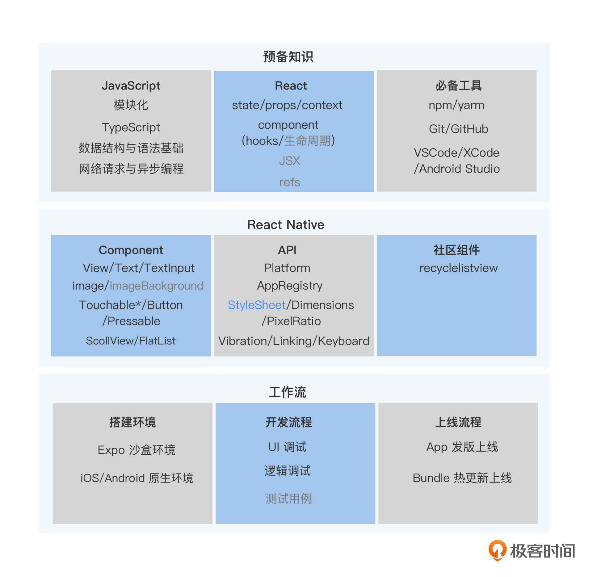

### 基础知识

那所谓的基础知识是什么呢？我认为能够满足开发业务的最小知识集合都是基础。比如，

语言、框架和一些编程的必备工具，还有 React Native 框架和社区提供的核心组件、核心API，再有就是熟悉工作流包括搭建环境、开发流程、上线流程，这些都是 React Native
的基础知识。

在这张知识地图中，我把知识分为了三类。
第一类是开发语言、React 框架、开发必备工具这些预备知识。虽然这些预备知识，并不是 React Native 本身的重点内容，但这些都是你在开发之前需要掌握的。

第二类知识是 React Native 本身的知识。组件是这类知识中的重点，包括框架提供的组件和社区提供的组件，这方面我会重点讲解。但 API 类的知识，本身比较简单，所以我只挑
选了样式内容和你进行讲解。至于其他 API 知识，你在用的时候，查查React Native官方文档就能很快学会了。

第三类知识是工作流中的实操知识。学习实操类知识最好的方法，其实是根据手册一步一步操作，所以这一块我不会细讲。但其中有些能帮你节约自己独立探索时间的经验类的知
