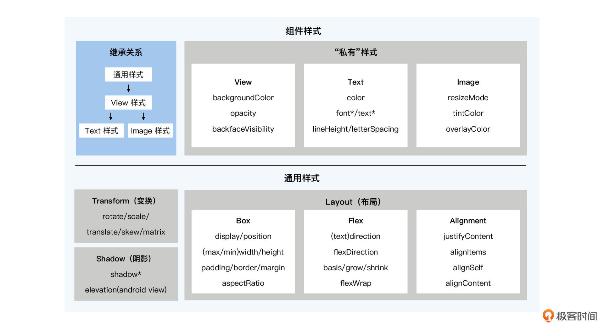

React Native 组件样式都有哪些？
React Native 的 Flex 布局有哪些特点？
React Native 样式代码如何管理？

### 组件样式

大部分 React Native 提供的框架组件都有样式属性，也就是 style 属性

```html
// 文字颜色
<Text style={{color:'red'}}>
// 圆角边框
<Text style={{borderColor:'green', borderWidth: 1, borderRadius: 5}}>
```

不过，不同组件的支持的样式可能会有些不同。比如，上面这段代码中，文字颜色 color只有 Text 和 TextInput 组件有，图片组件 Image 没有文字也不需要 color 样式。而边框
样式 border（比如 borderColor、borderWidth、boderRadius 等等），容器组件View、文字组件 Text、图片组件 Image 都有。


那我们怎么知道哪个组件都有哪些样式？要死记硬背吗？当然不用。

一方面，通过 TypeScript 声明文件，编辑器会提醒你某个组件都有哪些样式。另一方面，React Native 的组件样式是有规则的，你只需要把那些高频样式用会就可以了，其他低频
样式，等要用到的时候再翻文档也不迟。

组件样式是有继承关系的，可以分为三层：

* 第一层是通用样式；
* 第二层是 View 组件样式；
* 第三层是 Text、Image 等其他组件样式。

我把组件样式的三层继承规则整理成了一张图片，相信你看完之后会有更深刻的理解：
通用样式包括布局 Layout、变换 Transform 和阴影 Shadow。容器组件要不要展示归布局 Layout 管，位置确定后要往左边挪点还是旋转个角度归变换 Transform 管，要立体感
要加个阴影归 Shadow 管。View 组件样式继承了所有通用样式，包括布局 Layout、变换 Transform、阴影Shadow，除此之外，还有自己的“私有”样式，比如背景颜色 backgroundColor、透明
度 opacity、背面可见 backfaceVisibility。另外，Android API 28 以下用的阴影属性elevation 也是 View 的“私有”样式，为了记忆方便，你也可以将其归类到阴影 Shadow上。

大部分组件，比如 Text、Image 组件，都继承了 View 组件样式。因此 View 组件的背景色 backgroundColor、Android 低版本阴影 elevation 等“私有”样式，其实也可以算作
通用样式。但 Text 组件、Image 组件的“私有”样式，就不能相互通用了。文字颜色 color、字体大小 fontSize、文字行高 lineHeight，这些是文字组件独有的，图片组件就不能用。图片大
小模型样式 resizeMode 是图片独有的，文字组件也不能用。简而言之，组件样式 = 通用样式 + “私有”样式，View 组件样式可以算作通用样式，而Text 和 Image 组件各有各的“私有”样式。

#### Flex：跨平台、高性能、易上手

所有样式中，你用的最多一定是布局样式（Layout），而布局样式中大部分都是 Flex 相关的弹性布局。

React Native 在 2015 年诞生之初，就选择使用 Flex 作为默认的布局方式，到现在为止也仅仅只支持了 Flex 弹性盒子布局和 Absolute 绝对定位这两种布局方法。而 Flex 这种布局
方式，也经受住了时间的考验，得到更多开发者的认同。

下面是React Native 的 Flex 布局，先举三个例子：

##### 第一个例子，从上往下排列布局。

在同一个父容器中，放三个子容器 View，父容器不写任何的样式，子容器只给一个固定高度，三个子容器就是从上往下排列的。这里强调一下，父容器 VIew 的默认样式是

`{display:"flex",flexDirection:'column'`}。也就是说，父容器是弹性盒子，且主轴是纵轴，子元素会沿着纵轴（主轴）方向排列，因此在父元素不写任何样式时，子元素是从上
往下排列的。
示例代码如下：

##### 第二个例子，左图右文布局。

在同一个父容器中，放一个 Image 和一个 Text。为了让图片文字左右排列，我们需要给父容器设置布局样式 `{flexDirection: 'row'}`。为了让图片不拉伸变形，我们需要给
图片 Image 设置一个固定宽高。为了让文字将剩余宽度铺满，我们需要给文字 Text 设置 `{flex: 1}`。这时，父容器的主轴是横轴，子元素会沿着横轴（主轴）方向排列，整体布
局是左图右文。具体的代码如下：

```html
<View style={{flexDirection: 'row'}}>
<Image
  style={{width: 100, height: 100}}
  source={{
     uri: 'https://placeimg.com/640/480/cats',
  }}
/>
  <Text style={{flex: 1,fontSize: 18}}>我是文字</Text>
</View>
```

##### 第三个例子，文字居中布局。

曾经有一道经典的面试题，"父容器高度确定，使其子元素 Text 水平垂直方向居中"，不过自从有了 flex 后，这道题的难度降低了很多，问的频率也变低了。我们通过 `alignItems` 和` justifyContent `的配合，很容易实现水平垂直方向的居中布局，
示例代码如下：

```html
<View
  style={{
  alignItems: 'center',
  justifyContent: 'center',
  // 高度确定
  height: 60,
  borderWidth: 1,
 }}>
  <Text
    style={{
    fontSize: 18,
    // 文字默认内边距，会导致垂直居中偏下
    includeFontPadding: false,
    // 文字默认基于基线对齐，会导致垂直居中偏下
    textAlignVertical: 'center',
    }}>
      我是文字1
  </Text>
</View>
```

#### StyleSheet：分离、复用、性能好

在前面的几个例子中，我们写样式用的都是内联的方式。内联样式就是直接在 JSX 的元素属性中写样式，这样写起来是很方便，但是却把 JSX 的元素结构和样式混在一起了。
既然样式属性可以内联，那事件属性也可以内联，甚至所有的属性都可以内联。而且现在JSX 模板既要声明元素结构，又要写样式、事件、属性逻辑，整一个大杂烩。写起来是很
爽，但维护起来就很“酸爽”了。
此外，内联样式还存在不能复用，性能损耗的问题。首先，即便两个文字组件的样式是一样的，内联样式也不能重复使用，必须在两个组件中各写一套。其次，每次执行自定义组
件函数生成元素时，或实例化元素时，样式对象都要重复创建，这导致了性能损耗。

推荐使用StyleSheet：

* 元素结构和样式分离，可维护性更好；
* 样式对象可以复用，能减少重复代码；
* 样式对象只创建一次，也减少性能的损耗。

```jsx
// JSX 结构
<View
hitSlop={hitSlop}
onLayout={handleLayout}
style={styles.container}>
<Text style={styles.texts}>我是文字1</Text>
<Text style={styles.texts}>我是文字2</Text>
</View>
// 样式表
const styles = StyleSheet.create({
container: {
alignItems: 'center',
justifyContent: 'center',
height: 60,
borderWidth: 1,
},
texts: {
fontSize: 18,
includeFontPadding: false,
textAlignVertical: 'center',
}
});

```

React Native 的样式其实很简单，所有的核心样式在的源码中只有 1 份声明文件[StyleSheetTypes]()
