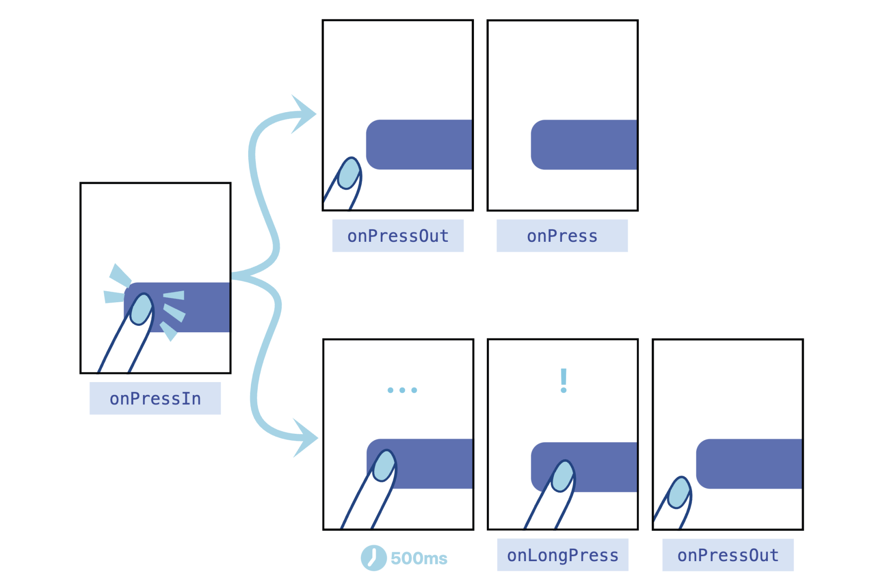

下面以三个问题为脉络进行讲解：

* 点按组件是要简单易用还是要功能丰富，如何取舍？
* 点按组件是如何知道它是被点击了，还是被长按了？
* 点按组件为什么还要支持用户中途取消点击？

通过这三个问题，你不仅能明白如何在 React Native 中实现一个体验好的点按组件，同时也能借助它背后的设计原理，更“懂”用户，提升产品的用户体验。
要简单易用还是功能丰富？
首先，点按组件是设计给你我这样的开发者来使用的，它功能越简单开发者用起来就越简单，它功能越复杂就能满足更多的需求场景。那是让开发者简单易用好，还是用丰富的功
能去满足用户，有没有两全其美之计？
实际上，React Native 的点按组件经历了三个版本的迭代，才找到了两全其美的答案。等你了解了这个三个版本的迭代思路后，你就能很好明白优秀通用组件应该如何设计，才能
同时在用户体验 UX 和开发者体验 DX 上找到平衡。
我先给你从第一代点按组件开始讲起。

### 按钮组件的发展

#### 第一代Touchable组件

第一代点按组件想要解决的核心问题是，提过多种反馈风格。

第一代 Touchable 点按组件的设计思路是，提供多种原生平台的反馈风格给开发者自己选择。框架提供了 1 个基类和 4 个扩展类，它们分别是：

* TouchableWithoutFeedback：用于响应用户的点按操作，但不给出任何点按反馈效果。反馈效果由 4 个扩展类实现；
* TouchableNativeFeedback：给出当前原生平台的点按反馈效果，在 Android 中是涟漪（ripple）效果，就是从点击处散开水波纹的效果；
* TouchableOpacity：短暂地改变组件的透明度；
* TouchableHighlight：短暂地加深组件的背景色；
* TouchableBounce：有 bounce 回弹动画的响应效果。

Touchable 点按组件提供了 5 个类，选择起来也很麻烦。有经验的开发者可能知道如何进行选择，但新手却要花上很长时间，去了解不同组件之间的区别。所以说，Touchable 点
按组件在提供多样性的功能支持的同时，也带来了额外的学习成本。

为了降低学习成本，React Native 团队又开发了第二代点按组件，Button。

#### 第二代Button组件

二代 Button 组件的实质是对 Touchable 组件的封装。在 Android 上是TouchableNativeFeedback 组件，在 iOS 上是 TouchableOpacity 组件。

Button 组件虽然降低了开发者选择成本，但是想在 UI 风格上让大家选择都原生平台自身的风格，这太难了。因此，React Native 团队又开发了第三代点按组件 Pressable。

#### 第三代Pressable组件

第三代 Pressable 点按组件，不再是 Touchable 组件的封装，而是一个全新重构的点按组件，它的反馈效果可由开发者自行配置。

但是，点按组件通常是有点击和未点击两种状态的，这两种状态对应着两种点按样式，一种样式是未点击时的基础样式，一种是点按后的反馈样式。这两种样式怎么写？又该怎么
切换？

Pressable 组件的 API 设计得很是巧妙，扩展起来非常方便。Pressable 的样式 style 属性同时支持固定样式，和函数返回的“动态样式”：

```typescript
type PressableStyle = ViewStyle | (({ pressed: boolean }) => ViewStyle)
```

其一，固定样式，也就是type PressableStyle = ViewStyle的意思是，Pressable组件的支持样式类型和 View 组件的支持样式类型是一样的，具体ViewStyle都包括那
些“通用”样式和“私有”样式，我们在Style中已经学过了，相信你能很快回想起来。

其二，动态样式，也就是type PressableStyle = (({ pressed:boolean})=>ViewStyle)的意思是，在用户没有点击时 pressed 值为 false，在用户点击时pressed值为 true，你可以根据两种点按状态，为按钮定制不同的样式。

具体怎么实现呢？我们先来看固定样式。固定样式，顾名思义，就是按钮组件的样式是“固定”的，比如你可以看下这段代码：

```typescript
/ 固定的基础样式
const baseStyle = { width: 50, height: 50, backgroundColor: 'red'}
<Pressable
onPress={handlePress}
style={baseStyle} >
<Text>按钮</Text>
</Pressable>
```

这段示例代码就是一个最简单的固定样式按钮的代码片段。我们在 Pressable 元素中嵌套了一个文字是“按钮”的 Text 元素，并给 Pressable 元素添加了一个固定的基础样式，宽高各位 50 像素，且背景颜色为红色。

那如果我们需要实现动态样式，应该怎么实现呢？比如，你想在所有平台都实现降低透明度的点击反馈，那你可以定义一个基础样式 baseStyle，然后通过点按状态 pressed ，管
理透明度 opacity 的切换。具体的代码示例如下：

```typescript
// 固定的基础样式
const baseStyle = { width: 50, height: 50, backgroundColor: 'red'}
<Pressable
onPress={handlePress}
style={({ pressed }) => [ /* 动态样式 */
baseStyle,
{ opacity: pressed ? 0.5 : 1}
]} >
<Text>按钮</Text>
</Pressable>
```

这段示例代码用的就是 Pressable 的动态样式。首次渲染时，React Native 会先调用一次Pressable 的 style 属性的回调函数，这时点按状态 pressed 是 false，透明度为 1。在你
触碰到“按钮”时，就会触发点击事件 onPress，与此同时，React Native 会再调用一次style 属性的回调函数，此时点按状态 pressed 是 true，透明度为 0.5。在你松开“按
钮”后，透明度会重新变为 1。

你可以看到，使用动态样式来实现降低透明度的点击反馈是非常方便的。除了改变透明度，你还可以选择改变背景色，改变按钮的宽高，甚至还可以把“按钮”的文字改了。你
看，动态样式是不是非常灵活？除了这两点，你可能还会问，如果我想实现 Android 平台特有的涟漪效果，Pressable 组件也能实现吗？可以，你可以使用 android_ripple 和 android_disableSound 属性进行配置。

* android_ripple：用于配置 Android 特有的涟漪效果RippleConfig ；
* android_disableSound：禁用 Android 系统的点击音效，默认 false 不禁用。

### 如何知道是点击，还是长按？

我们知道，开始响应事件和结束响应事件是两个最基础的手势事件，在 Android、iOS 或者 Web 中都有类似的事件。在 React Native 中它们是：

* onResponderGrant：开始响应事件，用户手指接触屏幕，且该手势被当前组件锁定后
  触发；
* onResponderRelease：结束响应事件，用户手指离开屏幕时触发。

你可以在 Pressable 组件中，使用 onPressIn 来响应开始点按事件，使用 onPressOut 来响应结束点按事件。示例代码如下：

```html
<Pressable
onPressIn={handlePressIn}
onPressOut={handlePressOut}
>
<Text>按钮</Text>
</Pressable>
```

当你触碰到“按钮”开始点按时，React Native 框架就会帮你调用 handlePressIn 处理函数，当你手指离开“按钮”结束点按时，就会调用 handlePressOut 处理函数。基于开始点按事件 onPressIn 和结束点按事件 onPressOut，我们自己是否可以封装出“自定义”的点击事件 onPress 和长按事件 onLongPress 呢？你可以短暂的按一下暂停键，思考一下如果要要你来实现你会怎么做，然后再去看 React Native 框架提供的答案。这个方案也很简单，你只需要判断 onPressIn 事件和 onPressOut 事件之间触发间隔耗时就可以了：

如果间隔耗时 < 500ms 属于点击。用户的点按动作会先触发 onPressIn，再触发onPressOut，在 onPressOut 事件中可以触发我们 “自定义的”点击事件 onPress；如果间隔耗时 >= 500ms 属于长按。用户的点按动作会先触发 onPressIn，这个时候你可以埋下一个定时器，并在第 500ms 时通过定时器触发我们 “自定义的”onLongPress，最后在用户松手的时候触发 onPressOut。

实际上，React Native 框架就是这么设计的。在你同时监听了 onPress 和 onLongPress 两个事件时，如果点按耗时小于 500ms，在你松手时触发的是点击事件 onPress；如果点按耗时大于500ms，大致会在第 500ms 先触发长按事件 onLongPress，那这时即使你再松手也不会触发 onPress 事件了。也就是说，点击事件 onPress 和长按事件 onLongPress 是互斥的，触发了一个就不会再触发另一个了。关于 Pressable 组件的 4 个响应事件，onPressIn、onPressOut 、onPress 和onLongPress 的触发方式，我放了一张官方提供的示意图，相信你看后会有更深的理解：



### 为什么支持中途取消？

现在，你对 Pressable 组件的点按事件的工作原理已经有所了解了。讲到这里，我们开头提出的三个问题，只剩最后一个：点按组件为什么还要支持用户中途取消点击？
要讲清楚这个问题，我们需要深入到事件区域模型，也就是点按操作手势的可用范围的概念下进行讲解。
点按操作手势的可用范围包括盒模型区域、可触发区域 HitRect 和可保留区域 PressRect，接下来我们一个个讲解。

#### 盒模型区域

还记得吗？在我们介绍Style的布局属性时，我们有提到过宽度 width、高度height，这两个属性就决定了盒模型（Box Modal）中的内容 content 大小。除此之外，盒模型中还有内边距 padding、边框 border、外边距 margin。这些内容、边框、边距之间关系是什么呢？其实，React Native 中的盒模型概念来自于Web 领域的 W3C 规范。

我们可以直接修改宽高、边框、内边距的值，通过扩大盒模型的范围，提高点中的成功率。但是，修改盒模型成本较高，它可能会导致原有 UI 布局发生变化。

更好的方案是，不修改影响布局的盒模型，直接修改可触发区域的范围，提高点中的成功率。

#### 可触发区域HitRect

Pressable 组件有一个可触发区域 HitRect，默认情况下，可触发区域 HitRect 就是盒模型中的不透明的可见区域。你可以通过修改 hitSlop 的值，直接扩大可触发区域。
HitSlop 类型的定义如下：

```typescript
type Rect = {
  top?: number;
  bottom?: number;
  left?: number;
  right?: number;
}
type HitSlop = Rect | number
```


HitSlop 接收两种类型的参数，一种是 number 类型，以原有盒模型中的 border 为边界，将可触发区域向外扩大一段距离。另一种是 Rect 类型，你可以更加精准地定义，要扩大的上下左右的距离。在老点不中、老勾不中的场景中，你可以在不改变布局的前提下，设置 Pressable 组件的可触发区域 HitSlop，让可点击区域多个 10 像素、20 像素，让用户的更容易点中。

#### 可保留区域PressRect

前面我讲到，用户的手势可能会有一定误差。不仅如此，用户的行为本身就很复杂，用户的意愿也可能会在很短的时间内发生改变的。其实，这里也是在回答开头我们提出的最后
一个问题，用户行为的复杂性，就导致了我们在设计点按组件需要有更多的思考。
比如，用户已经点到购买按钮了，突然犹豫，又不想买了，于是将手指从按钮区域移开了。这时你得让用户能够反悔，能够取消即将触发的点击操作。这里我们就要引入一个新的概念：可保留区域 PressRect。点按事件可保留区域的偏移量（Press Retention Offset）默认是 0，也就是说默认情况下可见区域就是可保留区域。你可以通过设置 pressRetentionOffset 属性，来扩大可保留区域 PressRect。
pressRetentionOffset 属性的类型如下：

```typescript
type PressRetentionOffset = Rect | number
```

你可以看到，pressRetentionOffset 和 HitSlop 一样，接收两种类型的参数，一种是number 类型，另一种是 Rect 类型。Rect 类型设置后，会以原有可触发区域为基准，将可保留区域向外扩大一段距离。
