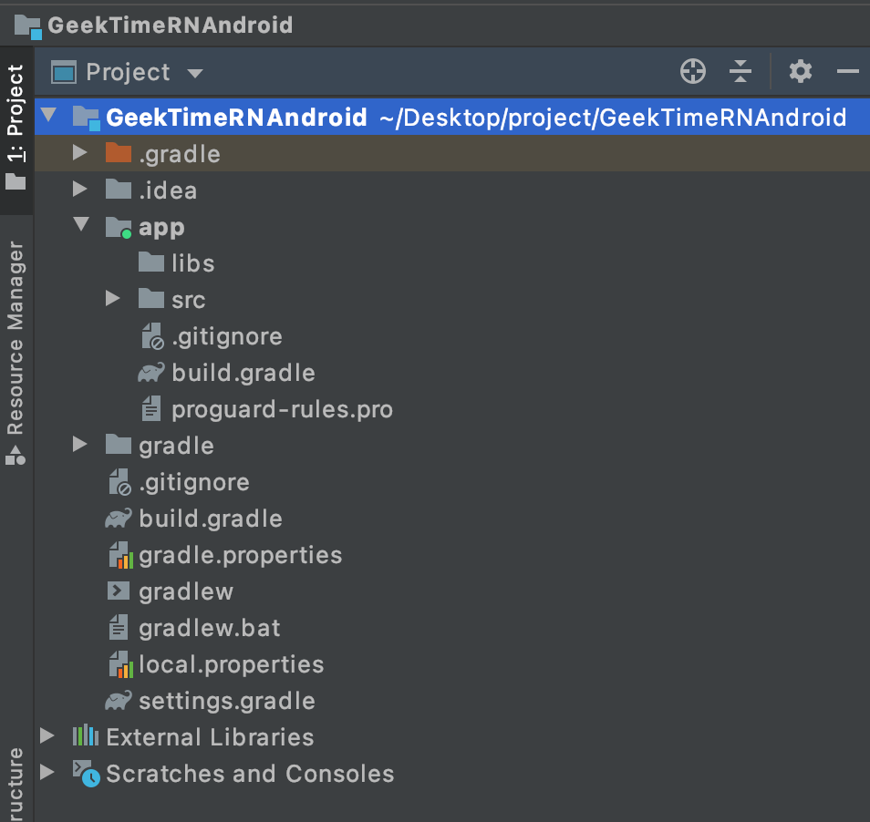

## App 混合开发指的是什么？

App 混合开发，指的是一个 App 部分功能用 Native 构建，部分功能用跨端框架构建。目前比较流行的跨端框架有 H5、React Native、Flutter、布局动态化等。当然我们这门课主要是围绕着 React Native 来进行讲解。

以 Native 与 React Native 混合开发为例，在同一个 App 中，通常存在以下几种形态：


那么，Native 与 React Native 混合开发一般会用在哪儿呢？

首先是一些大型 App 中，比如美团、携程、京东、58 等。这些大型 App 一般都非常复杂，整个框架需要包含模块化、组件化、插件化、跨端等能力。相比纯 React Native 工程，大型 App 的实际业务开发还需要考虑如何在已有原生项目中引入 React Native，作为原生框架的扩展能力。比如，部分业务可能对开发效率、多端一致性、动态更新能力有较强要求，就可以使用 React Native 来实现。

除了大型 App 外，如果你要对已上线的项目引入 React Native 也需要使用混合模式。因为原生改造成 React Native 并不是那么简单的事情，毕竟开发语言、页面管理、模块管理完全是另一套东西，而且一些原生页面，如启动页、首页等，出于性能考虑，大都还是会选择原生来实现。

当然一些新开发的轻量级 App，建议你选择纯 React Native 模式。因为新开发的 App 没有技术债，可以从 0 到 1 享受 React Native 跨端的优势，比如项目最关心的开发成本。

那么混合开发又有什么优点呢？简单说有这几点：

* 开发效率高，一套代码可以在 Android、iOS 上运行；
* 更新部署方便，无须依赖应用市场发版，迭代更新速度快；

* 具备动态更新能力，特别是国内 App，以 Android 为例，受限于 Google Play，无法使用 Android App bundle，而插件化框架又存在稳定性问题。而业务快速迭代、Bug 响应速度都对动态更新能力有强烈的需求。

但混合开发也不是万能的，它也有一些缺点，你要特别注意：

* 性能不佳。H5 渲染链路长；React Native 依托于 JS bridge 交互 （指旧版，最新架构使用 JSI）；虽然 Flutter 绘制流程直接使用 Skia，但依赖于原生的能力仍需异步交互；
* 兼容性差。Android、iOS 各版本都存在各种兼容性问题，特别是 Android 碎片化严重；

* 问题排查成本高。跨端框架一般涉及 Native、FE、Server，中间做了大量的桥接转换，排查链路比纯 Native 长；
* 动态化能力受限。相比纯原生的插件化，跨端框架动态更新的业务如果涉及 Native 部分的组件更新，需要依赖 App 发版。


## 环境配置

我们先从 Native 环境配置开始，先看看如何在 Android 端进行混合工程下的 React Native 环境配置。

### Android

#### 第一步：创建本地工程

我们使用 Android Studio 创建一个新的 App 项目，如果你已经有了本地项目，可以跳过此步骤。填写完项目名称、包名、项目本地路径后，点击 “Finish” 按钮。你可以把这个项目名称取名为 “GeekTimeRNAndroid”。


创建好的工程目录如下：




#### 第二步：添加依赖

创建好本地工程后，我们就要给它添加依赖。其实，React Native 官方对集成到现有的原生应用提供了相应的[文档]()，你可以看看。

文档提示，我们需要“创建一个空目录用于存放 React Native 项目，然后在其中创建一个 /android 子目录，把你现有的 Android 项目拷贝到 /android 子目录中”。

当然，官方提供的方式是非常不错的，它更偏向于 React Native 的工程管理模式。而我们在实际开发中，特别是已经上线的项目里面，React Native 功能和其他业务功能一样，一般会被当成原生工程的子模块来管理，所以我们这边选择偏向混合工程管理方式来集成。

这里，给你画了一张几种模式的对比图，你可以看看：


对比官方模式，我们采用混合工程模式，是基于以下几点考虑的：

可以不侵入现有工程结构，React Native 模块会作为现有工程的一部分进行组织管理。

不会影响代码仓库管理，不用把 Android、iOS 放在同一代码仓库下进行管理。

混合模式方便我们进行组件功能复用，你可以将 React Native 模块独立成组件，提供给其他 App 平台使用。


那么，基于混合工程模式集成 React Native 模块需要哪些依赖项呢？我们结合[文档]()来看下，主要是：

react-native：React Native 的核心框架；

JavaScript 引擎：可选 JSC、Hermes，用于执行 JavaScript。

接下来，我们参考文档进行如下操作：

```bash
# 切换到刚刚新建好的工程目录
cd /Users/kuangzhongwen/Desktop/project/GeekTimeRNAndroid
# 执行添加 react-native 命令，yarn 或 npm 都可以
yarn add react-native
```


执行 yarn add react-native 命令后，默认会安装最新版本的 React Native 包。

因为我们这个专栏主要是围绕 React Native 新架构讲解的，所以这边我们选择 React Native 0.68.0-rc3 版本。因此，我们指定 0.68.0-rc3 这个版本，执行如下命令：([这里]()可查看 react-native 版本)：

```

yarn add react-native@0.68.0-rc3
```


执行以上命令成功之后，我们会发现 GeekTimeRNAndroid 工程下多了一个 node_modules 目录，里面不仅有 react-native 框架，还有 JavaScript 引擎编译好的产物，包括 aar 和 pom 依赖文件。接下来，我们可以参考官方提供的方式，将 node_modules 目录配置为 repository，然后在工程中引入相关依赖。

不过，这种方式并不太推荐，其实我们只需要 react-native 和 JavaScript 引擎这两个产物就可以了。获取这两个产物后，在 Android 自己进行二次封装，然后发布到公司的远程仓库，就不用忍受一大堆无用的文件存放在项目中了 （虽然可以用 git ignore 忽略）。


目前 node_modules 目录里有这几个内容：

…/GeekTimeRNAndroid/node_modules/react-native（本地安装好的 node_module 中的 react-native 框架编译产物）：


…/GeekTimeRNAndroid/node_modules/JavaScriptc-android（本地安装好的 node_module 中的 JSC 引擎编译产物）：


…/GeekTimeRNAndroid/node_modules/hermes-engine（本地安装好的 node_module 中的 Hermes 引擎编译产物）：


其中只有 react-native 框架是必需的，而具体选择 JSC 引擎还是 Hermes 引擎，你可以参考以下几个点：

* 在启动性能上，Hermes 比 JSC 更快。Hermes 采用的是 AOT 提前编译的方案，它支持字节码文件，相比于 JSC，Hermes 不用先将 JavaScript 文本编译为字节码，节约了编译字节码的耗时，自然启动性能更好。
* 在运行性能上，JSC 比 Herems 更快。JSC 使用的是 JIT 即时编译方案，该方案支持动态缓存热点代码，因此运行性能上更快。

但整体而言，由于 Hermes 引擎是专门为移动端定制的，[在引擎大小、启动速度、运行内存、通信性能等方面都优于 JSC]()。如果你的是新项目，没有历史负担，建议你直接使用 Hermes 引擎。如果是之前已使用 JSC 引擎上线的项目，可以往 Hermes 引擎进行升级。

接下来，我们来给 GeekTimeRNAndroid 工程添加 react native 相关的依赖，包括：

* react-native.arr 文件；
* react-native.aar 依赖的第三方库；

* JavaScript 引擎 aar 文件。

首先我们先来添加 react-native.arr 文件。我们将 …/GeekTimeRNAndroid/node_modules/react-native/ 目录下的 react-native-0.68.0-rc.3.aar 拷贝放置到 GeekTimeRNAndroid/libs 目录。注意，Android 引入本地 aar 文件需要在工程根目录 build.gradle 添加 flatDir 配置：

```js
allprojects {
    repositories {
        google()
        jcenter()
        // 添加 flatDir 配置
        flatDir {
            dirs 'libs'
        }
    }
}
```

然后在 GeekTimeRNAndroid/app 模块下的 build.gradle 添加依赖：

```

implementation(name:'react-native-0.68.0-rc.3', ext:'aar')
```

接着，我们再将 …/GeekTimeRNAndroid/node_modules/react-native/ 目录下的 react-native-0.68.0-rc.3.pom 中的依赖库，按照 android gradle 依赖的方式进行添加，这些依赖主要是 react-native aar 本身远程依赖的第三方库。添加好的 app build.gradle 如下：

```json

dependencies {
    implementation(name:'react-native-0.68.0-rc.3', ext:'aar')
  
    implementation 'com.facebook.infer.annotation:infer-annotation:0.18.0'
    implementation 'javax.inject:javax.inject:1'
    implementation 'androidx.appcompat:appcompat:1.0.2'
    implementation 'com.facebook.fresco:imagepipeline-okhttp3:2.5.0'
    implementation 'com.facebook.fresco:fresco:2.5.0'
    implementation 'com.facebook.soloader:soloader:0.10.3'
    implementation 'com.google.code.findbugs:jsr305:3.0.2'
    implementation 'com.squareup.okhttp3:okhttp:4.9.2'
    implementation 'com.squareup.okhttp3:okhttp-urlconnection:4.9.2'
    implementation 'com.squareup.okio:okio:2.9.0'
}
```

最后，我们添加下 JavaScript 引擎 aar 就可以了。这边我们使用 JSC 引擎 (Hermes 引擎则是将 …/GeekTimeRNAndroid/node_modules/hermes-engine 下的 hermes-cppruntime-release.aar & hermes-release.aar 拷贝到 libs 目录，并在 build.gradle 中添加依赖)。

JSC aar 位于 …/GeekTimeRNAndroid/node_modules/jsc-android 目录下，主要是 jsc 的 so 动态库，将 android-jsc-r250230.aar 拷贝到 GeekTimeRNAndroid/libs 目录：

完整的 GeekTimeRNAndroid/app/build.gradle 依赖配置如下：

```json
dependencies {
    implementation(name:'react-native-0.68.0-rc.3', ext:'aar')
    implementation(name:'android-jsc-r250230', ext:'aar')
    implementation 'com.facebook.infer.annotation:infer-annotation:0.18.0'
    implementation 'javax.inject:javax.inject:1'
    implementation 'androidx.appcompat:appcompat:1.0.2'
    implementation 'com.facebook.fresco:imagepipeline-okhttp3:2.5.0'
    implementation 'com.facebook.fresco:fresco:2.5.0'
    implementation 'com.facebook.soloader:soloader:0.10.3'
    implementation 'com.google.code.findbugs:jsr305:3.0.2'
    implementation 'com.squareup.okhttp3:okhttp:4.9.2'
    implementation 'com.squareup.okhttp3:okhttp-urlconnection:4.9.2'
    implementation 'com.squareup.okio:okio:2.9.0'
}
```

到这里，React Native 相关的依赖配置已经完成，这时候你可以将 GeekTimeRNAndroid/node_modules 删除了。

#### 第三步：配置权限

配置好相关的依赖库后，我们需要来添加下权限和清单配置。这个很简单，我们只需要在 GeekTimeRNAndroid/app 的 AndroidManifest.xml 清单文件中声明网络权限就好了：

```json

<uses-permission android:name="android.permission.INTERNET" />
```

不过，如果你还需要访问开发者菜单界面，就需要在 AndroidManifest.xml 中声明：

```json

<activity android:name="com.facebook.react.devsupport.DevSettingsActivity" />

```

至此，Android 混合工程中的 React Native 环境配置就已经完成了。接下来我们再看看，如何在 iOS 中进行 React Native 环境配置。


### iOS

iOS 端初始化载体页比较简单，只需要下面几个步骤。

首先，我们要创建一个 Bridge。在 React Native 中，通过 Bridge 实现了 JavaScript 与原生框架之间的通信，调用 React Native 提供的 API ，就相当于通过 Bridge 调用原生的 API。因此，我们需要创建一个 Bridge，与载体页一对一绑定。

```json

 RCTBridge *carrierBridge = [[RCTBridge alloc] initWithDelegate:self 
                                               launchOptions:nil];
```

接下来，我们需要创建一个 RCTRootView，用于展示 React Native 视图的组件 RCTRootView，在 JavaScript 代码中 render() 部分的 UI 组件均会渲染到该 View 中，创建方式如下：

```json
 RCTRootView *rctView = [[RCTRootView alloc] initWithBridge:bridge 
                                             moduleName:moduleName 
                                             initialProperties:nil];
 [self.view addSubview:rctView];
```

到此， iOS 端初始化准备过程就完成了。你看，确实比较简单吧？

那么接下来，我们就需要获取 React Native 代码包，也就是 JS Bundle 资源。那么我们要怎么动态下载 JS Bundle 资源呢？

我们可以采用热更新策略，动态下载 JS bundle 资源。每个不同的 JS bundle 包都有它自己的标识 id，我们可以根据该 id 从服务器中获取该 JS bundle 资源对应的最新版本号，以及最新资源下载地址。

在获取 JS Bundle 的最新版本号后，如果用户之前浏览过当前 React Native 页面，还存在缓存，那么我们就可以检测缓存版本号是否与最新版本号相同。如果是相同的，就不需要重复下载了；如果不相同，那你还要根据最新资源下载地址，下载最新的资源包，并缓存到本地。

要是用户之前并没有浏览过当前 React Native 页面，或者缓存已被清空，你可以直接根据最新资源下载地址，下载最新的资源包，并缓存到本地。

你可以看一下这张整体流程图加深理解：


### 加载渲染

通过以上步骤，我们就能创建好载体页并成功下载 JS bundle 了，那么现在就可以准备开始执行 JavaScript 代码并渲染 React Native 页面了。我们先来看下 Android 端是如何加载 JS bundle 文件的。

#### 加载 JS bundle（Android）

Android 端通过 ReactContext 获取 CatalystInstance 对象，CatalystInstance 实现类为 CatalystInstanceImp。CatalystInstanceImpl 有一个非 public 方法 loadScriptFromFile()，我们通过这个方法就可以动态加载本地的 bundle 文件了。不过，由于 loadScriptFromFile() 为非 public，所以需要反射获取调用：

```json
CatalystInstance catalystInstance = mReactContext.getCatalystInstance();
Method loadScripFromFileMethod = CatalystInstanceImpl.class.getDeclaredMethod("loadScriptFromFile", String.class, String.class, boolean.class);
loadScripFromFileMethod.setAccessible(true);
// fileName 和 sourceURL 传入本地缓存的 bundle 路径，loadSynchronously 为是否同步加载
loadScripFromFileMethod.invoke(catalystInstance, fileName, sourceURL, loadSynchronously);

```

接着，我们再调用 ReactRootView startReactApplication 就可以开始加载渲染 React Native 页面了。这里要注意，startReactApplication() 中的参数 moduleName 必须对应 “index.js” 中的 “AppRegistry.registerComponent()” 的第一个参数：

```json
reactRootView.startReactApplication(reactInstanceManager, moduleName, launchOption);

```


我们还可以使用 catalystInstance.setGlobalVariable() 设置全局变量。设置好后，JavaScript 运行时可获取到这些全局变量了：

```json
catalystInstance.setGlobalVariable("xxx", xxx)

```
