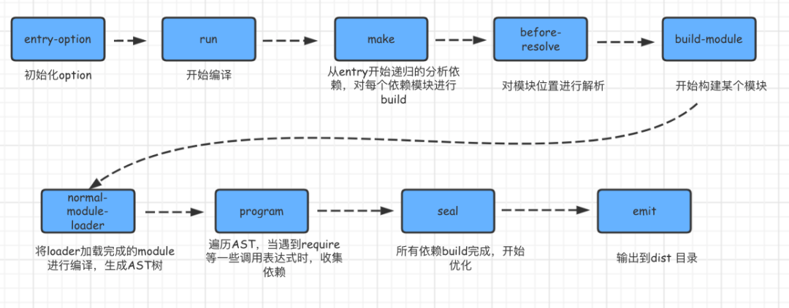
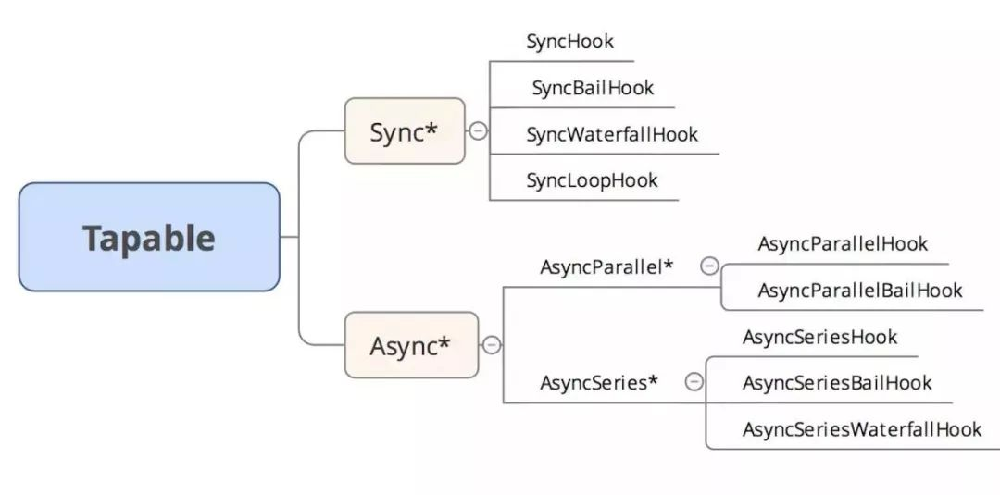
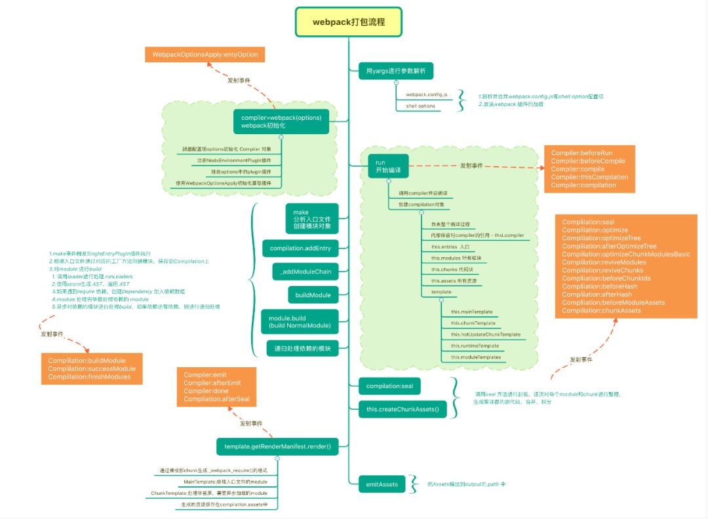
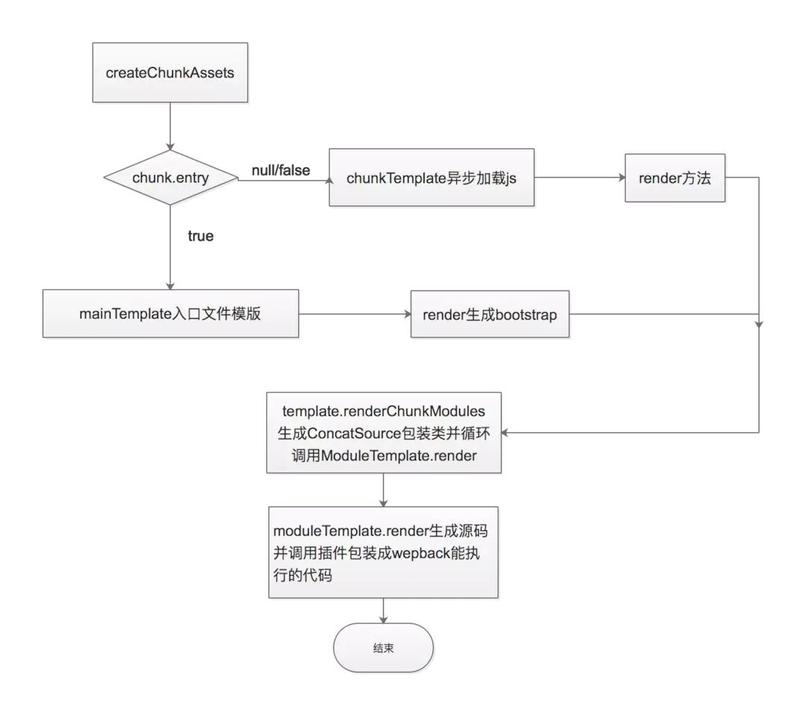
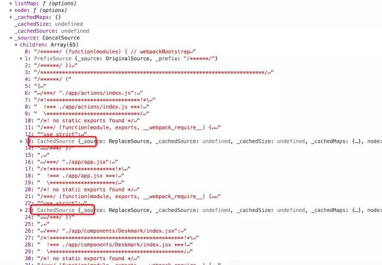

webpack打包流程总览:



webpack 的运行流程是一个串行的过程，从启动到结束会依次执行以下流程：首先会从配置文件和 Shell 语句中读取与合并参数，并初始化需要使用的插件和配置插件等执行环境所需要的参数；初始化完成后会调用Compiler的run来真正启动webpack编译构建过程，webpack的构建流程包括compile、make、build、seal、emit阶段，执行完这些阶段就完成了构建过程。

### webpack的事件流机制

Webpack是基于事件流的插件集合，它的工作流程就是将各个插件串联起来，而实现这一切的核心就是Tapable，Tapable是一个类似Node.js的EventEmitter的库,主要是控制钩子函数的发布与订阅，控制着webpack的插件系统。Webpack中最核心的负责编译的Compiler和负责创建的捆绑包的Compilation都是Tapable实例。

Tapable库暴露很多Hook类，为插件提供挂载的钩子。

```typescript
const {
	SyncHook,  // 同步钩子
	SyncBailHook, // 同步熔断钩子
	SyncWaterfallHook, // 同步流水钩子
	SyncLoopHook, // 同步循环钩子
	AsyncParallelHook, // 异步并发钩子
	AsyncParallelBailHook, // 异步并发熔断钩子
	AsyncSeriesHook, // 异步串行钩子
	AsyncSeriesBailHook, // 异步串行熔断钩子
	AsyncSeriesWaterfallHook // 异步串行流水钩子
 } = require("tapable");
const hook = new SyncHook(["arg1", "arg2", "arg3"]);
```



webpack中tapable的应用：

```typescript
if (Array.isArray(options)) {
    compiler = new MultiCompiler(
	    Array.from(options).map(options => webpack(options))
	);
} else if (typeof options === "object") {
	// 1 做初始的操作
	options = new WebpackOptionsDefaulter().process(options);
	compiler = new Compiler(options.context);
	compiler.options = options;
	// 2  必须插件有apply接受compiler 参数
	new NodeEnvironmentPlugin({
		infrastructureLogging: options.infrastructureLogging
	}).apply(compiler);
	// 插件接收compiler对象上的hooks，议案事件触发，插件也会执行操作
	if (options.plugins && Array.isArray(options.plugins)) {
		for (const plugin of options.plugins) {
			if (typeof plugin === "function") {
				plugin.call(compiler, compiler);
			} else {
				plugin.apply(compiler);
			}
		}
	}
	compiler.hooks.environment.call();
	compiler.hooks.afterEnvironment.call();
	compiler.options = new WebpackOptionsApply().process(options, compiler);
}
```

### webpack的总体打包流程

Webpack首先会把配置参数和命令行的参数及默认参数合并，并初始化需要使用的插件和配置插件等执行环境所需要的参数；初始化完成后会调用Compiler的run来真正启动webpack编译构建过程，webpack的构建流程包括compile、make、build、seal、emit阶段，执行完这些阶段就完成了构建过程。这其实就是我们上面所讲到的。

* 初始化参数: 从配置文件和 Shell 语句中读取与合并参数，得出最终的参数。
* 开始编译: 根据我们的webpack配置注册好对应的插件调用 compile.run 进入编译阶段,在编译的第一阶段是 compilation，他会注册好不同类型的module对应的 factory，不然后面碰到了就不知道如何处理了。

* 编译模块: 进入 make 阶段，会从 entry 开始进行两步操作：第一步是调用 loaders 对模块的原始代码进行编译，转换成标准的JS代码, 第二步是调用 acorn 对JS代码进行语法分析，然后收集其中的依赖关系。每个模块都会记录自己的依赖关系，从而形成一颗关系树。
* 输出资源：根据入口和模块之间的依赖关系，组装成一个个包含多个模块的 Chunk，再把每个 Chunk 转换成一个单独的文件加入到输出列表，这步是可以修改输出内容的最后机会。

* 输出完成：在确定好输出内容后，根据配置确定输出的路径和文件名，把文件内容写入到文件系统。

### webpack流程图





### webpack打包的三个阶段

webpack的打包总体来说其实是分为三个阶段：初始化阶段、编译阶段、输出文件阶段

初始化阶段：

* 初始化参数: 从配置文件和 Shell 语句中读取与合并参数，得出最终的参数。这个过程中还会执行配置文件中的插件实例化语句` new Plugin()`。

* 初始化默认参数配置:` new WebpackOptionsDefaulter().process(options)`
* 实例化 `Compiler`对象:用上一步得到的参数初始化Compiler实例，Compiler负责文件监听和启动编译。Compiler实例中包含了完整的Webpack配置，全局只有一个Compiler实例。
* 加载插件: 依次调用插件的apply方法，让插件可以监听后续的所有事件节点。同时给插件传入compiler实例的引用，以方便插件通过compiler调用Webpack提供的API。
* 处理入口: 读取配置的Entrys，为每个Entry实例化一个对应的EntryPlugin，为后面该Entry的递归解析工作做准备。

编译阶段：

* run阶段：启动一次新的编译。`this.hooks.run.callAsync`。
* compile: 该事件是为了告诉插件一次新的编译将要启动，同时会给插件带上compiler对象。

* compilation: 当Webpack以开发模式运行时，每当检测到文件变化，一次新的Compilation将被创建。一个Compilation对象包含了当前的模块资源、编译生成资源、变化的文件等。Compilation对象也提供了很多事件回调供插件做扩展。
* make:一个新的 Compilation 创建完毕主开始编译  完毕主开始编译this.hooks.make.callAsync。

* addEntry: 即将从 Entry 开始读取文件。
* _addModuleChain: 根据依赖查找对应的工厂函数，并调用工厂函数的create来生成一个空的MultModule对象，并且把MultModule对象存入compilation的modules中后执行MultModule.build。

* buildModules: 使用对应的Loader去转换一个模块。开始编译模块,this.buildModule(module)  buildModule(module, optional, origin,dependencies, thisCallback)。

* build: 开始真正编译模块。
* doBuild: 开始真正编译入口模块。
* normal-module-loader: 在用Loader对一个模块转换完后，使用acorn解析转换后的内容，输出对应的抽象语法树（AST），以方便Webpack后面对代码的分析。
* program: 从配置的入口模块开始，分析其AST，当遇到require等导入其它模块语句时，便将其加入到依赖的模块列表，同时对新找出的依赖模块递归分析，最终搞清所有模块的依赖关系。

文件输出阶段：

* seal: 封装` compilation.seal seal(callback)`。
* addChunk: 生成资源 addChunk(name)。

* createChunkAssets: 创建资源 this.createChunkAssets()。
* getRenderManifest: 获得要渲染的描述文件 getRenderManifest(options)。

* render: 渲染源码 source = fileManifest.render()。
* afterCompile: 编译结束   this.hooks.afterCompile。

* shouldEmit: 所有需要输出的文件已经生成好，询问插件哪些文件需要输出，哪些不需要。this.hooks.shouldEmit。
* emit: 确定好要输出哪些文件后，执行文件输出，可以在这里获取和修改输出内容。
* done: 全部完成     this.hooks.done.callAsync。

### Webpack执行流程源码分析

下面我们从源码去分析一下webpack的执行流程：

##### 初始化入口分析 entery-option

webpack内部会有一个默认的配置，在 webpack.js 入口处理函数中，初始化了所有的默认配置, 在WebpackOptionsDefaulter()中，配置了很多关于 resolve 和 resolveLoader 的配置。主要有三种 对模块的默认配置，输出output，解析optimization，加载resolve模块以及resolveLoader。我们首先看一下webpack.js 入口:

```js
// ~/webpack/lib/webpack.js
       if (Array.isArray(options)) {
	       compiler = new MultiCompiler(
			Array.from(options).map(options => webpack(options))
		);
	} else if (typeof options === "object") {
		// 做初始的操作
		options = new WebpackOptionsDefaulter().process(options);
 
		compiler = new Compiler(options.context);
		compiler.options = options;
		// 可以看出插件必须有apply以及接受compiler 参数
		new NodeEnvironmentPlugin({
			infrastructureLogging: options.infrastructureLogging
		}).apply(compiler);
		// 插件接收compiler对象上的hooks，议案事件触发，插件也会执行操作
		if (options.plugins && Array.isArray(options.plugins)) {
			for (const plugin of options.plugins) {
				if (typeof plugin === "function") {
					plugin.call(compiler, compiler);
				} else {
					plugin.apply(compiler);
				}
			}
		}
		compiler.hooks.environment.call();
		compiler.hooks.afterEnvironment.call();
		compiler.options = new WebpackOptionsApply().process(options, compiler);
	}
```

process方法将我们写的 webpack 的配置 和默认的配置合并。并且 process 过程里会注入关于 normal/context/loader 的默认配置的获取函数。

```js
// ~/webpack/lib/WebpackOptionsApply.js
new EntryOptionPlugin().apply(compiler);
compiler.hooks.entryOption.call(options.context, options.entry);
```

EntryOptionPlugin的实现：

```js
// ~/webpack/lib/EntryOptionPlugin.js
const SingleEntryPlugin = require("./SingleEntryPlugin");
const MultiEntryPlugin = require("./MultiEntryPlugin");
const DynamicEntryPlugin = require("./DynamicEntryPlugin");
 
const itemToPlugin = (context, item, name) => {
	if (Array.isArray(item)) {
		returnnew MultiEntryPlugin(context, item, name);
	}
	returnnew SingleEntryPlugin(context, item, name);
};
 
module.exports = class EntryOptionPlugin {
	apply(compiler) {
		compiler.hooks.entryOption.tap("EntryOptionPlugin", (context, entry) => {
		   // string 类型则为 new SingleEntryPlugin
		   // array 类型则为 new MultiEntryPlugin
			if (typeof entry === "string" || Array.isArray(entry)) {
				itemToPlugin(context, entry, "main").apply(compiler);
			} elseif (typeof entry === "object") {
			    // 对于 object 类型，遍历其中每一项
				for (const name ofObject.keys(entry)) {
					itemToPlugin(context, entry[name], name).apply(compiler);
				}
			} elseif (typeof entry === "function") {
			    // function 类型则为 DynamicEntryPlugin
				new DynamicEntryPlugin(context, entry).apply(compiler);
			}
			return true;
		});
	}
};
```

在 EntryOptionsPlugin中注册了 entryOption 的事件处理函数，根据 entry 值的不同类型(string/array/object中每一项/functioin)实例化和执行不同的 EntryPlugin：string 对应 SingleEntryPlugin；array 对应 MultiEntryPlugin；function 对应 DynamicEntryPlugin。而对于 object 类型来说遍历其中的每一个 key，将每一个 key 当做一个入口，并根据类型 string/array 的不同选择 SingleEntryPlugin 或 MultiEntryPlugin。在最后执行 compiler.run(callback)。

##### run方法

```js
// ~/webpack/lib/Compiler.js
        run(callback) {
		if (this.running) return callback(new ConcurrentCompilationError());
		const finalCallback = (err, stats) => {
			this.running = false;
			if (err) {
				this.hooks.failed.call(err);
			}
 
			if (callback !== undefined) return callback(err, stats);
		};
              // 计算编译进行时间的初始时间点
		const startTime = Date.now();
		this.running = true;
		// 当编译完成后需要执行的函数，处理编译完成后的事情
		const onCompiled = (err, compilation) => {
			if (err) return finalCallback(err);
 
			if (this.hooks.shouldEmit.call(compilation) === false) {
				const stats = new Stats(compilation);
				stats.startTime = startTime;
				stats.endTime = Date.now();
				this.hooks.done.callAsync(stats, err => {
					if (err) return finalCallback(err);
					return finalCallback(null, stats);
				});
				return;
			}
			// 调用emitAsset方法，emitAsset主要负责写入文件输出文件
			this.emitAssets(compilation, err => {
				if (err) return finalCallback(err);
 
				if (compilation.hooks.needAdditionalPass.call()) {
					compilation.needAdditionalPass = true;
 
					const stats = new Stats(compilation);
					stats.startTime = startTime;
					stats.endTime = Date.now();
					//继续异步调用时间流
					this.hooks.done.callAsync(stats, err => {
						if (err) return finalCallback(err);
						//  这次多了一个时间流,调用额外编译，告知编译终于编完了
						this.hooks.additionalPass.callAsync(err => {
							if (err) return finalCallback(err);
							this.compile(onCompiled);
						});
					});
					return;
				}
 
				this.emitRecords(err => {
					if (err) return finalCallback(err);
 
					const stats = new Stats(compilation);
					stats.startTime = startTime;
					stats.endTime = Date.now();
					this.hooks.done.callAsync(stats, err => {
						if (err) return finalCallback(err);
						return finalCallback(null, stats);
					});
				});
//最终总结，无论走那个分支都是 new Stats(compilation) 返回stats的回调函数,
//按照目前的流程走的是最后一个分支，调用 this.emitRecords
			});
		};
		// this.hooks.beforeRun this.hooks.run 主要是构建一个架子，面向切面编程
		this.hooks.beforeRun.callAsync(this, err => {
			if (err) return finalCallback(err);
 
			this.hooks.run.callAsync(this, err => {
				if (err) return finalCallback(err);
 
				this.readRecords(err => {
					if (err) return finalCallback(err);
					// 执行compile 方法 /把onCompiled函数传入，调用compile
					this.compile(onCompiled);
				});
			});
		});
	}
```

##### compile方法

```js
// ~/webpack/lib/Compiler.js
         compile(callback) {
		const params = this.newCompilationParams();
		this.hooks.beforeCompile.callAsync(params, err => {
			if (err) return callback(err);
 
			this.hooks.compile.call(params);
			// 新建一个 compilation
			// compilation 里面也定义了 this.hooks ， 原理和 Compiler 一样
			const compilation = this.newCompilation(params);
// 执行make函数， 从 entry开始递归分析依赖，对每个依赖模块进行build，
//对complie.hooks.make进行执行
			this.hooks.make.callAsync(compilation, err => {
				if (err) return callback(err);
 
				compilation.finish(err => {
					if (err) return callback(err);
 
					compilation.seal(err => {
						if (err) return callback(err);
 
						this.hooks.afterCompile.callAsync(compilation, err => {
							if (err) return callback(err);
 
							return callback(null, compilation);
						});
					});
				});
			});
		});
	}
```

##### make的实现

在complie中进行 this.hooks.make.callAsync，在compiler.hooks.make.tapAsync进行监听，执行监听 监听SingleEntryPlugin中的插件，webpack入口条目，参数是单入口字符串，单入口数组，多入口对象还是动态函数，无论是什么都会调用compilation.addEntry方法，这个方法会执行_addModuleChain，将入口文件加入需要编译的体积中。然后少量中的文件被一个一个处理，文件中的import约会了其他的文件又会通过addModuleDependencies加入到编译层次中。最终当这个编译堆栈中的内容完成被处理完时，就完成了文件到模块的转化。

```js
// ~/webpack/lib/SingleEntryPlugin.js
apply(compiler) {
	compiler.hooks.compilation.tap(
		"SingleEntryPlugin",
		(compilation, { normalModuleFactory }) => {
			compilation.dependencyFactories.set(
				SingleEntryDependency,
				normalModuleFactory
			);
		}
	);
	// 对compiler.hooks进行tapAsync 进行异步绑定，在compiler进行监听
	compiler.hooks.make.tapAsync(
		"SingleEntryPlugin",
		(compilation, callback) => {
			const { entry, name, context } = this;
			const dep = SingleEntryPlugin.createDependency(entry, name);
			compilation.addEntry(context, dep, name, callback);
		}
	);
```

##### addEntry

```js
// ~/webpack/lib/Compilation.js
addEntry(context, entry, name, callback) {
	// context => 默认为process.cwd()
    // entry => dep => SingleEntryDependency
    // name => 单入口默认为main
    // callback => 后面的流程
        const slot = {
            name: name,
            module: null
        };
        // 初始为[]
        this.preparedChunks.push(slot);
        this._addModuleChain(context, entry, (module) => { /**/ }, (err, module) => { /**/ });
    }
```

##### _addModuleChain

_addModuleChain主要做了两件事情。一是根据模块的类型获取对应的模块工厂并创建模块，二是构建模块。通过 ModuleFactory.create *ModuleFactory.create方法创建模块，（有NormalModule , MultiModule , ContextModule , DelegatedModule 等）

```js
// ~/webpack/lib/Compilation.js
class Compilation extends Tapable {
    // ...
    _addModuleChain(context, dependency, onModule, callback) {
        // profile => options.profile
        // 不传则start为undefined
        const start = this.profile && Date.now();
        // bail => options.bail
        const errorAndCallback = this.bail ? (err) => {
            callback(err);
        } : (err) => {
            err.dependencies = [dependency];
            this.errors.push(err);
            callback();
        };
 
        if (typeof dependency !== "object" || dependency === null || !dependency.constructor) {
            thrownewError("Parameter 'dependency' must be a Dependency");
        }
        // dependencyFactories包含了所有的依赖集合
        const moduleFactory = this.dependencyFactories.get(dependency.constructor);
        if (!moduleFactory) {
            thrownewError(`No dependency factory available for this dependency type: ${dependency.constructor.name}`);
        }
 
this.semaphore.acquire(() => {
	moduleFactory.create(
		{
			contextInfo: {
				issuer: "",
				compiler: this.compiler.name
			},
			context: context,
			dependencies: [dependency]
		},
		(err, module) => {
			if (err) {
				this.semaphore.release();
				return errorAndCallback(new EntryModuleNotFoundError(err));
			}
			let afterFactory;
			if (currentProfile) {
				afterFactory = Date.now();
				currentProfile.factory = afterFactory - start;
			}
			// 将所有的依赖放入modules
			const addModuleResult = this.addModule(module);
			module = addModuleResult.module;
				onModule(module);
				dependency.module = module;
			module.addReason(null, dependency);
				const afterBuild = () => {
					if (addModuleResult.dependencies) {
					this.processModuleDependencies(module, err => {
						if (err) return callback(err);
						callback(null, module);
					});
				} else {
					return callback(null, module);
					}
			};
			if (addModuleResult.issuer) {
				if (currentProfile) {
					module.profile = currentProfile;
				}
			}
			if (addModuleResult.build) {
			// 执行buildModule
			this.buildModule(module, false, null, null, err => {
			if (err) {
				this.semaphore.release();
					return errorAndCallback(err);
				}
			if (currentProfile) {
			    const afterBuilding = Date.now();
		    	currentProfile.building = afterBuilding - afterFactory;
			}
			this.semaphore.release();
				afterBuild();
			});
		} else {
			this.semaphore.release();
			this.waitForBuildingFinished(module, afterBuild);
			}
		}
			);
		});
    }
}
```

_addModuleChain 和 addModuleDependencies 函数中都会调用 this.semaphore.acquire 这个函数的具体实现在 lib/util/Semaphore.js 文件中。

```js
// lib/util/Semaphore.js
class Semaphore {
   constructor(available) {
      // available 为最大的并发数量
   	this.available = available;
   	this.waiters = [];
   	this._continue = this._continue.bind(this);
   }
 
   acquire(callback) {
   	if (this.available > 0) {
   		this.available--;
   		callback();
   	} else {
   		this.waiters.push(callback);
   	}
   }
 
   release() {
   	this.available++;
   	if (this.waiters.length > 0) {
   		process.nextTick(this._continue);
   	}
   }
 
   _continue() {
   	if (this.available > 0) {
   		if (this.waiters.length > 0) {
   			this.available--;
   			const callback = this.waiters.pop();
   			callback();
   		}
   	}
   }
}
```

对外暴露的只有两个个方法：

acquire: 申请处理资源，如果有闲置资源(即并发数量)则立即执行处理，并且闲置的资源减1；否则存入等待队列中。

release: 释放资源。在 acquire 中会调用 callback 方法，在这里需要使用 release 释放资源，将闲置资源加1。同时会检查是否还有待处理内容，如果有则继续处理

这个 Semaphore 类借鉴了在多线程环境中，对使用资源进行控制的 Semaphore（信号量）的概念。其中并发个数通过 available 来定义，那么默认值是多少呢？在 Compilation.js 中可以找到 this.semaphore = new Semaphore(options.parallelism || 100); 复制代码 默认的并发数是 100，注意这里说的并发只是代码设计中的并发，不要和js的单线程特性搞混了。

##### buildModule

对modules进行build包括 调用loader处理源文件，使用acorn生成AST并且遍历AST,遇到require创建依赖depende,并且加入数组.

```js
// lib/util/Semaphore.js
class Semaphore {
   constructor(available) {
      // available 为最大的并发数量
   	this.available = available;
   	this.waiters = [];
   	this._continue = this._continue.bind(this);
   }
 
   acquire(callback) {
   	if (this.available > 0) {
   		this.available--;
   		callback();
   	} else {
   		this.waiters.push(callback);
   	}
   }
 
   release() {
   	this.available++;
   	if (this.waiters.length > 0) {
   		process.nextTick(this._continue);
   	}
   }
 
   _continue() {
   	if (this.available > 0) {
   		if (this.waiters.length > 0) {
   			this.available--;
   			const callback = this.waiters.pop();
   			callback();
   		}
   	}
   }
}
```

##### build

```js
//~/webpack/lib/NormalModule.js
try {
// 调用parse方法，创建依赖Dependency并放入依赖数组，这里会将 source 转为 AST，分析出所有的依赖著作权归原作者所有。
  const result = this.parser.parse(
    this._ast || this._source.source(), {
       current: this,
       module: this,
       compilation: compilation,
       options: options
    },
    (err, result) => {
       if (err) {
          handleParseError(err);
       } else {
          handleParseResult(result);
       }
    });
    if (result !== undefined) {
    // parse is sync
      handleParseResult(result);
     }
 }
 
build(options, compilation, resolver, fs, callback) {
   this.buildTimestamp = Date.now();
   this.built = true;
   this._source = null;
   this._sourceSize = null;
   this._ast = null;
   this._buildHash = "";
   this.error = null;
   this.errors.length = 0;
   this.warnings.length = 0;
   this.buildMeta = {};
   this.buildInfo = {
     cacheable: false,
     fileDependencies: newSet(),
     contextDependencies: newSet(),
     assets: undefined,
     assetsInfo: undefined
   };
   returnthis.doBuild(options, compilation, resolver, fs, err => {
     this._cachedSources.clear();
   // if we have an error mark module as failed and exit
     if (err) {
         this.markModuleAsErrored(err);
         this._initBuildHash(compilation);
             return callback();
     }
     // check if this module should !not! be parsed.
    // if so, exit here;
     const noParseRule = options.module && options.module.noParse;
        if (this.shouldPreventParsing(noParseRule, this.request)) {
           this._initBuildHash(compilation);
           return callback();
     }
   const handleParseError = e => {
   const source = this._source.source();
   const loaders = this.loaders.map(item =>
      contextify(options.context, item.loader)
   );
   const error = new ModuleParseError(this, source, e, loaders);
       this.markModuleAsErrored(error);
       this._initBuildHash(compilation);
         return callback();
   };
  const handleParseResult = result => {
     this._lastSuccessfulBuildMeta = this.buildMeta;
     this._initBuildHash(compilation);
       return callback();
   };
   try {
   // / 调用parse方法，创建依赖Dependency并放入依赖数组，这时传入 parse 方法中的就是 loader 处理之后，
   // 返回的 extraInfo.webpackAST，类型是 AST 对象。这么做的好处是什么呢？如果 loader 处理过程中已经执行过将文件转化为 AST 了，
    // 那么这个 AST 对象保存到 extraInfo.webpackAST 中，在这一步就可以直接复用，以避免重复生成 AST，提升性能。
 
    const result = this.parser.parse(
       this._ast || this._source.source(), {
           current: this,
           module: this,
           compilation: compilation,
           options: options
       },
       (err, result) => {
          if (err) {
             handleParseError(err);
        } else {
             handleParseResult(result);
        }
     }
     );
     if (result !== undefined) {
       // parse is sync
     handleParseResult(result);
     }
   } catch (e) {
     handleParseError(e);
   }
   });
}
```

##### doBuild

```js
//~/webpack/lib/NormalModule.js   
doBuild(options, compilation, resolver, fs, callback) {
        const loaderContext = this.createLoaderContext(
            resolver,
            options,
            compilation,
            fs
        );
        // 获取loader相关的信息并转换成webpack需要的js文件
        runLoaders({
                resource: this.resource,
                loaders: this.loaders,
                context: loaderContext,
                readResource: fs.readFile.bind(fs)
            },
            (err, result) => {
                if (result) {
                    this.buildInfo.cacheable = result.cacheable;
                    this.buildInfo.fileDependencies = newSet(result.fileDependencies);
                    this.buildInfo.contextDependencies = newSet(
                        result.contextDependencies
                    );
                }
 
                if (err) {
                    if (!(err instanceofError)) {
                        err = new NonErrorEmittedError(err);
                    }
                    const currentLoader = this.getCurrentLoader(loaderContext);
                    const error = new ModuleBuildError(this, err, {
                        from: currentLoader &&
                            compilation.runtimeTemplate.requestShortener.shorten(
                                currentLoader.loader
                            )
                    });
                    return callback(error);
                }
 
                const resourceBuffer = result.resourceBuffer;
                const source = result.result[0];
                const sourceMap = result.result.length >= 1 ? result.result[1] : null;
                const extraInfo = result.result.length >= 2 ? result.result[2] : null;
                // runLoader 结果是一个数组：[source, sourceMap, extraInfo], extraInfo.webpackAST 如果存在，则会被保存到 module._ast 中。
                // 也就是说，loader 除了返回处理完了 source 之后，还可以返回一个 AST 对象。在 doBuild 的回调中会优先使用 module._ast
              
                if (!Buffer.isBuffer(source) && typeof source !== "string") {
                    const currentLoader = this.getCurrentLoader(loaderContext, 0);
                    const err = newError(
                        `Final loader (${
							currentLoader
								? compilation.runtimeTemplate.requestShortener.shorten(
										currentLoader.loader
								  )
								: "unknown"
						}) didn't return a Buffer or String`
                    );
                    const error = new ModuleBuildError(this, err);
                    return callback(error);
                }
 
                this._source = this.createSource(
                    this.binary ? asBuffer(source) : asString(source),
                    resourceBuffer,
                    sourceMap
                );
                // ExtraInfo.webpackAST 如果存在，则会被保存到 module._ast 中。
                this._sourceSize = null;
                this._ast =
                    typeof extraInfo === "object" &&
                    extraInfo !== null &&
                    extraInfo.webpackAST !== undefined ?
                    extraInfo.webpackAST :
                    null;
                // 回build中执行ast(抽象语法树，编译过程中常见结构，vue、babel原理都有)
                return callback();
            }
        );
    }
```


整个 parse 的过程关于依赖的部分，我们总结一下：

将 source 转为 AST（如果 source 是字符串类型）

遍历 AST，遇到 import 语句就增加相关依赖，代码中出现 A(import 导入的变量) 的地方也增加相关的依赖。

所有的依赖都被保存在 module.dependencies 中，一共有下面4个

`HarmonyCompatibilityDependency
HarmonyInitDependency
ConstDependency
HarmonyImportSideEffectDependency
HarmonyImportSpecifierDependency`


到此 build 阶段就结束了，回到 module.build 的回调函数。对于所有的依赖再次经过 create->build->add->processDep。如此递归下去，最终我们所有的文件就都转化为了 module，并且会得到一个 module 和 dependencies 的关系结构,这个结构会交给后续的 chunck 和 生成打包文件代码使用。module 生成的过程结束之后，最终会回到 Compiler.js 中的 compile 方法的 make 事件回调中，module 生成的过程就结束了。

##### Seal函数

seal函数之后的流程,就主要和chunk函数生成有关了。回调的 seal 方法中，将运用这些 module 以及 module 的 dependencies 信息整合出最终的 chunck。

* module，就是不同的资源文件，包含了你的代码中提供的例如：js/css/图片 等文件，在编译环节，webpack 会根据不同 module 之间的依赖关系去组合生成 chunk。webpack 打包构建时会根据你的具体业务代码和 webpack 相关配置来决定输出的最终文件，具体的文件的名和文件数量也与此相关。而这些文件就被称为 chunk。例如在你的业务当中使用了异步分包的 API。

chunk由 module 组成，一个 chunk 可以包含多个 module，它是 webpack 编译打包后输出的最终文件。例如:

`import('./foo.js').then(bar => bar())`
在最终输出的文件当中，foo.js会被单独输出一个 chunk 文件。这些生成的 chunk 文件当中即是由相关的 module 模块所构成的。下面是seal函数的入口:

```js
~/webpack/lib/Compiler.js
        compile(callback) {
		const params = this.newCompilationParams();
		this.hooks.beforeCompile.callAsync(params, err => {
			if (err) return callback(err);
 
			this.hooks.compile.call(params);
			// 新建一个 compilation
			// compilation 里面也定义了 this.hooks ， 原理和 Compiler 一样
			const compilation = this.newCompilation(params);
			// 执行make函数，四：从 entry开始递归分析依赖，对每个依赖模块进行build，对complie.hooks.make进行执行
			this.hooks.make.callAsync(compilation, err => {
				if (err) return callback(err);
 
				compilation.finish(err => {
					if (err) return callback(err);
 
					compilation.seal(err => {
						if (err) return callback(err);
 
						this.hooks.afterCompile.callAsync(compilation, err => {
							if (err) return callback(err);
 
							return callback(null, compilation);
						});
					});
				});
			});
		});
	}
```

下面我们看下seal函数具体实现:

```js
// ~/lib/Compilation.js
   seal(callback) {
  	this.hooks.seal.call();
 
  	while (
  		this.hooks.optimizeDependenciesBasic.call(this.modules) ||
  		this.hooks.optimizeDependencies.call(this.modules) ||
  		this.hooks.optimizeDependenciesAdvanced.call(this.modules)
  	) {
  		/* empty */
  	}
  	this.hooks.afterOptimizeDependencies.call(this.modules);
 
  	this.hooks.beforeChunks.call();
  	// 根据 addEntry 方法中收集到入口文件组成的 _preparedEntrypoints 数组
  	for (const preparedEntrypoint ofthis._preparedEntrypoints) {
  		constmodule = preparedEntrypoint.module;
  		const name = preparedEntrypoint.name;
  		const chunk = this.addChunk(name); // 入口 chunk 且为 runtimeChunk
  		const entrypoint = new Entrypoint(name); // 每一个 entryPoint 就是一个 chunkGroup
  		entrypoint.setRuntimeChunk(chunk); // 设置 runtime chunk
  		entrypoint.addOrigin(null, name, preparedEntrypoint.request);
  		this.namedChunkGroups.set(name, entrypoint); // 设置 chunkGroups 的内容
  		this.entrypoints.set(name, entrypoint);
  		this.chunkGroups.push(entrypoint);
  		// 建立起 chunkGroup 和 chunk 之间的关系
  		GraphHelpers.connectChunkGroupAndChunk(entrypoint, chunk);
  		// 建立起 chunk 和 module 之间的关系
  		GraphHelpers.connectChunkAndModule(chunk, module);
 
  		chunk.entryModule = module;
  		chunk.name = name;
 
  		this.assignDepth(module);
  	}
  	buildChunkGraph(
  		this,
  		/** @type {Entrypoint[]} */ (this.chunkGroups.slice())
  	);
  	// 对 module 进行排序
  	this.sortModules(this.modules);
  	// 创建完 chunk 之后的 hook
  	this.hooks.afterChunks.call(this.chunks);
 
  	this.hooks.optimize.call();
 
  	while (
  		this.hooks.optimizeModulesBasic.call(this.modules) ||
  		this.hooks.optimizeModules.call(this.modules) ||
  		this.hooks.optimizeModulesAdvanced.call(this.modules)
  	) {
  		/* empty */
  	}
  	// 优化 module 之后的 hook
  	this.hooks.afterOptimizeModules.call(this.modules);
 
  	while (
  		this.hooks.optimizeChunksBasic.call(this.chunks, this.chunkGroups) ||
  		this.hooks.optimizeChunks.call(this.chunks, this.chunkGroups) ||
  		// 主要涉及到 webpack config 当中的有关 optimization 配置的相关内容
  		this.hooks.optimizeChunksAdvanced.call(this.chunks, this.chunkGroups)
  	) {
  		/* empty */
  	}
  			// 优化 chunk 之后的 hook
  	this.hooks.afterOptimizeChunks.call(this.chunks, this.chunkGroups);
.....
 
  }
```

在这个过程当中首先遍历 webpack config 当中配置的入口 module，每个入口 module 都会通过addChunk方法去创建一个 chunk，而这个新建的 chunk 为一个空的 chunk，即不包含任何与之相关联的 module。之后实例化一个 entryPoint，而这个 entryPoint 为一个 chunkGroup，每个 chunkGroup 可以包含多的 chunk，同时内部会有个比较特殊的 runtimeChunk(当 webpack 最终编译完成后包含的 webpack runtime 代码最终会注入到 runtimeChunk 当中)。到此仅仅是分别创建了 chunk 以及 chunkGroup，接下来便调用GraphHelpers模块提供的connectChunkGroupAndChunk及connectChunkAndModule方法来建立起 chunkGroup 和 chunk 之间的联系，以及 chunk 和 入口 module 之间(这里还未涉及到依赖 module)的联系。

##### createChunkAssets

```js
// ~/lib/Compilation.js
   createChunkAssets() {
  	const outputOptions = this.outputOptions;
  	const cachedSourceMap = newMap();
  	/** @type {Map<string, {hash: string, source: Source, chunk: Chunk}>} */
  	const alreadyWrittenFiles = newMap();
  	for (let i = 0; i < this.chunks.length; i++) {
  		const chunk = this.chunks[i];
  		chunk.files = [];
  		let source;
  		let file;
  		let filenameTemplate;
  		try {
  			// 1 chunk.entry判断是mainTemplate(入口文件打包)还是chunkTemplate(异步加载js打包模板)
  		    const template = chunk.hasRuntime()
  			? this.mainTemplate
  			: this.chunkTemplate;
  				// 2 生成manifest 对象
  		    const manifest = template.getRenderManifest({
  				chunk,
  				hash: this.hash,
  				fullHash: this.fullHash,
  				outputOptions,
  				moduleTemplates: this.moduleTemplates,
  				dependencyTemplates: this.dependencyTemplates
  			}); // [{ render(), filenameTemplate, pathOptions, identifier, hash }]
  			for (const fileManifest of manifest) {
  				const cacheName = fileManifest.identifier;
  				const usedHash = fileManifest.hash;
  				filenameTemplate = fileManifest.filenameTemplate;
  				const pathAndInfo = this.getPathWithInfo(
  					filenameTemplate,
  					fileManifest.pathOptions
  				);
  				file = pathAndInfo.path;
  				const assetInfo = pathAndInfo.info;
 
  				// check if the same filename was already written by another chunk
  				const alreadyWritten = alreadyWrittenFiles.get(file);
  				if (alreadyWritten !== undefined) {
  					if (alreadyWritten.hash === usedHash) {
  						if (this.cache) {
  							this.cache[cacheName] = {
  								hash: usedHash,
  								source: alreadyWritten.source
  							};
  						}
  						chunk.files.push(file);
  						this.hooks.chunkAsset.call(chunk, file);
  						continue;
  					} else {
  						thrownewError(
  							`Conflict: Multiple chunks emit assets to the same filename ${file}` +
  								` (chunks ${alreadyWritten.chunk.id} and ${chunk.id})`
  						);
  					}
  				}
  				if (
  					this.cache &&
  					this.cache[cacheName] &&
  					this.cache[cacheName].hash === usedHash
  				) {
  					// 3 chunk 打包封装的入口
  					source = this.cache[cacheName].source;
  				} else {
  					source = fileManifest.render();
  					// Ensure that source is a cached source to avoid additional cost because of repeated access
  					if (!(source instanceof CachedSource)) {
  						// 4 存放cacheEntry源码
  						const cacheEntry = cachedSourceMap.get(source);
  						if (cacheEntry) {
  							source = cacheEntry;
  						} else {
  							const cachedSource = new CachedSource(source);
  							cachedSourceMap.set(source, cachedSource);
  							source = cachedSource;
  						}
  					}
  					if (this.cache) {
  						this.cache[cacheName] = {
  							hash: usedHash,
  							source
  						};
  					}
  				}
  				this.emitAsset(file, source, assetInfo);
  				chunk.files.push(file);
  				this.hooks.chunkAsset.call(chunk, file);
  				alreadyWrittenFiles.set(file, {
  					hash: usedHash,
  					source,
  					chunk
  				});
  			}
  		} catch (err) {
  			this.errors.push(
  				new ChunkRenderError(chunk, file || filenameTemplate, err)
  			);
  		}
  	}
  }
```

流程应该是这样的：



 从上图可以看出不同的chunk处理模版不一样，根据chunk的entry判断是选择mainTemplate（入口文件打包模版）还是chunkTemplate（异步加载js打包模版）;选择模版后根据模版的template.getRenderManifest生成manifest对象，该对象中的render方法就是chunk打包封装的入口；mainTemplate和chunkTemplate的唯一区别就是mainTemplate多了wepback执行的bootsrap代码。当调用render时会调用template.renderChunkModules方法，该方法会创建一个ConcatSource容器用来存放chunk的源码，该方法接下来会对当前chunk的module遍历并执行moduleTemplate.render获得每一个module的源码；在moduleTemplate.render中获取源码后会触发插件去封装成wepack需要的代码格式；当所有的module都生成完后放入ConcatSource中返回；并以该chunk的输出文件名称为key存放在Compilation的assets中。



##### this.emitAssets

webpack 调用 Compiler 中的 emitAssets() ，按照 output 中的配置项异步将文件输出到了对应的 path 中，从而 webpack 整个打包过程结束。要注意的是，若想对结果进行处理，则需要在 emit 触发后对自定义插件进行扩展。

```js
// ~/webpack/lib/Compiler.js
            this.emitAssets(compilation, err => {
		if (err) return finalCallback(err);
 
		if (compilation.hooks.needAdditionalPass.call()) {
		    compilation.needAdditionalPass = true;
 
		    const stats = new Stats(compilation);
		    stats.startTime = startTime;
		    stats.endTime = Date.now();
		    //继续异步调用时间流
		    this.hooks.done.callAsync(stats, err => {
			if (err) return finalCallback(err);
			//  这次多了一个时间流,调用额外编译，告知编译终于编完了
			this.hooks.additionalPass.callAsync(err => {
			    if (err) return finalCallback(err);
			    this.compile(onCompiled);
			});
		    });
		    return;
	      }
```

##### compiler.hooks.emit.callAsync()

最后我们到达了compiler.emitAssets方法体中。在compiler.emitAssets中会先调用this.hooks.emit生命周期，之后根据webpack config文件的output配置的path属性，将文件输出到指定的文件夹。至此，你就可以在./debug/dist中查看到调试代码打包后的文件了。

```js
// ~/webpack/lib/Compiler.js
this.hooks.emit.callAsync(compilation, () => {
    outputPath = compilation.getPath(this.outputPath, {})
    mkdirp(this.outputFileSystem, outputPath, emitFiles)
 })
```
