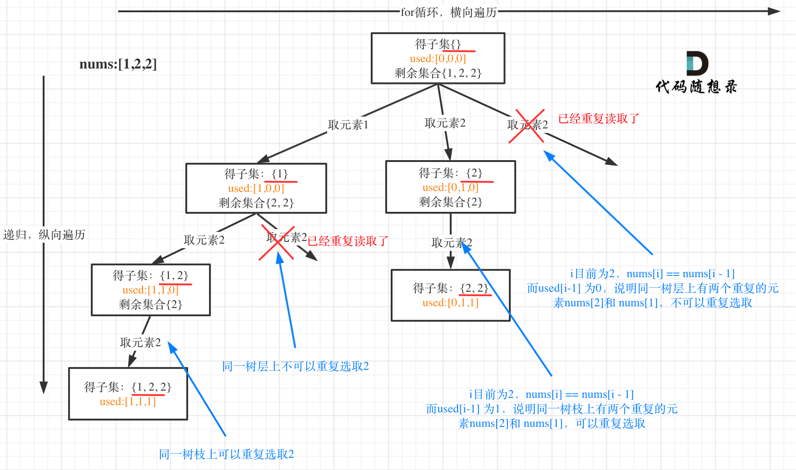

### 2021.03.30

#### [74. 搜索二维矩阵](https://leetcode-cn.com/problems/search-a-2d-matrix/)

难度中等382收藏分享切换为英文接收动态反馈

编写一个高效的算法来判断 `m x n` 矩阵中，是否存在一个目标值。该矩阵具有如下特性：

- 每行中的整数从左到右按升序排列。
- 每行的第一个整数大于前一行的最后一个整数。

 

**示例 1：**


```
输入：matrix = [[1,3,5,7],[10,11,16,20],[23,30,34,60]], target = 3
输出：true
```

思路：

直接从右下角开始寻找，如果`target`比当前数小则列向上移动，如果`target`比当前数大则列向右移动。这样减少了无效的比对

实现代码：

````js
var searchMatrix = function(matrix, target) {
  let n = matrix.length-1, m = matrix[0].length, j = 0
  while(n >= 0 && j < m){
    if(matrix[n][j] > target) {
      n--// 行向上移动
    } else if (matrix[n][j] < target) {
      j++// 列向右移动
    } else {
      return true
    }
  }
  return false
};
````

### 2021.03.31

#### [90. 子集 II](https://leetcode-cn.com/problems/subsets-ii/)

难度中等463收藏分享切换为英文接收动态反馈

给你一个整数数组 `nums` ，其中可能包含重复元素，请你返回该数组所有可能的子集（幂集）。

解集 **不能** 包含重复的子集。返回的解集中，子集可以按 **任意顺序** 排列。

 

**示例 1：**

```
输入：nums = [1,2,2]
输出：[[],[1],[1,2],[1,2,2],[2],[2,2]]
```

**示例 2：**

```
输入：nums = [0]
输出：[[],[0]]
```

 思路：我们可以用树状来模拟该过程，那么该怎么去重呢？首先我们可以先排序，然后，在每次递归时判断是否是同层节点是否一致，如果一致就退出本次遍历即可。

````js
if(i > start && nums[i]===nums[i-1]) continue
````




实现代码：

```js
var subsetsWithDup = function(nums) {
  const res = []
  nums.sort((a,b)=>a-b)
  const dfs = function(path, start) {
    res.push(path)
    for(let i = start; i < nums.length; i++) {
      if(i > start && nums[i-1]===nums[i]) continue
      path.push(nums[i])
      dfs(path.slice(), i+1)
      path.pop()
    }
  }
  dfs([], 0)
  return res
};
```

