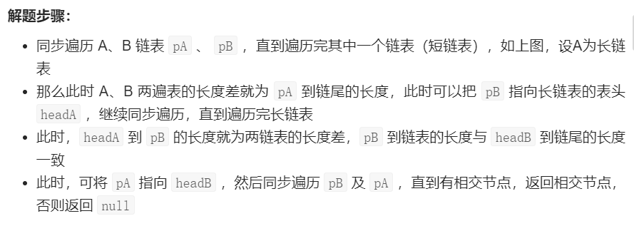

#### [ 合并两个排序的链表](https://leetcode-cn.com/problems/he-bing-liang-ge-pai-xu-de-lian-biao-lcof/)

输入两个递增排序的链表，合并这两个链表并使新链表中的节点仍然是递增排序的。

**示例1：**

```
输入：1->2->4, 1->3->4
输出：1->1->2->3->4->4
```

**限制：**

```
0 <= 链表长度 <= 1000
```

思路一：迭代

```js
var mergeTwoLists = function (l1, l2) {
    let preHead = new ListNode(-1);
    let cur = preHead;
    while (l1 && l2) {
        if (l1.val < l2.val) {
            cur.next = l1;
            l1 = l1.next;
        } else {
            cur.next = l2;
            l2 = l2.next;
        }
        cur = cur.next;
    }
    cur.next = l1 || l2;
    return preHead.next;
};
```

思路二：

```js
var mergeTwoLists = function (l1, l2) {
   if(!l1 || !l2) return l1 || l2
   if(l1.val < l2.val) {
       l1.next = mergeTwoLists(l1.next, l2)
       return l1
   } else {
       l2.next = mergeTwoLists(l1, l2.next)
       return l2
   }
};
```

#### [排序链表](https://leetcode-cn.com/problems/sort-list/)

难度中等1056收藏分享切换为英文接收动态反馈

给你链表的头结点 `head` ，请将其按 **升序** 排列并返回 **排序后的链表** 。

**进阶：**

- 你可以在 `O(n log n)` 时间复杂度和常数级空间复杂度下，对链表进行排序吗？

 

**示例 1：**


```
输入：head = [4,2,1,3]
输出：[1,2,3,4]
```

**示例 2：**


```
输入：head = [-1,5,3,4,0]
输出：[-1,0,3,4,5]
```

**示例 3：**

```
输入：head = []
输出：[]
```

思路：

 第一步：分割 

- 使用快慢指针（双指针法），获取链表的中间节点
- 根据中间节点，分割成两个小链表
- 递归执行上一步，直到小链表中只有一个节点

 第二步：归并（合并有序链表） 

```js
var sortList = function(head) {
  if(!head || !head.next) return head
  let fast = head, slow = head, preSlow = null
  while(fast && fast.next) {
    preSlow = slow
    fast = fast.next.next
    slow = slow.next
  }
  preSlow.next = null
  let l = sortList(head)
  let r = sortList(slow)
  return merge(l, r)
};
function merge(l1, l2) {
  if(!l1 || !l2) return l1 || l2
  if(l1.val < l2.val){
    l1.next = merge(l1.next, l2)
    return l1
  } else {
    l2.next = merge(l1, l2.next)
    return l2
  }
}
```

#### [两数相加](https://leetcode-cn.com/problems/add-two-numbers/)

给你两个 **非空** 的链表，表示两个非负的整数。它们每位数字都是按照 **逆序** 的方式存储的，并且每个节点只能存储 **一位** 数字。

请你将两个数相加，并以相同形式返回一个表示和的链表。

你可以假设除了数字 0 之外，这两个数都不会以 0 开头。

 

**示例 1：**


```
输入：l1 = [2,4,3], l2 = [5,6,4]
输出：[7,0,8]
解释：342 + 465 = 807.
```

思路：直接链表模拟，保存进位和当前和即可

代码：

```js
var addTwoNumbers = function(l1, l2) {
  // 直接模拟链表即可
  let node = new ListNode('head')
  let temp = node,
  add = 0, // 判断进位
  sum = 0
  while(l1 || l2) {
      let n1 = l1 ? l1.val : 0
      let n2 = l2 ? l2.val : 0
      sum = n1 + n2 + add
      // 下一位
      temp.next = new ListNode(sum%10)
      add = parseInt(sum/10)
      temp = temp.next
      if(l1) l1 = l1.next
      if(l2) l2 = l2.next
  }
  // 再加上最后一个进位
  if(add > 0) temp.next = new ListNode(add)
  return node.next
};
```

#### [160. 相交链表](https://leetcode-cn.com/problems/intersection-of-two-linked-lists/)

难度简单1072收藏分享切换为英文接收动态反馈

编写一个程序，找到两个单链表相交的起始节点。

如下面的两个链表**：**

[](https://assets.leetcode-cn.com/aliyun-lc-upload/uploads/2018/12/14/160_statement.png)

在节点 c1 开始相交。

 

**示例 1：**

[](https://assets.leetcode.com/uploads/2018/12/13/160_example_1.png)

```
输入：intersectVal = 8, listA = [4,1,8,4,5], listB = [5,0,1,8,4,5], skipA = 2, skipB = 3
输出：Reference of the node with value = 8
输入解释：相交节点的值为 8 （注意，如果两个链表相交则不能为 0）。从各自的表头开始算起，链表 A 为 [4,1,8,4,5]，链表 B 为 [5,0,1,8,4,5]。在 A 中，相交节点前有 2 个节点；在 B 中，相交节点前有 3 个节点。
```

 思路一：



实现代码：

```js
var getIntersectionNode = function(headA, headB) {
    let pA = headA, pB = headB
    while(pA || pB){
      if(pA === pB) return pA
      pA = pA === null? headB: pA.next
      pB = pB === null? headA: pB.next
    }
    return null
};
```

#### [剑指 Offer 24. 反转链表](https://leetcode-cn.com/problems/fan-zhuan-lian-biao-lcof/)

难度简单208收藏分享切换为英文接收动态反馈

定义一个函数，输入一个链表的头节点，反转该链表并输出反转后链表的头节点。


**示例:**

```
输入: 1->2->3->4->5->NULL
输出: 5->4->3->2->1->NULL
```

 实现代码：

````js
var reverseList = function(head) {
    let pre = null, cur = head, next = null
    while(cur) {
      next = cur.next
      cur.next = pre
      pre = cur
      cur = next
    }
    return pre
};
````

#### [面试题 02.03. 删除中间节点](https://leetcode-cn.com/problems/delete-middle-node-lcci/)

实现一种算法，删除单向链表中间的某个节点（即不是第一个或最后一个节点），假定你只能访问该节点。

**示例：**

```
输入：单向链表a->b->c->d->e->f中的节点c
结果：不返回任何数据，但该链表变为a->b->d->e->f
```

思路：注意题目说你只能访问当前节点，其实就是把当前节点删掉的过程。

实现代码：

```js
var deleteNode = function(node) {
  node.val = node.next.val
  node.next = node.next.next
};
```

